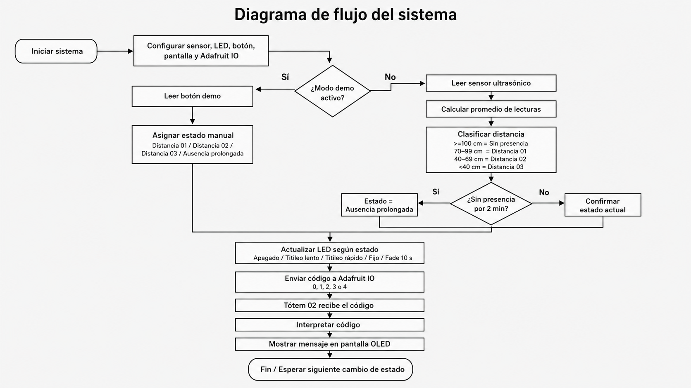

# Examen / grupo-1

lunes 22 junio 2026

## Integrantes

- Magdalena Balart / https://github.com/magdalenabalart
- Jesús Miranda / https://github.com/jesumirandaa
- Carla Núñez / https://github.com/ccarlabelenn

## Descripción textual del proyecto

El proyecto consiste en un altar lumínico compuesto por dos tótems conectados inalámbricamente entre sí, donde la presencia física de una persona se transforma en una señal luminosa, mecánica y afectiva. La interacción principal ocurre en el Tótem 01, construido como un altar vertical. En su base se encuentra resguardado el Arduino, mientras que en su estructura se integra un sensor ultrasónico capaz de medir la distancia entre el objeto y la persona que se aproxima.

A partir de esta medición, el sistema interpreta distintos rangos de cercanía. No se trata solamente de detectar si alguien está o no está frente al altar, sino de reconocer cómo se aproxima y si decide permanecer. Cuando una persona se acerca, el sensor ultrasónico registra la distancia y envía ese dato al Arduino, que lo traduce en una condición de intensidad lumínica. Mientras más cerca se encuentra la persona, mayor es la intensidad de la luz LED del tótem. De esta manera, la luz se enciende progresivamente, como si el altar despertara lentamente ante la presencia de alguien. Cuando la persona alcanza la distancia más cercana definida por el sistema, la luz llega a su 100%, indicando que la presencia fue sostenida y reconocida.

Si la persona se aleja antes de completar este proceso, la luz disminuye lentamente y no se activa la comunicación final. Esto permite que el sistema distinga entre una cercanía casual y un gesto de permanencia. Así, el funcionamiento técnico refuerza la dimensión ritual del proyecto: no basta con pasar frente al objeto, hay que quedarse el tiempo suficiente para que el altar responda.

Cuando la persona llega a la condición de mayor cercanía y la luz del Tótem 01 alcanza su máxima intensidad, el sistema envía un mensaje al Tótem 02. Este mensaje aparece en la pantalla LED como una señal de compañía, indicando que alguien estuvo ahí, recordó o decidió hacerse presente. De esta forma, el segundo tótem no solo recibe datos técnicos, sino una huella simbólica de la interacción ocurrida en el primero.

Además, el proyecto incorpora una pregunta central: ¿qué pasa si el altar no solo responde a quien se acerca, sino también a la ausencia de alguien? Desde esta idea, el sistema puede contemplar una segunda condición: si durante un periodo prolongado nadie se aproxima al altar, la luz puede encenderse por sí sola de manera tenue o intermitente, como una presencia fantasma. Esta activación no representaría una visita física, sino la memoria de una ausencia. En ese caso, el mensaje enviado al Tótem 02 sería distinto, no como señal de compañía presente, sino como una alusión a alguien que falta, que no ha llegado o que sigue habitando el espacio desde la distancia.

## Descripción conceptual proyecto

El proyecto consiste en un altar compuesto por dos tótems conectados inalámbricamente entre sí, donde la presencia física de una persona se transforma en una señal luminosa, mecánica y afectiva.

La interacción no responde a una cercanía casual, sino al gesto de quedarse: no basta con pasar frente al objeto, hay que permanecer. La luz se enciende progresivamente, como si el altar despertara lentamente ante quien se aproxima. Solo cuando la presencia se sostiene el tiempo suficiente, el altar la reconoce y la comunica al segundo tótem, que responde con movimiento y una señal de compañía.

El proyecto también contempla la ausencia. Si durante un periodo prolongado nadie se aproxima, la luz puede encenderse por sí sola de manera tenue o intermitente, como una presencia fantasma. En ese caso, el mensaje enviado al segundo tótem no sería una señal de compañía presente, sino una alusión a alguien que falta, que no ha llegado o que sigue habitando el espacio desde la distancia.

## Descripción técnica

El **Tótem 01** funciona como dispositivo de entrada. En su base se encuentra el Arduino, y en su estructura se integra un sensor ultrasónico que mide la distancia entre el altar y la persona que se aproxima. A partir de esa medición, el sistema interpreta distintos rangos de cercanía y los traduce en intensidad lumínica mediante LEDs. Mientras más cerca se encuentra la persona, mayor es la intensidad de la luz. Si la persona se aleja antes de completar el proceso, la luz disminuye lentamente y no se activa la comunicación.

El **Tótem 02** funciona como dispositivo receptor. Cuando la presencia es reconocida por completo, el Tótem 02 recibe un mensaje que se muestra en pantalla como señal de compañía. La comunicación entre ambos tótems ocurre de forma inalámbrica a través de Adafruit IO. 

## Diagrama de flujo




## Lista de compras y materiales
 
| Elemento | Función dentro de la interacción | Precio |
|---|---|---|
| Arduino | Controla el funcionamiento del Tótem 01 y procesa la información del sensor. | |
| Raspberry Pi Pico | Permite la conexión inalámbrica y el envío/recepción de datos entre tótems. | |
| Sensor ultrasónico | Detecta la distancia entre la persona y el Tótem 01. | |
| LED | Se enciende progresivamente según la cercanía de la persona. | |
| Protoboard mini | Permite conectar y organizar los componentes electrónicos. | |
| Cables Dupont mix | Conectan los sensores, LED, servo, pantalla y placas. | |
| Cable USB-C | Permite alimentar o conectar el Arduino y la Raspberry Pi Pico. | |
| Servo | Imita físicamente la distancia detectada por el sensor. | |
| Pantalla OLED | Muestra los mensajes recibidos desde el Tótem 01. | |

# Pseudocódigo

### Tótem 01
```
INICIO

Definir sensor ultrasónico
Definir LED
Definir conexión inalámbrica con Tótem 02

Definir distancia_lejana = mayor a 100 cm
Definir distancia_media = entre 70 cm y 100 cm
Definir distancia_cercana = entre 40 cm y 70 cm
Definir distancia_muy_cercana = menor a 40 cm

Definir intensidad_LED = 0%

MIENTRAS el sistema esté encendido:

Medir distancia de la persona con el sensor ultrasónico

SI la distancia es mayor a 100 cm:
    La persona está lejos
    LED apagado o con intensidad mínima
    intensidad_LED = 0%
    Enviar al Tótem 02: "sin presencia cercana"

SI la distancia está entre 70 cm y 100 cm:
    La persona comienza a acercarse
    LED se enciende suavemente
    intensidad_LED = 25%
    Enviar al Tótem 02: "presencia lejana"

SI la distancia está entre 40 cm y 70 cm:
    La persona está cerca del altar
    LED aumenta su intensidad
    intensidad_LED = 60%
    Enviar al Tótem 02: "presencia cercana"

SI la distancia es menor a 40 cm:
    La persona está muy cerca del altar
    LED alcanza su máxima intensidad
    intensidad_LED = 100%
    Enviar al Tótem 02: "presencia reconocida / alguien está aquí"

Actualizar intensidad del LED según el valor definido

Esperar un momento breve antes de volver a medir

FIN
```

### Tótem 02 

```
INICIO

Definir pantalla LED
Definir servomotor
Definir conexión inalámbrica con Tótem 01

Definir posición_servo = 0 grados

MIENTRAS el sistema esté encendido:

Esperar información enviada desde el Tótem 01

Recibir dato de distancia o condición de cercanía

SI el mensaje recibido es "sin presencia cercana":
    Mostrar en pantalla: "Sin presencia"
    Mover servo a 0 grados
    posición_servo = 0 grados

SI el mensaje recibido es "presencia lejana":
    Mostrar en pantalla: "Alguien se aproxima"
    Mover servo a 45 grados
    posición_servo = 45 grados

SI el mensaje recibido es "presencia cercana":
    Mostrar en pantalla: "Presencia cerca"
    Mover servo a 90 grados
    posición_servo = 90 grados

SI el mensaje recibido es "presencia reconocida":
    Mostrar en pantalla: "Estoy aquí"
    Mover servo a 180 grados
    posición_servo = 180 grados

Esperar un momento breve antes de volver a recibir información

FIN
```

# Códigos 

## Tótem 01 

### Qué necesitábamos lograr con el código

El objetivo principal era construir un sistema de dos tótems conectados. El **Tótem 01** debía detectar la cercanía de una persona usando un sensor ultrasónico, traducir esa distancia en estados simples, activar un LED según la condición detectada y enviar esa información a Adafruit IO. El Tótem 02 debía recibir esa información desde Adafruit y mostrar el mensaje correspondiente en una pantalla OLED. 

Al principio se pensó que el Tótem 02 también tendría un servo, pero después decidimos retirarlo porque su movimiento agregaba ruido visual y mecánico. Como el proyecto buscaba una respuesta más limpia, silenciosa y contemplativa, **se prefirió dejar solamente el mensaje en pantalla.** 

### Componentes considerados

 <ins> Para el Tótem 01, trabajamos con: </ins>
| Elemento | Función dentro del proyecto |
|---|---|
| Sensor ultrasónico HC-SR04 | Detecta la distancia o cercanía de la persona frente al tótem. |
| LED | Genera una respuesta lumínica según el estado detectado. |
| Botón demo | Permite activar manualmente los estados del sistema para la presentación. |
| Arduino con WiFi | Controla el sistema y permite enviar/recibir datos por internet. |
| Adafruit IO | Plataforma que conecta el Tótem 01 con el Tótem 02 mediante envío de datos. |


 <ins> La conexión principal quedó pensada así: </ins>

| Conexión | Pin |
|---|---|
| Sensor trig | Pin 2 |
| Sensor echo | Pin 3 |
| LED | Pin 6 |
| Botón positivo | Pin 7 |
| Botón señal | Pin 4 |
| Botón GND | GND |

 <ins> Lógica de estados </ins>

Pedimos que el sensor no enviara las distancias crudas todo el tiempo, porque eso generaba demasiada información. Por eso se transformaron las lecturas en códigos simples: 

**0** = sin presencia  
**1** = distancia 01  
**2** = distancia 02  
**3** = distancia 03  
**4** = ausencia prolongada   

 <ins> Los rangos finales quedaron así: </ins>

**100 cm o más** = sin presencia  
**70 a 99 cm** = distancia 01  
**40 a 69 cm** = distancia 02  
**menos de 40 cm** = distancia 03   

También consideramos que el sensor era sensible, por lo que estas distancias tenían que ser muy específicas. Por eso se planteó marcar el suelo con un recorrido o zonas de distancia, para que la interacción fuera más clara y limpia. 


### Funciones principales del código

| Función | Descripción |
|---|---|
| `setup()` | Prepara todo al iniciar el sistema. Configura los pines del sensor, LED y botón, inicia el monitor serial, apaga el LED, reinicia el promedio del sensor y llama a la conexión con Adafruit IO. |
| `loop()` | Es el corazón del sistema. Mantiene viva la conexión con Adafruit, lee el botón, toma lecturas del sensor si no está en modo demo, actualiza el mensaje, envía datos si cambió el estado y controla el comportamiento del LED. |
| `conectarAdafruit()` | Conecta el Arduino a Adafruit IO. Tiene un límite de espera para que el código no quede pegado si internet falla. Si conecta, el sistema puede enviar datos; si no conecta, sigue funcionando localmente con sensor, botón y LED. |
| `medirDistanciaSimple()` | Activa el sensor ultrasónico y calcula la distancia en centímetros. Si no recibe una lectura válida, devuelve `-1`. |
| `registrarLectura()` | Guarda cada lectura del sensor dentro de una lista de muestras. Solo acepta valores razonables, entre 2 y 300 cm, para evitar datos raros. |
| `calcularPromedioDistancia()` | Calcula el promedio de varias lecturas del sensor. Esto ayuda a estabilizar la respuesta, ya que el sensor puede ser sensible y saltar entre valores. |
| `reiniciarPromedioSensor()` | Limpia las muestras anteriores del sensor. Sirve especialmente cuando se vuelve desde el modo demo al modo sensor real. |
| `decodificarDistancia()` | Convierte la distancia medida en uno de los códigos del sistema. Por ejemplo, si la distancia está entre 70 y 99 cm, la transforma en `distancia 01`; si es menor a 40 cm, la transforma en `distancia 03`. |
| `confirmarEstadoSensor()` | Evita que el sistema cambie de estado demasiado rápido. El código espera a que la condición se mantenga durante un pequeño tiempo antes de aceptar el cambio. |
| `actualizarMensaje()` | Asocia cada código con un mensaje textual: `0 = Sin presencia`, `1 = Distancia 01`, `2 = Distancia 02`, `3 = Distancia 03`, `4 = Ausencia prolongada`. Esto sirve para imprimir el estado en el monitor serial y para que el Tótem 02 pueda mostrar mensajes claros. |
| `actualizarAusencia()` | Detecta si el sistema lleva mucho tiempo sin presencia. Si pasan 2 minutos sin detectar a alguien, el estado cambia a `ausencia prolongada`. |
| `leerBoton()` | Lee el botón demo y usa debounce, evitando que una sola presión se lea muchas veces por error. |
| `avanzarModoBoton()` | Permite recorrer manualmente los estados del sistema sin usar el sensor. La secuencia es: primera presión = distancia 01, segunda presión = distancia 02, tercera presión = distancia 03, cuarta presión = ausencia prolongada y quinta presión = vuelve al sensor. |
| `reiniciarValoresDemo()` | Limpia variables internas cada vez que se activa un estado desde el botón, para que el modo demo no se mezcle con lecturas anteriores del sensor. |
| `enviarEstadoSiCambio()` | Envía información solo cuando el estado cambia. Esto evita mandar miles de datos a Adafruit IO. En vez de enviar todo el tiempo la distancia exacta, solo se envía el código actual. |
| `controlarLed()` | Controla el comportamiento del LED según el estado actual: sin presencia = LED apagado, distancia 01 = titileo lento, distancia 02 = titileo más rápido, distancia 03 = LED fijo y ausencia prolongada = encendido progresivo. |
| `latirLed()` | Genera el efecto de titileo o latido del LED para las primeras distancias. La distancia 01 tiene un latido más lento y la distancia 02 uno más rápido. |
| `encendidoProgresivoAusencia()` | Genera el fade de ausencia prolongada. El LED no se prende de golpe, sino que sube progresivamente hasta llegar al brillo máximo en 10 segundos. |


**Decisiones importantes que tomamos**:

También fuimos ajustando varias cosas durante la construcción:


- No enviar lecturas crudas del sensor.  
- Enviar solo códigos simples a Adafruit IO.   
- Usar promedio para estabilizar el sensor.  
- Usar confirmación temporal antes de cambiar de estado.  
- Agregar botón demo para el examen.  
- Hacer que el LED tenga respuestas distintas según la cercanía.  
- Hacer que la ausencia prolongada tenga un fade de 10 segundos.  
- Evitar que Adafruit bloquee el código si no hay internet.  
- Retirar el servo del Tótem 02 para dejar una respuesta más limpia.  
- Usar pantalla OLED como respuesta principal del segundo tótem.  

### Prompts utilizados para el desarrollo del código del Tótem 01

Durante el desarrollo del código del **Tótem 01**, se trabajó con ChatGPT mediante una serie de prompts orientados a construir, probar y ajustar progresivamente el funcionamiento del sistema. Estos prompts permitieron organizar el proceso por etapas, desde la lectura del sensor ultrasónico hasta la integración de respuestas lumínicas mediante LED.


### Prompts de trabajo utilizados

| Etapa / área de trabajo | Prompt utilizado |
|---|---|
| Lectura inicial del sensor | “Generar un código base en Arduino para leer un sensor ultrasónico HC-SR04, utilizando TRIG en el pin 2 y ECHO en el pin 3, e imprimir la distancia medida en centímetros a través del monitor serial.” |
| Clasificación de presencia | “Modificar el código del sensor ultrasónico para clasificar la distancia detectada en distintos estados de presencia, considerando rangos específicos de proximidad frente al tótem.” |
| Uso de `millis()` | “Ajustar el código para evitar el uso de `delay()` y reemplazarlo por `millis()`, con el objetivo de mantener una lectura fluida del sensor sin bloquear el funcionamiento general del sistema.” |
| Respuesta inmediata | “Optimizar la lectura del sensor para que el cambio de estado se actualice de manera inmediata, evitando tiempos de espera excesivos que puedan afectar la interacción del tótem.” |
| Incorporación del LED | “Incorporar un LED como salida visual del sistema, conectado a un pin PWM, para que responda según los distintos estados de distancia detectados por el sensor.” |
| Exploración lumínica | “Evaluar distintas formas de respuesta lumínica para representar la proximidad de una persona, considerando inicialmente porcentajes de intensidad y luego una lógica basada en parpadeos diferenciados.” |
| Primeros rangos de distancia | “Reformular las condiciones de distancia en tres estados principales: presencia lejana a 230 cm, acercamiento a 150 cm y presencia cercana a 50 cm.” |
| Parpadeo según cercanía | “Programar el LED para que parpadee lentamente cuando la persona esté lejos, a una velocidad media cuando se acerque y permanezca encendido de forma fija cuando esté cerca del tótem.” |
| Ausencia prolongada | “Agregar una condición de ausencia prolongada para que, si no se detecta presencia durante 2 minutos, el LED comience a encenderse progresivamente de manera lenta.” |
| Organización del código | “Mantener el código organizado por funciones, separando la lectura del sensor, la clasificación de estados y el control del LED, para facilitar futuras modificaciones e integración con Adafruit IO.” |
| Preparación para conexión inalámbrica | “Preparar la lógica del código para una futura conexión inalámbrica con el Tótem 02, considerando el envío de estados simplificados en lugar de lecturas numéricas constantes.” |
| Decodificación para Adafruit IO | “Proponer una estructura de decodificación para Adafruit IO, donde cada estado del sensor sea enviado como un valor resumido, evitando saturar la plataforma con datos innecesarios.” |
| Ajuste final de rangos | “Ajustar los rangos de distancia del sensor para trabajar con una escala más precisa: sin presencia sobre 100 cm, distancia 01 entre 70 y 99 cm, distancia 02 entre 40 y 69 cm, y distancia 03 bajo 40 cm.” |
| Códigos de estado | “Modificar la lógica del sensor para que las lecturas no se envíen en centímetros directamente, sino que se transformen en códigos simples del 0 al 4 según el estado de presencia detectado.” |
| Promedio de lecturas | “Implementar un promedio de lecturas del sensor ultrasónico para estabilizar la medición y evitar que el sistema cambie de estado por una lectura aislada o errática.” |
| Validación de muestras | “Agregar una cantidad mínima de muestras válidas antes de aceptar una distancia como correcta, considerando que el sensor puede ser sensible a objetos cercanos o variaciones del entorno.” |
| Confirmación temporal | “Incorporar una confirmación temporal del estado detectado para que el sistema solo cambie de condición cuando la lectura se mantenga durante un breve periodo.” |
| Mantener ausencia prolongada | “Modificar el código para que, en caso de ausencia prolongada, el estado no vuelva inmediatamente a sin presencia, sino que mantenga la condición de ausencia hasta que vuelva a detectarse cercanía.” |
| Botón demo | “Agregar un botón demo conectado al sistema para poder activar manualmente los estados del tótem durante la presentación, sin depender únicamente de la lectura del sensor.” |
| Secuencia del botón | “Programar el botón demo para que cada presión avance por una secuencia de estados: distancia 01, distancia 02, distancia 03, ausencia prolongada y retorno al modo sensor.” |
| Modo demo | “Configurar el modo demo para que, mientras esté activo, el sensor ultrasónico quede temporalmente desactivado y no interfiera con la demostración manual.” |
| Debounce del botón | “Agregar debounce al botón para evitar que una sola presión sea leída varias veces por error.” |
| Retorno al modo sensor | “Reiniciar los valores del sensor y del promedio cuando el sistema vuelve desde el modo demo al modo sensor, evitando que queden lecturas anteriores afectando el funcionamiento.” |
| Mensajes por estado | “Asignar un mensaje textual a cada código del sistema, de manera que cada estado pueda ser identificado claramente en el monitor serial y enviado como lógica para el Tótem 02.” |
| Comportamiento final del LED | “Ajustar el comportamiento del LED para que la distancia 01 tenga un latido lento, la distancia 02 un latido más rápido, la distancia 03 quede encendida fija y la ausencia prolongada active un encendido progresivo.” |
| Fade de ausencia | “Modificar el fade de ausencia prolongada para que el LED aumente su brillo de forma progresiva durante 10 segundos hasta llegar al máximo.” |
| Integración con Adafruit IO | “Integrar Adafruit IO al código del Tótem 01 para enviar el código del estado actual al feed correspondiente.” |
| Envío solo por cambio | “Configurar el envío a Adafruit IO para que solo ocurra cuando el estado cambia, evitando mandar datos repetidos o saturar la plataforma.” |
| Conexión no bloqueante | “Agregar una conexión a Adafruit IO con tiempo máximo de espera, para que el código no quede bloqueado si falla la conexión a internet.” |
| Funcionamiento local | “Mantener el funcionamiento local del sensor, botón y LED aunque Adafruit IO no logre conectarse, permitiendo seguir probando el tótem sin depender completamente de internet.” |
| Código modular | “Organizar el código en funciones separadas para facilitar su lectura, modificación y explicación: lectura del sensor, promedio, clasificación de distancia, botón demo, control del LED, ausencia prolongada y envío a Adafruit IO.” |
| Tótem 01 como emisor | “Preparar el código para que el Tótem 01 funcione como dispositivo emisor, enviando estados simplificados al Tótem 02 a través de Adafruit IO.” |


## Tótem 02 

### Qué necesitábamos lograr con el código

El objetivo principal del Tótem 02 era recibir la información enviada por el Tótem 01 a través de Adafruit IO y mostrar el mensaje correspondiente en una pantalla OLED. A diferencia del Tótem 01, este segundo tótem no detecta directamente la distancia, sino que interpreta los códigos recibidos desde el feed TOTEM01.

En una primera etapa, el Tótem 02 también consideraba el uso de un servo que se movía según la cercanía detectada. Sin embargo, después de probar la interacción, se decidió retirarlo porque su movimiento agregaba ruido visual y mecánico. Como el proyecto buscaba una respuesta más limpia, silenciosa y contemplativa, se prefirió dejar únicamente el mensaje en pantalla.

De esta forma, el Tótem 02 funciona como un dispositivo receptor: escucha los datos enviados por Adafruit IO, traduce cada código en un mensaje textual y lo muestra de manera clara en la pantalla OLED.

Componentes considerados

<ins> Para el Tótem 02, trabajamos con: </ins>

| Elemento | Función dentro del proyecto |
|---|---|
| Pantalla OLED | Muestra el mensaje correspondiente al estado recibido desde Adafruit IO. |
| Arduino con WiFi | Recibe los datos enviados desde Adafruit IO y controla la pantalla. |
| Adafruit IO | Plataforma que permite recibir los estados enviados por el Tótem 01. |
| Feed `TOTEM01` | Canal de comunicación donde el Tótem 01 envía los códigos y el Tótem 02 los recibe. |

<ins>La conexión principal quedó pensada así:</ins>

| Conexión | Pin |
|---|---|
| OLED VCC | 3.3V o 5V, según la pantalla |
| OLED GND | GND |
| OLED SDA | SDA de la placa |
| OLED SCL | SCL de la placa |

El Tótem 02 recibe códigos simples desde Adafruit IO. Cada código representa un estado detectado previamente por el Tótem 01.

**0** = sin presencia  
**1** = distancia 01  
**2** = distancia 02  
**3** = distancia 03  
**4** = ausencia prolongada  

<ins>Mensajes mostrados en pantalla:</ins>

**0**	Sin presencia  
**1**	Distancia 01  
**2**	Distancia 02  
**3**	Distancia 03  
**4**	Ausencia prolongada  
**Otro valor	Código no válido**  

El Tótem 02 no recibe la distancia exacta en centímetros, sino un código resumido. Esto permite que la comunicación sea más limpia y que la pantalla muestre mensajes claros sin saturar el sistema con datos innecesarios.

### Funciones principales del código

| Función | Descripción |
|---|---|
| `setup()` | Prepara el sistema al iniciar. Inicia el monitor serial, configura la pantalla OLED, muestra el mensaje de inicio, prepara la recepción del feed de Adafruit IO y llama a la conexión con internet. |
| `loop()` | Mantiene viva la conexión con Adafruit IO mediante `io.run()`. Como ya no hay servo, el loop queda más simple y solo se encarga de escuchar nuevos datos. |
| `conectarAdafruit()` | Conecta el Arduino a Adafruit IO. Tiene un tiempo máximo de espera para que el código no quede bloqueado si falla internet. Si conecta, muestra “Conectado”; si no conecta, muestra un mensaje de error en la pantalla. |
| `recibirEstado()` | Se ejecuta cada vez que llega un nuevo dato desde Adafruit IO. Lee el código recibido, lo imprime en el monitor serial y evita repetir la acción si llega el mismo código anterior. |
| `interpretarCodigo()` | Traduce el código recibido en un mensaje textual. Por ejemplo, si recibe `1`, lo interpreta como “Distancia 01”; si recibe `4`, lo interpreta como “Ausencia prolongada”. |
| `mostrarTextoInicio()` | Muestra mensajes generales de inicio, conexión o error en la pantalla OLED. Se usa para estados como “Iniciando”, “Conectando” o “No conecta”. |
| `mostrarEnPantalla()` | Limpia la pantalla OLED y muestra el mensaje correspondiente al código recibido desde Adafruit IO. También muestra el código para verificar qué dato llegó. |


Aunque inicialmente el Tótem 02 fue programado con un servo, finalmente se decidió eliminarlo del código y del funcionamiento del prototipo. Esta decisión permitió simplificar la interacción y evitar elementos que pudieran distraer del mensaje principal.

Al retirar el servo, el código quedó más limpio: se eliminaron la librería Servo.h, el pin del servo, los grados de movimiento, las funciones de movimiento fijo y las funciones de movimiento irregular en ausencia prolongada.

La respuesta final del Tótem 02 queda centrada únicamente en la pantalla OLED, reforzando una comunicación más silenciosa, directa y coherente con la atmósfera del proyecto. 

### Prompts de trabajo utilizados para el código del Tótem 02

| Etapa / área de trabajo | Prompt utilizado |
|---|---|
| Código base receptor | “Generar un código base para el Tótem 02 que reciba datos desde Adafruit IO utilizando el mismo feed del Tótem 01.” |
| Conexión a Adafruit IO | “Configurar el Tótem 02 para conectarse a Adafruit IO mediante WiFi y mantenerse escuchando los datos enviados desde el feed `TOTEM01`.” |
| Recepción de códigos | “Crear una lógica de recepción de códigos desde Adafruit IO, donde cada número recibido represente un estado enviado por el Tótem 01.” |
| Traducción de datos | “Traducir los códigos recibidos desde Adafruit IO en mensajes textuales claros para mostrarlos en una pantalla OLED.” |
| Pantalla de inicio | “Configurar la pantalla OLED para que muestre un mensaje de inicio mientras el sistema se conecta a internet y a Adafruit IO.” |
| Mensajes por estado | “Mostrar en pantalla el mensaje correspondiente a cada estado recibido: sin presencia, distancia 01, distancia 02, distancia 03 y ausencia prolongada.” |
| Interpretación de códigos | “Agregar una función que interprete el código recibido y lo convierta en el mensaje correspondiente para la pantalla.” |
| Actualización de pantalla | “Incorporar una función específica para limpiar la pantalla OLED y actualizar el mensaje cada vez que llegue un nuevo dato desde Adafruit IO.” |
| Evitar repeticiones | “Evitar que el sistema repita la misma acción si recibe nuevamente el mismo código desde Adafruit IO.” |
| Monitor serial | “Agregar mensajes en el monitor serial para revisar qué código está llegando desde Adafruit IO y verificar si la comunicación funciona correctamente.” |
| Conexión no bloqueante | “Programar una conexión a Adafruit IO con tiempo máximo de espera, para evitar que el código quede bloqueado permanentemente si falla internet.” |
| Mensaje de error | “Modificar el código para que, si Adafruit IO no conecta, la pantalla muestre un mensaje de error como ‘No conecta’ o ‘Revisar WiFi/IO’.” |
| Rol del Tótem 02 | “Ajustar el código del Tótem 02 para que funcione como receptor del sistema, dependiendo de la información enviada por el Tótem 01.” |
| Prueba con servo | “Probar inicialmente el Tótem 02 con pantalla OLED y servo, donde el servo se moviera en distintos grados según la cercanía detectada por el Tótem 01.” |
| Movimiento por cercanía | “Programar el servo para que se moviera a distintos ángulos según el código recibido: 0°, 45°, 90° y 135°.” |
| Ausencia con servo | “Agregar una condición especial para que, en ausencia prolongada, el servo realizara un movimiento irregular automático.” |
| Evaluación del servo | “Evaluar si el movimiento del servo aportaba a la interacción del Tótem 02 o si generaba ruido visual y mecánico.” |
| Retiro del servo | “Modificar el código para eliminar el servo del Tótem 02, dejando únicamente la pantalla OLED como respuesta principal.” |
| Limpieza del código | “Eliminar del código la librería `Servo.h`, el pin del servo, los grados de movimiento y las funciones relacionadas con movimiento fijo o irregular.” |
| Simplificación del `loop()` | “Simplificar el `loop()` del Tótem 02 para que solo mantenga viva la conexión con Adafruit IO y escuche nuevos datos.” |
| Respuesta limpia | “Ajustar la interfaz de la pantalla OLED para que la respuesta del Tótem 02 sea más limpia, silenciosa y directa.” |
| Organización por funciones | “Mantener el código organizado por funciones, separando la conexión a Adafruit IO, la recepción de datos, la interpretación del código y la visualización en pantalla.” |
| Tótem receptor | “Preparar el Tótem 02 como un dispositivo receptor que no mide directamente la distancia, sino que interpreta los estados enviados por el Tótem 01.” |
| Revisión del feed | “Revisar que el feed utilizado por el Tótem 02 sea el mismo que el del Tótem 01, para asegurar que ambos dispositivos se comuniquen correctamente.” |
| Versión final | “Construir una versión final del código del Tótem 02 sin servo, centrada únicamente en recibir mensajes desde Adafruit IO y mostrarlos en pantalla OLED.” |
