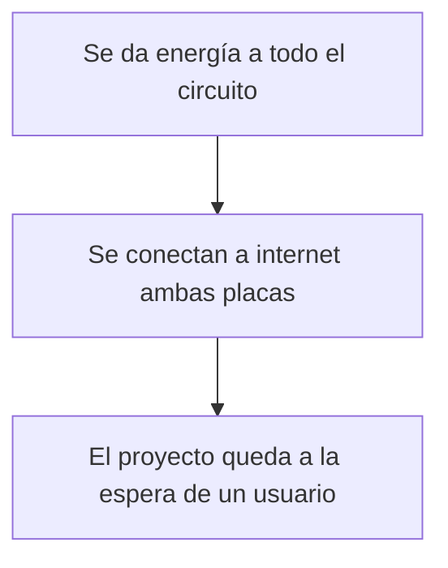

# ⋆⭒˚.⋆ └[∵┌] Examen "Grupo 02" - Acu-Visual [┐∵]┘ ⋆.˚⭒⋆

Lunes 22 de junio 2026

---

## Grupo 02. Pa-Pa's

### Integrantes

* [Camila Parada](https://github.com/Camila-Parada): Código, Investigación, Shopper, Tester
* [Vania Paredes](https://github.com/paredesvania): Touchdesigner, Código, Proyección, Registro.

## Descripción del proyecto

### _"¿Cómo presenciamos el "habitar" de los espacios a través del sonido presente en los edificios de la FAAD?"_

Nos interesa observar en vivo las huellas sonoras (conversaciones, pasos, risas, silencios, etc) que dejan las personas al ocupar o transitar un lugar (espacio físico). Esta "identidad acústica" cambiante nos habla de cómo se vive y se comparte un espacio . Estos registros en tiempo real son la materia prima para la producción de visualizaciones experimentales producidas en Touchdesigner,

La dimensión material del proyecto abarca el uso de 2 placas rapsberry pi pico 2W, cada una con un "Sensor de Sonido (LM393)" que reúne información y la sube en 2 feeds en Adafruit IO. Cada uno de estos módulos se encuentran ubicados en uno de los edificios de la Facultad de Artes, Arquitectura y Diseño (República 180 y Salvador Sanfuentes 2221). 

Por otra parte, el computador (o el Arduino) recibirá dichos datos para posteriormente entregarlos a Touchdesigner. La visualización generativa en tiempo real posee variables como el movimiento, las formas y los colores que responden a la actividad sonora de cada lugar.

De esta manera, aquello que normalmente percibimos solo con el oído podrá manifestarse visualmente frente a nosotros.

Buscamos hacer visible una dimensión cotidiana que suele pasar desapercibida: la manera en que habitamos los espacios y cómo nuestra presencia los transforma a través de la relación entre sonido e imagen, la visualización funcionará como un retrato vivo de ambos lugares.

## Primeros acercamientos

En un inicio se utilizaron varias

## Input: Micrófono 

Para comenzar...

### Código Micrófono

```cpp
# ============================================================
# SENSOR DE SONIDO — Raspberry Pi Pico 2W + MAX9812
# Examen interacciones inalámbricas
# ============================================================
# CONEXIONES MAX9812:
#   VCC  → Pin 36 (3V3)
#   GND  → Pin 38 (GND)
#   OUT  → Pin 31 (GP26)
# ============================================================

import time
import board
import analogio
import wifi
import socketpool
import adafruit_minimqtt.adafruit_minimqtt as MQTT

# ============================================================
# CONFIGURACIÓN — solo cambia esto entre los dos Picos
# ============================================================

EDIFICIO      = "grupo02-rep" # Dirección del feed (cambia según el edificio)
WIFI_SSID     = "Nombre wifi" # Nombre wifi
WIFI_PASSWORD = "01234" # Clave wifi

AIO_USERNAME  = "loremipsum" # Nombre del usuario de la cuenta
AIO_KEY       = "aio_secret" # AIO Key del usuario de la cuenta

# ============================================================
# PARÁMETROS DE MEDICIÓN
# ============================================================

# El MAX9812 ya tiene 20dB de ganancia incorporada
# así que los umbrales son más bajos que con KY-037
RUIDO_PISO   = 150    # amplitud mínima para contar como sonido
AMPLITUD_MAX = 5000   # amplitud que representa 100%
                      # bajar si no llega a 100% aplaudiendo
                      # subir si se satura muy fácil

NUM_MUESTRAS = 150    # muestras por ráfaga (~15ms sin delay)
INTERVALO_S  = 2.0    # segundos entre envíos (límite Adafruit IO)

# ============================================================
# SENSOR (arreglo para el requisito del curso)
# ============================================================

PINES_SENSORES = [board.GP26]
sensores       = [analogio.AnalogIn(pin) for pin in PINES_SENSORES]

# ============================================================
# RED
# ============================================================

pool         = None
mqtt_cliente = None


def estado_wifi():
    try:
        return wifi.radio.connected
    except Exception:
        return False


def conectar_wifi():
    print(f"Conectando a WiFi: '{WIFI_SSID}'")
    while not estado_wifi():
        try:
            wifi.radio.connect(WIFI_SSID, WIFI_PASSWORD)
            time.sleep(1)
            if estado_wifi():
                print(f"  ✓ WiFi OK — IP: {wifi.radio.ipv4_address}")
                return
        except Exception as e:
            print(f"  ✗ {e}")
        print("  Reintentando en 5s...")
        time.sleep(5)


def crear_mqtt():
    global pool, mqtt_cliente
    pool = socketpool.SocketPool(wifi.radio)
    mqtt_cliente = MQTT.MQTT(
        broker         = "io.adafruit.com",
        port           = 1883,
        username       = AIO_USERNAME,
        password       = AIO_KEY,
        socket_pool    = pool,
        socket_timeout = 1,
        keep_alive     = 30,
    )


def conectar_mqtt():
    intentos = 0
    while True:
        try:
            print("Conectando a Adafruit IO...")
            mqtt_cliente.connect()
            print(f"  ✓ MQTT OK — feed: {EDIFICIO}")
            return
        except Exception as e:
            intentos += 1
            espera = min(3 * intentos, 30)
            print(f"  ✗ {e}. Reintentando en {espera}s...")
            try:
                mqtt_cliente.disconnect()
            except Exception:
                pass
            time.sleep(espera)


def asegurar_conexiones():
    if not estado_wifi():
        print("WiFi caído. Reconectando...")
        try:
            mqtt_cliente.disconnect()
        except Exception:
            pass
        conectar_wifi()
        crear_mqtt()
        conectar_mqtt()
        return
    try:
        mqtt_cliente.loop(timeout=1)
    except Exception as e:
        print(f"MQTT caído: {e}. Reconectando...")
        try:
            mqtt_cliente.disconnect()
        except Exception:
            pass
        if not estado_wifi():
            conectar_wifi()
            crear_mqtt()
        conectar_mqtt()


def publicar(valor):
    try:
        asegurar_conexiones()
        mqtt_cliente.publish(f"{AIO_USERNAME}/feeds/{EDIFICIO}", str(valor))
        print(f"  → {EDIFICIO}: {valor}%")
    except Exception as e:
        print(f"  ✗ Error: {e}")
        try:
            mqtt_cliente.disconnect()
        except Exception:
            pass
        conectar_wifi()
        crear_mqtt()
        conectar_mqtt()

# ============================================================
# MEDICIÓN — pico máximo sin promediar
# ============================================================

def medir_pico():
    """
    Recorre el arreglo de sensores con un bucle for.
    En cada sensor toma una ráfaga rápida y calcula
    la amplitud pico-a-pico SIN promediar.
    Retorna el nivel más alto entre todos los sensores.
    """
    niveles = []

    for i in range(len(sensores)):

        # Ráfaga rápida sin delays (bucle for + arreglo)
        maximo = 0
        minimo = 65535
        for j in range(NUM_MUESTRAS):
            v = sensores[i].value
            if v > maximo:
                maximo = v
            if v < minimo:
                minimo = v

        amplitud = maximo - minimo

        if amplitud < RUIDO_PISO:
            porcentaje = 0
        else:
            porcentaje = int(((amplitud - RUIDO_PISO) / AMPLITUD_MAX) * 100)
            porcentaje = max(0, min(100, porcentaje))

        niveles.append(porcentaje)

    return max(niveles)

# ============================================================
# INICIO
# ============================================================

conectar_wifi()
crear_mqtt()
conectar_mqtt()

ultimo_envio = 0
pico_maximo  = 0       # guarda el pico más alto desde el último envío

print(f"\n=== [{EDIFICIO.upper()}] Escuchando... ===\n")

# ============================================================
# LOOP PRINCIPAL
# ============================================================

while True:
    try:
        # Medir constantemente
        nivel = medir_pico()

        # Guardar el pico más alto visto (no promediar)
        if nivel > pico_maximo:
            pico_maximo = nivel
            print(f"    nuevo pico: {pico_maximo}%")

        # Enviar cada INTERVALO_S segundos
        ahora = time.monotonic()
        if (ahora - ultimo_envio) >= INTERVALO_S:
            publicar(pico_maximo)
            pico_maximo = 0        # resetear después de enviar
            ultimo_envio = ahora

    except Exception as e:
        print(f"Error: {e}. Reconectando...")
        try:
            mqtt_cliente.disconnect()
        except Exception:
            pass
        conectar_wifi()
        crear_mqtt()
        conectar_mqtt()
        time.sleep(2)
```

## Output: Touchdesigner

Al tener los datos recopilados ...

## Demostraciones en vivo

### Video en el mismo edificio (distintos espacios)

Video 1

### Video en distintos edificios

Video 2

## Bill of materials (listado de materiales)

| Componentes         | Tipo  | Cantidad | Precio  | Enlace            |
| ------------------- | ----- | -------- | ------- | ----------------  |
| Raspberry Pi Pico 2 W | Placa de desarrollo | 2   | $14.990 | <https://mcielectronics.cl/shop/product/74358//> |
| Mini Protoboard 400 Puntos | Placa prototipado | 2  | $1.500 | <https://afel.cl/products/mini-protoboard-400-puntos> |
| Cable Dupont Macho Macho 10cm | Cable | Pack 40 | $2.590 | <https://mcielectronics.cl/shop/product/cable-dupont-macho-macho-20cm-pack-40-unidades/> |
| Sensor Analógico Sonido/Audio MAX9812 | Sensor | 1 | $3.790 | <https://hubot.cl/producto/sensor-analogico-audio-max9812-sku-614/> |
| Pantalla LCD OLED 0,96 | Componente | 1 | $4.500 | <https://afel.cl/products/pantalla-lcd-oled-azul-y-amarillo-0-96> |

## Mapa de flujo



## Investigaciones individuales

Aportes, información y exploraciones personales compartidas con el equipo.

- [Camila Parada.md](./persona-01.md) 

- [Vania Paredes.md](./persona-02.md)

## Bibliografía

* <https://learn.adafruit.com/series/adafruit-io-basics>
