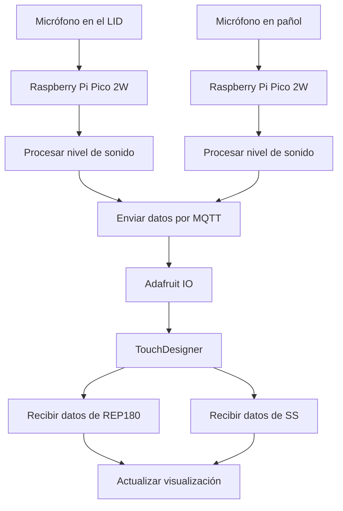

# ⋆⭒˚.⋆ └[∵┌] Examen "Grupo 02" - Acu-Visual [┐∵]┘ ⋆.˚⭒⋆

Lunes 22 de junio 2026

---

## Grupo 02. Pa-Pa's

### Integrantes

* [Camila Parada](https://github.com/Camila-Parada): Código, Investigación, Shopper, Tester
* [Vania Paredes](https://github.com/paredesvania): Touchdesigner, Código, Proyección, Registro.

## Descripción del proyecto

### _"¿Cómo presenciamos el "habitar" de los espacios a través del sonido presente en los edificios de la FAAD?"_

Nos interesa observar en vivo las huellas sonoras (conversaciones, pasos, risas, silencios, etc) que dejan las personas al ocupar o transitar un lugar (espacio físico). Esta "identidad acústica" cambiante nos habla de cómo se vive y se comparte un espacio . Estos registros en tiempo real son la materia prima para la producción de visualizaciones experimentales producidas en Touchdesigner,

La dimensión material del proyecto abarca el uso de 2 placas rapsberry pi pico 2W, cada una con un sensor analógico de sonido "MAX9812". Estos módulos reúnen información del ruido ambiente y la sube en 2 feeds en Adafruit IO. Cada uno de estos se encuentran ubicados en distintos edificios y sectores de la "Facultad de Artes, Arquitectura y Diseño" (República 180 y Salvador Sanfuentes 2221), en el que un micrófono se ubicará en el "Casino" y el otro en el "Laboratorio de interacción digital (LID)". Por otra parte, se requiere un computador con Touchdesigner, sowftware que se conecta a los feeds de Adafruit y recibe dichos datos para posteriormente procesarlos. 

La visualización generativa en tiempo real posee variables como el movimiento, las formas y los colores que responden a la actividad sonora de cada lugar.

De esta manera, aquello que normalmente percibimos solo con el oído puede ser manifestado visualmente frente a nosotros. Trazando una dimensión de la cotidianeidad que suele pasar desapercibida: la manera en que habitamos los espacios y cómo nuestra presencia los transforma a través de la relación entre sonido e imagen, la visualización funcionará como un retrato vivo de ambos lugares.

## Pseudocódigo Raspberry (input)

1. Conectar Raspberry Pi Pico a WiFi
2. Conectar Raspberry Pi Pico a Adafruit IO mediante MQTT
-  MIENTRAS el sistema esté funcionando
3. Leer datos del micrófono
4. Calcular nivel de sonido
5. Convertir nivel de sonido a porcentaje (0% a 100%)
6. Enviar porcentaje al feed MQTT en adafruit

## Pseudocódigo Touchdesigner (output)

1. Conectarse a Adafruit IO mediante MQTT
2. Suscribirse a los feeds de ambos lugares
- CUANDO llegue un mensaje
3. Leer valor recibido
4. Identificar de qué lugar proviene
5. Actualizar la variable correspondiente
6. Mostrar el dato en la visualización

## Primeros acercamientos

En un inicio se utilizaron otros sensores de audio que necesitaban que el sonido estuviera muy cerca para poder detectar estas fluctuaciones, por lo que no funcionaba como esperábamos.

## Input: Micrófono 

### Qué hace

Mide el sonido ambiente con dos micrófonos MAX9812, calcula qué tan fuerte fue ese sonido, y cada un segundo manda ese dato a Adafruit IO, que actúa como intermediario en la nube entre la Pico y TouchDesigner.

---

### Código Rasberry pi pico 2W

```cpp
# ============================================================
# SENSOR DE SONIDO - Raspberry Pi Pico 2W + 2x MAX9812
# Examen interacciones inalambricas
# ============================================================
# CONEXIONES MAX9812 A:
#   VCC -> Pin 36 (3V3)
#   GND -> Pin 38 (GND)
#   OUT -> Pin 31 (GP26)
# CONEXIONES MAX9812 B:
#   VCC -> Pin 36 (3V3)
#   GND -> Pin 33 (GND)
#   OUT -> Pin 32 (GP27)
# ============================================================

import time
import board
import analogio
import wifi
import socketpool
import adafruit_minimqtt.adafruit_minimqtt as MQTT

# ============================================================
# CONFIGURACION - esto es lo unico que cambia entre los dos picos
# ============================================================

EDIFICIO      = "grupo02-rep" #Solo cambia el nombre del feed 
WIFI_SSID     = "Nombre wifi"
WIFI_PASSWORD = "01234"

AIO_USERNAME  = "udpmontoyamoraga"
AIO_KEY       = "aio_secret"

# ============================================================
# PARAMETROS DE MEDICION
# ============================================================

RUIDO_PISO   = 150
AMPLITUD_MAX = 5000

NUM_MUESTRAS = 150
INTERVALO_S  = 1.0

# ============================================================
# SENSORES - dos microfonos en diferentes lugares de la FAAD
# ============================================================

PINES_SENSORES = [board.GP26]
sensores        = [analogio.AnalogIn(pin) for pin in PINES_SENSORES]

# ============================================================
# RED
# ============================================================

pool         = None
mqtt_cliente = None


def estado_wifi():
    try:
        return wifi.radio.connected
    except Exception:
        return False


def conectar_wifi():
    print(f"Conectando a wifi: '{WIFI_SSID}'")
    while not estado_wifi():
        try:
            wifi.radio.connect(WIFI_SSID, WIFI_PASSWORD)
            time.sleep(1)
            if estado_wifi():
                print(f"  conectado - IP: {wifi.radio.ipv4_address}")
                return
        except Exception as e:
            print(f"  fallo: {e}")
        print("  reintentando en 5s...")
        time.sleep(5)


def crear_mqtt():
    global pool, mqtt_cliente
    pool = socketpool.SocketPool(wifi.radio)
    mqtt_cliente = MQTT.MQTT(
        broker         = "io.adafruit.com",
        port           = 1883,
        username       = AIO_USERNAME,
        password       = AIO_KEY,
        socket_pool    = pool,
        socket_timeout = 1,
        keep_alive     = 30,
    )


def conectar_mqtt():
    intentos = 0
    while True:
        try:
            print("Conectando a adafruit io...")
            mqtt_cliente.connect()
            print(f"  listo - feed: {EDIFICIO}")
            return
        except Exception as e:
            intentos += 1
            espera = min(3 * intentos, 30)
            print(f"  fallo: {e}. reintentando en {espera}s...")
            try:
                mqtt_cliente.disconnect()
            except Exception:
                pass
            time.sleep(espera)


def asegurar_conexiones():
    if not estado_wifi():
        print("wifi caido. reconectando todo...")
        try:
            mqtt_cliente.disconnect()
        except Exception:
            pass
        conectar_wifi()
        crear_mqtt()
        conectar_mqtt()
        return
    try:
        mqtt_cliente.loop(timeout=1)
    except Exception as e:
        print(f"mqtt caido: {e}. reconectando...")
        try:
            mqtt_cliente.disconnect()
        except Exception:
            pass
        if not estado_wifi():
            conectar_wifi()
            crear_mqtt()
        conectar_mqtt()


def publicar(valor):
    try:
        asegurar_conexiones()
        mqtt_cliente.publish(f"{AIO_USERNAME}/feeds/{EDIFICIO}", str(valor))
        print(f"  -> {EDIFICIO}: {valor}%")
    except Exception as e:
        print(f"  error: {e}")
        try:
            mqtt_cliente.disconnect()
        except Exception:
            pass
        conectar_wifi()
        crear_mqtt()
        conectar_mqtt()

# ============================================================
# MEDICION - recorre ambos sensores y se queda con el mas fuerte
# ============================================================

def medir_nivel():
    """
    recorre el arreglo de sensores (2 microfonos).
    cada uno mide su propia rafaga y calcula su propia amplitud.
    al final se queda con el nivel mas alto entre los dos,
    asi no importa de que lado venga el sonido, igual lo agarra.
    """
    niveles = []

    for i in range(len(sensores)):

        maximo = 0
        minimo = 65535
        for j in range(NUM_MUESTRAS):
            v = sensores[i].value
            if v > maximo:
                maximo = v
            if v < minimo:
                minimo = v

        amplitud = maximo - minimo

        if amplitud < RUIDO_PISO:
            porcentaje = 0
        else:
            porcentaje = int(((amplitud - RUIDO_PISO) / AMPLITUD_MAX) * 100)
            porcentaje = max(0, min(100, porcentaje))

        niveles.append(porcentaje)
        print(f"    sensor {i + 1}: {porcentaje}%")

    return max(niveles)

# ============================================================
# INICIO
# ============================================================

conectar_wifi()
crear_mqtt()
conectar_mqtt()

ultimo_envio = 0
nivel_maximo = 0

print(f"\n=== [{EDIFICIO.upper()}] escuchando... ===\n")

# ============================================================
# LOOP PRINCIPAL
# ============================================================

while True:
    try:
        nivel = medir_nivel()

        if nivel > nivel_maximo:
            nivel_maximo = nivel
            print(f"    nuevo maximo detectado: {nivel_maximo}%")

        ahora = time.monotonic()
        if (ahora - ultimo_envio) >= INTERVALO_S:
            publicar(nivel_maximo)
            nivel_maximo = 0
            ultimo_envio = ahora

    except Exception as e:
        print(f"error: {e}. reconectando...")
        try:
            mqtt_cliente.disconnect()
        except Exception:
            pass
        conectar_wifi()
        crear_mqtt()
        conectar_mqtt()
        time.sleep(2)
```

## Output: Touchdesigner

### Qué hace

Recibe los datos que llegan desde Adafruit IO (los que mandan las dos Picos) y los deja disponibles como valores que se pueden usar dentro de la red de TouchDesigner para controlar las visuales.

Este código vive dentro de un `Callbacks DAT`, conectado a un `MQTT Client DAT`. TouchDesigner llama automáticamente a estas funciones cuando ocurre el evento correspondiente.

---

## Codigo Mqtt client / touch designer

```python
# mqttclient1_callbacks

FEEDS = {
    'grupo02-rep': 'constant_rep',
    'grupo02-ss':  'constant_ss',
}

def onConnect(dat, *args):
    for feed in FEEDS:
        dat.subscribe(f'udpmontoyamoraga/feeds/{feed}')
    print('MQTT conectado')
    return

def onDisconnect(dat, *args):
    print('MQTT desconectado')
    return

def onMessage(dat, topic, payload, qos, retain):
    try:
        valor = float(payload)
        valor = max(0.0, min(100.0, valor))
    except:
        return

    for feed_name, chop_name in FEEDS.items():
        if feed_name in topic:
            op(chop_name).par.value0 = valor
            print(f'[{feed_name}] {valor:.0f}%')
            break
    return

def onSubscribe(dat, *args):
    print(f'Suscrito a: {args}')
    return

def onUnsubscribe(dat, *args):
    return
```

## Parámetros del mqtt_client DAT


## Demostraciones en vivo

### Video en el mismo edificio (distintos espacios)

Este video fué grabado con uno de los micrófonos en el Laboratorio de interacción digital, otro en pañol y el output en la sala 102 de Salvador Sanfuentes 2221, en el proyector de la sala. Todo en el mismo edificio.

[](https://youtube.com/shorts/wxTEaNKYboA)

[](https://youtu.be/jCxNm1AnnEM)

---

## Bill of materials (listado de materiales)

| Componentes         | Tipo  | Cantidad | Precio  | Enlace            |
| ------------------- | ----- | -------- | ------- | ----------------  |
| Raspberry Pi Pico 2 W | Placa de desarrollo | 2   | $14.990 | <https://mcielectronics.cl/shop/product/74358//> |
| Mini Protoboard 400 Puntos | Placa prototipado | 2  | $1.500 | <https://afel.cl/products/mini-protoboard-400-puntos> |
| Cable Dupont Macho Macho 10cm | Cable | Pack 40 | $2.590 | <https://mcielectronics.cl/shop/product/cable-dupont-macho-macho-20cm-pack-40-unidades/> |
| Sensor Analógico Sonido/Audio MAX9812 | Sensor | 1 | $3.790 | <https://hubot.cl/producto/sensor-analogico-audio-max9812-sku-614/> |
| Pantalla LCD OLED 0,96 | Componente | 1 | $4.500 | <https://afel.cl/products/pantalla-lcd-oled-azul-y-amarillo-0-96> |

---

## Mapa de flujo




---

## Investigaciones individuales

Aportes, información y exploraciones personales compartidas con el equipo.

- [Camila Parada.md](./persona-01.md) 

- [Vania Paredes.md](./persona-02.md)

## Links a conversaciones con la IA durante el proceso de trabajo

* <https://claude.ai/share/908f5fc8-04b0-407a-ad07-761d9c147662>
* <https://chatgpt.com/share/6a270e2e-6ed0-83e9-9219-f21ec0dc3f2f>
* <https://claude.ai/chat/7cd64083-1322-4b08-8168-85c80d8ea3de>

## Bibliografía

* <https://learn.adafruit.com/series/adafruit-io-basics>
* <https://www.youtube.com/watch?v=V_Q_fDukTI0>
* <https://aws.amazon.com/es/what-is/api/>
* <https://derivative.ca/UserGuide/OSC>
* <https://mct-master.github.io/networked-music/2024/03/17/thomaseo-intro_to_OSC.html>
* <https://ccrma.stanford.edu/groups/osc/index.html>
*  <https://arduinomodules.info/ky-037-high-sensitivity-sound-detection-module/>
