# persona-2

[Vania Paredes](https://github.com/paredesvania)

---

## Investigación

Primero probé un micrófono ( KY-037 )conectado a un arduino, para primero ver cómo funcionaban los datos de este en touchdesigner.

Así conecté el mic KY-037 al Arduino:

* VCC      ->   5V
* GND      ->   GND
* AO       ->   A0       (esta es la señal analógica del sonido)

Acá encontré la info para la conexión y detalles del microfono: <https://arduinomodules.info/ky-037-high-sensitivity-sound-detection-module/>

Usé este código para ver los datos del micrófono.

```cpp
const int MIC_PIN = A0;
const int MUESTRAS = 8;

int leerPromedio() {
  long suma = 0;
  for (int i = 0; i < MUESTRAS; i++) {
    suma += analogRead(MIC_PIN);
  }
  return suma / MUESTRAS;
}

void setup() {
  Serial.begin(9600);
  delay(1000);
}

void loop() {
  int nivel = leerPromedio();
  Serial.println(nivel);
  delay(30);
}
```

---

En touchdesigner primero hice una figura base simple que tuviera parámetros que pudiera deformar con el sonido, en este caso ocupé noise.


Me vi este tutorial para ver como funcionaba la conexión arduino/touch designer: <https://www.youtube.com/watch?v=V_Q_fDukTI0>

Puse un serial DAT, y en este ajusté los parámetros para conectarlo a mi arduino, en este caso seleccionar el port y baud rate correctos. Se puede ver que me llegan datos, ahora debo limpiarlos para poder usarlos con más control en mi visual.

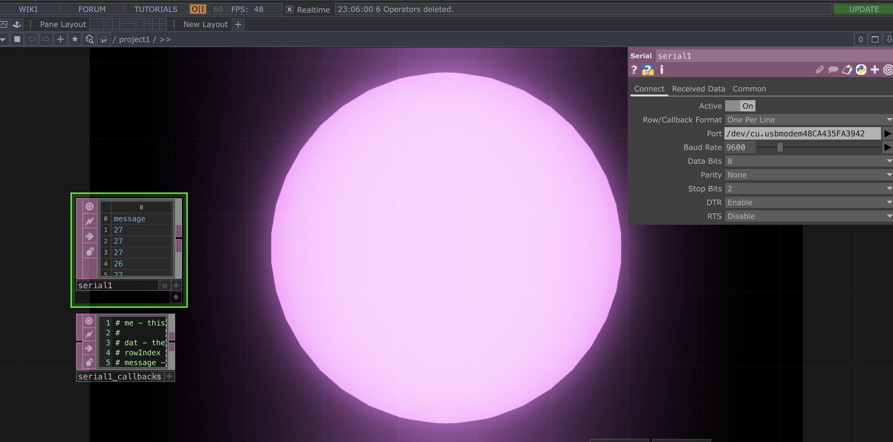

Ajusté unos parámetros de mi visual para hacerla más estética. Hasta quedar satisfecha con el resultado, no quería hacer algo muy complicado visualmente, sino que enfocarme más en el código.

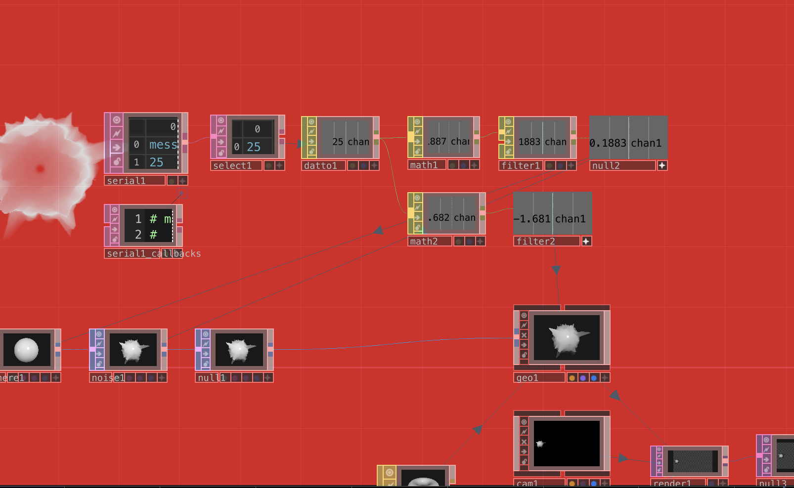
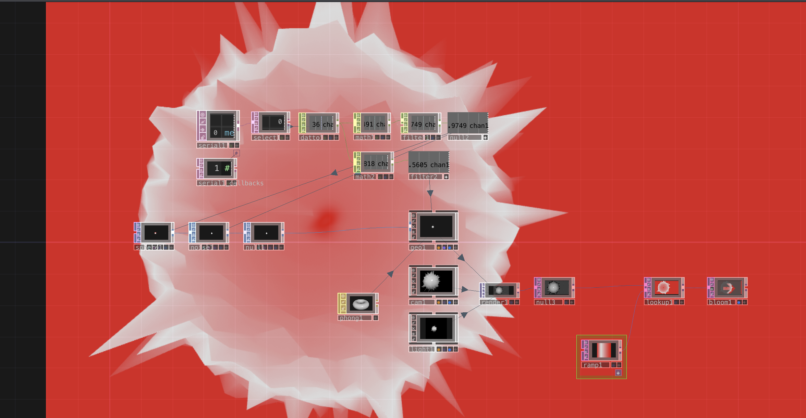

Me di cuenta que el micrófono no detecta tantos cambios en el sonido a no ser que se hagan muy cerca del micrófono, (rangos de 27 a 300) así que ajusté los parámetros para que aunque haya un cambio mínimo se note más.

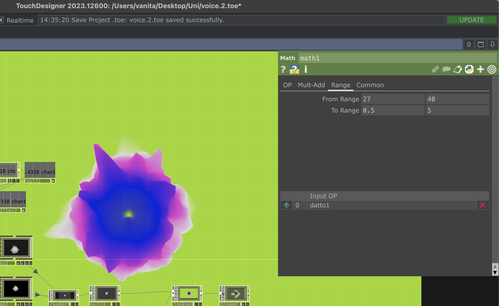

Seguía sin convencerme el diseño así que lo volví a cambiar

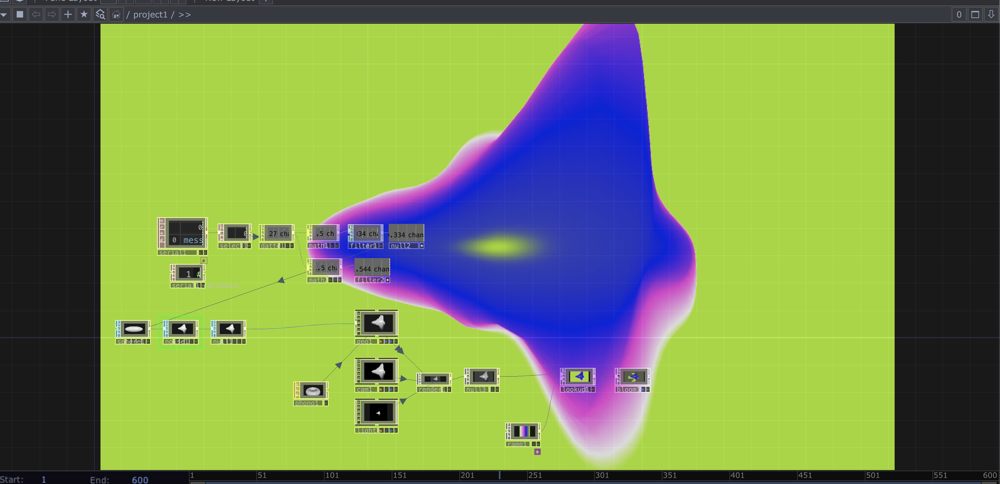

Una vez esto me funcionaba empecé a investigar cómo podríamos conectar estos dos micrófonos de la manera más simple y eficiente a touchdesigner.

Hablé con claude, el prompt fué larguísimo así que dejo el link a la conversación: <https://claude.ai/share/908f5fc8-04b0-407a-ad07-761d9c147662>

Probé lo que me dijo claude:

Cuesta que se conecte al internet pero lo logra:

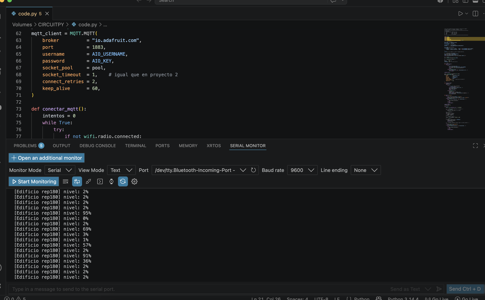

Y se ve la info en el feed:

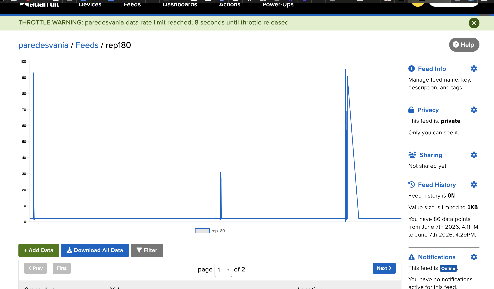

Pero no logro hacer bien la conexión en touchdesigner para ver los datos;(.

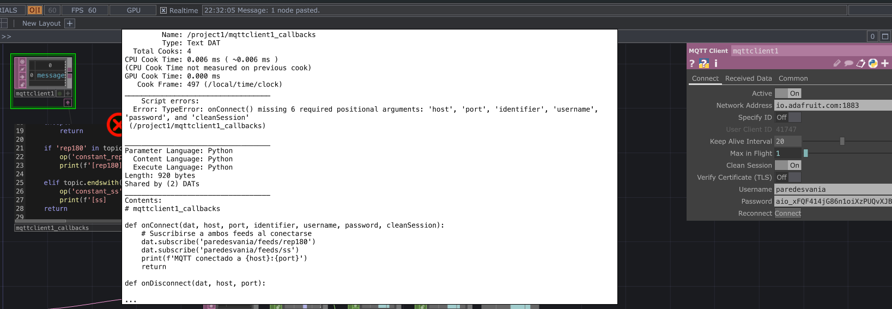

---

Ya lo logre!! funciona, pero aún hay problemas de conexión, cuesta que se conecte a internet y cuando se conecta se vuelve a desconectar.

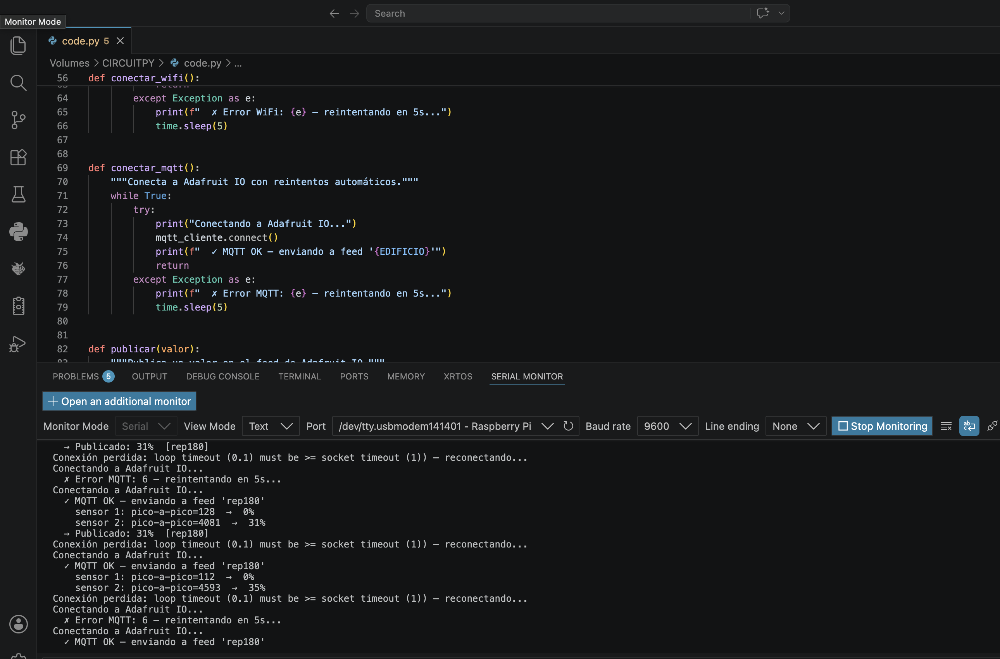


Mateo me ayudó con eso, me dijo que le pidió a chatgpt reforzar la conexión, este es el link de su conversación: <https://chatgpt.com/share/6a270e2e-6ed0-83e9-9219-f21ec0dc3f2f>

Y funciona!!!

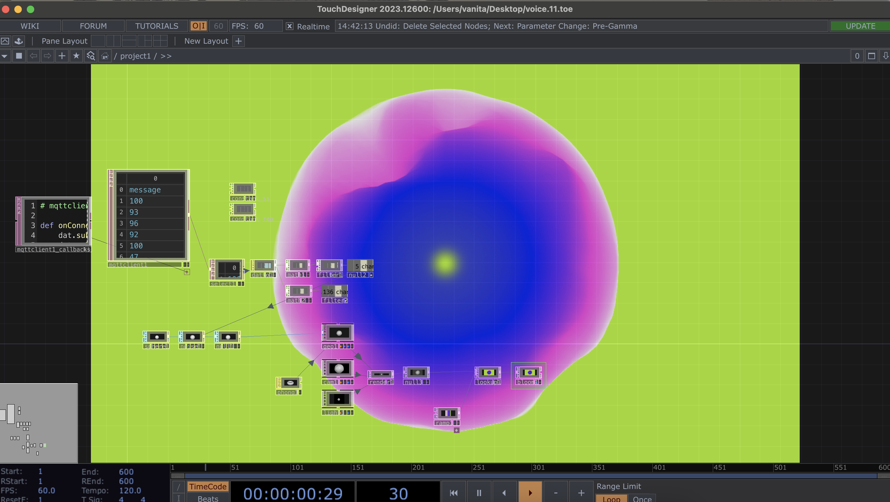

Ahora lo conecté a la cuenta de aaron, así no se me acaba tan rapido el límite de datos que puedo enviar a mi cuenta de adafruit. Los códigos finales que ocupé fueron:

## Código Raspberry

```python
# ============================================================
# SENSOR DE SONIDO — Raspberry Pi Pico 2W
# Examen interacciones inalámbricas
# ============================================================

import time
import board
import analogio
import wifi
import socketpool
import adafruit_minimqtt.adafruit_minimqtt as MQTT

# ============================================================
# CONFIGURACIÓN 
# ============================================================

EDIFICIO      = "grupo02-rep"
WIFI_SSID     = "iPhone de Mateo"
WIFI_PASSWORD = "aaron123"

# ============================================================
# ADAFRUIT IO
# ============================================================

AIO_USERNAME  = "udpmontoyamoraga"
AIO_KEY       = "secreto"
FEED          = f"{AIO_USERNAME}/feeds/{EDIFICIO}"

# ============================================================
# PARÁMETROS
# ============================================================

NUM_MUESTRAS  = 60
PAUSA_MS      = 0.001
INTERVALO_S   = 2.0

PINES_SENSORES = [board.GP26, board.GP27]

# ============================================================
# SENSORES
# ============================================================

sensores = [analogio.AnalogIn(pin) for pin in PINES_SENSORES]
buffers = [[0] * NUM_MUESTRAS for _ in sensores]

# ============================================================
# VARIABLES GLOBALES DE RED
# ============================================================

pool = None
mqtt_cliente = None

# ============================================================
# FUNCIONES WIFI / MQTT
# ============================================================

def estado_wifi():
    """
    Revisa si el WiFi sigue conectado.
    Retorna True si hay conexión, False si no.
    """
    try:
        return wifi.radio.connected
    except Exception:
        return False


def conectar_wifi():
    """
    Conecta o reconecta al WiFi con reintentos.
    """
    print(f"\nConectando a WiFi: '{WIFI_SSID}'")

    while not estado_wifi():
        try:
            wifi.radio.connect(WIFI_SSID, WIFI_PASSWORD)
            time.sleep(1)

            if estado_wifi():
                print("  ✓ WiFi conectado")
                print(f"  IP: {wifi.radio.ipv4_address}")

                try:
                    print(f"  RSSI: {wifi.radio.ap_info.rssi} dBm")
                except Exception:
                    pass

                return True

        except Exception as e:
            print(f"  ✗ Error WiFi: {e}")

        print("  Reintentando WiFi en 5 segundos...")
        time.sleep(5)

def crear_mqtt():
    """
    Crea un nuevo socketpool y un nuevo cliente MQTT.
    Esto es importante después de una caída de WiFi.
    """
    global pool, mqtt_cliente

    pool = socketpool.SocketPool(wifi.radio)

    mqtt_cliente = MQTT.MQTT(
        broker         = "io.adafruit.com",
        port           = 1883,
        username       = AIO_USERNAME,
        password       = AIO_KEY,
        socket_pool    = pool,
        socket_timeout = 1,
        keep_alive     = 30,
    )

def conectar_mqtt():
    """
    Conecta a Adafruit IO.
    Si falla, reintenta.
    """
    global mqtt_cliente

    if mqtt_cliente is None:
        crear_mqtt()

    while True:
        try:
            print("Conectando a Adafruit IO...")
            mqtt_cliente.connect()
            print(f"  ✓ MQTT conectado — feed: {EDIFICIO}")
            return True

        except Exception as e:
            print(f"  ✗ Error MQTT: {e}")

            try:
                mqtt_cliente.disconnect()
            except Exception:
                pass

            print("  Reintentando MQTT en 5 segundos...")
            time.sleep(5)

def desconectar_mqtt_seguro():
    """
    Intenta cerrar MQTT sin romper el programa.
    """
    global mqtt_cliente

    try:
        if mqtt_cliente is not None:
            mqtt_cliente.disconnect()
    except Exception:
        pass

def asegurar_conexiones():
    """
    Revisa WiFi y MQTT.
    Si el WiFi se cayó, reconecta todo desde cero.
    """
    global mqtt_cliente

    # Si WiFi se cayó, reconectar WiFi y recrear MQTT completo
    if not estado_wifi():
        print("\n⚠ WiFi desconectado. Reconectando todo...")

        desconectar_mqtt_seguro()

        conectar_wifi()
        crear_mqtt()
        conectar_mqtt()
        return

    # Si WiFi está OK, mantener vivo MQTT
    try:
        if mqtt_cliente is not None:
           mqtt_cliente.loop(timeout=1)
    except Exception as e:
        print(f"\n⚠ MQTT perdió conexión: {e}")
        print("Reconectando MQTT...")

        desconectar_mqtt_seguro()

        # Si en realidad también cayó WiFi, reconstruir todo
        if not estado_wifi():
            conectar_wifi()
            crear_mqtt()

        conectar_mqtt()

def publicar(valor):
    """
    Publica un valor en Adafruit IO.
    Si falla, reconecta y vuelve a intentar una vez.
    """
    global mqtt_cliente

    try:
        asegurar_conexiones()
        mqtt_cliente.publish(FEED, str(valor))
        print(f"  → Publicado: {valor}%  [{EDIFICIO}]")

    except Exception as e:
        print(f"  ✗ Error al publicar: {e}")
        print("  Intentando reconectar y republicar...")

        try:
            desconectar_mqtt_seguro()
            conectar_wifi()
            crear_mqtt()
            conectar_mqtt()

            mqtt_cliente.publish(FEED, str(valor))
            print(f"  → Republicado: {valor}%  [{EDIFICIO}]")

        except Exception as e2:
            print(f"  ✗ No se pudo republicar: {e2}")

# ============================================================
# MEDICIÓN
# ============================================================

def medir_nivel_sonoro():
    """
    Lee todos los sensores KY-037 conectados por AO.
    Calcula amplitud pico-a-pico y retorna el nivel más alto.
    """
    amplitudes = []

    for i in range(len(sensores)):

        for j in range(NUM_MUESTRAS):
            buffers[i][j] = sensores[i].value
            time.sleep(PAUSA_MS)

        maximo   = max(buffers[i])
        minimo   = min(buffers[i])
        amplitud = maximo - minimo

        porcentaje = min(int((amplitud / 65535) * 100 * 5), 100)

        amplitudes.append(porcentaje)

        print(f"    sensor {i + 1}: pico-a-pico={amplitud} → {porcentaje}%")

    return max(amplitudes)


# ============================================================
# INICIO
# ============================================================

conectar_wifi()
crear_mqtt()
conectar_mqtt()

ultimo_envio = 0

print(f"\n=== [{EDIFICIO.upper()}] Midiendo sonido... ===\n")


# ============================================================
# LOOP PRINCIPAL
# ============================================================

while True:
    try:
        asegurar_conexiones()

        ahora = time.monotonic()

        nivel = medir_nivel_sonoro()

        if (ahora - ultimo_envio) >= INTERVALO_S:
            publicar(nivel)
            ultimo_envio = ahora

    except Exception as e:
        print(f"\n⚠ Error general en loop principal: {e}")
        print("Reiniciando conexiones...")

        try:
            desconectar_mqtt_seguro()
        except Exception:
            pass

        conectar_wifi()
        crear_mqtt()
        conectar_mqtt()

        time.sleep(2)
```

## Codigo Mqtt client / touch designer

```python
# mqttclient1_callbacks

def onConnect(dat, *args):
    dat.subscribe('udpmontoyamoraga/feeds/grupo02-rep')
    dat.subscribe('udpmontoyamoraga/feeds/grupo02-ss')
    print('MQTT conectado')
    return

def onDisconnect(dat, *args):
    print('MQTT desconectado')
    return

def onMessage(dat, topic, payload, qos, retain):
    try:
        valor = float(payload)
        valor = max(0.0, min(100.0, valor))
    except:
        return

    if 'rep180' in topic:
        op('constant_rep').par.value0 = valor
        print(f'[rep180] {valor:.0f}%')

    elif topic.endswith('/ss'):
        op('constant_ss').par.value0 = valor
        print(f'[ss]     {valor:.0f}%')
    return

def onSubscribe(dat, *args):
    print(f'Suscrito a: {args}')
    return

def onUnsubscribe(dat, *args):
    return
```

## Parámetros del mqtt_client DAT

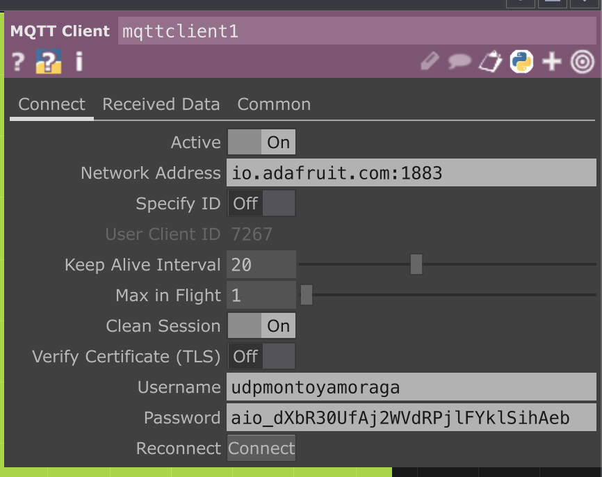

### Video en funcionamiento

[](https://youtube.com/shorts/eZcYLyGfErY)

---

También hablé con el profesor Guillermo Montecinos para saber su opinión ya que él sabe mucho de estos temas. Me recomendó quizás usar websocket, Node.js, o OSC.

Así que me puse a investigar sobre estos lenguajes.

—--

### Websocket

No lo conocía pero había escuchado de él, por lo que veo tiene que ver con APIS (bacán porque investigar sobre APIS es parte de la rúbrica)

<https://developer.mozilla.org/es/docs/Web/API/WebSocket>

Según esta página WebSocket provee la API para la creación y administración de una conexión WebSocket a un servidor, así como también para enviar y recibir datos en la conexión.

<https://www.ibm.com/docs/es/was/9.0.5?topic=applications-websocket>

WebSocket es un protocolo estándar que permite que un navegador web o una aplicación cliente y una aplicación de servidor web utilice una conexión dúplex para comunicarse.

No he encontrado mucha info sobre como usarlo con touchdesigner;(

### Node.js

<https://nodejs.org/en>

Node.js is a software environment used to run JavaScript code outside of a web browser, allowing developers to build server-side applications and backend systems.

### OSC

<https://ccrma.stanford.edu/groups/osc/index.html>

Según wikipedia Open Sound Control (OSC) es un protocolo de red altamente flexible diseñado para conectar sintetizadores, ordenadores y software multimedia. Creado para superar las limitaciones del tradicional MIDI, permite transmitir datos de control en tiempo real con mayor precisión, utilizando redes estándar como Wi-Fi o cables Ethernet.

Según <https://mct-master.github.io/networked-music/2024/03/17/thomaseo-intro_to_OSC.html>
“OSC - Open Sound Control. Like MIDI, but better.”

Osc en touchdesigner: <https://derivative.ca/UserGuide/OSC>

### Qué es una API?

<https://aws.amazon.com/es/what-is/api/>

---

Finalmente por ahora y por temas de tiempo estoy prefiriendo quedarme con la forma de enviar que hemos estaado usando todo el semestre (Adafruit y circuitpython)
