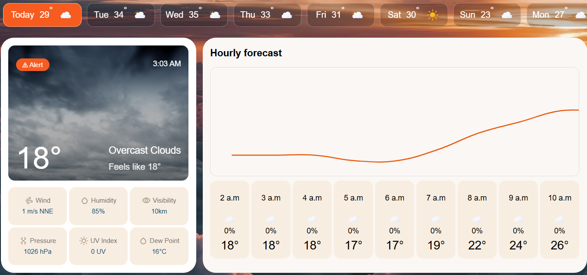

# grupo-3

* Josefa Cristina Araya Cartes / [josefa-kristina](<https://github.com/disenoUDP/dis9079-2026-1/tree/main/05-josefa-kristina>)
* Débora Skarlett Soto Valenzuela / [DebSkar](<https://github.com/disenoUDP/dis9079-2026-1/tree/main/26-DebSkar>)
* Nicolás Elías Valdés Greve / [nicolasvaldesgreve](<https://github.com/disenoUDP/dis9079-2026-1/tree/main/28-nicolasvaldesgreve>)
* Cristóbal Vergara Silva / [cristobalvergarasilva](<https://github.com/disenoUDP/dis9079-2026-1/tree/main/29-cristobalvergarasilva>)

---


# Bruma compacta

Chile es un territorio con climas muy distintos el uno con el otro, en algunas localidades puede llegar a ser muy desértico mientras en el otro extremo del país existen bosques frondosos y ríos que demuestran la riqueza ecosistémica de nuestro país.
Nos parece interesante crear una experiencia donde por medio de componentes electrónicos y programación se pueda sentir que interactuamos con nuestro patrimonio natural, por eso es que a través de nuestro proyecto queremos provocar una escena inmersiva entre el agua y el usuario, reinterpretando el clima de 8 localidades distintas de Chile, totalmente al azar con la intención de utilizar datos concretos para generar una instancia divertida.


El punto de partida para materializar nuestro proyecto fue conectar una Raspberry Pi Pico 2W en una protoboard, junto a un switch que activa el envío de datos y un LED que indica cuándo el microcontrolador está conectado al WiFi y transmitiendo información. Usamos el terminal serial de PuTTY para ver los prints.

En este proceso de envío se recopila información climática desde la API de [Open Weather Map](<https://openweathermap.org/>), donde seleccionamos 8 ciudades de Chile distribuidas a lo largo del territorio: Arica, Copiapó, Santiago, Valparaíso, Isla de Pascua, Juan Fernández, Punta Arenas y Villa Las Estrellas en la Antártica. Los porcentajes de humedad de cada localidad se almacenan en un array de 8 posiciones (una por ciudad) y se publican en Adafruit IO a través de feeds individuales, también recorridos con un for.

Para armar el código, utilizamos **arrays**  que son como listas ordenadas de datos las que nos permiten manejar las 8 ciudades y sus valores de humedad eficientemente en lugar de tener que escribir el mismo código ocho veces, para utilizar los arrays un **for** recorre cada ciudad automáticamente y realiza la misma operación para todas: consultar la API, guardar el dato y publicarlo. 

Estos datos son recibidos por un Arduino UNO R4 WiFi, que también utiliza arrays para gestionar los 8 feeds simultáneamente: suscribirse a todos, esperar que lleguen los 8 valores y confirmar cada recepción encendiendo el LED correspondiente en un módulo RGB de 8 bits. Una vez llegados los datos de las 8 ciudades el Arduino ejecuta el sorteo.

El resultado se muestra en el módulo LED, mientras la Raspberry recopila los porcentajes, se iluminan todos los LED en azul, luego comienza a funcionar como una ruleta que barre los 8 LEDs en secuencia, frenando gradualmente hasta detenerse en la ciudad ganadora. La ruleta, sostenida por un mago, ilumina ese LED en verde si la humedad de la ciudad supera el 35%, o en rojo si es inferior. Una serie de letreros indica al usuario que si la luz es verde puede presionar el botón del humidificador, activando una membrana ultrasónica que libera una bruma en el espacio.

---

# API utilizada




Open Weather Map nos permite tener acceso a los datos meteorológicos globales mediante APIs, es decir, los datos están disponibles para cualquier coordenada del mundo. Las APIs que nos ofrece incluyen información como:

+ Condiciones meteorológicas actuales
+ Pronósticos minuto a minuto
+ Pronósticos por hora y diarios
+ Perspectivas a corto y largo plazo
+ Alertas meteorológicas del gobierno
+ Más de 47 años de observaciones históricas
+ Archivos históricos de pronósticos
+ Datos estadísticos sobre el clima 
+ Datos sobre la calidad del aire
+ Mapas meteorológicos capas geoespaciales

Los servicios de Open Weather Map se ofrecen a través de _API REST_ con respuestas _JSON_ estructuradas, adecuadas para su integración en entornos web, móviles, análisis, IoT y empresariales.

> **API REST**: Interfaz de programación de aplicaciones que sigue los principios de REST, el cual significa transferencia de estado representacional y consiste en un conjunto de reglas y recomendaciones para diseñar una API web.
Fuente: <https://www.redhat.com/es/topics/api/what-is-a-rest-api> 

> **JSON**: Formato ligero de intercambio de datos, basado en un subconjunto del lenguaje JavaScript.
Fuente: <https://www.json.org/json-es.html>

---
está super yo creo - josefa

# Proceso 

Durante la primera clase de avance en examen, se nos indicó realizar un párrafo descriptivo (conceptual, no técnico) de lo que queríamos lograr con nuestro proyecto. La razón por la que se hizo esta actividad fue para poder recibir dudas y críticas de otros compañeros, para así lograr hacer la versión mejorada de este texto en base a su retroalimentación.

El párrafo inicial fue el siguiente:

“Bruma compacta: Queremos expresar y materializar el clima a través de un humidificador alimentado de los datos de humedad en el ambiente (datos de un API), provocando una escena inmersiva entre el agua y el usuario.” 

Luego de enviar el texto, nuestros compañeros del grupo 9 realizaron las siguientes preguntas en donde se muestran sus respectivas respuestas:

P1: Cuando dicen en el ambiente, sería el ambiente donde están físicamente? o un lugar random que la api les haya dado?

R1: De un lugar aleatorio pero de Chile.

P2: A que se refieren con materializar el clima?

R2: Con materializar el clima nos referíamos a que sería una demostración más literal y concentrada de la humedad al que el humidificador expulse una bruma de agua.

P3: Ese lugar aleatorio es siempre el mismo? o cambia cada vez que alguien interactúa con el proyecto?

R3: Cambiaría cada vez.

### Pseudocódigo

Para poder entender lo que haría nuestro código, se nos recomendó hacer un pseudocódigo que mencione de manera simplificada lo que harían nuestros códigos de enviar y recibir, en donde el resultado fue el siguiente:

#### RASPBERRY

```ccp
código enviar: 

Verificar si Wi Fi conectado
Verificar si API está funcionando
Verificar conexión con la nube

Nombre WIFI
Contraseña WIFI
User nube 
Contraseña nube
interruptor
LEDS

Al mover el interruptor de la izq a la derecha se encienden leds y empieza a enviar la información de la API al arduino a través de aio

Envía la información de la humedad de 8 ciudades de Chile

Arica
Copiapó
Santiago
Valparaíso
Isla de Pascua
Juan Fernández
Punta Arenas
Antártica

deja de enviar información al girar el interruptor de derecha a izq
```

#### ARDUINO

```ccp
código recibir:


Definir módulo led
Definir pantalla
Definir humidificador
Verificar si Wi Fi conectado
Verificar si API está funcionando
Verificar conexión con la nube

Definir componentes conectados al arduino


Recibir información de la humedad de las 8 ciudades
asignarle un valor y relacionarlo a un led del módulo

Con dado digital elegir al azar un valor y encender el led correspondiente de la ciudad
detectar el porcentaje de humedad del lugar y mostrarlo en monitor serial
reiniciar y esperar nueva información
```

Luego de crear nuestros pseudocódigos, nos dedicamos a buscar APIs que nos dieran datos meteorológicos para poder detectar la humedad de distintos lugares de Chile, en donde descubrimos una API de [Dirección Meteorológica de Chile](<https://www.meteochile.gob.cl/PortalDMC-web/index.xhtml>), la cual utilizamos durante los primeros intentos de código pero que luego tuvimos que cambiar debido a que esta solo contiene la información meteorológica de una cantidad reducida de ciudades de Chile, y no se encontraban todas las que queríamos mencionar. Como no nos funcionaba con lo que queríamos, estuvimos buscando otras APIs que den datos meteorológicos y logramos encontrar la que estamos usando actualmente:  [Open Weather Map](<https://openweathermap.org/>).

En este punto como ya habíamos solucionado el tema de la API, decidimos probar códigos con los componentes que teníamos pensados utilizar en este proyecto los cuales eran los siguientes:

Módulo RGB LED de 8 bits 5050
Módulo LCD 1602 con interfaz I2C
KIT humidificador USB M020
Push button 4 pines
LED 5mm

## Prompts creados para claude AI

Luego de crear nuestro pseudocódigo, decidir los componentes y elegir la API, creamos los siguientes prompts para pedirle ayuda a Claude AI:

#### Prompt 1 

Primero decidimos redactar un panorama completo de lo que era nuestro proyecto hasta ese entonces, asi que le escribimos lo siguiente:

Queremos conectar una Raspberry Pi Pico 2 W con un Botón push 4 pines y una luz led
Necesitamos que nuestro código de python use OpenWeatherMap y que en Adafruit IO use un feed por ciudad (ciudades: Arica, Copiapó, Santiago, Valparaíso, Isla de Pascua, Juan Fernández, Punta Arenas, Antártica) y la Raspberry Pi Pico 2W publicará en esos feeds los datos de la humedad.
El botón se usaría para empezar a enviar los datos y la luz led para mostrar que se están enviando.
Recibiendo estaría un Arduino UNO R4 WiFi conectado a un Módulo RGB led de 8 bits 505 (cada led representaría una ciudad) sorteará los datos de las ciudades mediante un dado digital mostrando este sorteo en el modulo rgb tipo una ruleta, se iluminarán de manera aleatoria las luces y se detendrá en una indicando la ciudad seleccionada la cual según el porcentaje de humedad actuará el KIT Humidificador USB (Placa de control para humidificador y membrana ultrasónica) todas estas conecciones en una Protoboard 400 puntos, esto pero con putty, en 115200 bauds y en circuitpython


#### Respuesta 1
Lado emisor (Raspberry Pi Pico 2 W, CircuitPython):
 Botón presiona → enciende LED → se conecta a WiFi → consulta OpenWeatherMap para las 8 ciudades → publica cada humedad en su feed de Adafruit IO → apaga LED.
Lado receptor (Arduino UNO R4 WiFi):
 Se suscribe a los 8 feeds vía MQTT → cada cierto tiempo corre la animación de "ruleta" en el módulo RGB de 8 LEDs (barrido que va frenando hasta caer en una ciudad al azar) → revisa la humedad de esa ciudad → si es mayor a 35%, activa el humidificador a través del transistor/relé.
Pico 2 W: botón en GP15, LED en GP16
Arduino: módulo RGB en D2, control del relé (vía transistor) en pin 5, igual a como ya lo tenías armado
Created 2 files, ran a command
Created 2 files, ran a command
Ahora el receptor en el Arduino UNO R4 WiFi:
Created a file, ran a command, read a file
Created a file, ran a command, read a file
Cómo instalarlo:
Pico 2 W: copia code.py a la raíz del Pico, renombra settings_example.toml a settings.toml, complétalo con tus credenciales reales, y copia en /lib las librerías adafruit_requests, adafruit_io (carpeta completa) y adafruit_connection_manager desde el bundle de CircuitPython.
Arduino UNO R4 WiFi: instala desde el Library Manager Adafruit MQTT Library y Adafruit NeoPixel, completa SSID/password y usuario/key de Adafruit IO arriba del archivo, y sube el sketch.
Verifica los nombres de feed: en el código asumí que tus 8 feeds se llaman arica, copiapo, santiago, valparaiso, isla-de-pascua, juan-fernandez, punta-arenas, antartica. Si en Adafruit IO los nombraste distinto, son fáciles de cambiar en el diccionario CIUDADES (Pico) y el arreglo FEEDS_CIUDADES (Arduino).
Pines: botón en GP15 y LED en GP16 del Pico; módulo RGB en D2 y relé en pin 5 del Arduino (igual al transistor/relé que ya tenías armado). Si tu protoboard usa otros pines, son una sola línea para cambiar arriba de cada archivo.

Como hago las conexiones?
Transistor BC547 (o 2N2222):
Base → resistencia 10kΩ → pin D2 del Arduino
Emisor → GND Arduino
Colector → pad SW1 del botón en la placa del humidificador
El otro pad del botón (SW2) → GND Arduino (cierra el circuito del switch)
Alimentación del humidificador:
Pin +5V de la placa → fuente externa 5V (recomendado) o pin 5V del Arduino si tu fuente lo soporta
GND de la placa → GND común

Codigos sugeridos por Claude

Raspberry pi, envío 
```ccp
# ===================================================================
# EMISOR - Raspberry Pi Pico 2 W (CircuitPython)
# Lee humedad de 8 ciudades desde OpenWeatherMap y la publica en
# 8 feeds de Adafruit IO. Botón inicia el envío, LED indica actividad.
# ===================================================================
#
# LIBRERÍAS NECESARIAS (copiar en /lib desde el bundle de CircuitPython):
#   adafruit_requests.mpy
#   adafruit_io/  (carpeta completa, incluye adafruit_io.mpy)
#   adafruit_connection_manager.mpy
#
# CREDENCIALES: van en settings.toml (no en este archivo), ver el
# archivo settings_example.toml que te dejo aparte.
 
import time
import os
import board
import digitalio
import wifi
import socketpool
import ssl
import adafruit_requests
from adafruit_io.adafruit_io import IO_HTTP, AdafruitIO_RequestError
 
# ---------------- CONFIGURACIÓN ----------------
 
BOTON_PIN = board.GP15      # Botón push 4 pines (a GND, con pull-up interno)
LED_PIN = board.GP16        # LED indicador de envío
 
# Pausa entre envíos de ciudades distintas (para no saturar la API)
PAUSA_ENTRE_CIUDADES = 1.5
 
# Después de terminar una ronda, cuánto esperar antes de permitir otra
ANTI_REBOTE_RONDA = 5
 
OPENWEATHER_API_KEY = os.getenv("OPENWEATHER_API_KEY")
AIO_USERNAME = os.getenv("AIO_USERNAME")
AIO_KEY = os.getenv("AIO_KEY")
 
# Nombre del feed en Adafruit IO + coordenadas para OpenWeatherMap
CIUDADES = {
   "Arica":          {"feed": "arica",         "lat": -18.4783, "lon": -70.3126},
   "Copiapo":        {"feed": "copiapo",        "lat": -27.3668, "lon": -70.3322},
   "Santiago":       {"feed": "santiago",       "lat": -33.4489, "lon": -70.6693},
   "Valparaiso":     {"feed": "valparaiso",      "lat": -33.0472, "lon": -71.6127},
   "Isla de Pascua": {"feed": "isla-de-pascua", "lat": -27.1127, "lon": -109.3497},
   "Juan Fernandez": {"feed": "juan-fernandez", "lat": -33.6333, "lon": -78.8333},
   "Punta Arenas":   {"feed": "punta-arenas",   "lat": -53.1638, "lon": -70.9171},
   "Antartica":      {"feed": "antartica",      "lat": -62.2167, "lon": -58.9667},
}
 
# ---------------- HARDWARE ----------------
 
boton = digitalio.DigitalInOut(BOTON_PIN)
boton.direction = digitalio.Direction.INPUT
boton.pull = digitalio.Pull.UP  # botón a GND -> presionado = False
 
led = digitalio.DigitalInOut(LED_PIN)
led.direction = digitalio.Direction.OUTPUT
led.value = False
 
# ---------------- RED ----------------
 
def conectar_wifi():
   if wifi.radio.connected:
       return
   print("Conectando a WiFi...")
   wifi.radio.connect(os.getenv("CIRCUITPY_WIFI_SSID"), os.getenv("CIRCUITPY_WIFI_PASSWORD"))
   print("WiFi conectado, IP:", wifi.radio.ipv4_address)
 
pool = socketpool.SocketPool(wifi.radio)
requests = adafruit_requests.Session(pool, ssl.create_default_context())
