# grupo-3

* Josefa Cristina Araya Cartes / [josefa-kristina](<https://github.com/disenoUDP/dis9079-2026-1/tree/main/05-josefa-kristina>)
* Débora Skarlett Soto Valenzuela / [DebSkar](<https://github.com/disenoUDP/dis9079-2026-1/tree/main/26-DebSkar>)
* Nicolás Elías Valdés Greve / [nicolasvaldesgreve](<https://github.com/disenoUDP/dis9079-2026-1/tree/main/28-nicolasvaldesgreve>)
* Cristóbal Vergara Silva / [cristobalvergarasilva](<https://github.com/disenoUDP/dis9079-2026-1/tree/main/29-cristobalvergarasilva>)

---


# Bruma compacta

Chile es un territorio con climas muy distintos el uno con el otro, en algunas localidades puede llegar a ser muy desértico mientras en el otro extremo del país existen bosques frondosos y ríos que demuestran la riqueza ecosistémica de nuestro país.
Nos parece interesante crear una experiencia donde por medio de componentes electrónicos y programación se pueda sentir que interactuamos con nuestro patrimonio natural, por eso es que a través de nuestro proyecto queremos provocar una escena inmersiva entre el agua y el usuario, reinterpretando el clima de 8 localidades distintas de Chile, totalmente al azar con la intención de utilizar datos concretos para generar una instancia divertida.


El punto de partida para materializar nuestro proyecto fue conectar una Raspberry Pi Pico 2W en una protoboard, junto a un switch que activa el envío de datos y un LED que indica cuándo el microcontrolador está conectado al WiFi y transmitiendo información. Usamos el terminal serial de PuTTY para ver los prints.

En este proceso de envío se recopila información climática desde la API de [Open Weather Map](<https://openweathermap.org/>), donde seleccionamos 8 ciudades de Chile distribuidas a lo largo del territorio: Arica, Copiapó, Santiago, Valparaíso, Isla de Pascua, Juan Fernández, Punta Arenas y Villa Las Estrellas en la Antártica. Los porcentajes de humedad de cada localidad se almacenan en un array de 8 posiciones (una por ciudad) y se publican en Adafruit IO a través de feeds individuales, también recorridos con un for.

Para armar el código, utilizamos **arrays**  que son como listas ordenadas de datos las que nos permiten manejar las 8 ciudades y sus valores de humedad eficientemente en lugar de tener que escribir el mismo código ocho veces, para utilizar los arrays un **for** recorre cada ciudad automáticamente y realiza la misma operación para todas: consultar la API, guardar el dato y publicarlo. 

Estos datos son recibidos por un Arduino UNO R4 WiFi, que también utiliza arrays para gestionar los 8 feeds simultáneamente: suscribirse a todos, esperar que lleguen los 8 valores y confirmar cada recepción encendiendo el LED correspondiente en un módulo RGB de 8 bits. Una vez llegados los datos de las 8 ciudades el Arduino ejecuta el sorteo.

El resultado se muestra en el módulo LED, mientras la Raspberry recopila los porcentajes, se iluminan todos los LED en azul, luego comienza a funcionar como una ruleta que barre los 8 LEDs en secuencia, frenando gradualmente hasta detenerse en la ciudad ganadora. La ruleta, sostenida por un mago, ilumina ese LED en verde si la humedad de la ciudad supera el 35%, o en rojo si es inferior. Una serie de letreros indica al usuario que si la luz es verde puede presionar el botón del humidificador, activando una membrana ultrasónica que libera una bruma en el espacio.

---

# API utilizada

###### Página web de Open Meteo


Open Meteo es una API de código abierto y gratuita, nos permite tener acceso a los datos meteorológicos globales, es decir, los datos están disponibles para cualquier coordenada del mundo. Las APIs que nos ofrece incluyen información como:

+ Condiciones meteorológicas actuales
+ Datos sobre el clima marítimo 
+ Pronósticos por hora y diarios
+ Perspectivas a corto y largo plazo
+ Alerta de inundaciónes
+ Más de 47 años de observaciones históricas
+ Archivos históricos de pronósticos
+ Datos estadísticos sobre el clima 
+ Datos sobre la calidad del aire
+ Información sobre la radiación satelital 

Algo que diferencia a Open Meteo API es que dan los créditos correspondientes a los medios donde recopilan sus datos climáticos y son totalmente transparentes con su código base, la gracia de esto es que cualquier persona pueda desarrollar su propio sistema rapidamente

Los servicios de Open Meteo se ofrecen a través de _API REST_ con respuestas _JSON_ estructuradas, adecuadas para su integración en entornos web, móviles, análisis, IoT y empresariales.

> **API REST**: Interfaz de programación de aplicaciones que sigue los principios de REST, el cual significa transferencia de estado representacional y consiste en un conjunto de reglas y recomendaciones para diseñar una API web.
Fuente: <https://www.redhat.com/es/topics/api/what-is-a-rest-api> 

> **JSON**: Formato ligero de intercambio de datos, basado en un subconjunto del lenguaje JavaScript.
Fuente: <https://www.json.org/json-es.html>


---

# Proceso 

Durante la primera clase de avance en examen, se nos indicó realizar un párrafo descriptivo (conceptual, no técnico) de lo que queríamos lograr con nuestro proyecto. La razón por la que se hizo esta actividad fue para poder recibir dudas y críticas de otros compañeros, para así lograr hacer la versión mejorada de este texto en base a su retroalimentación.

El párrafo inicial fue el siguiente:

“Bruma compacta: Queremos expresar y materializar el clima a través de un humidificador alimentado de los datos de humedad en el ambiente (datos de un API), provocando una escena inmersiva entre el agua y el usuario.” 

Luego de enviar el texto, nuestros compañeros del grupo 9 realizaron las siguientes preguntas en donde se muestran sus respectivas respuestas:

P1: Cuando dicen en el ambiente, sería el ambiente donde están físicamente? o un lugar random que la api les haya dado?

R1: De un lugar aleatorio pero de Chile.

P2: A que se refieren con materializar el clima?

R2: Con materializar el clima nos referíamos a que sería una demostración más literal y concentrada de la humedad al que el humidificador expulse una bruma de agua.

P3: Ese lugar aleatorio es siempre el mismo? o cambia cada vez que alguien interactúa con el proyecto?

R3: Cambiaría cada vez.

### Pseudocódigo

Para poder entender lo que haría nuestro código, se nos recomendó hacer un pseudocódigo que mencione de manera simplificada lo que harían nuestros códigos de enviar y recibir, en donde el resultado fue el siguiente:

#### RASPBERRY

```ccp
código enviar: 

Verificar si Wi Fi conectado
Verificar si API está funcionando
Verificar conexión con la nube

Nombre WIFI
Contraseña WIFI
User nube 
Contraseña nube
interruptor
LEDS

Al mover el interruptor de la izq a la derecha se encienden leds y empieza a enviar la información de la API al arduino a través de aio

Envía la información de la humedad de 8 ciudades de Chile

Arica
Copiapó
Santiago
Valparaíso
Isla de Pascua
Juan Fernández
Punta Arenas
Antártica

deja de enviar información al girar el interruptor de derecha a izq
```

#### ARDUINO

```ccp
código recibir:


Definir módulo led
Definir pantalla
Definir humidificador
Verificar si Wi Fi conectado
Verificar si API está funcionando
Verificar conexión con la nube

Definir componentes conectados al arduino


Recibir información de la humedad de las 8 ciudades
asignarle un valor y relacionarlo a un led del módulo

Con dado digital elegir al azar un valor y encender el led correspondiente de la ciudad
detectar el porcentaje de humedad del lugar y mostrarlo en monitor serial
reiniciar y esperar nueva información
```

Luego de crear nuestros pseudocódigos, nos dedicamos a buscar APIs que nos dieran datos meteorológicos para poder detectar la humedad de distintos lugares de Chile, en donde descubrimos una API de [Dirección Meteorológica de Chile](<https://www.meteochile.gob.cl/PortalDMC-web/index.xhtml>), la cual utilizamos durante los primeros intentos de código pero que luego tuvimos que cambiar debido a que esta solo contiene la información meteorológica de una cantidad reducida de ciudades de Chile, y no se encontraban todas las que queríamos mencionar. Como no nos funcionaba con lo que queríamos, estuvimos buscando otras APIs que den datos meteorológicos y logramos encontrar la que estamos usando actualmente:  [Open Weather Map](<https://openweathermap.org/>).

En este punto como ya habíamos solucionado el tema de la API, decidimos probar códigos con los componentes que teníamos pensados utilizar en este proyecto los cuales eran los siguientes:

Módulo RGB LED de 8 bits 5050

Módulo LCD 1602 con interfaz I2C

KIT humidificador USB M020

Push button 4 pines

LED 5mm

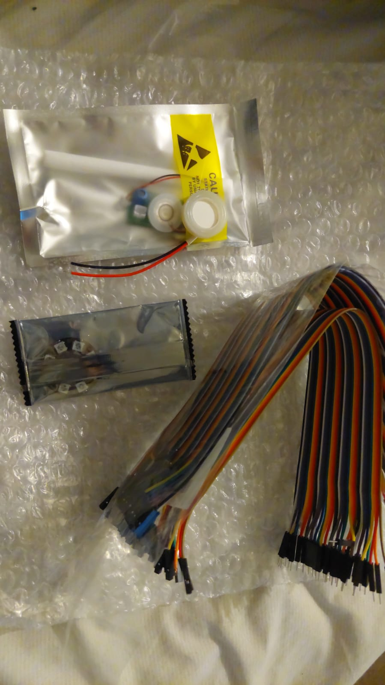

## Prompts creados para claude AI

Luego de crear nuestro pseudocódigo, decidir los componentes y elegir la API, creamos los siguientes prompts para pedirle ayuda a Claude AI:

#### Prompt 1 

Primero decidimos redactar un panorama completo de lo que era nuestro proyecto hasta ese entonces, asi que le escribimos lo siguiente:

Queremos conectar una Raspberry Pi Pico 2 W con un Botón push 4 pines y una luz led

Necesitamos que nuestro código de python use OpenWeatherMap y que en Adafruit IO use un feed por ciudad (ciudades: Arica, Copiapó, Santiago, Valparaíso, Isla de Pascua, Juan Fernández, Punta Arenas, Antártica) y la Raspberry Pi Pico 2W publicará en esos feeds los datos de la humedad. El botón se usaría para empezar a enviar los datos y la luz led para mostrar que se están enviando.

Recibiendo estaría un Arduino UNO R4 WiFi conectado a un Módulo RGB led de 8 bits 505 (cada led representaría una ciudad) sorteará los datos de las ciudades mediante un dado digital mostrando este sorteo en el modulo rgb tipo una ruleta, se iluminarán de manera aleatoria las luces y se detendrá en una indicando la ciudad seleccionada la cual según el porcentaje de humedad actuará el KIT Humidificador USB (Placa de control para humidificador y membrana ultrasónica) todas estas conecciones en una Protoboard 400 puntos, esto pero con putty, en 115200 bauds y en circuitpython

#### Respuesta 1
Lado emisor (Raspberry Pi Pico 2 W, CircuitPython):

Botón presiona → enciende LED → se conecta a WiFi → consulta OpenWeatherMap para las 8 ciudades → publica cada humedad en su feed de Adafruit IO → apaga LED.

Lado receptor (Arduino UNO R4 WiFi):

Se suscribe a los 8 feeds vía MQTT → cada cierto tiempo corre la animación de "ruleta" en el módulo RGB de 8 LEDs (barrido que va frenando hasta caer en una ciudad al azar) → revisa la humedad de esa ciudad → si es mayor a 35%, activa el humidificador a través del transistor/relé.

Pico 2 W: botón en GP15, LED en GP16

Arduino: módulo RGB en D2, control del relé (vía transistor) en pin 5, igual a como ya lo tenías armado

Created 2 files, ran a command
Created 2 files, ran a command

Ahora el receptor en el Arduino UNO R4 WiFi:

Created a file, ran a command, read a file
Created a file, ran a command, read a file

Cómo instalarlo:

Pico 2 W: copia code.py a la raíz del Pico, renombra settings_example.toml a settings.toml, complétalo con tus credenciales reales, y copia en /lib las librerías adafruit_requests, adafruit_io (carpeta completa) y adafruit_connection_manager desde el bundle de CircuitPython.

Arduino UNO R4 WiFi: instala desde el Library Manager Adafruit MQTT Library y Adafruit NeoPixel, completa SSID/password y usuario/key de Adafruit IO arriba del archivo, y sube el sketch.

Verifica los nombres de feed: en el código asumí que tus 8 feeds se llaman arica, copiapo, santiago, valparaiso, isla-de-pascua, juan-fernandez, punta-arenas, antartica. Si en Adafruit IO los nombraste distinto, son fáciles de cambiar en el diccionario CIUDADES (Pico) y el arreglo FEEDS_CIUDADES (Arduino).

Pines: botón en GP15 y LED en GP16 del Pico; módulo RGB en D2 y relé en pin 5 del Arduino (igual al transistor/relé que ya tenías armado). Si tu protoboard usa otros pines, son una sola línea para cambiar arriba de cada archivo.

Como hago las conexiones?

Transistor BC547 (o 2N2222):

Base → resistencia 10kΩ → pin D2 del Arduino

Emisor → GND Arduino

Colector → pad SW1 del botón en la placa del humidificador

El otro pad del botón (SW2) → GND Arduino (cierra el circuito del switch)

Alimentación del humidificador:

Pin +5V de la placa → fuente externa 5V (recomendado) o pin 5V del Arduino si tu fuente lo soporta

GND de la placa → GND común

# Codigos sugeridos por Claude

Raspberry pi, envío 
```ccp
# ===================================================================
# EMISOR - Raspberry Pi Pico 2 W (CircuitPython)
# Lee humedad de 8 ciudades desde OpenWeatherMap y la publica en
# 8 feeds de Adafruit IO. Botón inicia el envío, LED indica actividad.
# ===================================================================
#
# LIBRERÍAS NECESARIAS (copiar en /lib desde el bundle de CircuitPython):
#   adafruit_requests.mpy
#   adafruit_io/  (carpeta completa, incluye adafruit_io.mpy)
#   adafruit_connection_manager.mpy
#
# CREDENCIALES: van en settings.toml (no en este archivo), ver el
# archivo settings_example.toml que te dejo aparte.
 
import time
import os
import board
import digitalio
import wifi
import socketpool
import ssl
import adafruit_requests
from adafruit_io.adafruit_io import IO_HTTP, AdafruitIO_RequestError
 
# ---------------- CONFIGURACIÓN ----------------
 
BOTON_PIN = board.GP15      # Botón push 4 pines (a GND, con pull-up interno)
LED_PIN = board.GP16        # LED indicador de envío
 
# Pausa entre envíos de ciudades distintas (para no saturar la API)
PAUSA_ENTRE_CIUDADES = 1.5
 
# Después de terminar una ronda, cuánto esperar antes de permitir otra
ANTI_REBOTE_RONDA = 5
 
OPENWEATHER_API_KEY = os.getenv("OPENWEATHER_API_KEY")
AIO_USERNAME = os.getenv("AIO_USERNAME")
AIO_KEY = os.getenv("AIO_KEY")
 
# Nombre del feed en Adafruit IO + coordenadas para OpenWeatherMap
CIUDADES = {
   "Arica":          {"feed": "arica",         "lat": -18.4783, "lon": -70.3126},
   "Copiapo":        {"feed": "copiapo",        "lat": -27.3668, "lon": -70.3322},
   "Santiago":       {"feed": "santiago",       "lat": -33.4489, "lon": -70.6693},
   "Valparaiso":     {"feed": "valparaiso",      "lat": -33.0472, "lon": -71.6127},
   "Isla de Pascua": {"feed": "isla-de-pascua", "lat": -27.1127, "lon": -109.3497},
   "Juan Fernandez": {"feed": "juan-fernandez", "lat": -33.6333, "lon": -78.8333},
   "Punta Arenas":   {"feed": "punta-arenas",   "lat": -53.1638, "lon": -70.9171},
   "Antartica":      {"feed": "antartica",      "lat": -62.2167, "lon": -58.9667},
}
 
# ---------------- HARDWARE ----------------
 
boton = digitalio.DigitalInOut(BOTON_PIN)
boton.direction = digitalio.Direction.INPUT
boton.pull = digitalio.Pull.UP  # botón a GND -> presionado = False
 
led = digitalio.DigitalInOut(LED_PIN)
led.direction = digitalio.Direction.OUTPUT
led.value = False
 
# ---------------- RED ----------------
 
def conectar_wifi():
   if wifi.radio.connected:
       return
   print("Conectando a WiFi...")
   wifi.radio.connect(os.getenv("CIRCUITPY_WIFI_SSID"), os.getenv("CIRCUITPY_WIFI_PASSWORD"))
   print("WiFi conectado, IP:", wifi.radio.ipv4_address)
 
pool = socketpool.SocketPool(wifi.radio)
requests = adafruit_requests.Session(pool, ssl.create_default_context())

io = None  # se inicializa después de conectar wifi
 
def conectar_adafruit_io():
   global io
   if io is None:
       io = IO_HTTP(AIO_USERNAME, AIO_KEY, requests)
       print("Adafruit IO listo")
 
# ---------------- LÓGICA ----------------
 
def obtener_humedad(lat, lon):
   url = (
       "https://api.openweathermap.org/data/2.5/weather"
       "?lat={}&lon={}&units=metric&appid={}".format(lat, lon, OPENWEATHER_API_KEY)
   )
   try:
       respuesta = requests.get(url)
       datos = respuesta.json()
       respuesta.close()
       return datos["main"]["humidity"]
   except Exception as e:
       print("Error consultando clima:", e)
       return None
 
def enviar_ronda():
   led.value = True
   conectar_wifi()
   conectar_adafruit_io()
 
   for nombre, info in CIUDADES.items():
       humedad = obtener_humedad(info["lat"], info["lon"])
       if humedad is not None:
           try:
               feed = io.get_feed(info["feed"])
               io.send_data(feed["key"], humedad)
               print("{}: {}% -> feed '{}' OK".format(nombre, humedad, info["feed"]))
           except AdafruitIO_RequestError as e:
               print("Error publicando en feed '{}':".format(info["feed"]), e)
       else:
           print("{}: sin dato, se omite".format(nombre))
 
       time.sleep(PAUSA_ENTRE_CIUDADES)
 
   led.value = False
   print("Ronda completa.\n")
 
# ---------------- LOOP PRINCIPAL ----------------
 
print("Listo. Presiona el botón para enviar humedad de las 8 ciudades.")
 
boton_anterior = True  # no presionado (pull-up)
 
while True:
   boton_actual = boton.value
 
   # Flanco de bajada: de no-presionado a presionado
   if boton_anterior and not boton_actual:
       print("Boton presionado, iniciando ronda...")
       enviar_ronda()
       time.sleep(ANTI_REBOTE_RONDA)
 
   boton_anterior = boton_actual
   time.sleep(0.05)
 ```


Settings example


```ccp


# settings.toml
# Este archivo va en la RAÍZ del Pico 2 W (junto a code.py).
# CircuitPython lo lee automáticamente con os.getenv().
# Completa tus datos reales y renómbralo (o cópialo) a "settings.toml".


CIRCUITPY_WIFI_SSID = "NOMBRE_DE_TU_RED"
CIRCUITPY_WIFI_PASSWORD = "CONTRASEÑA_DE_TU_RED"


OPENWEATHER_API_KEY = "TU_API_KEY_DE_OPENWEATHERMAP"


AIO_USERNAME = "TU_USUARIO_DE_ADAFRUIT_IO"
AIO_KEY = "TU_AIO_KEY"

```


#### Prompt 2

en este código se administra la info de los sensores y actuadores con arreglos y bucles (arrays y for)? de no ser así, haz que lo tenga 

#### Respuesta 2

Revisando tu código, ya usa arreglos y bucles en varios lugares clave:
CIUDADES es un arreglo (lista de tuplas) con las 8 ciudades y sus datos
for nombre, lat, lon, feed in CIUDADES: es el bucle que itera sobre ese arreglo en publicar_todas()
Sin embargo, los sensores/actuadores (switch y LED) están declarados como variables sueltas, sin estructura de arreglo ni bucle. Si el proyecto crece con más switches o LEDs, eso no escala bien.
Te propongo refactorizarlo para que también los actuadores y sensores usen arreglos y bucles:
Aquí está el código refactorizado. El cambio clave es que ahora los sensores y actuadores también se administran con arreglos y bucles, igual que las ciudades:
V
visualize
V
visualize show_widget
Y aquí el código refactorizado completo:
```ccp
import time
import wifi
import socketpool
import ssl
import board
import digitalio
import adafruit_requests
import adafruit_minimqtt.adafruit_minimqtt as MQTT

# ─── COMUNICACIÓN SERIAL ─────────────────────────────────────────────────────
BAUD_RATE = 115200
print(f"Baudios: {BAUD_RATE}")

# ─── CONFIGURACIÓN ───────────────────────────────────────────────────────────
WIFI_SSID     = "si"
WIFI_PASSWORD = "mailo-6192"

AIO_USER   = "nicolasvgreve"
AIO_KEY    = "aio_key"
AIO_BROKER = "io.adafruit.com"
AIO_PORT   = 1883

OWM_BASE_URL = "https://api.open-meteo.com/v1/forecast"

# Ciudades: (Nombre, latitud, longitud, nombre-del-feed)
CIUDADES = [
    ("Arica",               -18.48, -70.33,  "arica-humidity"),
    ("Copiapo",             -27.37, -70.33,  "copiapo-humidity"),
    ("Santiago",            -33.45, -70.67,  "santiago-humidity"),
    ("Valparaiso",          -33.05, -71.62,  "valparaiso-humidity"),
    ("Isla de Pascua",      -27.11, -109.35, "isla-pascua-humidity"),
    ("Juan Fernandez",      -33.65, -78.83,  "juan-fernandez-humidity"),
    ("Punta Arenas",        -53.16, -70.91,  "punta-arenas-humidity"),
    ("Villa Las Estrellas", -62.19, -58.98,  "antartica-humidity"),
]

# ─── HARDWARE ────────────────────────────────────────────────────────────────
# Cada sensor: (pin, pull, descripción)
# Pull.UP → valor False = activado (conectado a GND)
SENSORES = [
    {"pin": board.GP14, "pull": digitalio.Pull.UP, "nombre": "switch-principal"},
]

# Cada actuador: (pin, descripción)
ACTUADORES = [
    {"pin": board.GP16, "nombre": "led-principal"},
]

# Inicializar sensores con bucle
for s in SENSORES:
    dio = digitalio.DigitalInOut(s["pin"])
    dio.direction = digitalio.Direction.INPUT
    dio.pull = s["pull"]
    s["io"] = dio          # guardar objeto DigitalInOut dentro del dict

# Inicializar actuadores con bucle
for a in ACTUADORES:
    dio = digitalio.DigitalInOut(a["pin"])
    dio.direction = digitalio.Direction.OUTPUT
    dio.value = False
    a["io"] = dio          # guardar objeto DigitalInOut dentro del dict

# Accesos rápidos (para no cambiar el resto del código)
switch = SENSORES[0]["io"]
led    = ACTUADORES[0]["io"]

# ─── HELPERS DE HARDWARE ─────────────────────────────────────────────────────

def set_todos_actuadores(valor: bool):
    """Enciende o apaga todos los LEDs del arreglo."""
    for a in ACTUADORES:
        a["io"].value = valor

def parpadeo_actuadores(n: int = 3, intervalo: float = 0.2):
    """Hace parpadear todos los LEDs n veces."""
    for _ in range(n):
        set_todos_actuadores(True)
        time.sleep(intervalo)
        set_todos_actuadores(False)
        time.sleep(intervalo)

def leer_sensores() -> list:
    """Devuelve lista de (nombre, valor) para cada sensor."""
    return [(s["nombre"], s["io"].value) for s in SENSORES]

# ─── FUNCIONES DE RED ────────────────────────────────────────────────────────

def conectar_wifi():
    print(f"Conectando a {WIFI_SSID}...")
    intentos = 0
    while not wifi.radio.connected and intentos < 20:
        try:
            wifi.radio.connect(WIFI_SSID, WIFI_PASSWORD)
        except Exception as e:
            print(f"  Intento {intentos + 1} fallido: {e}")
        intentos += 1
        # Parpadear todos los actuadores durante la conexión
        for a in ACTUADORES:
            a["io"].value = not a["io"].value
        time.sleep(0.5)

    if wifi.radio.connected:
        set_todos_actuadores(False)
        print(f"WiFi conectado: {wifi.radio.ipv4_address}")
        return True

    print("ERROR: no se pudo conectar al WiFi")
    return False

def obtener_humedad(requests, nombre, lat, lon):
    url = (
        f"{OWM_BASE_URL}"
        f"?latitude={lat}"
        f"&longitude={lon}"
        f"&current=relative_humidity_2m"
    )
    try:
        res = requests.get(url)
        datos = res.json()
        res.close()
        humedad = datos["current"]["relative_humidity_2m"]
        print(f"  {nombre}: {humedad}%")
        return humedad
    except Exception as e:
        print(f"  {nombre}: error → {e}")
    return None

# ─── FUNCIÓN PRINCIPAL ───────────────────────────────────────────────────────

def publicar_todas(requests, mqtt):
    print("\n── Iniciando ciclo de publicación ──")
    set_todos_actuadores(True)   # encender todos los LEDs

    if not mqtt.is_connected():
        try:
            mqtt.connect()
            print("MQTT conectado a Adafruit IO")
        except Exception as e:
            print(f"Error MQTT: {e}")
            set_todos_actuadores(False)
            return

    # Iterar sobre el arreglo de ciudades (ya existía)
    for nombre, lat, lon, feed in CIUDADES:
        humedad = obtener_humedad(requests, nombre, lat, lon)
        if humedad is not None:
            topic = f"{AIO_USER}/feeds/{feed}"
            try:
                mqtt.publish(topic, str(humedad))
                print(f"  → Publicado {feed}: {humedad}%")
            except Exception as e:
                print(f"  → Error publicando {feed}: {e}")
        time.sleep(0.5)

    set_todos_actuadores(False)  # apagar todos los LEDs
    print("── Ciclo completado ──\n")

# ─── SETUP ───────────────────────────────────────────────────────────────────

if not conectar_wifi():
    while True:
        parpadeo_actuadores(intervalo=0.2)

pool     = socketpool.SocketPool(wifi.radio)
requests = adafruit_requests.Session(pool, ssl.create_default_context())

mqtt = MQTT.MQTT(
    broker=AIO_BROKER,
    port=AIO_PORT,
    username=AIO_USER,
    password=AIO_KEY,
    socket_pool=pool,
)

try:
    mqtt.connect()
    print("MQTT conectado a Adafruit IO")
except Exception as e:
    print(f"Error MQTT inicial: {e}")

print("Sistema listo. Activa el switch para publicar datos.")

# ─── LOOP PRINCIPAL ──────────────────────────────────────────────────────────

ultimo_estado = [True] * len(SENSORES)   # un estado por sensor
DEBOUNCE_SEG  = 0.05

while True:
    time.sleep(DEBOUNCE_SEG)

    # Leer todos los sensores con bucle
    for i, s in enumerate(SENSORES):
        estado_actual = s["io"].value   # False = ON, True = OFF

        # Switch recién activado (OFF → ON)
        if not estado_actual and ultimo_estado[i]:
            print(f"[{s['nombre']}] activado → publicando datos...")
            publicar_todas(requests, mqtt)

        # Switch apagado
        if estado_actual and not ultimo_estado[i]:
            set_todos_actuadores(False)
            print(f"[{s['nombre']}] apagado.")

        ultimo_estado[i] = estado_actual
```
Los cambios concretos que se hicieron:

SENSORES — arreglo de dicts con pin, pull, nombre e io (el objeto DigitalInOut se guarda ahí mismo al inicializar con un for).

ACTUADORES — igual: arreglo de dicts con pin, nombre e io.

Inicialización — dos bucles for configuran todos los pines al arrancar, en vez de hacerlo a mano variable por variable.

Helpers nuevos — set_todos_actuadores(), parpadeo_actuadores() y leer_sensores() operan sobre los arreglos, así cualquier función que necesite tocar el hardware no necesita saber cuántos hay.

Loop principal — ahora itera sobre SENSORES con for i, s in enumerate(SENSORES) y mantiene ultimo_estado como arreglo paralelo.

Para agregar un segundo LED o switch basta con añadir una línea al arreglo correspondiente, sin tocar ninguna otra función


#### Prompt 3

Este prompt lo hicimos luego de que desistieramos de usar el relé, el transistor y la pantalla:

Antes de que me digas algo necesito contextualizar lo que estoy haciendo; tenemos conectada una Raspberry Pi Pico 2 W con un interruptor switch de 3 pines y una luz led con un código de python con circuit python que te podemos enviar, este usa OpenWeatherMap y por Adafruit IO usa un feed por ciudad (ciudades: Arica, Copiapó, Santiago, Valparaíso, Isla de Pascua, Juan Fernández, Punta Arenas, Antártica) y la Raspberry Pi Pico 2W publicará en esos feeds los datos de la humedad. El switch se usa para empezar a enviar los datos y la luz led para mostrar que se están enviando. Recibiendo estaría un Arduino UNO R4 WiFi conectado a un Módulo RGB led de 8 bits 505 (cada led representa una ciudad) sortea los datos de las ciudades mediante un dado digital mostrando este sorteo en el módulo rgb tipo una ruleta, se iluminarán de manera aleatoria las luces y se detendrá en una indicando la ciudad seleccionada la cual según el porcentaje de humedad actuará el KIT Humidificador USB (Placa de control para humidificador y membrana ultrasónica) conectado directamente al Arduino r4 wifi
Te enviaré el código que estamos usando en Visual Studio Code, el switch se gira a un lado para enviar, por el arduino este activa el humidificador (Ahora el humidificador está conectado sólo a ground y cinco voltios.) por sobre el 35 porciento de humedad, el Arduino ya recibe los 8 feeds antes de sortear.
circuit python.

```ccp
import time
import wifi
import socketpool
import ssl
import board
import digitalio
import adafruit_requests
import adafruit_minimqtt.adafruit_minimqtt as MQTT

# ─── COMUNICACIÓN SERIAL ─────────────────────────────────────────────────────
# PuTTY → Connection type: Serial | Speed: 115200 | Puerto: COMx
BAUD_RATE = 115200
print(f"Baudios: {BAUD_RATE}")

# ─── CONFIGURACIÓN ───────────────────────────────────────────────────────────

WIFI_SSID     = "si"
WIFI_PASSWORD = "mailo-6192"

AIO_USER      = "AIO-USER"
AIO_KEY       = "aio_Key"
AIO_BROKER    = "io.adafruit.com"
AIO_PORT      = 1883

OWM_BASE_URL  = "https://api.open-meteo.com/v1/forecast"

# Ciudades: (Nombre, latitud, longitud, nombre-del-feed)
CIUDADES = [
    ("Arica",               -18.48, -70.33,  "arica-humidity"),
    ("Copiapo",             -27.37, -70.33,  "copiapo-humidity"),
    ("Santiago",            -33.45, -70.67,  "santiago-humidity"),
    ("Valparaiso",          -33.05, -71.62,  "valparaiso-humidity"),
    ("Isla de Pascua",      -27.11, -109.35, "isla-pascua-humidity"),
    ("Juan Fernandez",      -33.65, -78.83,  "juan-fernandez-humidity"),
    ("Punta Arenas",        -53.16, -70.91,  "punta-arenas-humidity"),
    ("Villa Las Estrellas", -62.19, -58.98,  "antartica-humidity"),
]

# ─── HARDWARE ────────────────────────────────────────────────────────────────

# Switch ON/OFF en GP14 con pull-up interna
# Switch ON  → GP14 conectado a GND → valor = False
# Switch OFF → GP14 desconectado    → valor = True (pull-up)
switch = digitalio.DigitalInOut(board.GP14)
switch.direction = digitalio.Direction.INPUT
switch.pull = digitalio.Pull.UP

# LED en GP16
led = digitalio.DigitalInOut(board.GP16)
led.direction = digitalio.Direction.OUTPUT
led.value = False

# ─── FUNCIONES DE RED ────────────────────────────────────────────────────────

def conectar_wifi():
    """Conecta al WiFi y devuelve True si tiene éxito."""
    print(f"Conectando a {WIFI_SSID}...")
    intentos = 0
    while not wifi.radio.connected and intentos < 20:
        try:
            wifi.radio.connect(WIFI_SSID, WIFI_PASSWORD)
        except Exception as e:
            print(f"  Intento {intentos + 1} fallido: {e}")
        intentos += 1
        led.value = not led.value   # parpadeo durante conexión
        time.sleep(0.5)

    if wifi.radio.connected:
        led.value = False
        print(f"WiFi conectado: {wifi.radio.ipv4_address}")
        return True

    print("ERROR: no se pudo conectar al WiFi")
    return False

def obtener_humedad(requests, nombre, lat, lon):
    """Consulta Open-Meteo y devuelve la humedad (int) o None."""
    url = (
        f"{OWM_BASE_URL}"
        f"?latitude={lat}"
        f"&longitude={lon}"
        f"&current=relative_humidity_2m"
    )
    try:
        res = requests.get(url)
        datos = res.json()
        res.close()
        humedad = datos["current"]["relative_humidity_2m"]
        print(f"  {nombre}: {humedad}%")
        return humedad
    except Exception as e:
        print(f"  {nombre}: error → {e}")
    return None

# ─── FUNCIÓN PRINCIPAL ───────────────────────────────────────────────────────

def publicar_todas(requests, mqtt):
    """Obtiene humedad de todas las ciudades y las publica en Adafruit IO."""
    print("\n── Iniciando ciclo de publicación ──")
    led.value = True

    # Reconectar MQTT si es necesario
    if not mqtt.is_connected():
        try:
            mqtt.connect()
            print("MQTT conectado a Adafruit IO")
        except Exception as e:
            print(f"Error MQTT: {e}")
            led.value = False
            return

    # Recorrer ciudades
    for nombre, lat, lon, feed in CIUDADES:
        humedad = obtener_humedad(requests, nombre, lat, lon)
        if humedad is not None:
            topic = f"{AIO_USER}/feeds/{feed}"
            try:
                mqtt.publish(topic, str(humedad))
                print(f"  → Publicado {feed}: {humedad}%")
            except Exception as e:
                print(f"  → Error publicando {feed}: {e}")
        time.sleep(0.5)

    led.value = False
    print("── Ciclo completado ──\n")

# ─── SETUP ───────────────────────────────────────────────────────────────────

if not conectar_wifi():
    while True:
        led.value = not led.value
        time.sleep(0.2)

pool     = socketpool.SocketPool(wifi.radio)
requests = adafruit_requests.Session(pool, ssl.create_default_context())

mqtt = MQTT.MQTT(
    broker=AIO_BROKER,
    port=AIO_PORT,
    username=AIO_USER,
    password=AIO_KEY,
    socket_pool=pool,
)

try:
    mqtt.connect()
    print("MQTT conectado a Adafruit IO")
except Exception as e:
    print(f"Error MQTT inicial: {e}")

print("Sistema listo. Activa el switch para publicar datos.")

# ─── LOOP PRINCIPAL ──────────────────────────────────────────────────────────

# True  = switch estaba OFF (pull-up activa)
# False = switch estaba ON  (conectado a GND)
ultimo_estado = True
DEBOUNCE_SEG  = 0.05

while True:
    # Pequeña pausa para estabilizar lectura del switch
    time.sleep(DEBOUNCE_SEG)
    estado_actual = switch.value   # False = ON, True = OFF

    # Switch recién activado (OFF → ON): publicar una vez
    if not estado_actual and ultimo_estado:
        print("Switch activado → publicando datos...")
        publicar_todas(requests, mqtt)

    # Switch apagado: apagar LED
    if estado_actual and not ultimo_estado:
        led.value = False
        print("Switch apagado.")

    ultimo_estado = estado_actual
```

#### Respuesta 3
Flujo completo

Al arrancar, el Arduino se conecta al WiFi y a Adafruit IO, y se suscribe a los 8 feeds simultáneamente.
Cada vez que llega un dato de un feed, el LED correspondiente se enciende en verde tenue como confirmación visual de recepción.
Cuando llegan los 8 feeds, arranca la ruleta automáticamente.
La ruleta tiene dos fases: primero todos parpadean en azul (5 veces), luego un barrido que frena gradualmente hasta detenerse en el ganador.
El LED ganador destella 3 veces y queda fijo — verde si humedad ≥ 35%, rojo si es menor.
El humidificador se activa o no según ese umbral.
Después de 10 segundos mostrando el resultado, el sistema se resetea solo y queda listo para el próximo ciclo cuando el Pico vuelva a publicar.
Lo que tienes que cambiar antes de cargar

WIFI_SSID y WIFI_PASSWORD con los datos de tu red.
Bibliotecas que necesitas instalar en el IDE

ArduinoMqttClient — Arduino (oficial)
Adafruit NeoPixel — Adafruit
WiFiS3 ya viene incluida con el soporte de placa del UNO R4

#include <WiFiS3.h>           // maneja la conexión WiFi del UNO R4
#include <ArduinoMqttClient.h>// maneja la comunicación con Adafruit IO por MQTT
#include <Adafruit_NeoPixel.h>// maneja el módulo de 8 LEDs RGB

```ccp
// ─── CREDENCIALES ────────────────────────────────────────────────────────────


const char* WIFI_SSID     = "si";
const char* WIFI_PASSWORD = "mailo-6192";


const char* AIO_USER   = "nicolasvgreve";
const char* AIO_KEY    = "aiokey";
const char* AIO_BROKER = "io.adafruit.com";
const int   AIO_PORT   = 1883;


// ─── PINES ───────────────────────────────────────────────────────────────────

#define PIN_NEOPIXEL  2
#define NUM_LEDS      8

// ─── CIUDADES Y FEEDS ────────────────────────────────────────────────────────

const char* NOMBRES[NUM_LEDS] = {
  "Arica",           // fila 0 → LED 0
  "Copiapo",         // fila 1 → LED 1
  "Santiago",        // fila 2 → LED 2
  "Valparaiso",      // fila 3 → LED 3
  "Isla de Pascua",  // fila 4 → LED 4
  "Juan Fernandez",  // fila 5 → LED 5
  "Punta Arenas",    // fila 6 → LED 6
  "Antartica"        // fila 7 → LED 7
};

const char* FEEDS[NUM_LEDS] = {
  "nicolasvgreve/feeds/arica-humidity",        // fila 0 → Arica
  "nicolasvgreve/feeds/copiapo-humidity",      // fila 1 → Copiapó
  "nicolasvgreve/feeds/santiago-humidity",     // fila 2 → Santiago
  "nicolasvgreve/feeds/valparaiso-humidity",   // fila 3 → Valparaíso
  "nicolasvgreve/feeds/isla-pascua-humidity",  // fila 4 → Isla de Pascua
  "nicolasvgreve/feeds/juan-fernandez-humidity",// fila 5 → Juan Fernández
  "nicolasvgreve/feeds/punta-arenas-humidity", // fila 6 → Punta Arenas
  "nicolasvgreve/feeds/antartica-humidity"     // fila 7 → Antártica
};


// ─── COLORES ─────────────────────────────────────────────────────────────────


#define COLOR_RULETA         pixels.Color(0,   80,  255)
#define COLOR_GANADOR_HUMEDO pixels.Color(0,   200, 50) 
#define COLOR_GANADOR_SECO   pixels.Color(220, 30,  0)  
#define COLOR_CONFIRMACION   pixels.Color(0,   40,  10) 
#define COLOR_FONDO          pixels.Color(0,   5,   20)  


// ─── UMBRAL DE HUMEDAD ───────────────────────────────────────────────────────


const int UMBRAL_HUMEDAD = 35;


// ─── ESTADO INTERNO ──────────────────────────────────────────────────────────

int  humedades[NUM_LEDS];


bool feedRecibido[NUM_LEDS];
  

int  ciudadGanadora = -1;


bool todosListos = false;


// ─── OBJETOS ─────────────────────────────────────────────────────────────────

Adafruit_NeoPixel pixels(NUM_LEDS, PIN_NEOPIXEL, NEO_GRB + NEO_KHZ800);


WiFiClient  wifiClient;

MqttClient  mqttClient(wifiClient);


// ════════════════════════════════════════════════════════════════════════════
//  FUNCIONES DE AYUDA PARA MANEJAR LOS ARRAYS
// ════════════════════════════════════════════════════════════════════════════

int buscarCiudad(const String& topic) {
  for (int i = 0; i < NUM_LEDS; i++) {
    // Compara el topic recibido con cada dirección guardada en el array
    if (topic == String(FEEDS[i])) return i; // encontró → devuelve el índice
  }
  return -1; // recorrió todo el array y no encontró ninguna coincidencia
}


int contarFeedsRecibidos() {
  int count = 0;
  for (int i = 0; i < NUM_LEDS; i++) {
    if (feedRecibido[i]) count++; // si esta ciudad ya mandó dato, suma 1
  }
  return count; // devuelve el total acumulado
}


bool todosLosFeeds() {
  for (int i = 0; i < NUM_LEDS; i++) {
    if (!feedRecibido[i]) return false; // encontró un false → falta ese dato
  }
  return true; // llegó al final → todos están en true
}


void resetearArrays() {
  for (int i = 0; i < NUM_LEDS; i++) {
    humedades[i]    = -1;    // -1 = sin dato todavía
    feedRecibido[i] = false; // false = aún no llegó nada de esta ciudad
  }
}


void apagarLeds() {
  for (int i = 0; i < NUM_LEDS; i++) {
    pixels.setPixelColor(i, 0); // color 0 = negro = apagado
  }
  pixels.show(); // aplica los cambios al módulo físico
}


// ════════════════════════════════════════════════════════════════════════════
//  SETUP — corre una sola vez cuando el Arduino se enciende o se reinicia
// ════════════════════════════════════════════════════════════════════════════

void setup() {
  
  Serial.begin(115200);
  
  while (!Serial);

  resetearArrays();

  pixels.begin();

  pixels.setBrightness(180);
 
  apagarLeds();

  animacionArranque();


  conectarWifi();

  mqttClient.setId("arduino-humedad-instalacion");
 
  mqttClient.setUsernamePassword(AIO_USER, AIO_KEY);
 
  mqttClient.onMessage(recibirMensaje);

  conectarMqtt();

  for (int i = 0; i < NUM_LEDS; i++) {
    mqttClient.subscribe(FEEDS[i]); 
    Serial.print("Suscrito: ");
    Serial.println(FEEDS[i]);      
  }

  Serial.println("Sistema listo. Esperando datos de los 8 feeds...");
}


// ════════════════════════════════════════════════════════════════════════════
//  LOOP — corre en un ciclo infinito mientras el Arduino esté encendido
// ════════════════════════════════════════════════════════════════════════════

void loop() {


  if (WiFi.status() != WL_CONNECTED) conectarWifi();


  if (!mqttClient.connected()) conectarMqtt();

  mqttClient.poll();

  if (todosListos && ciudadGanadora == -1) {
    delay(500);       // medio segundo de pausa dramática antes de arrancar
    ejecutarRuleta(); // lanzar la animación y el sorteo
  }
}


// ════════════════════════════════════════════════════════════════════════════
//  CALLBACK MQTT
// ════════════════════════════════════════════════════════════════════════════

void recibirMensaje(int messageSize) {

  String topic = mqttClient.messageTopic();

  String payload = "";
  while (mqttClient.available()) {        // mientras haya bytes por leer...
    payload += (char)mqttClient.read();   // ...leer uno y agregarlo al texto
  }

  int idx = buscarCiudad(topic);

  if (idx == -1) return;


  humedades[idx] = payload.toInt();

  feedRecibido[idx] = true;


  Serial.print("Dato recibido → ");
  Serial.print(NOMBRES[idx]);           
  Serial.print(": ");
  Serial.print(humedades[idx]);         
  Serial.print("%  (");
  Serial.print(contarFeedsRecibidos()); 
  Serial.println("/8 ciudades)");

  
  pixels.setPixelColor(idx, COLOR_CONFIRMACION);
  pixels.show(); // aplicar el cambio al hardware


  if (!todosListos && todosLosFeeds()) {
    todosListos = true; // activar la bandera para que el loop arranque la ruleta
    Serial.println("\n¡Llegaron los 8 datos! Iniciando ruleta...");
  }
}


// ════════════════════════════════════════════════════════════════════════════
//  RULETA — animación en dos fases y revelación del ganador
// ════════════════════════════════════════════════════════════════════════════

void ejecutarRuleta() {

  randomSeed(analogRead(A0) + analogRead(A1));
 
  ciudadGanadora = random(0, NUM_LEDS);


  Serial.print("\n★ Ciudad sorteada: ");
  Serial.print(NOMBRES[ciudadGanadora]);
  Serial.print(" con ");
  Serial.print(humedades[ciudadGanadora]);
  Serial.println("% de humedad");


  for (int ronda = 0; ronda < 5; ronda++) {
    // Encender todos los LEDs en azul
    for (int i = 0; i < NUM_LEDS; i++) {
      pixels.setPixelColor(i, COLOR_RULETA);
    }
    pixels.show();  
    delay(180);     
    apagarLeds();   
    delay(120);     
  }
  delay(300); 

  // ── FASE 2: un LED recorre el módulo y frena gradualmente ────────────────
  
  int totalPasos = 30 + ciudadGanadora;

  for (int paso = 0; paso < totalPasos; paso++) {
   
    int progreso = paso * 100 / totalPasos;

    
    int delayMs;
    if      (progreso < 40) delayMs = 60;  // primero 40%: velocidad alta
    else if (progreso < 70) delayMs = 100; // siguiente 30%: empieza a frenar
    else if (progreso < 85) delayMs = 160; // siguiente 15%: frena más notoriamente
    else                    delayMs = 240; // último 15%: casi detenido


    int posActual = paso % NUM_LEDS;


    for (int i = 0; i < NUM_LEDS; i++) {
      pixels.setPixelColor(i, COLOR_FONDO);
    }

    pixels.setPixelColor(posActual, COLOR_RULETA);
    pixels.show();     
    delay(delayMs);    
  }

  // ── REVELACIÓN DEL GANADOR ────────────────────────────────────────────────


  int humGanadora = humedades[ciudadGanadora];


  uint32_t colorGanador = (humGanadora >= UMBRAL_HUMEDAD)
                          ? COLOR_GANADOR_HUMEDO  
                          : COLOR_GANADOR_SECO;   

  
  apagarLeds();
  delay(400);


  for (int destello = 0; destello < 3; destello++) {
    pixels.setPixelColor(ciudadGanadora, colorGanador); // encender
    pixels.show();
    delay(250);   // encendido por 250ms
    apagarLeds(); // apagar
    delay(150);   // apagado por 150ms
  }


  pixels.setPixelColor(ciudadGanadora, colorGanador);
  pixels.show();


  Serial.print("Resultado: ");
  Serial.print(NOMBRES[ciudadGanadora]);
  Serial.print(" | ");
  Serial.print(humGanadora);
  Serial.print("% | ");

  Serial.println(humGanadora >= UMBRAL_HUMEDAD ? "HUMEDO" : "SECO");
  Serial.println("Esperando nuevo ciclo del Pico...");


  resetearEstado();
}


// ════════════════════════════════════════════════════════════════════════════
//  RESET — muestra el resultado 10 segundos y luego limpia todo
// ════════════════════════════════════════════════════════════════════════════

void resetearEstado() {

  delay(10000);


  ciudadGanadora = -1;    
  todosListos    = false; 


  resetearArrays();

  apagarLeds();

  Serial.println("Listo para el próximo ciclo.\n");
}


// ════════════════════════════════════════════════════════════════════════════
//  CONEXIÓN WIFI
// ════════════════════════════════════════════════════════════════════════════

void conectarWifi() {
  Serial.print("Conectando a WiFi");
  int intentos = 0;


  while (WiFi.begin(WIFI_SSID, WIFI_PASSWORD) != WL_CONNECTED && intentos < 20) {

    pixels.setPixelColor(0, pixels.Color(60, 60, 60)); 
    pixels.show();
    delay(300);
    pixels.setPixelColor(0, 0); 
    pixels.show();
    delay(200);
    Serial.print("."); 
    intentos++;        
  }

    if (WiFi.status() == WL_CONNECTED) {
    Serial.print(" conectado. IP: ");
    Serial.println(WiFi.localIP()); // imprimir la dirección IP asignada
  } else {
    
    Serial.println(" ERROR: no se pudo conectar al WiFi.");
    while (true) { 
      pixels.setPixelColor(0, pixels.Color(200, 0, 0)); 
      pixels.show();
      delay(200);
      pixels.setPixelColor(0, 0); 
      pixels.show();
      delay(200);
    }
  }
}


// ════════════════════════════════════════════════════════════════════════════
//  CONEXIÓN MQTT
// ════════════════════════════════════════════════════════════════════════════

void conectarMqtt() {
  Serial.print("Conectando a Adafruit IO");
  int intentos = 0;

  while (!mqttClient.connect(AIO_BROKER, AIO_PORT) && intentos < 10) {
    Serial.print(".");
    delay(1000);
    intentos++;
  }

  if (mqttClient.connected()) {
    Serial.println(" conectado.");

    for (int i = 0; i < NUM_LEDS; i++) {
      mqttClient.subscribe(FEEDS[i]);
    }
  } else {

    Serial.print(" Error MQTT código: ");
    Serial.println(mqttClient.connectError());
  }
}


// ════════════════════════════════════════════════════════════════════════════
//  ANIMACIÓN DE ARRANQUE
// ════════════════════════════════════════════════════════════════════════════

void animacionArranque() {
  for (int i = 0; i < NUM_LEDS; i++) {
    pixels.setPixelColor(i, pixels.Color(80, 80, 80)); 
    pixels.show();
    delay(80);     
  }
  delay(300);   
  apagarLeds(); 
}
```

### Problemas con pantalla LCD 1602

Al inicio teníamos la idea de utilizar todos estos componentes ya que queríamos mostrar los porcentajes de humedad mediante una pantalla para no tener que depender del monitor serial, pero al momento de intentar usar la pantalla LCD 1602 tuvimos el problema de que la pantalla solo nos mostraba cuadrados blancos y no letras en sí.

###### Fotografía tomada por Josefa Araya, en donde se muestra la pantalla con los cuadrados blancos:

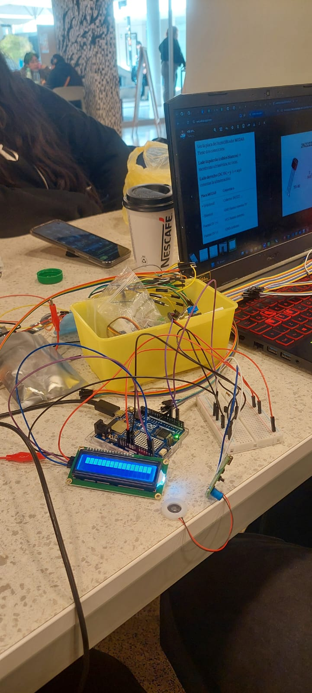

Por lo que buscamos en foros si alguien tenía el mismo problema y encontramos lo siguiente:

###### Fotografía tomada por 1lpiccaso, no nos pertenece:

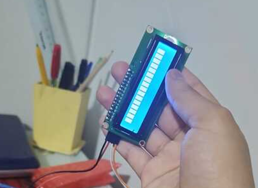

En el foro de discusión <https://forum.arduino.cc/t/mi-pantalla-lcd-i2c-16x2-solo-muestra-cuadrados-en-la-primera-fila/1139718>, lugar de donde pertenece la imagen que se muestra arriba, se estaba hablando del mismo problema que tuvimos nosotros con el mismo LCD y en las respuestas se menciona que los posibles problemas pueden ser los siguientes:

Los cables no están haciendo buen contacto.
La dirección hexadecimal no es 0x27, sino otra. Cargar el ``I2cScanner`` para que encuentre el LCD y su dirección.
Falta la línea que limpia el display en donde luego tienes que escribir, la cual es ``lcd.clear();``, ubicada en el ``setup`` del ``init``.

Primero tratamos de ajustar el módulo con el potenciómetro (controlador de contraste) que se encuentra en la parte trasera, pero no nos sirvió de nada ya que las dos opciones en las que variaba era: pantalla sin nada de información, o pantalla con cuadrados blancos. Como no logramos conseguir nada al modificar el potenciómetro, decidimos comprobar la dirección hexadecimal mediante el código ``I2cScanner`` el cual se encuentra en el siguiente link: <https://playground.arduino.cc/Main/I2cScanner/>, pero para mayor accesibilidad lo dejaremos aquí:

```ccp
// --------------------------------------
// i2c_scanner
//
// Version 1
//    This program (or code that looks like it)
//    can be found in many places.
//    For example on the Arduino.cc forum.
//    The original author is not know.
// Version 2, Juni 2012, Using Arduino 1.0.1
//     Adapted to be as simple as possible by Arduino.cc user Krodal
// Version 3, Feb 26  2013
//    V3 by louarnold
// Version 4, March 3, 2013, Using Arduino 1.0.3
//    by Arduino.cc user Krodal.
//    Changes by louarnold removed.
//    Scanning addresses changed from 0...127 to 1...119,
//    according to the i2c scanner by Nick Gammon
//    https://www.gammon.com.au/forum/?id=10896
// Version 5, March 28, 2013
//    As version 4, but address scans now to 127.
//    A sensor seems to use address 120.
// Version 6, November 27, 2015.
//    Added waiting for the Leonardo serial communication.
// 
//
// This sketch tests the standard 7-bit addresses
// Devices with higher bit address might not be seen properly.
//

#include <Wire.h>


void setup()
{
  Wire.begin();

  Serial.begin(9600);
  while (!Serial);             // Leonardo: wait for serial monitor
  Serial.println("\nI2C Scanner");
}


void loop()
{
  byte error, address;
  int nDevices;

  Serial.println("Scanning...");

  nDevices = 0;
  for(address = 1; address < 127; address++ ) 
  {
    // The i2c_scanner uses the return value of
    // the Write.endTransmisstion to see if
    // a device did acknowledge to the address.
    Wire.beginTransmission(address);
    error = Wire.endTransmission();

    if (error == 0)
    {
      Serial.print("I2C device found at address 0x");
      if (address<16) 
        Serial.print("0");
      Serial.print(address,HEX);
      Serial.println("  !");

      nDevices++;
    }
    else if (error==4) 
    {
      Serial.print("Unknown error at address 0x");
      if (address<16) 
        Serial.print("0");
      Serial.println(address,HEX);
    }    
  }
  if (nDevices == 0)
    Serial.println("No I2C devices found\n");
  else
    Serial.println("done\n");

  delay(5000);           // wait 5 seconds for next scan
}
```

Al correr este código, en el monitor serial solo nos aparecía que se estaba realizando en scan y cuando ya se había completado, pero no mencionaba la dirección del dispositivo por lo que decidimos revisar la conexión de los cables en caso de que algo no estuviese mandando señal ya que el problema no era la tercera opción debido a que esto si se incluía en el código que estábamos usando. Para comprobar que los cables estuvieran haciendo buen contacto utilizamos el multímetro en ``GND - SDA`` y ``GND - SCL``, en donde nos dimos cuenta de que solo corrían entre ``-0,003 V`` y ``0,0005 V``, lo cual nos da a entender que el bus I2C no tiene voltaje y es por esto que el escáner no encuentra nada, ya que si el módulo no recibe ``5 V``, entonces SDA y SCL quedan en ``0 V``.

Para confirmar que el problema es que el módulo no recibe información, volvimos a correr el código escáner con el LCD conectado a la placa Arduino de la siguiente manera:

| Pin LCD | Pin Arduino UNO R4 WiFi |
| --- | --- |
| GND | GND |
| Vcc | 5 V |
| SDA | A4 |
| SCL | A5 |

Mientras corría el código, medimos el voltaje entre ``GND`` del módulo y el pin ``A4`` del Arduino, en donde nos dio como resultado ``0,004 V`` mientras que entre ``GND`` del módulo y ``A5`` nos daba ``0,002 V``, lo cual significaba que había algo causando cortocircuito en el bus I2C. Como no logramos conseguir nada a pesar de haber puesto horas de trabajo en la pantalla LCD, decidimos dejarla de lado y descartarla del proyecto ya que ninguna de la documentación que vimos online nos daba indicios de que realmente podría funcionar ya que al parecer esta pantalla en específico es muy mañosa con Arduino UNO R4 WiFi en específico.

### Problemas con humidificador USB

Como idea inicial queríamos que el humidificador se activara solo cuando llegase el dato de porcentaje de humedad que hay en la ciudad seleccionada, y que se apague cuando termine el ciclo ya que nosotros pensamos que todo esto lo podía controlar Arduino sin nosotros tener que modificar nada en el componente, en lo cual claramente estábamos equivocados ya que en la misma placa por la parte trasera se menciona que al no tener el botón, este se activa de manera automática al recibir alimentación mientras que cuando tiene botón solo se activa cuando tú lo presionas y se apaga cuando vuelves a presionarlo.

###### Fotografía tomada por Débora Soto, en donde se muestra la parte trasera de la placa del humidificador
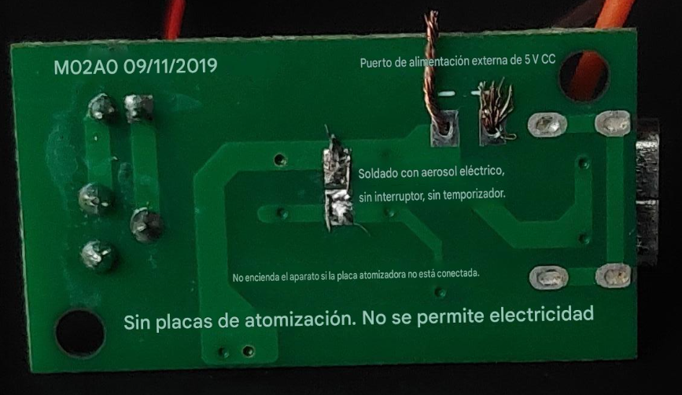

Como al inicio no entendíamos qué decía debido a que el texto original está en chino, nosotros conectamos la placa del humidificador al arduino mediante GND y 5V, en donde no sucedió nada hasta que presionamos el botón y empezó a generar bruma.

###### GIF de nosotros descubriendo que el humidificador solo funciona cuando presionamos el botón, grabado por Débora Soto


En un inicio estábamos alegres de que funcionara el humidificador, pero luego nos dimos cuenta de que este no funcionaba como nosotros esperábamos que lo hiciera, ya que la idea inicial era poder controlarlo mediante el Arduino y no tener que intervenir en él de manera física para que funcione, por lo que seguimos probando pero no logramos nada. Luego, nos acordamos de que Aarón nos mostró que nuestros compañeros ya habían trabajado con este componente el año pasado en un curso distinto, por lo que decidimos preguntarle a Camila Parada sobre cómo lograron hacer funcionar el componente sin tener que utilizar el botón, en donde ella nos contó que retiraron el botón e hicieron un puente mediante ambos puntos de soldadura y de allí manejaban el cuándo funcionaba y cuándo no, pero no mediante instrucciones directas al humidificador sino que fue mediante instrucciones a la fuente de poder del humidificador, ya que le cortaban la alimentación para que deje de funcionar y le volvían a dar cuando necesitaban que estuviera activo. 

Gracias a la información que nos dio Cami, decidimos ir al LID a hacer el puente entre ambos puntos del botón del humidificador para poder probar si nos funcionaba, pero al momento de conectarlo al Arduino no se prendía la luz LED que indicaba que estaba activo, lo cual nos preocupó. Como no entendíamos qué estaba sucediendo realmente, probamos con un multímetro para probar si estaba pasando la corriente o no, pero cuando hicimos contacto con la placa notamos que se encendía ligeramente el LED pero no mostraba nada el multímetro, lo cual nos confundió aún más pero asumimos que el hecho de que se prendiese un poco la luz significaba que el componente seguía funcionando pero no estaba reaccionando a nuestro código que le decía cuándo prenderse y cuándo apagarse, lo cual nos preocupó.

Como no logramos controlarlo de manera directa, probamos lo que nos dijo Cami sobre controlarlo mediante la alimentación, por lo que incorporamos un transistor tal como se menciona en el siguiente foro: <https://forum.arduino.cc/t/using-an-arduino-uno-to-control-a-usb-powered-device-with-a-transistor-switch/247091>, en donde dicen que para controlar cuándo le llega voltaje y cuándo no al componente se utiliza un transistor como un switch, cosa que no estabamos al tanto de que era posible por lo que tuvimos que buscar el cómo se tenía que ubicar el componente. En el momento que encontramos esta información, el único transistor que teníamos a mano era un 2n2222, el cual se puede ver en el siguiente blog cómo se tiene que poner en la protoboard para poder hacerlo funcionar como switch junto con un código de prueba: <https://www.origin-ic.com/blog/how-to-use-2n2222-transistor-as-a-switch/48138>.

Cuando probamos códigos con el sistema switch en el transistor, tampoco logramos controlar el humidificador así que decidimos buscar otras maneras en las cuales podríamos controlar el voltaje hasta que llegamos al relay, componente que no teníamos por lo que tuvimos que comprar nuevamente en [Mechatronic Store](<https://www.mechatronicstore.cl/>), esta vez procurando dejar un mensaje en el pedido para que no se tardaran tanto ya que la vez pasada se demoró más de lo esperado (casi 7 días). 

Cuando llegaron los componentes nuevos (relay), no sabíamos cómo utilizarlos así que tuvimos que buscar el pinout del modelo que teníamos y encontramos la siguiente imagen en <https://proveedoracano.com/eshop/SRD-05VDC-SL-C>: 

###### Pinout relay, rescatado del link mencionado anteriormente, no nos pertenece

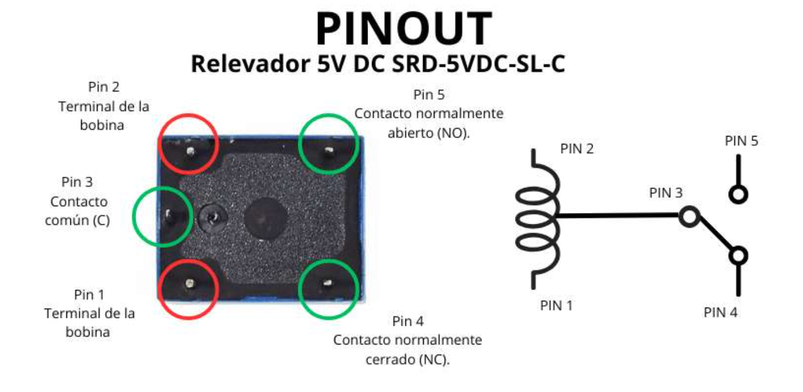

Siguiendo este pinout, hicimos las siguientes conexiones:

| Pin relay | Pin Arduino | Pin transistor | Placa humidificadora | Pin diodo 1N4007 |
| --- | --- | --- | --- | --- |
| Pin 1 | - | Colector | - | Ánodo en Pin 1 Relay |
| Pin 2 | 5 V | - | - | Cátodo en Pin 2 Relay |
| Pin 3 | 5 V | - | - | - |
| Pin 5 | - | - | Positivo de placa | - |
| Pin 4 | - | - | - | - |

###### Conexiones con relay, fotografía tomada por Débora Soto

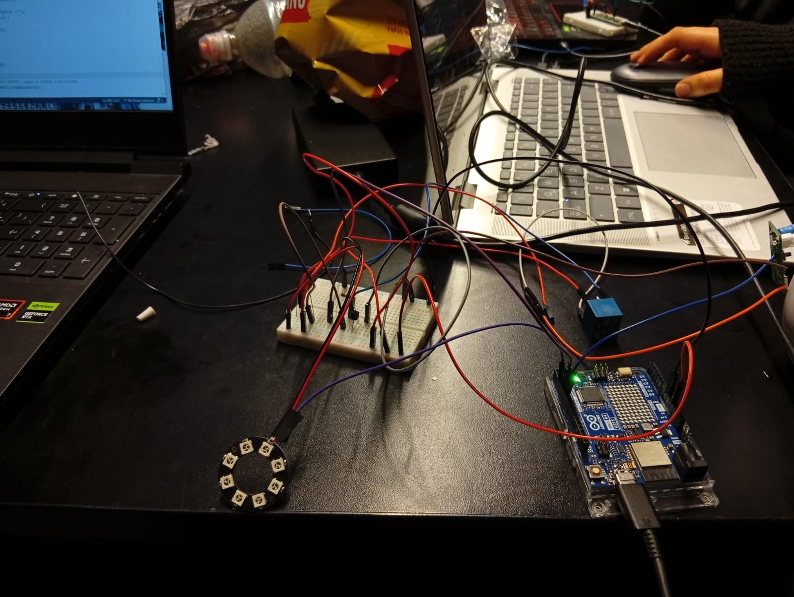

Luego de hacer las conexiones y volver a probar con el código, logramos que el humidificador se active solo cuando se seleccionaba la ciudad ganadora pero luego de eso no se apagaba, por lo que teníamos que intervenir de manera física de igual manera.

Como no sabíamos qué hacer, fuimos con Aarón a pedirle ayuda para poder controlar el humidificador en donde nos explicó que primero debíamos entender qué lado de la soldadura del botón era la que mandaba y cuál era la que seguía ordenes, lo cual podíamos ver con ayuda de un multímetro. Una vez ya tuviéramos esa información, recién ahí podíamos soldar y poner un cable en el lugar que manda, para así poder conectarlo al Arduino y poder enviarle señales de que se apague y que se prenda (todo esto lo escribió en un papel para que no se nos olvide).

###### Ayuda con Aarón, foto tomada por Josefa Araya

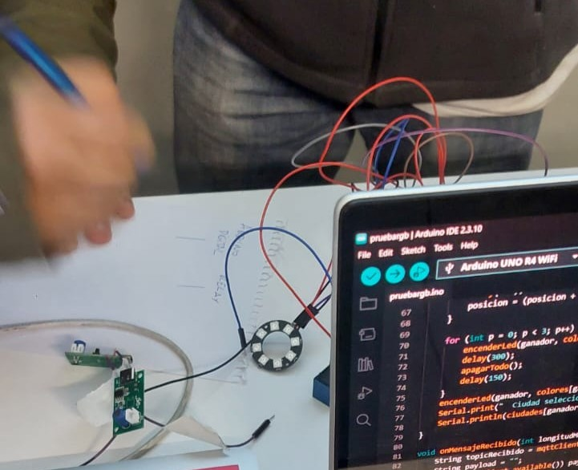

Ya con la información que necesitábamos, nos fuimos a trabajar al LID para poder utilizar el multímetro y poder soldar.

###### Cris soldando, foto tomada por Josefa Araya


Cuando íbamos a medir el voltaje con el multímetro, nos dimos cuenta de que en realidad solo sabíamos usarlo para verificar si estaba pasando corriente o no, pero no para ver cuánto voltaje le está llegando al componente en sí.

Como no sabíamos cómo hacerlo, pedimos ayuda a nuestros compañeros que se encontraban dentro del LID y nos enseñaron que era con la opción de _Voltaje Contínuo_. Cuando logramos identificar cuál es el que manda (el que recibe 5V) y cuál es el que sigue, soldamos el cable, volvimos a intentar con el código y no pasó nada, razón por la cual decidimos abandonar la idea de poder controlar el humidificador con el Arduino y preferimos dejar que el usuario interactúe directamente con el botón de humidificador para que visualicen la bruma.

### Carcasa 

Como ya habíamos abandonado todos nuestros sueños en honor al tiempo, decidimos quedarnos con todas las conexiones que ya teníamos y los últimos códigos que habíamos probado para ahora seguir con la carcasa, en donde nuestra compañera Débora Soto sugirió las siguientes ideas: 

###### Dibujos por Débora Soto de ideas para las carcasas de nuestro proyecto 

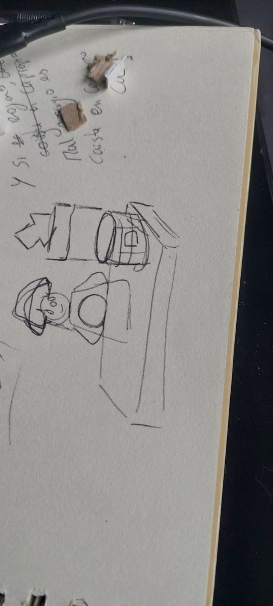


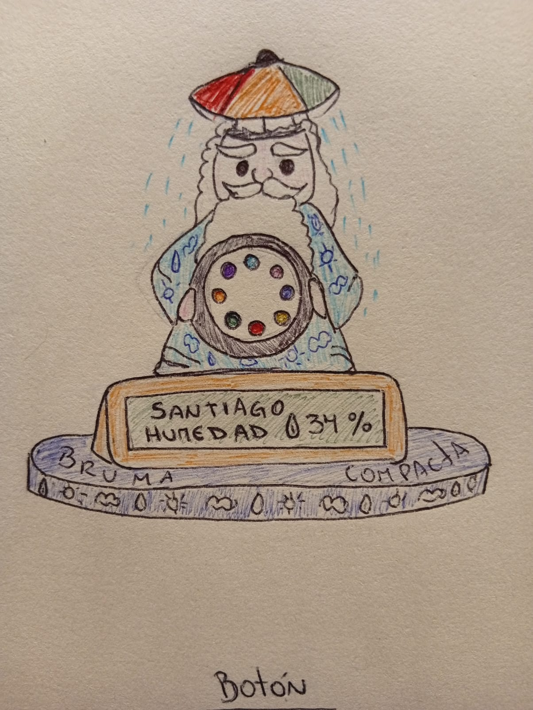


Primero se fabricó una carcasa para la Raspi con la luz LED y el switch. Esta carcasa esta hecha de cartón, spray plateado y stickers de la maquina para imprimir stickers del LID.

###### Versión 1 carcasa:

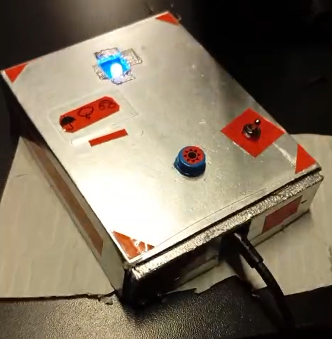

###### Versión final carcasa:

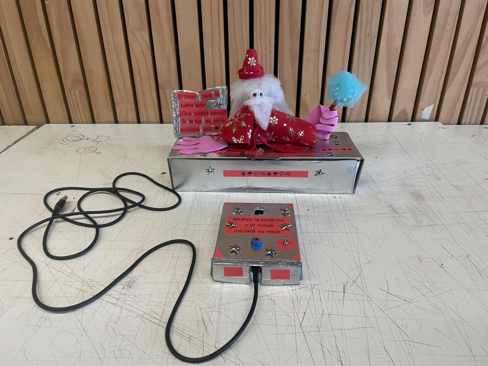

Luego la creación del maguito, su ropa se hizo con con paño lenci color rojo con detalles en plateado, la cabeza es de filamento blanco con ojos saltones y barba de napa. El está apoyado sobre una caja plateada con señales y mensajes que indican lo que tiene que hacer la persona que está interactuando con el objeto, como presionar el botón. Dentro de la caja se encuentra el Arduino con el modulo de luces LED y con el humidificador con su membrana led humedecida por una barra de algodón reposada sobre un tiesto con agua.

###### Imágenes del proceso de fabricación del mago Bruma: 

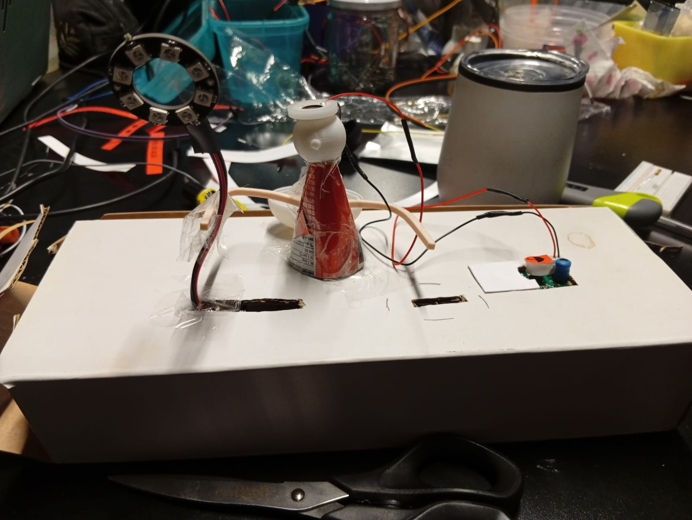

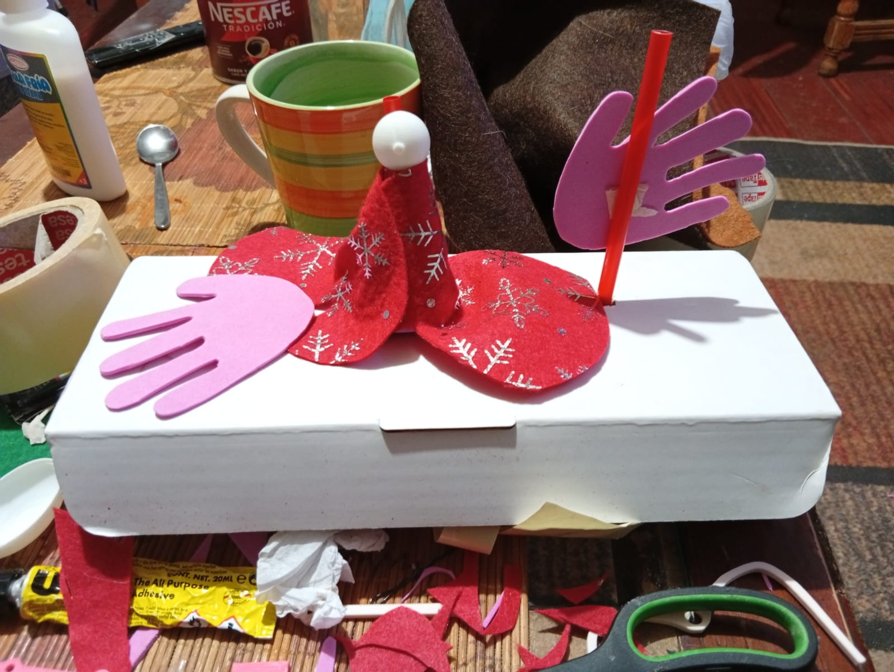

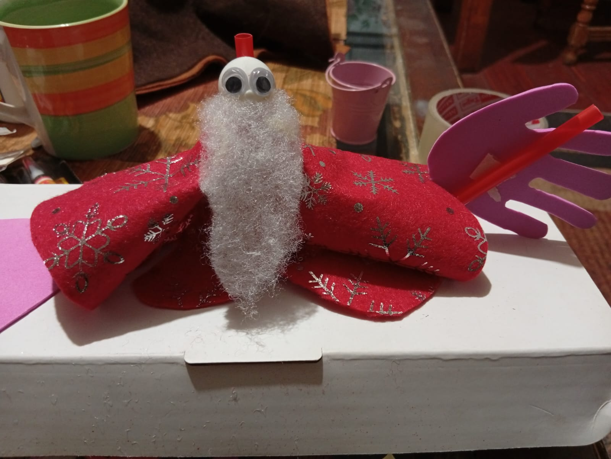


###### Mago Bruma listo

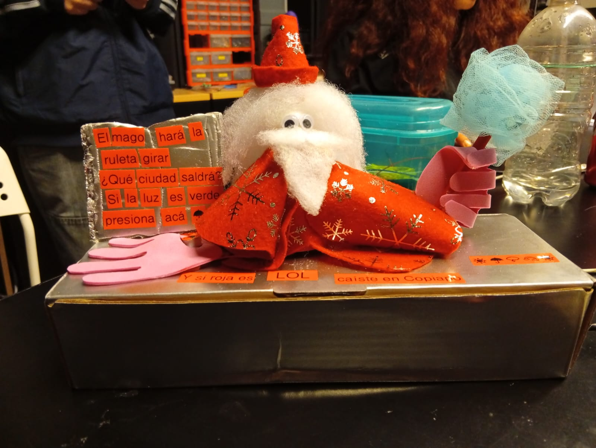


---

## BOM Proyecto

| Componente | Valor Unidad | Cantidad | Link |
| --- | --- | --- | --- |
| Raspberry Pi Pico 2 W | $14.990 | 1 | <https://raspberrypi.cl/products/raspberry-pi-pico-2-w-con-headers> |
| Arduino UNO R4 WiFi | $38.990 | 1 | <https://arduino.cl/producto/arduino-uno-r4-wifi/?srsltid=AfmBOopyyargcSiTQeFlT3cTN5ide380bxZlQXRZVP4u_op0O-qJcENB> |
| Diodo LED | $70 | 1 | <https://afel.cl/products/diodo-led-5mm-ultrabrillante-azul?pr_prod_strat=jac&pr_rec_id=1cd69e264&pr_rec_pid=8382019502232&pr_ref_pid=8382019600536&pr_seq=uniform> |
| KIT Humidificador USB | $8.490 | 1 | <https://www.mechatronicstore.cl/kit-humidificador-usb/?srsltid=AfmBOorNqdrjHbLaQqIg_9T7v2PwFpot8zKqXUEbviGQ94X7oUZElWh9> |
| Protoboard 400 puntos | $2.425 | 1 | <https://altronics.cl/protoboard-400ptos> |
| Pack 40 cables dupont | $2.735 | 1 | <https://altronics.cl/jumper-dupont-20cm-mm?search=cables%20dupont> |
| Módulo RGB led de 8 bits 5050 | $1.990 | 1 | <https://www.mechatronicstore.cl/modulo-rgb-led-de-8-bits-5050/> |
| Interruptor Switch 2 Pines ON-OFF Corto | $570 | 1 | <https://www.katode.cl/switches/1339-interruptor-switch-2-pines-on-off-corto.html> |

# Bibliografía

+ Odg. (noviembre 17, 2025). How to use a 2N2222 transistor as a switch. ODG Electronic. https://www.origin-ic.com/blog/how-to-use-2n2222-transistor-as-a-switch/48138
+ AR RoboTics. (septiembre 21, 2024). DIY Automatic Humidifier  | Arduino Humidifier #arduino #dht11 [Video]. YouTube. https://www.youtube.com/watch?v=Xo_wxNaZqeY
+ Arduino Philippines | Permission to ask po ma’am/sir.. | Facebook. (abril 15, 2024.). Grupos De Facebook. https://web.facebook.com/groups/1138837232801938/posts/7803770342975227/?_rdc=1&_rdr#
+ elevador 5V DC SRD-5VDC-SL-C - Controla Dispositivos de Alta Potencia. (n.d.). https://proveedoracano.com/eshop/SRD-05VDC-SL-C
+ Battery powered arduino - problems with AnalogIn - Hardware / Troubleshooting - Arduino Forum. (noviembre 13, 2006). Arduino Forum. https://forum.arduino.cc/t/battery-powered-arduino-problems-with-analogin/24709
+ Arduino Playground - I2CScanner. (noviembre 14, 2018). https://playground.arduino.cc/Main/I2cScanner/
+ Mi pantalla LCD I2C 16x2 solo muestra cuadrados en la primera fila - International / Español - Arduino Forum. (junio 20, 2023). Arduino Forum. https://forum.arduino.cc/t/mi-pantalla-lcd-i2c-16x2-solo-muestra-cuadrados-en-la-primera-fila/1139718
+ JSON. (n.d.). https://www.json.org/json-es.html
+ ¿Qué es una API REST? (julio 31, 2023). https://www.redhat.com/es/topics/api/what-is-a-rest-api
+ Maximum Pin current! - UNO Family / UNO R4 Minima - Arduino Forum. (julio 8, 2023). Arduino Forum. https://forum.arduino.cc/t/maximum-pin-current/1145859
+ ELECTROJUANYU. (junio 7, 2019). REVISIÓN ICSTATION MINI HUMIDIFICADOR CON DISCOS CERÁMICOS [Video]. YouTube. https://www.youtube.com/watch?v=k25P8RUv9UU
+ AlexGyver. (n.d.). GitHub - AlexGyver/autoHumidifier: Автоматический увлажнитель воздуха на Arduino. GitHub. https://github.com/AlexGyver/autoHumidifier
+ digitalWrite Pin HIGH = LOW and LOW = HIGH . . .Please help - Projects / Programming - Arduino Forum. (junio 19, 2016). Arduino Forum. https://forum.arduino.cc/t/digitalwrite-pin-high-low-and-low-high-please-help/392847
+ Problema I2C con Arduino UNO r4 Wifi - International / Español - Arduino Forum. (junio 5, 2024). Arduino Forum. https://forum.arduino.cc/t/problema-i2c-con-arduino-uno-r4-wifi/1268458
