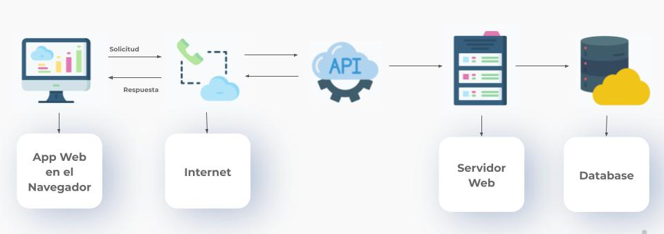
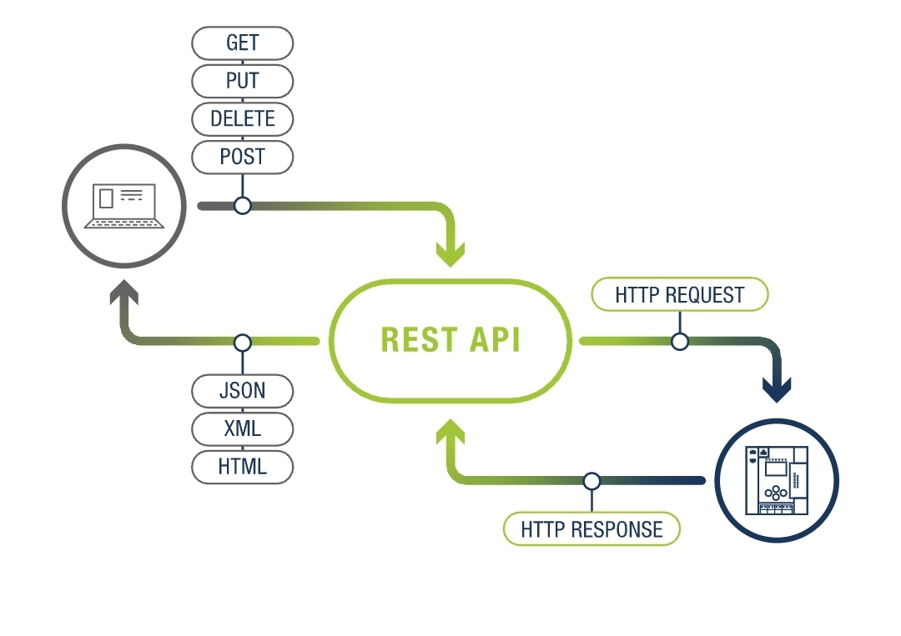

# persona-1

josefa-kristina

# APIs 

¿Qué son y para qué sirven?


API viene de *Application Programming Interface*, que traducido al español sería Interfaz de Programación de Aplicaciones. Es un intermediario que
permite que dos programas o sistemas se comuniquen entre sí sin que el usuario
vea lo que está pasando.



Una API funciona como un contrato entre dos aplicaciones, si una manda una
solicitud de cierta forma, la otra sabe exactamente cómo responder. Hay reglas
claras para ambos lados. Lo que más me llamó la atención al investigar esto es
que las APIs están en absolutamente todos lados, cuando uno inicia sesión con Google en otra plataforma, cuando una app muestra el clima, cuando se paga con WebPay en una tienda online, en todos esos casos hay una API funcionando en el fondo.


Desde el punto de vista del desarrollo, las APIs evitan tener que construir todo
desde cero. Si necesito integrar un sistema de pagos o geolocalización, puedo
usar una API ya existente en vez de desarrollar esa funcionalidad completa. En
diseño esto también se vuelve relevante, porque muchas de las experiencias que
diseñamos dependen de datos que vienen de APIs en el caso de nuestro examen feeds en otros casos mapas, contenido
dinámico, formularios de pago, etc.

## cómo funciona una API

Es como solicitud y respuesta entre un cliente y un servidor. La aplicación que envía la solicitud es el cliente, y el servidor provee la respuesta. La API es el puente que establece la conexión entre ambos.

Cuando el cliente hace una solicitud, especifica qué datos o acción necesita.
La API la recibe, la procesa, consulta al servidor, y devuelve una respuesta.
Todo eso puede pasar en poquísimo tiempo, hasta un milisegundo.

Uno de los propósitos principales de las APIs es ocultar los detalles internos
de cómo funciona un sistema, exponiendo solo lo necesario. Esto significa que
una empresa puede cambiar completamente cómo funciona su sistema por dentro, y
mientras la API se comporte igual.

## tipos de API

- **REST**: el estándar actual, el más usado en aplicaciones web. (el que usamos en el examen)


- **GraphQL**: más eficiente porque permite pedir exactamente los datos que
  necesitas y nada más.

- **WebSocket**: ideal para comunicación en tiempo real, como chats o
  notificaciones en vivo.

- **SOAP**: el más antiguo, menos flexible, intercambia mensajes en formato XML.

## sobre API REST



REST viene de Representational State Transfer y es con diferencia el tipo de
API más popular en la web hoy en día. No es un protocolo rígido sino un estilo
de arquitectura como un conjunto de principios que, si se siguen, hacen que la API sea predecible, escalable y fácil de usar.

Lo que define a una API REST es que trabaja con recursos. Un recurso puede
ser cualquier cosa, un usuario, un producto, una imagen, un pedido y cada
uno tiene su propia dirección única llamada URI (como una URL pero para datos).
Para interactuar con esos recursos se usan métodos HTTP estándar:

- **GET** > para obtener información
- **POST** > para crear algo nuevo
- **PUT** > para actualizar algo existente
- **DELETE** > para eliminar algo

Por ejemplo, si una tienda online tiene una API REST, obtener la información del
producto número 42 podría verse así:

```
GET https://tienda.com/api/productos/42
```

Y la API devolvería algo como:

```json
{
  "id": 42,
  "nombre": "Polera oversize",
  "precio": 14990,
  "stock": 8
}
```

Una característica importante de REST es que es **stateless**, o sin estado.
Esto significa que cada solicitud es completamente independiente — el servidor
no recuerda nada de solicitudes anteriores. Si necesito autenticarme, tengo que
incluir mis credenciales en cada solicitud, no solo en la primera.


### Bibliografía

- Amazon Web Services. (s. f.). *¿Qué es una API?*. AWS.
  https://aws.amazon.com/what-is/api/

- Red Hat. (s. f.). *¿Qué son las interfaces de programación de aplicaciones?*.
https://www.redhat.com/en/topics/api/what-are-application-programming-interfaces

- IBM. (s. f.). *¿Qué es una API?*. IBM Think.
  https://www.ibm.com/think/topics/api

- Oracle. (s. f.). *¿Qué es una API?*.
https://www.oracle.com/cloud/cloud-native/api-management/what-is-api/

- Cecilia Aguilera (Septiembre, 2021). *API testing: guía práctica introductoria.* https://es.abstracta.us/blog/api-testing-guia-practica/

- REST-API – *The easy way to access your machine and process data* - TekniskFOKUS. (2025, 29 enero). TekniskFOKUS. https://www.tekniskfokus.dk/blogs/rest-api-the-easy-way-to-access-your-machine-and-process-data/

- Google For Developers. (s. f.) *Cómo usar OAuth 2.0 para acceder a las API de Google.* https://developers.google.com/identity/protocols/oauth2?hl=es-419

