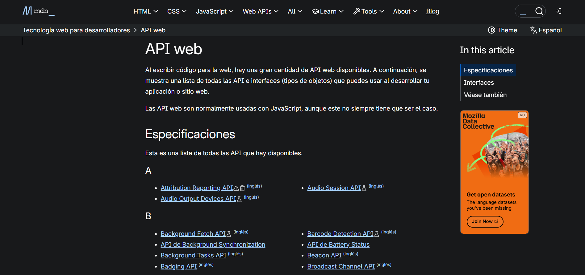
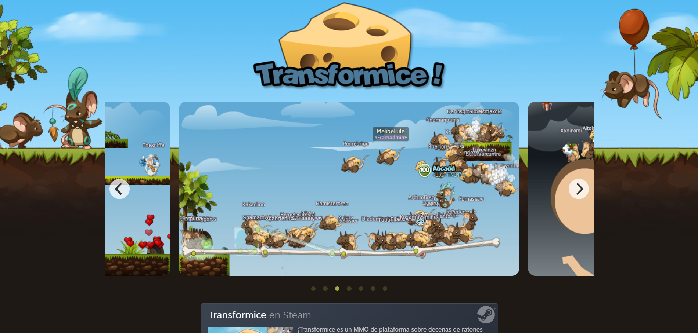
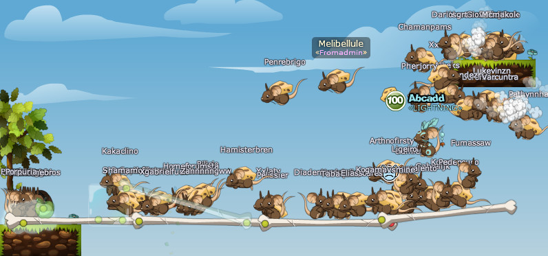
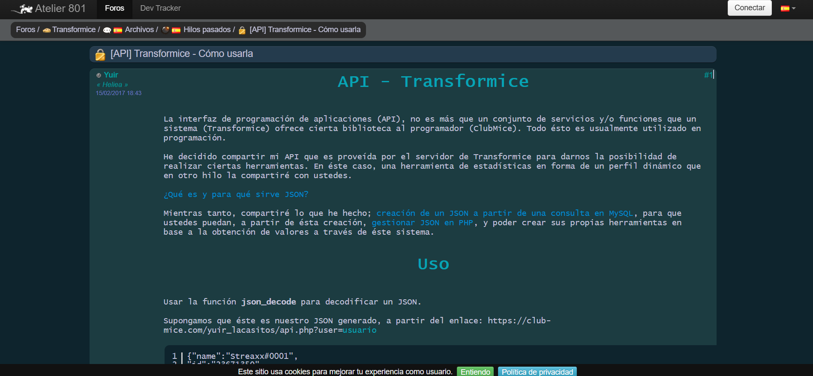
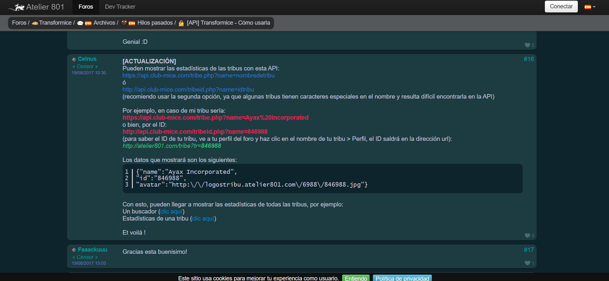

# persona-3

Nicolás Elías Valdés Greve / [nicolasvaldesgreve](https://github.com/disenoUDP/dis9079-2026-1/tree/main/28-nicolasvaldesgreve)

---

# Investigación personal APIs

#### ¿Qué son las APIs?

Las APIs (_Interfaces de Programación de Aplicaciones_) son un conjunto de protocolos que permiten que las aplicaciones de software logren comunicarse entre sí, actuando como puentes entre aplicaciones ya sea para intercambiar datos, características o funcionalidades.

En el proceso de intercambio participan tres partes:

+ Cliente: Es quien presenta la solicitud.
+ Servidor: Es en donde se cumple la solicitud.
+ API: Es el puente entre ambos que los logra conectar de manera documentada y predecible.

#### ¿Para qué se utilizan?

Las personas que navegan por internet se benefician constantemente de las APIs sin siquiera saberlo. Las APIs logran hacer una conexión en las fuentes públicas de datos, como lo son los sitios de previsión meteorológica (omg como lo que estamos usando con mi grupo, guiño guiño), con aplicaciones comerciales para advertirnos los próximos eventos meteorológicos. En el caso más común se pueden observar el uso de APIs de Google Maps para integrar mapas y servicios de ubicación en sitios web.

En "_Oracle_", en el siguiente link: <https://www.oracle.com/latam/cloud/cloud-native/api-management/what-is-api/>, se nos da el siguiente ejemplo para que logremos entender cómo funcionan las APIs:

> "Imagina un restaurante. Si todos los clientes entraran a la cocina para pedir sus platos favoritos, se produciría un caos. En este escenario, la API proporciona un menú (documentación) que enumera todos los servicios (platos) que la cocina (aplicación de servidor) puede ofrecer. Explica qué información debe proporcionar como cliente y en qué formato debe presentarse su pedido.

> La API actúa como camarero o intermedio, asegurándose de que los pedidos se realicen y entreguen de una manera estandarizada."

Las APIs definen cómo interactúan las aplicaciones entregando detalles que incluyen:

+ Puntos finales: URL específicas que definen dónde envían datos y solicitudes.
+ Métodos: Instrucciones como _GET_ para recuperar datos, _POST_ para enviarlos, _PUT_ para actualizarlos y _DELETE_ para eliminarlos.
+ Parámetros: Son detalles necesarios para la solicitud, como por ejemplo lo es la ubicación de los datos meteorológicos o credenciales de inicio de sesión en páginas o redes sociales.
+ Respuestas: Es el formato de los datos devueltos por la aplicación, como lo son _JSON_ o _XML_.

#### ¿Qué pueden hacer?

Antes de partir, les dejo aquí una página en donde hay un listado enorme de APIs por si les interesa:

Para entrar, hagan click en el siguiente link: <https://developer.mozilla.org/es/docs/Web/API>

Hay distintos tipos de APIs, por lo que cada una hace una cosa distinta. Las que se utilizan con más frecuencia son las siguientes:

+ APIs para manipular documentos cargados en el navegador: Un ejemplo de esto es [API DOM (_Document Object Model_)](<https://developer.mozilla.org/es/docs/Web/API/Document_Object_Model>), el cual te permite manipular HTML y CSS, ya sea crear, eliminar, modificar HTML o aplicar distintos estilos a una página. Cada vez que ves una ventana emergente dentro de una página, es el DOM haciendo su trabajo.
+ APIs que obtienen datos del servidos: Estas se utilizan normalmente para actualizar pequeñas secciones de una página web. Las APIs logran hacer esto debido a que incluyen [XMLHttpRequest](<https://developer.mozilla.org/es/docs/Web/API/XMLHttpRequest>) y [Fetch API](<https://developer.mozilla.org/es/docs/Web/API/Fetch_API>).
+ APIs para dibujar y manipular gráficos: Las más utilizadas son [Canvas](<https://developer.mozilla.org/es/docs/Web/API/Canvas_API> y [WebGL](https://developer.mozilla.org/es/docs/Web/API/WebGL_API>), las cuales permiten actualizar información de los píxeles contenidos en un canvas HTML, lo cual genera objetos 2D y 3D.
+ APIs de audio y video: Un ejemplo es [Web Audio API](<https://developer.mozilla.org/es/docs/Web/API/Web_Audio_API>), en donde puedes crear una interfaz personalizada para los controles de reproducción de audio y video, mostrar pistas de texto con subtítulos junto con el video, capturar video de la cámara web para ser manipulado en un canvas, etc.
+ APIs de dispositivos: Son APIs para manipular y recuperar información de dispositivos modernos de hardware, de manera en la que sean útiles para aplicaciones web. Un ejemplo sería el indicar al usuario que una actualización está disponible mediante notificaciones del sistema, como lo hace [Notifications API](<https://developer.mozilla.org/es/docs/Web/API/Notifications_API>).
+ APIs de almacenamiento en el lado del cliente: Estas APIs tienen la habilidad de almacenar información en el lado del cliente, para así lograr por ejemplo que se guarde su estado entre carga de páginas, como lo hace [Web Storage API](<https://developer.mozilla.org/es/docs/Web/API/Web_Storage_API>).

---

# API Transformice !! no lo puedo creer

Para subir algo más a esta bitácora (ya que sentí que estaba muy vacía), empecé a buscar APIs de juegos en los que me metía cuando chico y encontré una de Transformice!! la verdad no recuerdo mucho del juego, ya que mi memoria solo guardó recuerdos fotográficos de mi ratoncito cayendo al vacío luego de conseguir el queso.. pero filo, aquí dejo una foto del juego al que me refiero LOL:

El juego es simple, solo tienes que ir con un ratón a buscar el queso que se encuentra normalmente al otro lado del mapa o en altura, para lo que necesitarás ayuda de un _Shaman_, que son ratones más pro con poderes!! ellos te facilitan el poder llegar tanto al queso como a tu meta. Es muy lindo y entretenido por lo que recuerdo.

Volviendo a la API, la encontré en el siguiente link: <https://atelier801.com/topic?f=6&t=843935>, en donde (por lo que entiendo) se creó la API para ofrecer una biblioteca de _ClubMice_ en donde se pueden ver los stats de las tribus formadas dentro del juego, las cuales son el equivalente a los clanes de otros juegos (yo nunca pude meterme a una tribu porque no sabía cómo LOL). Aquí dejo ScreenShots de lo que mencionan en la página!! Debo aclarar que la última vez que fue actualizada fue en 2018, por lo que es muy probable que ya no esté activa la API debido a que el creador mencionó que no tenía un lugar estable en donde dejarla para que sea más accesible.

# Fuentes:

+ <https://www.ibm.com/think/topics/api>
+ <https://www.oracle.com/latam/cloud/cloud-native/api-management/what-is-api/>
+ <https://developer.mozilla.org/es/docs/Learn_web_development/Extensions/Client-side_APIs/Introduction>
+ <https://aws.amazon.com/es/what-is/xml/>
+ <https://www.arsys.es/blog/archivo-json-que-es-y-para-que-sirve>
+ <https://atelier801.com/topic?f=6&t=843935>
