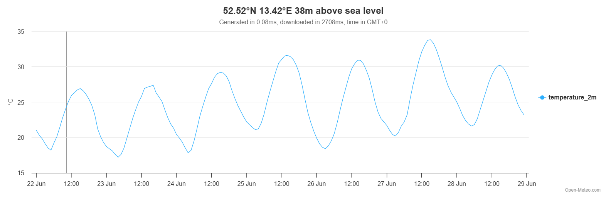
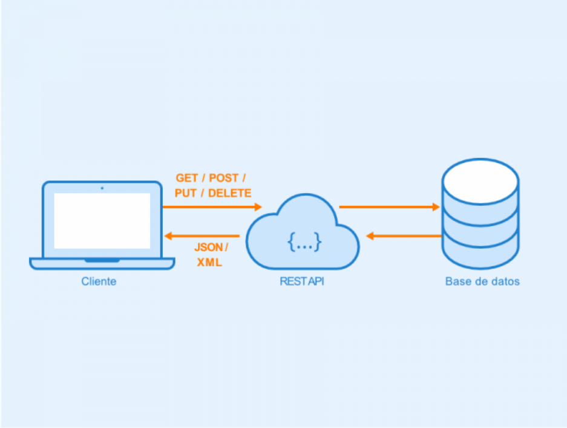

# persona-4

cristobalvergarasilva

---

## Investigación: APIs

Una **API** (*Application Programming Interface*) es un puente que sirve para la comunicación entre programas de forma remota. Lo que se ve es la interfaz que representa a la API. En el fondo, una API RESTful es una interfaz que dos sistemas computacionales usan para intercambiar información de manera segura a través de internet.

Existen varios tipos de API y pueden conectarse a varias fuentes, como sistema remoto que recibe solicitudes y da respuestas o datos ambientales. Su principal ventaja es que sirven para no crear algo desde cero. Aplicaciones como YouTube o X usan APIs para funcionar

### ¿Cómo funciona una API?

El funcionamiento básico es que un cliente hace una solicitud y un servidor responde. Cuando el servidor procesa la solicitud, envía una respuesta que incluye un código de estado, poniendo de ejemplo la que usamos para nuestro proyecto, Open Meteo, en este caso es una API climática de codigo abierto y gratuita que nos da la posibilidad de recibir datos sobre las condiciones meteorológicas del momento en el lugar que se necesite, el estado de calidad del aire, información meteorológica marina, alertas de inundaciones, radiación satelital, cambio climático, y reanálisis meteorológico de datos históricos.

En el código se vería algo así:

OWM_BASE_URL = "https://api.open-meteo.com/v1/forecast" 

Ciudades: (Nombre, latitud, longitud, nombre-del-feed)
CIUDADES = [
    ("Arica",               -18.48, -70.33,  "humedad-arica"),
    ("Copiapo",             -27.37, -70.33,  "humedad-copiapo"),

### Tipos de Apis

Existen distintos tipos de APIs, algunas pueden ser públicas o privadas, y también locales o remotas. Son útiles para la creación de apps.

+Las API públicas están abiertas y disponibles para que la use cualquier desarrollador o empresa.

+Las API privadas no son expuestas al usuario, se publican internamente para que las utilicen los desarrolladores con el fin de mejorar sus propios servicios.

+Las API locales operan dentro del mismo dispositivo o entorno de ejecución. La comunicación entre los componentes ocurre sin pasar por ninguna red,

+Las API remotas interactúan a través de una red de comunicación para manipular recursos fuera del ordenador que realiza la solicitud. A diferencia de la local, cada solicitud debe viajar por la red hasta un servidor externo, que la procesa y devuelve una respuesta.

### Arquitectura de software 

Una arquitectura de software es cómo se organiza y estructura un sistema. No es código en sí mismo, sino más bien las reglas o guías que determinan cómo deben relacionarse los componentes de un software entre sí.

#### API REST *Representational State Transfer*

La API REST es un tipo de arquitectura, se comunican mediante solicitudes HTTP para realizar funciones estándar de base de datos, como crear, leer, actualizar y eliminar registros. Fue definida en el año 2000 por el científico computacional Roy Fielding. (Phil Powell, Ian Smalley, What is REST API?)

Puede guardar el caché que es la función de almacenamiento temporal que tienen algunos sitios, el servidor puede almacenar una copia de la respuesta y reutilizarla para solicitudes posteriores, mejorando el rendimiento y reduciendo el tráfico de red. También se puede seleccionar qué datos se envían y cuáles no, y definir los permisos. Usa XML y JSON (*JavaScript Object Notation*) como formatos para enviar datos, además como el cliente y el servidor están separados, el sistema puede escalar sin mayor complejidad, permitiendo agregar funcionalidades sin rehacer todo desde cero.

Imagen: API REST- Autor: Seobility – Licencia: CC BY-SA 4.0

---

### Fuentes

https://www.ibm.com/think/topics/rest-apis

https://open-meteo.com/en/features

https://www.computerweekly.com/es/definicion/Interfaz-de-programacion-de-aplicaciones-API

https://www.youtube.com/watch?v=u2Ms34GE14U

https://www.xataka.com/basics/api-que-sirve

https://aws.amazon.com/es/what-is/api/
