# Grupo-4 - Examen Interacciones Inalámbricas

## Integrantes

- Renata Arévalo Urra / [arevalourra](<https://github.com/isipm08/dis9079-2026-1/tree/main/06-arevalourra>)
- Isidora Pérez Maulén / [isipm08](<https://github.com/isipm08/dis9079-2026-1/tree/main/21-isipm08>)

## Descripción del proyecto

Nuestro proyecto nace del deseo de transformar cada latido en un puente de conexión. Mediante el sensor ECG AD8232, la actividad cardíaca deja de ser una señal invisible para convertirse en información que viaja en cuestión de segundos. A través de Adafruit IO, cada pulso encuentra un camino seguro hasta una pantalla LCD conectada a un segundo microcontrolador, donde los datos cobran vida nuevamente. Así, este sistema no solo captura y transmite información: crea una nueva forma de acompañar, observar, demostrando que incluso el ritmo silencioso del corazón puede trascender la distancia y hacerse presente allí donde más se necesita.

Más allá de la transmisión de datos, el proyecto busca demostrar cómo las tecnologías inalámbricas pueden convertirse en herramientas para acercar a las personas. La información obtenida por el sensor es procesada por un Arduino UNO R4 WiFi y enviada mediante internet hacia un segundo dispositivo, permitiendo visualizar en tiempo real la frecuencia cardíaca sin necesidad de una conexión física entre ambos sistemas. Esta arquitectura evidencia el potencial de las plataformas IoT para compartir información biomédica de forma rápida, confiable y accesible.

El desarrollo integra hardware, programación y comunicación en la nube en una solución funcional que combina precisión técnica con una experiencia visual intuitiva. La pantalla TFT circular presenta los datos de manera clara mediante indicadores gráficos y numéricos, facilitando la interpretación de la información por parte del usuario. De esta forma, el proyecto no solo cumple con el objetivo de establecer una interacción inalámbrica entre dos microcontroladores, sino que también propone una aplicación con proyección hacia ámbitos educativos, de monitoreo remoto y de apoyo al bienestar de las personas.

## Materiales usados

| Componente | Valor Unidad | Cantidad | Link |
| --- | --- | --- | --- |
| Arduino UNO R4 WiFi | $38.990 | 2 | <https://arduino.cl/producto/arduino-uno-r4-wifi/?srsltid=AfmBOopyyargcSiTQeFlT3cTN5ide380bxZlQXRZVP4u_op0O-qJcENB> |
| Mini protoboard 170 puntos | $990 | 2 | <https://afel.cl/products/mini-protoboard-170-puntos?_pos=4&_sid=aa0b39e11&_ss=r |
| Cables Dupont (Pack 20 unidades) | $1.000 | 1 | <https://afel.cl/products/pack-20-cables-de-conexion-macho-macho> |
| Sensor de Frecuencia Cardíaca ECG AD8232 Electrocardiograma | $9.990 | 1 | <https://afel.cl/products/sensor-de-frecuencia-cardiaca-ecg-ad8232-electrocardiograma> |
| Pantalla TFT LCD redonda de 1.28" | $4.990 | 1 | <https://www.mechatronicstore.cl/pantalla-tft-lcd-redonda-de-1-28/?srsltid=AfmBOormrgaJyuZokh0vmjczLkHKXalCX8OpIDNKoXI-k0D8GjpyM3mX
| Electrodos PACH ECG TENS 5 unidades | $1.500 | 1 | <https://rambal.com/biometricos/1238-electrodo-ecg.html
| Cable USB C | X | 2 | X


## Proceso de Proyecto
---

### Lunes 01 Junio 

#### 3 Semanas para el examen

Inicio de ideación de examen, estuvimos leyendo e investigando sobre varios sensores, para ver si nos gustaba alguno para realizar nuestro proyecto de examen, nos decidimos por un sensor de pulso, específicamente el Sensor de Frecuencia Cardíaca ECG AD8232 Electrocardiograma,  que es un módulo diseñado para medir la actividad eléctrica del corazón y generar lecturas similares a un electrocardiograma (ECG). Funcionando como una interfaz que extrae, amplifica y filtra las señales eléctricas muy débiles que genera el cuerpo humano al latir. 

Con  este sensor teníamos la idea de obtener registros en vivo de los latidos por minuto del usuario, usaremos la API -> Adafruit IO, que ya conocemos y sabemos su funcionamiento, por el lado de recepción de datos, pensamos en una pantalla LCD que muestre los latidos por minuto, usaremos 2 arduinos, uno para enviar y otro para recibir la información.

Durante esta primera etapa también evaluamos distintas alternativas para la comunicación entre ambos dispositivos. Consideramos diferentes formas de transmitir la información, pero finalmente optamos por utilizar Adafruit IO debido a que ya contábamos con experiencia previa trabajando con la plataforma, lo que nos permitiría concentrarnos en el desarrollo de la lógica del proyecto en lugar de invertir tiempo en aprender una nueva tecnología. Además, la posibilidad de enviar y recibir datos en tiempo real mediante internet se ajustaba perfectamente a la idea que buscábamos desarrollar.

Una vez definida la arquitectura general del sistema, comenzamos a distribuir las tareas y a planificar las siguientes semanas de trabajo. Establecimos como primer objetivo lograr una lectura estable de la señal del sensor AD8232, para posteriormente procesar la información, calcular los latidos por minuto y transmitirlos hacia un segundo Arduino encargado de la visualización. En esta etapa también realizamos un listado preliminar de los componentes necesarios y definimos una metodología de trabajo basada en pruebas progresivas, validando cada parte del sistema antes de integrarlas en un único proyecto.


*Modulo Sensor AD8232 - Imagen extraída de página web de AFEL*

https://afel.cl/cdn/shop/files/modulo-sensor-ad8232.jpg?v=1720904051&width=713


### Interacción entre grupos vía Discord

Descripción inicial de nuestro proyecto:

Grupo 04: Queremos lograr una exploración sobre la capacidad de las tecnologías inalámbricas para transportar señales humanas más allá del cuerpo que las origina. El proyecto captura el ritmo cardíaco de una persona y lo transforma en una presencia remota, permitiendo que sus pulsaciones sean observadas en otro lugar en tiempo real. A través de esta conexión invisible, los latidos dejan de ser una experiencia íntima para convertirse en un lenguaje compartido entre dispositivos, espacios y personas. La propuesta reflexiona sobre cómo la información biológica puede viajar, ser representada y generar nuevas formas de percepción y vínculo mediante redes inalámbricas.

- Aarón nos sugiere computación inalámbrica en vez de tecnologías inalámbricas

- Aarón nos pregunta lo siguiente: van a procesar esos datos de pulso? van a enviar el pulso directamente? o un resumen en latidos por minuto?

    -  Resp: Resumen en latidos por minuto

- Jesús Miranda nos pregunta: ¿qué pasa en este caso en el dispositivo receptor? ya que en el párrafo dice que los latidos "son observados" pero no queda claro si es una pantalla LED, sonido, ¿cómo se ve esa presencia remota?

    - Resp: Estamos considerando el uso de la pantalla led del arduino o anexar una pantalla LCD para la visualización de los datos, que en este caso son las pulsaciones por minuto

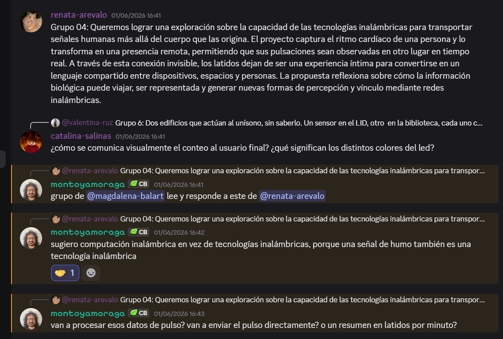

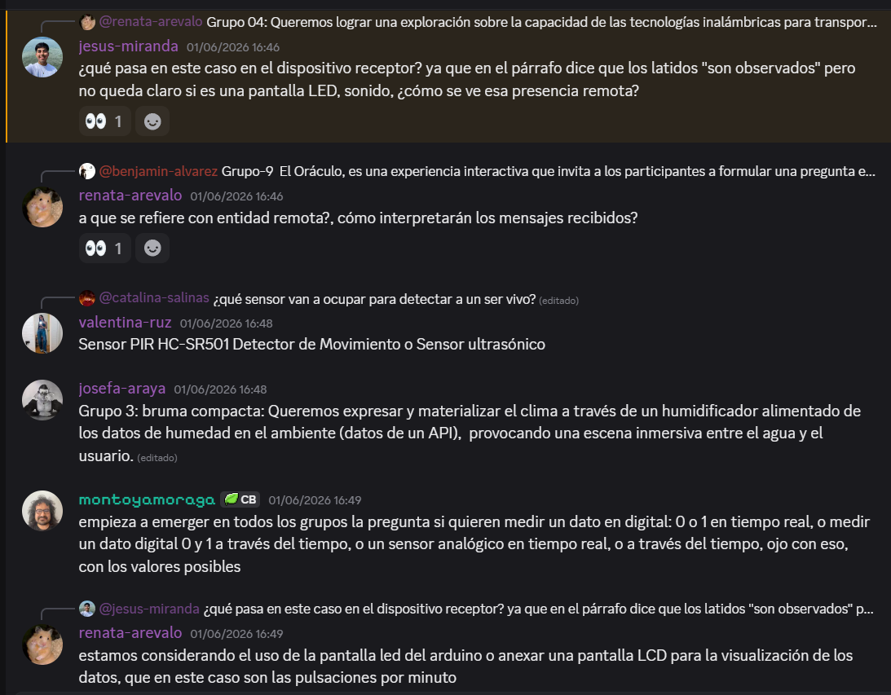

*Registro de Interacción en Discord*

La interacción vía Discord con Aarón y los demás grupos fue una instancia clave para el inicio de nuestro proyecto. Como la idea había sido definida ese mismo día, las preguntas y observaciones que recibimos nos ayudaron a identificar aspectos que, al estar inmersas en la conversación y en la construcción de la propuesta, dábamos por entendidos, pero que no quedaban claros para quienes la conocían por primera vez.

Esta retroalimentación nos permitió mirar el proyecto desde otras perspectivas, aclarar el funcionamiento del sistema y definir con mayor precisión cómo se transmitirían y visualizarían los datos. Gracias a estas observaciones, pudimos fortalecer la propuesta desde sus primeras etapas y comenzar el desarrollo con una idea más clara, mejor estructurada y más fácil de comunicar.

Gracias equipo curso!!

-----

### Lunes 08 Junio

#### 2 Semanas para el examen

***Proyecto de examen definido***

Durante esta semana logramos definir completamente el rumbo de nuestro proyecto. Luego de analizar las observaciones recibidas en la instancia de interacción con el profesor y nuestros compañeros, consolidamos la idea inicial y establecimos cómo funcionaría el sistema de principio a fin. Definimos el objetivo principal, la arquitectura de comunicación entre ambos Arduino, la plataforma que utilizaríamos para la transmisión de datos y la forma en que la información sería presentada al usuario. Con estas decisiones, el proyecto dejó de ser una idea conceptual y pasó a contar con una planificación clara para comenzar su desarrollo e implementación.


###### Nombre Formal

Sistema IoT de monitoreo cardíaco en tiempo real

###### Objetivo

Diseñar un sistema capaz de capturar la actividad cardíaca de una persona mediante un sensor ECG AD8232, transmitir los datos a través de Internet utilizando Adafruit IO y visualizarlos remotamente en una pantalla LCD conectada a un segundo microcontrolador.

###### Funcionamiento

##### AD8232 → Arduino UNO R4 WiFi → Adafruit IO

##### Adafruit IO → Arduino UNO R4 WiFi → LCD 16x2

- El sensor AD8232 detecta la actividad eléctrica del corazón.

- El Arduino transmisor procesa la señal.

- Se calcula la frecuencia cardíaca en BPM.

- El dato se envía a Adafruit IO.

- Un segundo Arduino consulta la información.

- La pantalla LCD muestra los latidos por minuto en tiempo real.

Con esta estructura definida, ya contábamos con una visión completa del funcionamiento del sistema y de las tareas que debíamos abordar durante las semanas siguientes. A partir de este punto, el trabajo se enfocaría en el montaje del circuito, el desarrollo del código para ambos microcontroladores y las pruebas de comunicación mediante Adafruit IO, con el objetivo de validar cada etapa antes de integrar el sistema completo.


### Pseudocódigo 

    INICIO

     Conectar Arduino transmisor a WiFi

     Conectar Arduino receptor a WiFi

     Mientras sistema esté activo

      - Leer señal ECG desde AD8232

      - Calcular BPM

      - Enviar BPM a Adafruit IO

    Fin Mientras

#### Arduino Receptor

    INICIO

     Conectar a WiFi

     Conectar a Adafruit IO

     Mientras sistema esté activo

      - Obtener BPM desde Adafruit IO

      - Mostrar BPM en LCD

    Fin Mientras

### Lista de materiales
    
2 Arduino UNO R4 WiFi

1 Sensor ECG AD8232

1 Pantalla LCD 16x2 con módulo I2C

Protoboard

Cables Dupont

2 Cable USB-C para Arduino

Red WiFi

Cuenta Adafruit IO

---- 

Mateo se acercó a nuestro puesto para conocer el avance del proyecto. Le presentamos la propuesta que habíamos definido y, tras conversar sobre su funcionamiento, nos sugirió incorporar una carcasa para la pantalla donde se visualizarían los latidos por minuto (BPM). Además, nos prestó una pantalla TFT LCD redonda de 1,28", lo que abrió la posibilidad de replantear el diseño del dispositivo y darle una identidad visual mucho más atractiva mediante una carcasa con forma de corazón impresa en 3D.

Esta conversación marcó un punto importante en el desarrollo del proyecto. Al tratarse de un área completamente nueva para nosotras, la experiencia y disposición de Mateo para orientarnos durante el semestre han sido un apoyo constante. Sus comentarios no solo validaron la idea que estábamos desarrollando, sino que también nos ayudaron a pensar en aspectos de diseño y presentación que inicialmente no habíamos considerado. Motivadas por esta propuesta, comenzamos el modelado 3D de la carcasa con la intención de imprimirla en el LID. Aunque no tenemos la certeza de que el tiempo alcance para concretar la impresión antes de la entrega final, haremos todo lo posible por lograrlo, ya que creemos que este elemento aportará un valor importante tanto a la experiencia del usuario como a la presentación final del proyecto.

-----

### Nueva Lista de materiales
    
2 Arduino UNO R4 WiFi

1 Sensor ECG AD8232

Pantalla TFT LCD redonda de 1.28"

Protoboard

Cables Dupont

2 Cables USB-C para Arduino

Red WiFi

Cuenta Adafruit IO


### Martes 09 de Junio


*Compra de Sensor AD8282 en AFEL*


## Inicio de Trabajo con Sensor

### Lunes 15 Junio 

#### 1 Semana para el examen

Este día marcó el inicio del trabajo práctico con el proyecto. Ya contábamos con todos los componentes necesarios, por lo que comenzamos el montaje de los primeros circuitos y las pruebas de funcionamiento del sensor ECG AD8232. Nuestro objetivo era validar que la lectura de la señal cardíaca fuera estable antes de avanzar con la comunicación entre ambos Arduino. Aunque el modelado e impresión 3D de la carcasa aún estaba pendiente, decidimos priorizar el correcto funcionamiento del sistema electrónico para construir una base sólida sobre la cual seguir desarrollando el proyecto.

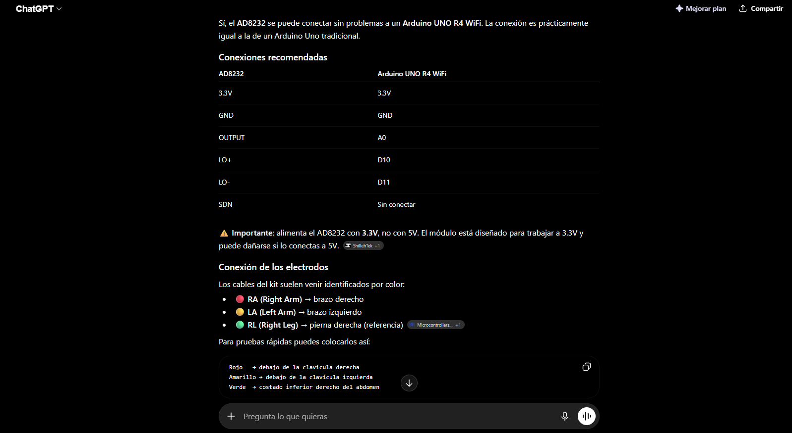

Como era la primera vez que trabajábamos con un sensor ECG AD8232, investigamos distintas referencias para comprender su funcionamiento y la forma correcta de realizar las conexiones. Entre ellas utilizamos ChatGPT como apoyo para resolver dudas sobre el cableado y verificar que la distribución de los pines fuera correcta antes de energizar el circuito. Esto nos permitió comenzar las pruebas con mayor seguridad y disminuir el riesgo de cometer errores de conexión que pudieran afectar los componentes.

Para obtener una lectura correcta de la actividad eléctrica del corazón utilizamos electrodos adhesivos desechables, conectados directamente al módulo AD8232. Antes de comenzar las mediciones revisamos la ubicación recomendada de cada electrodo, ya que una mala posición puede generar ruido en la señal o impedir que el sensor detecte correctamente los impulsos eléctricos del corazón.

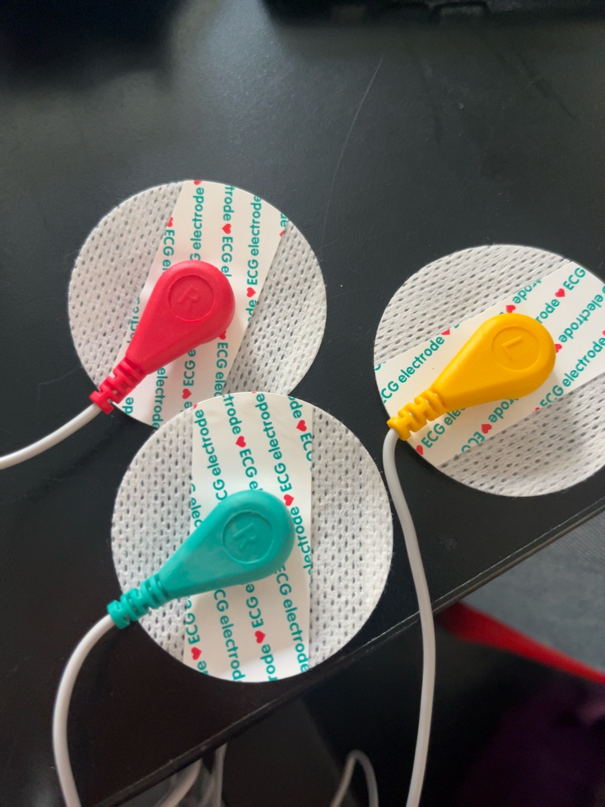

*Electrodos*

Con el objetivo de validar el funcionamiento del sensor, realizamos la instalación de los electrodos siguiendo la configuración recomendada por el fabricante. Cada uno fue ubicado en un punto específico del cuerpo para obtener una señal lo más estable posible durante las pruebas.

Luego conectamos nuestra Pantalla TFT LCD redonda de 1.28" a una proto y luego el Sensor ECG AD8232 a otra proto y a la isipm.


*Electrodo de referencia ubicado en el abdomen de isipm08, encargado de estabilizar la medición del sistema.*


*Electrodo conectado a la clavícula derecha de isipm08, utilizado para captar parte de la diferencia de potencial generada por la actividad eléctrica del corazón.*

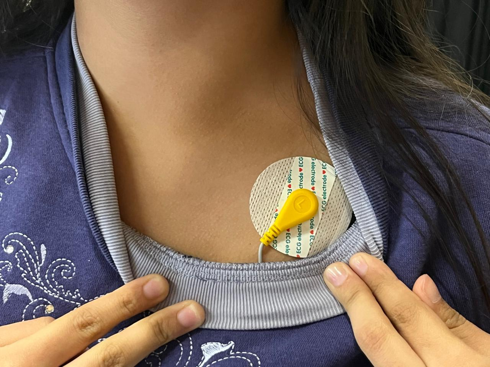

*Electrodo instalado en la clavícula izquierda de isipm08, completando la configuración necesaria para que el sensor pudiera registrar la señal ECG.*

----


Al finalizar las pruebas, Mateo y Aarón revisaron el avance de nuestro proyecto y valoraron positivamente el funcionamiento general del sistema. Sin embargo, nos hicieron algunas observaciones para seguir mejorándolo, principalmente relacionadas con el refresco de la pantalla y la calidad de la visualización de los datos. Aunque la información se estaba transmitiendo y mostrando correctamente, identificamos que aún había aspectos por optimizar para ofrecer una experiencia más fluida. Sospechamos que parte de este comportamiento podría deberse al cableado utilizado durante las pruebas, por lo que decidimos continuar investigando y realizando ajustes en las siguientes jornadas con el objetivo de perfeccionar el resultado final.

---- 

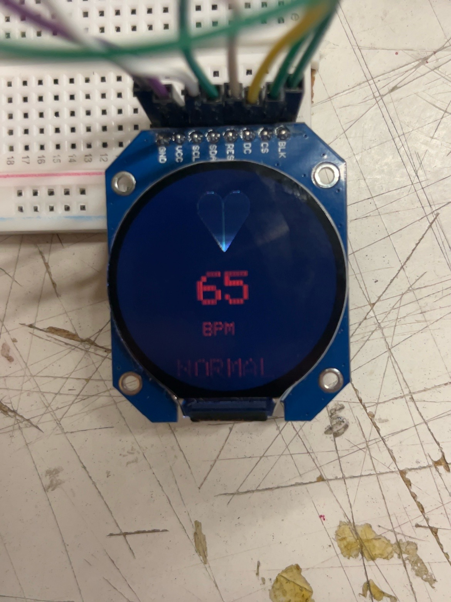

*Durante las pruebas nos dimos cuenta de que, si bien el sistema estaba funcionando y los datos se transmitían correctamente, la visualización en la pantalla TFT aún no era la esperada. La información se actualizaba, pero el refresco no era completamente fluido, lo que afectaba la experiencia de uso. En ese momento pensamos que el problema podía estar relacionado con el cableado o con la calidad de algunas conexiones realizadas en la protoboard, por lo que decidimos revisar cada componente y realizar nuevas pruebas para identificar la causa.*

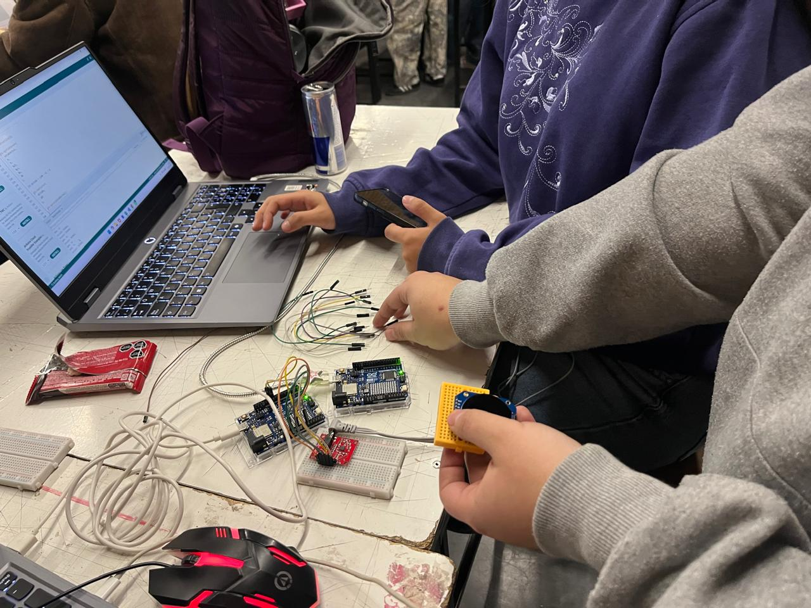

*En este proceso, Mateo nuevamente nos brindó su apoyo revisando tanto el montaje como el código desarrollado hasta ese momento. Sus observaciones y sugerencias nos ayudaron a analizar el proyecto desde otra perspectiva, desarmando todo e iniciando de nuevo y así descartar posibles causas del problema. Aunque todavía quedaban aspectos por optimizar, esta instancia nos permitió comprender mejor el comportamiento del sistema y definir los siguientes pasos para seguir mejorándolo. Una vez más, el trabajo colaborativo fue fundamental para continuar avanzando con mayor seguridad y confianza en el desarrollo del proyecto.*

----
Antes de finalizar la clase, realizamos una última prueba utilizando otra pantalla TFT para descartar que el problema estuviera en el propio módulo. Sin embargo, el comportamiento fue exactamente el mismo: la información seguía mostrándose con una visualización deficiente. Esto nos permitió concluir que la pantalla no era la causa del inconveniente y reforzó nuestra hipótesis de que el problema estaba relacionado con el cableado utilizado durante las pruebas. Como siguiente paso, decidimos comprar nuevos cables Dupont en AFEL para reemplazar los actuales y verificar si con ello logramos mejorar la estabilidad y la calidad de la visualización del sistema.

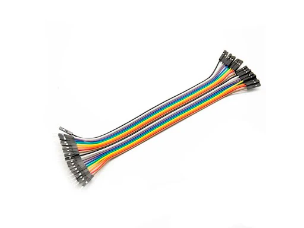

Cables Dupont Macho-Macho a comprar en AFEL

###### https://afel.cl/products/pack-20-cables-de-conexion-macho-macho?variant=45125080645784&country=CL&currency=CLP&utm_medium=product_sync&utm_source=google&utm_content=sag_organic&utm_campaign=sag_organic&utm_term=&utm_campaign=@+Smart+Shopping+2&utm_source=adwords&utm_medium=ppc&hsa_acc=1808722794&hsa_cam=19569174895&hsa_grp=&hsa_ad=&hsa_src=x&hsa_tgt=&hsa_kw=&hsa_mt=&hsa_net=adwords&hsa_ver=3&gad_source=1&gad_campaignid=19560974580&gbraid=0AAAAADBMsFSaa_EjN1agdLXJ4UzuE0ksu&gclid=CjwKCAjwuuPRBhAnEiwA2Ji8ejSXsewTZy0tTe8hjs1s3oJWQck6Ym9LjiydHCA4FiohQWOpc2zXchoCIY0QAvD_BwE

----

> CÓDIGO FALLIDO

```cpp
#include <WiFiS3.h>
#include "AdafruitIO_WiFi.h"

#include <Arduino_GFX_Library.h>

// ---------------- WIFI ----------------
#define WIFI_SSID "iPhone de Renata"
#define WIFI_PASS "arevalo1234"

// ---------------- ADAFRUIT ----------------
#define IO_USERNAME "arevalourra"
#define IO_KEY "TU_KEY"

// FEEDS
AdafruitIO_WiFi io(IO_USERNAME, IO_KEY, WIFI_SSID, WIFI_PASS);

AdafruitIO_Feed *bpmFeed =
  io.feed("examen-grupo04-bpm");

AdafruitIO_Feed *estadoFeed =
  io.feed("examen-grupo04-ecg");

// ---------------- PANTALLA GC9A01 ----------------

Arduino_DataBus *bus =
  new Arduino_HWSPI(
    9,    // DC
    10    // CS
  );

Arduino_GFX *gfx =
  new Arduino_GC9A01(
    bus,
    8,    // RESET
    0,    // rotación
    true
  );

// ---------------- VARIABLES ----------------

String bpm = "--";
String estado = "---";

void dibujarPantalla()
{
  gfx->fillScreen(0x0000);

  gfx->setTextColor(0xFFFF);

  gfx->setTextSize(2);
  gfx->setCursor(30, 40);
  gfx->println("ECG");

  gfx->setTextSize(4);
  gfx->setCursor(40, 90);
  gfx->println(bpm);

  gfx->setTextSize(2);
  gfx->setCursor(20, 170);
  gfx->println(estado);
}

// ---------- CALLBACK BPM ----------

void handleBPM(AdafruitIO_Data *data)
{
  bpm = data->toString();

  Serial.print("BPM recibido: ");
  Serial.println(bpm);

  dibujarPantalla();
}

// ---------- CALLBACK ESTADO ----------

void handleEstado(AdafruitIO_Data *data)
{
  estado = data->toString();

  Serial.print("Estado recibido: ");
  Serial.println(estado);

  dibujarPantalla();
}

void setup()
{
  Serial.begin(115200);

  gfx->begin();

  gfx->fillScreen(0x0000);

  gfx->setTextColor(0xFFFF);

  gfx->setTextSize(2);
  gfx->setCursor(20,120);
  gfx->println("Conectando...");

  Serial.println("Conectando Adafruit IO");

  io.connect();

  while(io.status() < AIO_CONNECTED)
  {
    Serial.print(".");
    delay(500);
  }

  Serial.println();
  Serial.println("Conectado!");

  bpmFeed->onMessage(handleBPM);
  estadoFeed->onMessage(handleEstado);

  bpmFeed->get();
  estadoFeed->get();

  dibujarPantalla();
}

void loop()
{
  io.run();
}
```

> CÓDIGO FALLIDO

```cpp
#include <WiFiS3.h>
#include "AdafruitIO_WiFi.h"

#include <Arduino_GFX_Library.h>

// ---------------- WIFI ----------------
#define WIFI_SSID "TU_WIFI"
#define WIFI_PASS "TU_CLAVE"

// ---------------- ADAFRUIT ----------------
#define IO_USERNAME "TU_USUARIO"
#define IO_KEY "TU_KEY"

// FEEDS
AdafruitIO_WiFi io(IO_USERNAME, IO_KEY, WIFI_SSID, WIFI_PASS);

AdafruitIO_Feed *bpmFeed =
  io.feed("examen-grupo04-bpm");

AdafruitIO_Feed *estadoFeed =
  io.feed("examen-grupo04-ecg");

// ---------------- PANTALLA GC9A01 ----------------

Arduino_DataBus *bus =
  new Arduino_HWSPI(
    9,    // DC
    10    // CS
  );

Arduino_GFX *gfx =
  new Arduino_GC9A01(
    bus,
    8,    // RESET
    0,    // rotación
    true
  );

// ---------------- VARIABLES ----------------

String bpm = "--";
String estado = "---";

void dibujarPantalla()
{
  gfx->fillScreen(0x0000);

  gfx->setTextColor(0xFFFF);

  gfx->setTextSize(2);
  gfx->setCursor(30, 40);
  gfx->println("ECG");

  gfx->setTextSize(4);
  gfx->setCursor(40, 90);
  gfx->println(bpm);

  gfx->setTextSize(2);
  gfx->setCursor(20, 170);
  gfx->println(estado);
}

// ---------- CALLBACK BPM ----------

void handleBPM(AdafruitIO_Data *data)
{
  bpm = data->toString();

  Serial.print("BPM recibido: ");
  Serial.println(bpm);

  dibujarPantalla();
}

// ---------- CALLBACK ESTADO ----------

void handleEstado(AdafruitIO_Data *data)
{
  estado = data->toString();

  Serial.print("Estado recibido: ");
  Serial.println(estado);

  dibujarPantalla();
}

void setup()
{
  Serial.begin(115200);

  gfx->begin();

  gfx->fillScreen(0x0000);

  gfx->setTextColor(0xFFFF);

  gfx->setTextSize(2);
  gfx->setCursor(20,120);
  gfx->println("Conectando...");

  Serial.println("Conectando Adafruit IO");

  io.connect();

  while(io.status() < AIO_CONNECTED)
  {
    Serial.print(".");
    delay(500);
  }

  Serial.println();
  Serial.println("Conectado!");

  bpmFeed->onMessage(handleBPM);
  estadoFeed->onMessage(handleEstado);

  bpmFeed->get();
  estadoFeed->get();

  dibujarPantalla();
}

void loop()
{
  io.run();
}
```

Adjuntamos registro de nuestras conexiones realizadas el día lunes, que estas despúes fueron cambiadas, ya que el día miércoles nos dimos cuenta que los datos visualizados en Adafruit y Arduino eran datos aleatorios.

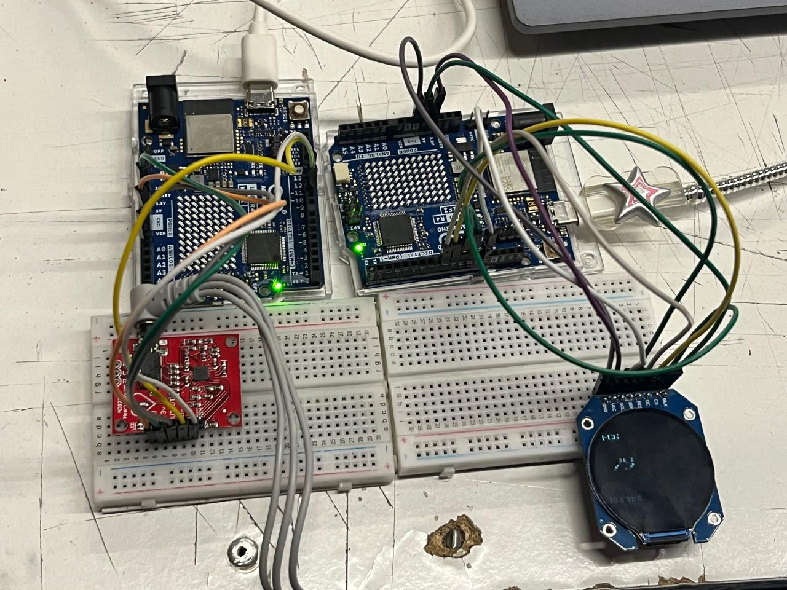

*Conexiones día Lunes*

Tuvimos que considerar la compra de más parches, debido a su desgaste y la adherencia con el cuerpo, ya que sin unos parches nuevos, los datos no tomarían de buena forma.

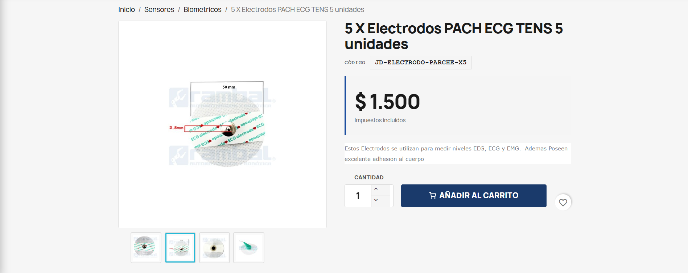

*Imagen electrodos sacada de https://rambal.com/biometricos/1238-electrodo-ecg.html*

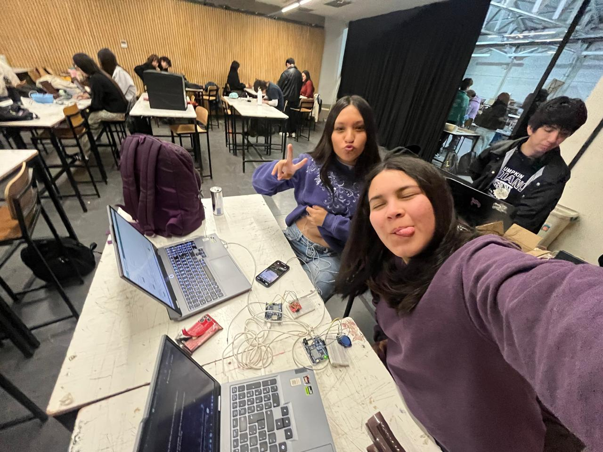

*Este fue uno de los días más importantes del proyecto, ya que pasamos de la planificación a ver el sistema funcionando en la práctica. Lograr que la información recorriera todo el proceso, desde la captura de la señal hasta su visualización, nos dio mayor confianza para continuar con el desarrollo. Terminamos la jornada muy contentas y satisfechas con los resultados obtenidos, ya que el trabajo realizado durante las semanas anteriores comenzó a materializarse en un sistema funcional.*

### Miércoles 17 Junio 

### 5 días para el examen

El día de hoy realizamos denuevo la prueba para la pantalla y efectivamente eran los cables!!. El día anterior la Rena realizó la compra de estos cables, para así poder realizar la prueba nuevamente con la pantalla y comprobar nuestra teoría.

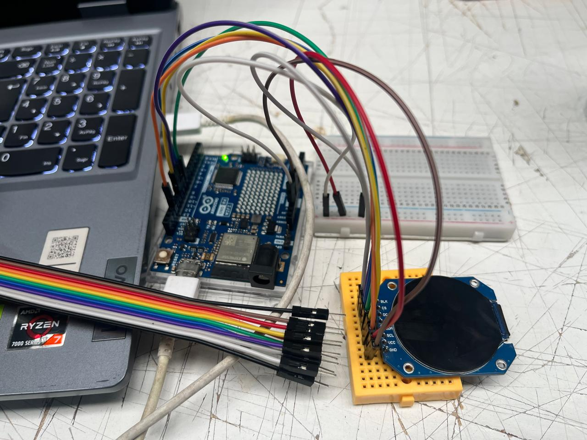

*Nuevos cables*

Nos dimos cuenta que los datos que nos tiraba en el monitor serial de Arduino y en Adafruit eran solo datos aleatorios y no detectaba los pulsos reales... Tras varios intentos de nuevas pruebas con nuevos códigos no pudimos realizar que los pulsos fueran en tiempo real y de nosotras. (Por hoy nos rendimos, seguiremos en esta lucha)...

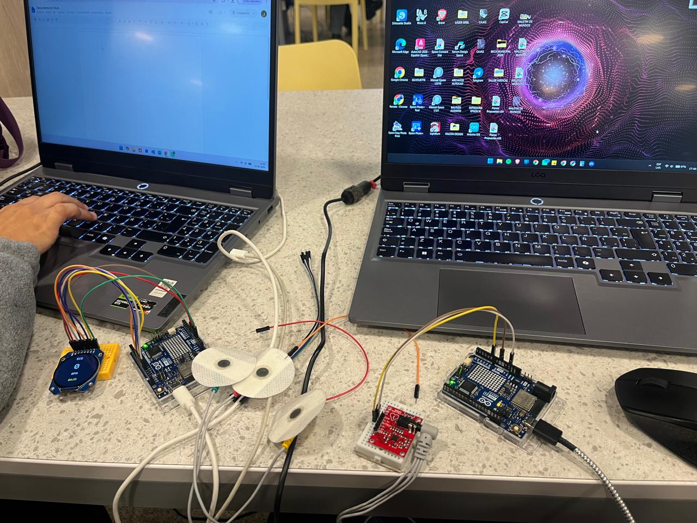

*Conexiones día Miércoles, probando nuevos cables*

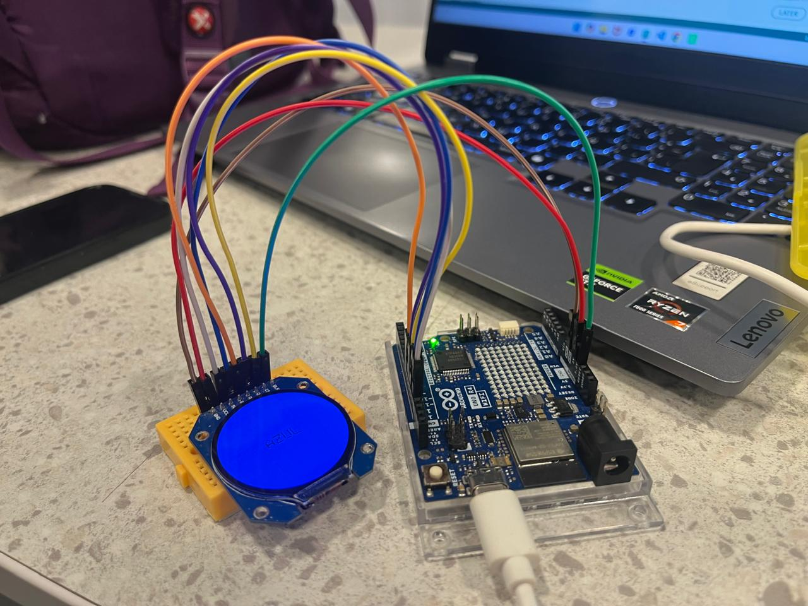

*Prueba pantalla con nuevos cables*

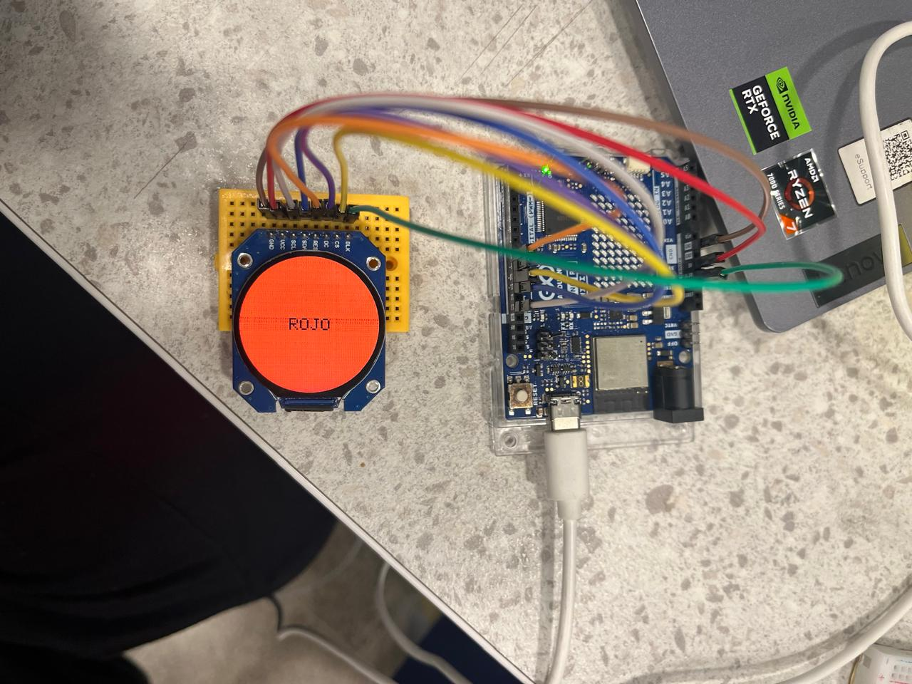

*Prueba pantalla con nuevos cables*


*Acá nos funcionó tanto la pantalla como el código, solo que este código despúes no lo utilizamos debido a los datos no reales*

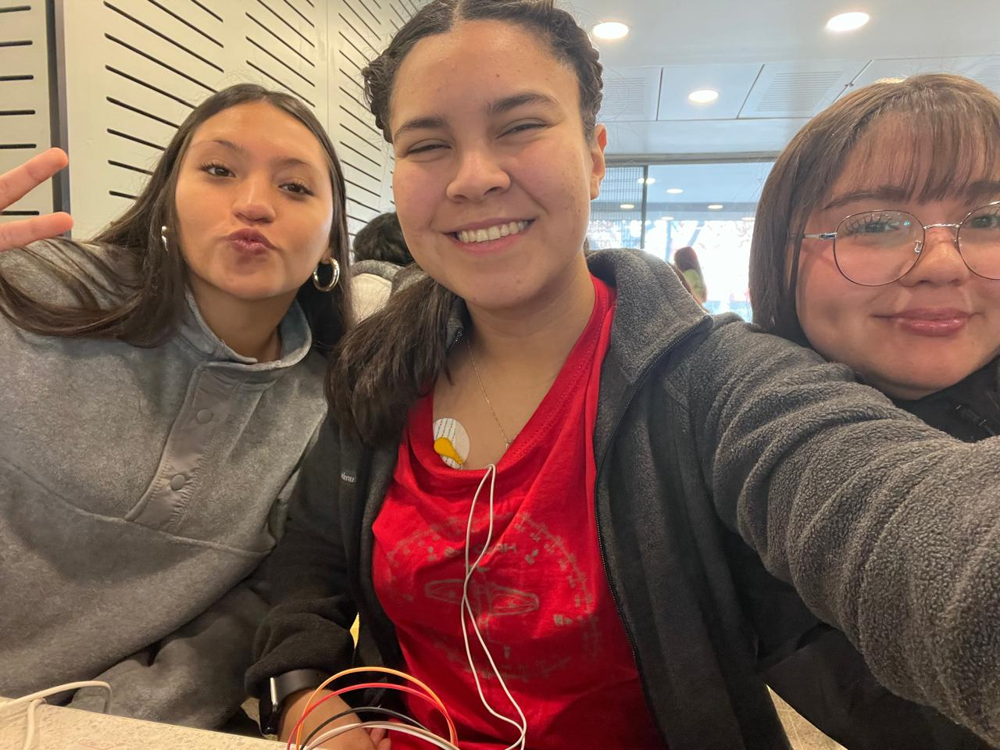

*Foto riendo pero por dentro llorando*

> CÓDIGO DE PRUEBA PANTALLA TFT LCD redonda de 1.28"

- Utilizamos este código para probar la pantalla con los cables nuevos y si funcionó, reflejaba los colores respectivos.

```cpp
#include <Arduino_GFX_Library.h>

// Pines de control
#define TFT_DC   9
#define TFT_CS   10
#define TFT_RST  8

// Colores RGB565
#define TFT_BLACK   0x0000
#define TFT_BLUE    0x001F
#define TFT_RED     0xF800
#define TFT_GREEN   0x07E0
#define TFT_WHITE   0xFFFF
#define TFT_YELLOW  0xFFE0
#define TFT_CYAN    0x07FF
#define TFT_MAGENTA 0xF81F

// Configuración SPI por hardware
Arduino_DataBus *bus = new Arduino_HWSPI(
  TFT_DC,
  TFT_CS
);

// Configuración pantalla GC9A01
Arduino_GFX *gfx = new Arduino_GC9A01(
  bus,
  TFT_RST,
  0,      // Rotación (0-3)
  true    // IPS
);

void setup() {

  Serial.begin(115200);

  if (!gfx->begin()) {
    Serial.println("Error al iniciar la pantalla");
    while (1);
  }

  gfx->fillScreen(TFT_BLACK);

  gfx->setTextSize(2);
  gfx->setTextColor(TFT_WHITE);
  gfx->setCursor(45, 110);
  gfx->println("TEST RGB");

  delay(2000);
}

void loop() {

  mostrarColor(TFT_RED, "ROJO");
  mostrarColor(TFT_GREEN, "VERDE");
  mostrarColor(TFT_BLUE, "AZUL");
  mostrarColor(TFT_WHITE, "BLANCO");
  mostrarColor(TFT_YELLOW, "AMARILLO");
  mostrarColor(TFT_CYAN, "CIAN");
  mostrarColor(TFT_MAGENTA, "MAGENTA");
  mostrarColor(TFT_BLACK, "NEGRO");
}

void mostrarColor(uint16_t color, const char *texto) {

  gfx->fillScreen(color);

  if (color == TFT_BLACK) {
    gfx->setTextColor(TFT_WHITE);
  } else {
    gfx->setTextColor(TFT_BLACK);
  }

  gfx->setTextSize(3);

  int16_t x1, y1;
  uint16_t w, h;

  gfx->getTextBounds(
    texto,
    0,
    0,
    &x1,
    &y1,
    &w,
    &h
  );

  int16_t x = (240 - w) / 2;
  int16_t y = (240 - h) / 2;

  gfx->setCursor(x, y);
  gfx->println(texto);

  delay(2000);
}
```


### Viernes 19 de Junio 

### 3 días para el examen

El día de hoy tratamos de mejorar los códigos, tuvimos un tiempo corto para poder avanzar, debido a nuestro acotado tiempo entre clases. No pudimos mejorar el código... Seguiremos informando.

### Domingo 21 de Junio

### 1 día para el examen

El día de hoy nos ayudó la Carla (gracias Carla) a realizar nuestras últimas conexiones y hacer que la señal de los BPM llegara a la pantalla que estaba conectada en la casa de Isipm. 

De partida probamos los códigos mostrados a continuación para realizar tanto demostraciones de la pantalla como los BPM en modo demo.

**CÓDIGO PANTALLA COLOR**
```cpp
#include <Arduino_GFX_Library.h>

#define TFT_CS 10
#define TFT_DC 9
#define TFT_RST 8

Arduino_DataBus *bus = new Arduino_HWSPI(TFT_DC, TFT_CS);
Arduino_GFX *tft = new Arduino_GC9A01(bus, TFT_RST, 0, false);

void setup() {

  tft->begin();

  tft->fillScreen(0xF800);

}

void loop() {
}
```


**CÓDIGO PANTALLA AZUL**
```cpp
#include <Arduino_GFX_Library.h>

#define TFT_CS 10
#define TFT_DC 9
#define TFT_RST 8

Arduino_DataBus *bus = new Arduino_HWSPI(TFT_DC, TFT_CS);
Arduino_GFX *tft = new Arduino_GC9A01(bus, TFT_RST, 0, true);

void setup() {

  tft->begin();

  tft->fillScreen(0x001F);

}

void loop() {
}
```

Este código nos sirvió para comprobar si la pantalla estaba buena, realizando pruebas de color. Tal como el anterior.

**CÓDIGO PRUEBA BPM DEMO**
```cpp
#include <WiFiS3.h>
#include "AdafruitIO_WiFi.h"
#include "config.h"
#include <Arduino_GFX_Library.h>

// Colores ajustados para tu pantalla
#define BLACK 0x0000
#define WHITE 0xFFFF
#define RED   0x001F
#define GREEN 0x07E0

AdafruitIO_WiFi io(IO_USERNAME, IO_KEY, WIFI_SSID, WIFI_PASS);
AdafruitIO_Feed *bpmFeed = io.feed("pulsaciones");

// Pines pantalla
#define TFT_CS   10
#define TFT_DC   9
#define TFT_RST  8

Arduino_DataBus *bus = new Arduino_HWSPI(TFT_DC, TFT_CS);
Arduino_GFX *tft = new Arduino_GC9A01(bus, TFT_RST, 0, false);

int bpm = 75;
int x = 0;
int lastY = 190;

unsigned long ultimoDibujo = 0;
unsigned long ultimoDemo = 0;

bool conectadoAdafruit = false;
bool corazonGrande = false;

void setup() {
  Serial.begin(115200);
  delay(2000);

  tft->begin();
  tft->fillScreen(BLACK);

  tft->setTextColor(WHITE);
  tft->setTextSize(2);
  tft->setCursor(35, 105);
  tft->print("Conectando...");

  Serial.println("Conectando Adafruit...");
  io.connect();

  unsigned long inicio = millis();

  while (io.status() < AIO_CONNECTED && millis() - inicio < 15000) {
    Serial.print(".");
    delay(500);
  }

  if (io.status() == AIO_CONNECTED) {
    conectadoAdafruit = true;
    Serial.println("\nAdafruit conectado");
    bpmFeed->onMessage(recibirBPM);
  } else {
    conectadoAdafruit = false;
    Serial.println("\nSin nube, modo demo");
  }

  tft->fillScreen(BLACK);
  dibujarPantalla();
}

void loop() {
  if (conectadoAdafruit) {
    io.run();
  }

  if (!conectadoAdafruit && millis() - ultimoDemo > 5000) {
    ultimoDemo = millis();
    bpm++;
    if (bpm > 82) bpm = 74;
    dibujarPantalla();
  }

  if (millis() - ultimoDibujo > 80) {
    ultimoDibujo = millis();
    dibujarOnda();
  }
}

void recibirBPM(AdafruitIO_Data *data) {
  bpm = data->toInt();

  if (bpm < 55 || bpm > 130) {
    bpm = 75;
  }

  Serial.print("BPM recibido: ");
  Serial.println(bpm);

  dibujarPantalla();
}

void dibujarPantalla() {
  tft->fillScreen(BLACK);

  tft->setTextColor(WHITE);
  tft->setTextSize(3);
  tft->setCursor(55, 30);
  tft->print(bpm);
  tft->print(" BPM");

  tft->setTextSize(1);
  tft->setCursor(78, 65);

  if (conectadoAdafruit) {
    tft->print("Pulso en nube");
  } else {
    tft->print("Modo demo");
  }

  dibujarCorazon(120, 115, false);
  tft->drawLine(20, 190, 220, 190, GREEN);
}

void dibujarCorazon(int cx, int cy, bool grande) {
  int r = grande ? 18 : 15;

  tft->fillCircle(cx - r / 2, cy, r, RED);
  tft->fillCircle(cx + r / 2, cy, r, RED);

  tft->fillTriangle(
    cx - r - 8, cy + 5,
    cx + r + 8, cy + 5,
    cx, cy + r + 25,
    RED
  );
}

void dibujarOnda() {
  corazonGrande = !corazonGrande;

  tft->fillRect(65, 85, 110, 85, BLACK);
  dibujarCorazon(120, 115, corazonGrande);

  int fase = x % 48;
  int y = 190;

  if (fase < 8) y = 190;
  else if (fase < 12) y = 178;
  else if (fase < 16) y = 210;
  else if (fase < 20) y = 150;
  else y = 190;

  tft->drawLine(x, lastY, x + 2, y, GREEN);

  lastY = y;
  x += 2;

  if (x > 235) {
    x = 0;
    lastY = 190;
    tft->fillRect(0, 175, 240, 65, BLACK);
  }
}
```

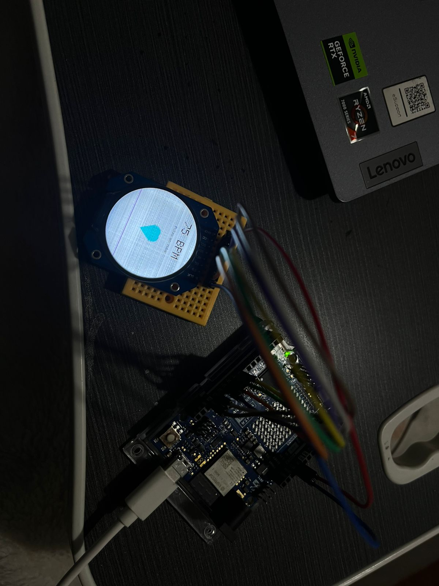

 

Este código nos funcionó de prueba para ver como se mostraban los BPM en la pantalla. Simulando BPM reales.

```cpp
#include <Arduino_GFX_Library.h>

#define TFT_CS 10
#define TFT_DC 9
#define TFT_RST 8

Arduino_DataBus *bus = new Arduino_HWSPI(TFT_DC, TFT_CS);
Arduino_GFX *tft = new Arduino_GC9A01(bus, TFT_RST, 0, false);

void setup() {
  tft->begin();
  tft->fillScreen(0xF800);
  tft->setTextColor(0xFFFF);
  tft->setTextSize(3);
  tft->setCursor(50, 100);
  tft->print("TEST");
}

void loop() {}
```

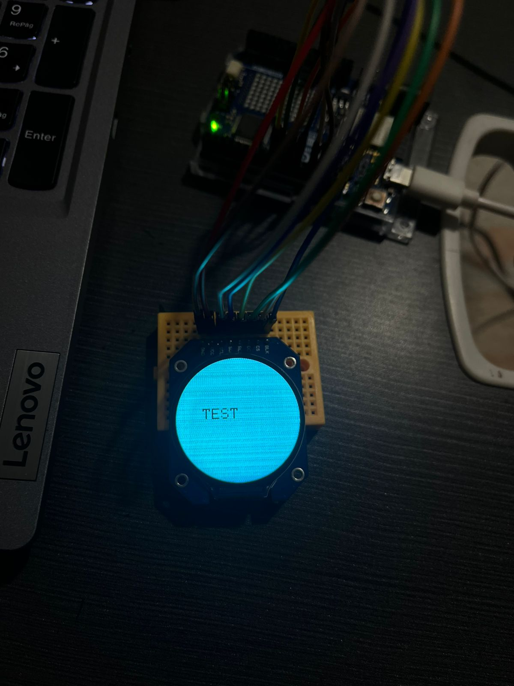

## FUNCIONÓ!

Realizamos la prueba de distintos códigos, tanto para ver el funcionamiento de la pantalla nuevamente, como también para realizar una prueba de los BPM. La prueba que realizamos fue de San Bernardo - Maipú, logrando una exitosa conexión entre ambos dispositivos y que en la nube de Adafruit y en la pantalla se pudiera registrar de manera simultánea los datos. !!! De igual forma en el Arduino con la pantalla mantuvimos siempre las conexiones iniciales, pero en el Arduino con el Sensor fuimos cambiando de conexiones hasta llegar a una definitiva e ir mejorando los códigos.

 

> DEMO EN VIVO REALIZADA DESDE MAIPÚ

Esta es la demo en vivo del transmisor.

 

> DEMO EN VIVO REALIZADA DESDE SAN BERNARDO

Esta es la demo en vivo del receptor.

**CÓDIGO FINAL TRANSMISOR**
```cpp
#include <WiFiS3.h>
#include "AdafruitIO_WiFi.h"
#include "config.h"

AdafruitIO_WiFi io(IO_USERNAME, IO_KEY, WIFI_SSID, WIFI_PASS);
AdafruitIO_Feed *bpmFeed = io.feed("pulsaciones");

#define ECG_PIN A0

float ecgFiltrado = 0;
float anteriorECG = 0;

unsigned long ultimoLatido = 0;
unsigned long ultimoEnvio = 0;

bool detectando = false;

float bpm = 75;
float ultimoBPMValido = 75;

// Ajustado a tu señal actual: sube aprox. a 235–236
int umbral = 233;

void setup() {
  Serial.begin(115200);
  delay(2000);

  Serial.println("Iniciando emisor ECG");
  Serial.println("Conectando Adafruit...");

  io.connect();

  while (io.status() < AIO_CONNECTED) {
    Serial.print(".");
    delay(500);
  }

  Serial.println("\nAdafruit conectado");
}

void loop() {
  io.run();

  int lectura = analogRead(ECG_PIN);

  ecgFiltrado = 0.75 * anteriorECG + 0.25 * lectura;
  anteriorECG = ecgFiltrado;

  Serial.print("ECG: ");
  Serial.print(ecgFiltrado);
  Serial.print(" | BPM: ");
  Serial.println(ultimoBPMValido);

  unsigned long ahora = millis();

  if (ecgFiltrado > umbral && !detectando) {
    unsigned long intervalo = ahora - ultimoLatido;

    if (intervalo > 450 && intervalo < 1200) {
      float bpmDetectado = 60000.0 / intervalo;

      if (bpmDetectado > 55 && bpmDetectado < 130) {
        bpm = bpmDetectado;
        ultimoBPMValido = (0.7 * ultimoBPMValido) + (0.3 * bpm);

        Serial.print("BPM valido: ");
        Serial.println(ultimoBPMValido);
      } else {
        Serial.print("BPM descartado: ");
        Serial.println(bpmDetectado);
      }
    }

    ultimoLatido = ahora;
    detectando = true;
  }

  if (ecgFiltrado < umbral - 2) {
    detectando = false;
  }

  if (ahora - ultimoEnvio > 5000) {
    ultimoEnvio = ahora;

    int bpmEnviar = (int)ultimoBPMValido;

    if (bpmEnviar < 55 || bpmEnviar > 130) {
      bpmEnviar = 75;
    }

    bpmFeed->save(bpmEnviar);

    Serial.print("ENVIADO A ADAFRUIT: ");
    Serial.println(bpmEnviar);
  }

  delay(10);
}
```

**CÓDIGO FINAL RECEPTOR**
```cpp
#include <WiFiS3.h>
#include "AdafruitIO_WiFi.h"
#include "config.h"
#include <Arduino_GFX_Library.h>

#define BLACK 0x0000
#define WHITE 0xFFFF
#define RED   0x001F
#define GREEN 0x07E0

AdafruitIO_WiFi io(IO_USERNAME, IO_KEY, WIFI_SSID, WIFI_PASS);
AdafruitIO_Feed *bpmFeed = io.feed("pulsaciones");

#define TFT_CS 10
#define TFT_DC 9
#define TFT_RST 8

Arduino_DataBus *bus = new Arduino_HWSPI(TFT_DC, TFT_CS);
Arduino_GFX *tft = new Arduino_GC9A01(bus, TFT_RST, 0, false);

int bpm = 75;

void setup() {
  Serial.begin(115200);
  delay(2000);

  tft->begin();
  tft->fillScreen(BLACK);
  tft->setTextColor(WHITE);
  tft->setTextSize(2);
  tft->setCursor(35, 105);
  tft->print("Conectando...");

  io.connect();

  while (io.status() < AIO_CONNECTED) {
    Serial.print(".");
    delay(500);
  }

  Serial.println("\nAdafruit conectado");
  bpmFeed->onMessage(recibirBPM);

  dibujarPantalla();
}

void loop() {
  io.run();
}

void recibirBPM(AdafruitIO_Data *data) {
  bpm = data->toInt();
  if (bpm < 55 || bpm > 130) bpm = 75;

  Serial.print("BPM recibido: ");
  Serial.println(bpm);

  dibujarPantalla();
}

void dibujarPantalla() {
  tft->fillScreen(BLACK);

  tft->setTextColor(WHITE);
  tft->setTextSize(3);
  tft->setCursor(55, 30);
  tft->print(bpm);
  tft->print(" BPM");

  tft->setTextSize(1);
  tft->setCursor(78, 65);
  tft->print("Pulso en nube");

  tft->fillCircle(112, 115, 18, RED);
  tft->fillCircle(128, 115, 18, RED);
  tft->fillTriangle(88, 125, 152, 125, 120, 170, RED);

  tft->drawLine(20, 200, 60, 200, GREEN);
  tft->drawLine(60, 200, 75, 175, GREEN);
  tft->drawLine(75, 175, 90, 220, GREEN);
  tft->drawLine(90, 220, 110, 160, GREEN);
  tft->drawLine(110, 160, 130, 200, GREEN);
  tft->drawLine(130, 200, 220, 200, GREEN);
}
```
Finalmente pudimos terminar nuestro examen de manera exitosa y pacientemente. Además de que nuestro prueba y error constante nos hizo seguir adelante a pesar de las muchas frustraciones que se pusieron en nuestros caminos. Aprendimos bastante y de eso nos nutrimos! Gracias LID, Aarón y Mateo! 

GRACIAS INTERACCIONES INALÁMBRICAS

fin mientras...

### Lunes 22 de Junio 

### Horas antes de el examen

El día de hoy realizamos nuestra prueba final y la demo en video sobre nuestro proyecto.

Primero realizamos la prueba pero hicimos un cambio en las conexiones del Sensor con el Arduino, conectándolos directamente los cables al Sensor. Nos dimos cuenta que las conexiones y los BPM no realizaban cambios y se mantenían en 75 (que es el BPM base). Lueego volvimos a nuestras conexiones del día de ayer y de esta forma los BPM cambiaban, no de manera constante pero tampoco se mantenía en 75. 

Acá se muestra el cambio de BPM, demostrando que si cambiaba, pero se demoraba mucho al cambiar, aproximadamente 2-3 minutos.

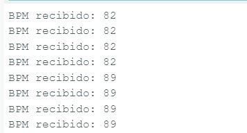 

### DEMO EN VIDEO SS PISO 2 - SS PISO 3 


