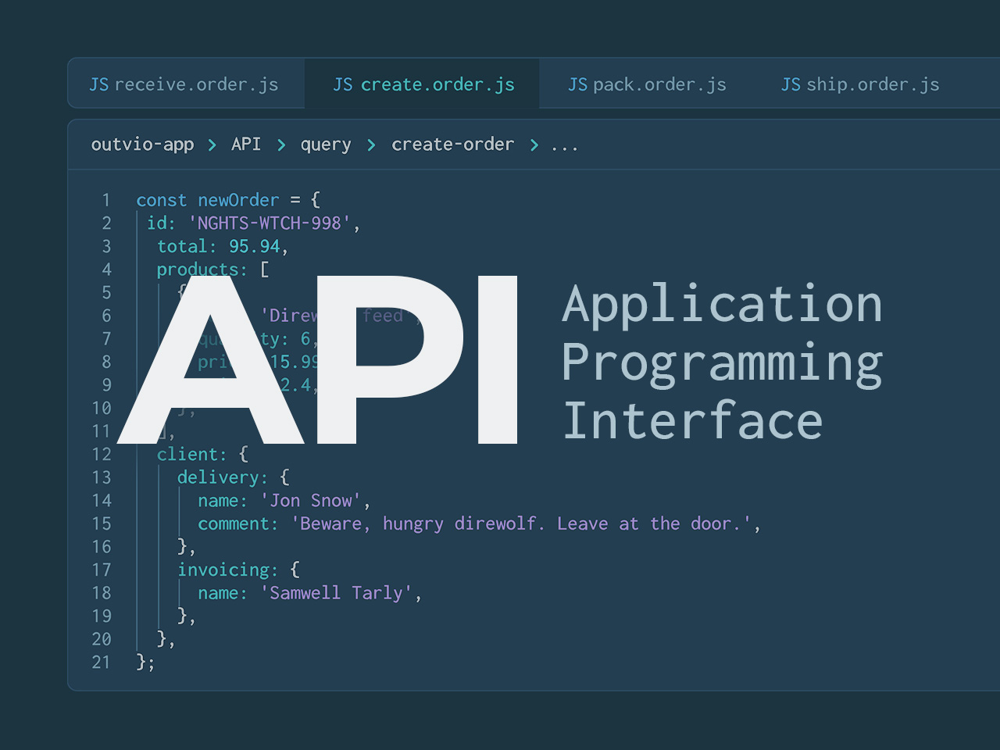
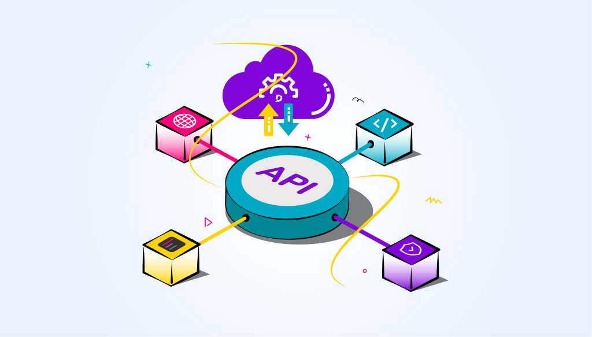
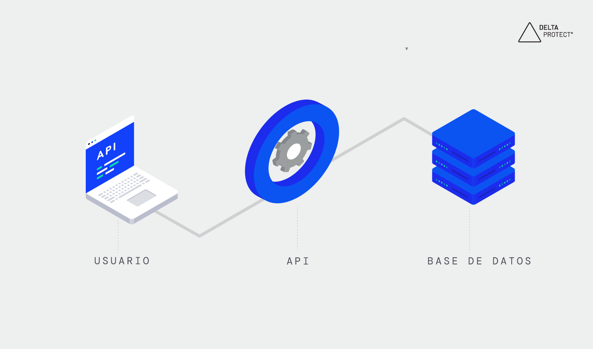
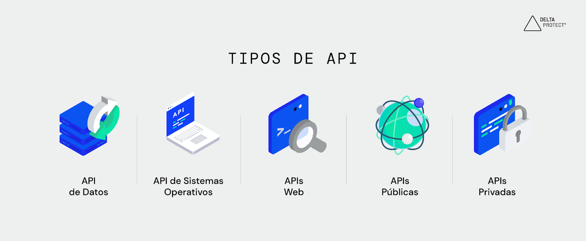
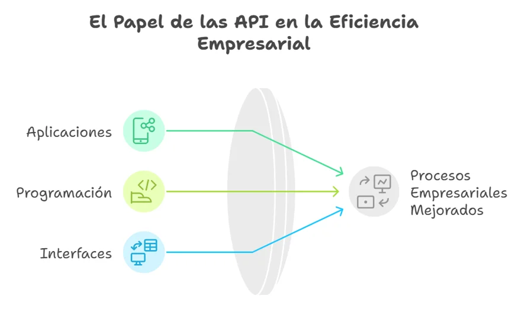
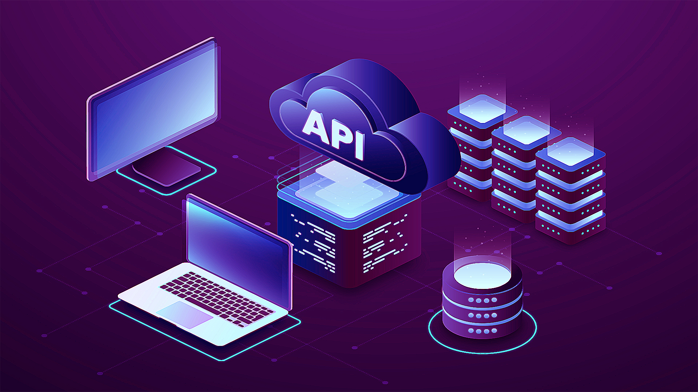
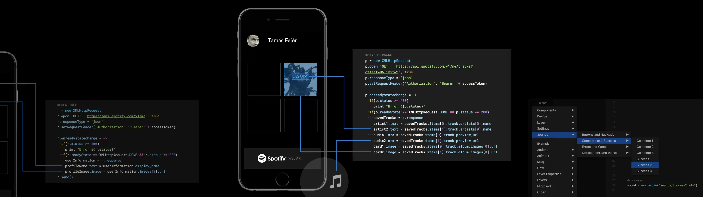
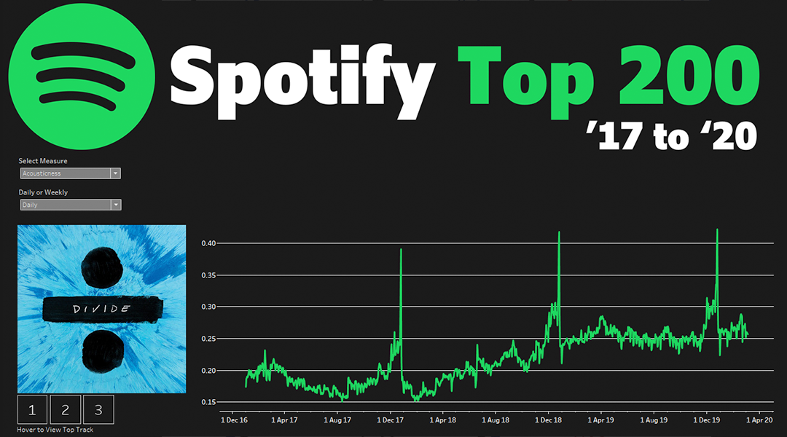
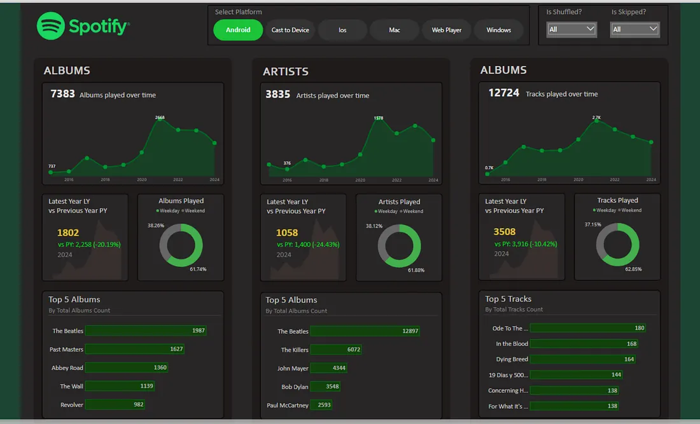
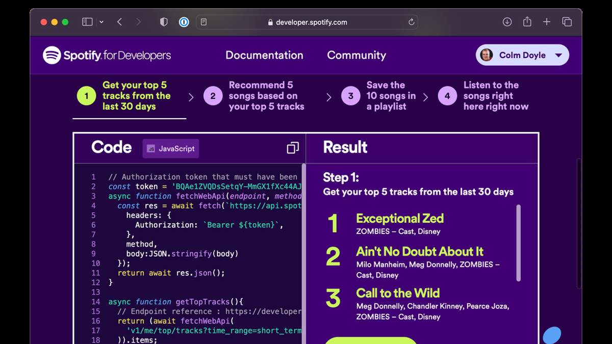

# Persona-1

arevalourra ✩

----

# Investigación sobre APIs

*Significado sigla API en inglés*

###### Créditos Imagen: https://outvio.com/es/blog/que-es-una-api/

## ¿Qué es una API?

Una API (Application Programming Interface o Interfaz de Programación de Aplicaciones) es un conjunto de reglas, protocolos y definiciones que permiten la comunicación entre diferentes aplicaciones, sistemas o servicios informáticos. Su principal objetivo es facilitar el intercambio de información y funcionalidades de manera estandarizada, permitiendo que distintos programas trabajen conjuntamente sin necesidad de conocer los detalles internos de su implementación.

Las APIs funcionan como intermediarias entre sistemas, estableciendo mecanismos seguros y estructurados para solicitar, enviar y recibir datos. Cuando una aplicación requiere acceder a una función o recurso de otro sistema, realiza una solicitud a través de la API correspondiente. Posteriormente, el sistema receptor procesa la solicitud y devuelve una respuesta con la información requerida o el resultado de la operación realizada.

Gracias a las APIs, los desarrolladores pueden integrar servicios externos en sus aplicaciones de forma eficiente, reduciendo tiempos de desarrollo y promoviendo la reutilización de recursos existentes. Actualmente, son un componente fundamental en el ecosistema digital, ya que permiten la conexión entre plataformas web, aplicaciones móviles, servicios en la nube, dispositivos inteligentes y bases de datos.

> Un ejemplo cotidiano es el uso de aplicaciones que muestran mapas, información meteorológica o sistemas de pago en línea. En estos casos, la aplicación no genera los datos por sí misma, sino que los obtiene mediante APIs proporcionadas por servicios especializados. De esta manera, las APIs facilitan la interoperabilidad entre sistemas y contribuyen al desarrollo de soluciones digitales más completas, escalables y eficientes.

*Las APIs son consideradas como el pegamento que une todos los servicios web que usamos*

###### Créditos Imagen: https://fourier.com.mx/las-apis-el-pegamento-que-une-todos-los-servicios-web-que-usas/

## Funcionamiento de una API

El funcionamiento de una API se basa en la comunicación entre un cliente y un servidor. Cuando una aplicación necesita acceder a información o ejecutar una función, envía una solicitud a través de la API. El servidor recibe la petición, la procesa y devuelve una respuesta con los datos solicitados o el resultado de la operación.

En las APIs web, esta comunicación se realiza generalmente mediante los protocolos HTTP o HTTPS. Además, muchas APIs utilizan mecanismos de autenticación para verificar la identidad del usuario y garantizar la seguridad de la información. Los datos intercambiados suelen entregarse en formatos estructurados como JSON, facilitando su integración entre diferentes sistemas y aplicaciones.

> Por ejemplo, al utilizar la Spotify Web API, una aplicación puede solicitar información sobre una canción o artista. La API procesa la consulta y devuelve los datos correspondientes, que posteriormente son mostrados al usuario a través de una interfaz gráfica.

*Funcionamiento General de una API*

###### Créditos Imagen: https://www.deltaprotect.com/blog/que-es-una-api

## Tipos de API

*Tipos de API*

###### Créditos Imagen: https://www.deltaprotect.com/blog/que-es-una-api

#### API de Datos

- Son interfaces diseñadas para acceder, consultar, modificar o gestionar información almacenada en bases de datos o servicios de información. Permiten que distintas aplicaciones obtengan datos de manera estructurada y segura.

#### API de Sistemas Operativos

- Proporcionan acceso a funciones y recursos del sistema operativo, permitiendo que las aplicaciones interactúen con elementos como archivos, memoria, dispositivos de hardware y procesos del sistema.

#### APIs Web

- Son interfaces que funcionan a través de internet mediante protocolos como HTTP o HTTPS. Permiten la comunicación entre aplicaciones distribuidas y servicios en línea, siendo ampliamente utilizadas en plataformas digitales y aplicaciones móviles.

#### APIs Públicas

- También conocidas como Open APIs, están disponibles para desarrolladores externos que deseen integrar servicios o funcionalidades en sus propias aplicaciones. Generalmente requieren registro y autenticación para su uso.

#### APIs Privadas

- Son desarrolladas para uso interno dentro de una organización. Su acceso está restringido a sistemas y equipos autorizados, permitiendo una integración segura entre plataformas corporativas y procesos internos.

***En conjunto, estos tipos de API cumplen un papel fundamental en el desarrollo de soluciones digitales modernas, al facilitar la interoperabilidad, el intercambio de información y la integración entre diferentes tecnologías.***

### Ventajas de las APIs

Las APIs ofrecen numerosos beneficios para empresas y desarrolladores:

- Facilitan la integración entre diferentes sistemas

- Reducen tiempos y costos de desarrollo

- Permiten reutilizar funcionalidades existentes

- Favorecen la escalabilidad de las aplicaciones

- Mejoran la interoperabilidad entre plataformas

- Impulsan la innovación mediante la creación de nuevos servicios digitales

*Resumen de beneficios del uso de APIs dentro de la tecnología empresarial*

###### Créditos Imagen: https://blog.factoringsecurity.cl/articulos/api-que-es-y-para-que-sirve

### APIs y la Transformación Digital

Las APIs son consideradas un componente fundamental de la transformación digital, ya que permiten conectar plataformas, automatizar procesos y compartir información en tiempo real. Su uso se ha expandido en sectores como la banca, salud, educación, comercio electrónico y servicios gubernamentales, donde la interoperabilidad y el acceso a datos son esenciales para mejorar la experiencia de los usuarios y optimizar la gestión de recursos.

*APIs como motor de la transformación digital.*

###### Créditos Imagen: https://azulschool.net/diferencias-entre-una-api-y-rest-api/

*Las APIs constituyen una tecnología clave para el desarrollo de aplicaciones modernas y la integración de sistemas digitales. Gracias a su capacidad para facilitar la comunicación entre diferentes plataformas, permiten crear soluciones más eficientes, escalables y centradas en las necesidades de los usuarios. Su importancia continúa creciendo a medida que las organizaciones avanzan hacia modelos cada vez más conectados e interdependientes.*

# Ejemplo de API

## Spotify Web API

La Spotify Web API es una interfaz de programación que permite a desarrolladores acceder a gran parte de la información y funcionalidades de la plataforma Spotify. A través de esta API, es posible consultar datos sobre canciones, artistas, álbumes, listas de reproducción y perfiles de usuarios, así como integrar servicios musicales en aplicaciones web, móviles o de escritorio.

La API utiliza el protocolo HTTP para el intercambio de información y emplea el formato JSON para la entrega de datos, facilitando la interoperabilidad entre diferentes sistemas y lenguajes de programación. Su diseño sigue los principios de una API REST, donde cada recurso puede ser consultado mediante una URL específica.

La Spotify Web API se clasifica principalmente como una **API Web pública de tipo REST**. Es una API Web porque permite la comunicación entre aplicaciones a través de internet mediante protocolos HTTP/HTTPS; es pública porque puede ser utilizada por desarrolladores externos previa autenticación; y sigue la arquitectura REST, permitiendo acceder a recursos como canciones, artistas, álbumes y listas de reproducción mediante solicitudes a endpoints específicos.

> Una API REST es un tipo de API que utiliza el protocolo HTTP para permitir la comunicación entre aplicaciones mediante solicitudes a recursos específicos. Cada recurso (como una canción, un artista o una playlist en Spotify) posee una dirección única llamada endpoint, a la que se puede acceder para consultar, crear, modificar o eliminar información de forma estandarizada.

### Integración con Framer

Framer es una plataforma de diseño y desarrollo web que permite crear interfaces visuales interactivas. Al integrarse con la Spotify Web API, los diseñadores pueden mostrar información dinámica, como canciones, artistas o listas de reproducción, directamente en sitios web y prototipos, mejorando la experiencia del usuario mediante contenido actualizado en tiempo real.

*Uso de la API web de Spotify en Framer*

###### Créditos Imagen: https://blog.prototypr.io/have-you-heard-about-the-spotify-web-api-8e8d1dac9eaf

### Funcionamiento

La Spotify Web API opera mediante solicitudes realizadas por una aplicación cliente a los servidores de Spotify. Antes de acceder a la información, la aplicación debe autenticarse utilizando el protocolo OAuth 2.0, que permite verificar la identidad del usuario y controlar los permisos otorgados. Una vez autenticada, la aplicación puede solicitar datos como canciones, artistas, álbumes, listas de reproducción y características musicales. La información recibida en formato JSON puede utilizarse para construir interfaces y paneles interactivos, como el mostrado en la Figura, donde se visualizan estadísticas, tendencias y análisis de canciones mediante gráficos dinámicos obtenidos a partir de los datos proporcionados por Spotify.

*Panel interactivo que visualiza datos y métricas musicales obtenidas mediante la Spotify Web API para analizar tendencias del ranking Spotify Top 200.*

###### Créditos Imagen: https://www.thedataschool.com.au/blogs/spotify-api/

### Ventajas de la Spotify Web API

- Acceso al catálogo global: Consulta directa de millones de canciones, álbumes y artistas.

- Amplia documentación: Guías claras que facilitan el desarrollo de aplicaciones.

- Integración multiplataforma: Soporte para entornos web, móviles y de escritorio (Android, iOS, PC, Mac).

- Métricas y analítica detallada: Datos históricos para crear gráficos de consumo y tendencias.

- Seguridad moderna: Protocolos avanzados de autenticación y protección de datos.

- Experiencias personalizadas: Rastreo preciso de hábitos, top tracks y patrones de escucha.

*Dashboard analítico de datos de reproducción de Spotify.*

###### Créditos Imagen: https://medium.com/@aruljennifer2000/how-i-turned-my-spotify-history-into-an-interactive-power-bi-dashboard-e67ea879de49

### Relevancia para el diseño y la experiencia de usuario

Desde la perspectiva del diseño de productos y experiencias digitales, la Spotify Web API constituye una herramienta que permite desarrollar interfaces altamente personalizadas. Gracias al acceso a datos de comportamiento y preferencias musicales, los diseñadores pueden crear experiencias adaptativas que respondan a los intereses del usuario en tiempo real, mejorando la interacción, el nivel de personalización y la satisfacción general durante el uso del producto.

La Spotify Web API representa una de las plataformas más completas para el acceso y gestión de información musical en entornos digitales. Su capacidad para proporcionar datos detallados sobre contenido, usuarios y características acústicas la convierte en una herramienta valiosa para el desarrollo de aplicaciones, sistemas de recomendación, investigaciones académicas y experiencias interactivas centradas en la música.

*Uso de API web de Spotify* ***https://developer.spotify.com/documentation/web-api***

###### Créditos Imagen: https://www.digitalmusicnews.com/2024/12/01/spotify-tightens-api-access-removes-several-data-points/
---

## Bibliografía

###### https://www.deltaprotect.com/blog/que-es-una-api

###### https://nbxsoluciones.com/2022/06/17/que-es-una-api-y-para-que-sirven/

###### https://beecrowd.com/es/blog-posts/api-3/

###### https://outvio.com/es/blog/que-es-una-api/

###### https://www.appleute.de/es/biblioteca-para-desarrolladores-de-aplicaciones/what-is-rest-api/

###### https://fourier.com.mx/las-apis-el-pegamento-que-une-todos-los-servicios-web-que-usas/

###### https://developer.spotify.com/

###### https://blog.prototypr.io/have-you-heard-about-the-spotify-web-api-8e8d1dac9eaf

###### https://medium.com/@aruljennifer2000/how-i-turned-my-spotify-history-into-an-interactive-power-bi-dashboard-e67ea879de49

