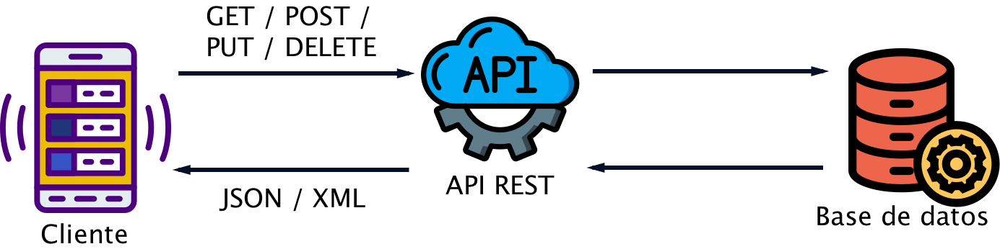
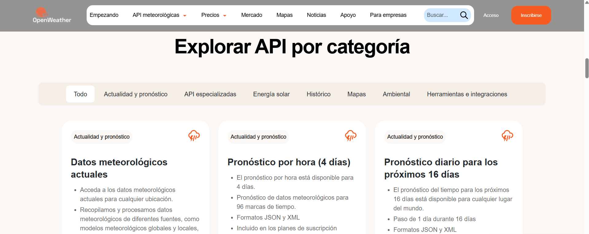
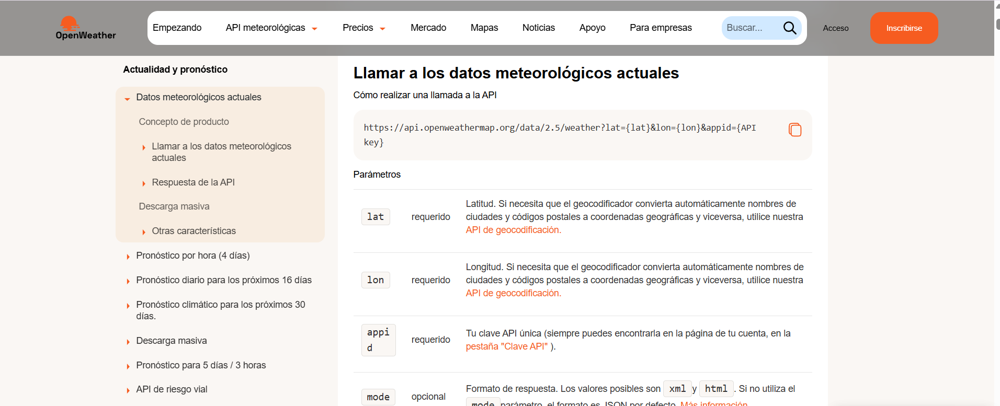
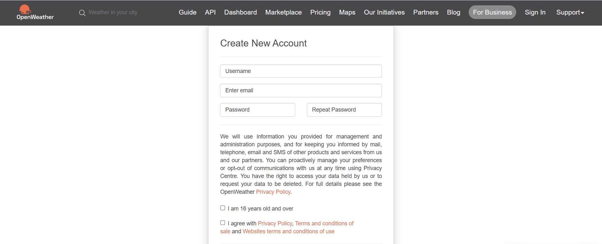

# persona-2

isipm08 ♡

# Investigación sobre APIs

---

## ¿Qué son?

- Conjunto de definiciones y protocolos de comunicación entre dos componentes, permitiendo que dos sistemas de software distintos puedan comunicarse entre sí e intercambiar informaciónde forma organizada. Estas actúan como intermediarios entre dos sistemas. Son como un "traductor" entre sistemas que no hablan el mismo lenguaje, siendo algo importante ya que permiten simplificar y ampliar las conexiones entre usuarios, sistemas o empresas. Además brinda que akguno de los desarrolladores de aplicaciones y páginas web contruya, conecte e integre distintos servicios de manera rápida y escalable. Gracias a estas se puede integrar de manera sencilla distintos servicios sin tener que construir dichos servicios desde cero.
- *Application Programming Interface* / *Interfaz de Programación de Aplicaciones*
- *Aplicación*: Cualquier software con una función distinta.
- *Interfaz*: Contrato de servicio entre dos aplicaciones, cómo se comunican entre sí.
- Actúa como un intermediario, recibiendo solicitud, aceptándola y devolviendo una respuesta.
- Documentación API: Manual instrucciones técnicas

## Sus diferentes funcionamientos

*Créditos Imagen:* <https://dossetenta.com/que-es-una-api-rest/>

- Una de las principales funciones de las APIs es la comunicación entre cliente - servidor. En donde si una apliación necesita acceder a ciertos datos, se envía una solicituda a través de la API, donde le servidor la recibe, procesa y finalmente devuelve una respuesta con los datos solicitados.
- Pueden funcionar de 4 maneras distintas según momento y motivo de creación
  
  - API de SOAP: Utilizan protocolo simple de acceso a objetos. Esta es menos flexible, más popular en el pasado.
  - API de RPC: Llamadas a procedimientos remotos.
  - API de WebSocket: Desarrollo moderno, admite comunicación bidireccional.
  - API de REST: Más popular y flexible, no tiene estado, es decir, no guarda datos del cliente entre las solicitudes.

## Tipos de APIs

*Créditos Imagen:* <https://www.deltaprotect.com/blog/que-es-una-api>

> Según ámbito de uso

- API Privada: Uso internamente dentro de una organización, conectando diferentes servicios, equipos o aplicaciones. API interna, suelen tener requisitos de seguridad.
- API Pública: Accesibles para desarrolladores externos, permitiendo el crecimiento del ecosistema y las integraciones con terceros.
- API de Socios: Se comparten con socios comerciales específicos bajo acuerdos o controles de acceso. Estas ofrecen más funcionalidades que las API públicas, pero con acceso menos abierto.
- API Compuestas: Combinan varias llamadas a la API en una sola solicitud, ejecutando distintas operaciones y así devolver un único resultado. Reduciendo la sobrecarga de red.
- API de Datos:  Conectar aplicaciones y sistemas de gestión de bases de datos.
- API del Sistema Operativo: Definen el cómo las apliaciones utilizan los recursos y servicios del sistema operativo.
- API Web: Permiten la transferencia de datos a través de Internet mediante el protocolo HTTP.

## Beneficios y Ventajas APIs

- Facilitar el trabajo a los desarrolladores y que estos puedan utilizar funciones que otros ya hayan creado.
- Son capaces de simplificar el diseño y el desarrollo de nuevas aplicaciones y servicios, así como también la integración de lo ya existente. Ofreciendo ventajas tanto para los desarrolladores como para las organizaciones, ya sean:
  - Innovación acelerada: Ofrecen cierto tipo de  flexibilidad, permitiendo que las empresas conecten con nuevos socios comerciales y ofrecer nuevos servicios a su mercado actual, permitiendo así acceder a nuevos mercados que generen aumento en la rentabilidad e impulsar transformación digital.
  - Monetización de Datos: Al inicio, las empresas optan por ofrecer API de forma gratuita, para así poder crear una comunidad de desarrolladores en torno a su marca y forjar relaciones con socios potenciales.
  - Seguridad del Sistema: Separan la aplicación solicitante de la infraestructura del servicio que responde y ofrecen capas de seguridad entre ambas durante la comunicación.
  - Seguridad y privacidad del usuario: Brindan protección adicional dentro de una red, ofreciendo capa adicional de protección para los usuarios particulares.

*"Las API bien diseñadas y documentadas siguen siendo la base de la innovación digital."*  

 *"Una documentación bien diseñada promueve una mejor experiencia de usuario de la API y, en general, contribuye al éxito de las API."*

## API investigada

*OpenWeather API*

- Es una interfaz de programación que permite acceder a información meteorológica en tiempo real y pronósticos del tiempo desde cualquier aplicación, sitio web o dispositivo conectado a Internet.
- Es una de las APIs más usadas actualmente, gracias a su facilidad de uso y que ofrece un plan gratuito. Algunos de los ejemplos en los cuales se utiliza son para proyectos educativos aplicaciones móviles, IoT.
- Los datos que proporciona esta API son varios, como por ejemplo: temperatura actual, sensación térmica, humedad relativa, presión atmosférica, nubosidad, índice UV, velocidad y dirección del viento, calidad del aire, pronósticos por hora o dirarios, entre otras.

*Créditos Imagen:* <https://openweathermap.org/api?utm_source>

*Créditos Imagen:* <https://openweathermap.org/api?utm_source>

## Pasos básicos funcionamiento

- Crear cuenta en <https://home.openweathermap.org/users/sign_up?utm_source>.
- Obtener API Key (clave de acceso única).
- Realizar tipos de solicitudes HTTP, esto se puede realizar mediante una aplicación o un microcontrolador.
- Recibir datos.

  

  Acá se muestra el inicio para poder registrarse y comenzar en la API.

  *Créditos Imagen:* <https://openweathermap.org/api?utm_source>
  
## Relevancia y ventajas

- Las ventajas que tiene esta API es que es de fácil implementación, utilizando una arquitectura tipo REST, lo que permite realizar solicitudes sencillas y recibir respuestas en formatos estándar, facilitando su integración en lenguajes como C++ o Python. Además al comenzar en esta API ofrece un plan gratuito, lo que permite desarrollar prototipos, proyectos o aplicaciones pequeñas sin ningún tipo de costo. También es capaz de tener una aplia cobertura geográfica, proporcionando datos meteorológicos de miles de ciudades, utilizando sus nombres de las ciudades y coordenadas geográficas, esto se liga a que ofrece una información variada (pronóticos diarios, calidad aire, índice UV, entre otras mencionadas anteriormente) y así entregarnos datos en tiempo real, respondiendo a las condiciones climáticas actuales.

### Bibliografía

<https://aws.amazon.com/es/what-is/api/>

<https://blog.postman.com/different-types-of-apis/>

<https://www.ibm.com/think/topics/api>

<https://www.xataka.com/basics/api-que-sirve>

<https://www.deltaprotect.com/blog/que-es-una-api>

<https://openweathermap.org/api?utm_source=chatgpt.com>

<https://chatgpt.com/>
> Le pedí a chat gpt que me diera ejemplos de APIs para investigar, dentro de todas las que me dió me llamó la atención esta y le pedí que me diera un poco de información al respecto.
