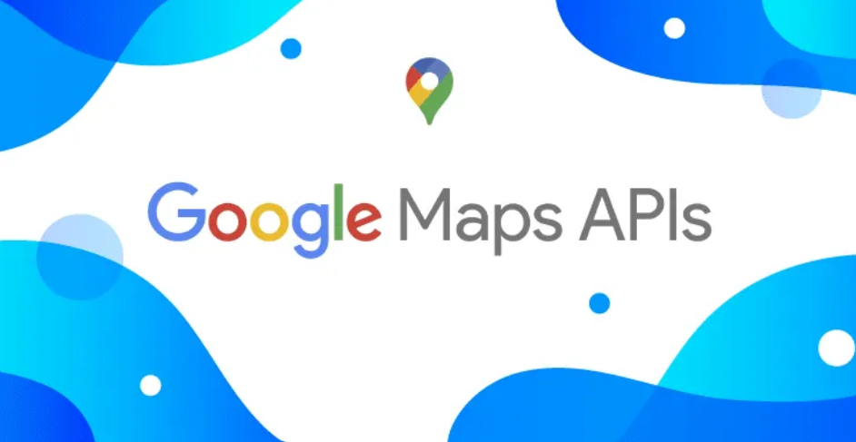

# persona-1

antokiaraa

## Investigación sobre APIs

qué es una API? significa "Application Programming Interfaces" es decir una interfaz de programación de aplicaciones que es un conjunto de reglas, protocolos y herramientas que permite que aplicaciones de software se comuniquen e interactúen entre sí. Actua como un puente estandarizado: el sistema cliente envía una solicitud con un formato específico, y el sistema servidor procesa esa solicitud y devuelve una respuesta estructurada.

### Tipos de APIs

- Hardware: Son las que conectan el software con cosas físicas. (Un ejemplo seria cuando una aplicación usa la cámara o el micrófono del celular).
- Sistema Operativo: Permiten que un programa funcione dentro de Windows, Mac o Android.
- Web: Son las que viajan a través de internet y son las más utilizadas hoy en día para conectar servicios remotos y bases de datos.

### APIs web y HTTP

La mayoría de las APIs web modernas se basan en la arquitectura "REST" (Representational State Transfer) y utilizan el protocolo estándar HTTP para la transferencia de datos.

- GET: Se utiliza exclusivamente para solicitar o recuperar información del servidor. No modifica los datos existentes.
- POST: Se usa para enviar datos nuevos al servidor para que sean procesados o almacenados.
- PUT / PATCH: Tienen la función de actualizar o modificar registros que ya existen en la base de datos del servidor.
- DELETE: Se utiliza para indicar al servidor que elimine un dato específico.

### Ejemplos de usos de APIs

- Uso de mapas en apps: Plataformas como Uber no cuentan con satélites propios de mapeo por lo que utilizan la API de Google Maps para integrar los mapas, trazar rutas y mostrar ubicaciones en tiempo real dentro de su propia interfaz.

*Fuente: [API GOOGLE MAPS](https://servinformacion.com/api-de-google-maps-que-son-y-para-que-sirven/)*

- Procesamiento de pagos en línea: Al realizar una compra en una tienda online, la web no tiene acceso directo a la cuenta bancaria del usuario asi que lo que hace es utilizar una API de un servicio financiero, como por ejemplo Webpay, para comunicarse con el banco y así validar los fondos y aprobar la transacción de manera segura.

*Fuente: [API TRANSBANK WEBPAY](https://www.transbankdevelopers.cl/)*

### Beneficios de utilizar APIs

- Permiten a los desarrolladores aprovechar funciones o servicios complejos que ya fueron creados por otras empresas. No es necesario programar un sistema desde cero si se puede integrar uno ya existente.
- Facilitan que sistemas diferentes, creados por distintas empresas y escritos en diferentes lenguajes de programación, puedan "hablar" un mismo idioma e intercambiar información sin problemas de compatibilidad.

### Bibliografía

- IBM. (s.f.). ¿Qué es una API (interfaz de programación de aplicaciones)?. <https://www.ibm.com/es-es/topics/api>
- Mozilla. (s.f.). Conceptos básicos de HTTP. MDN Web Docs. <https://developer.mozilla.org/es/docs/Web/HTTP/Overview>
- Red Hat. (s.f.). ¿Qué es una API REST?. <https://www.redhat.com/es/topics/ap>
- Amazon Web Services. (s.f.). ¿Qué es una API?. <https://aws.amazon.com/es/what-is/api/>
- Wikipedia. (s.f.). API. <https://es.wikipedia.org/wiki/API>
