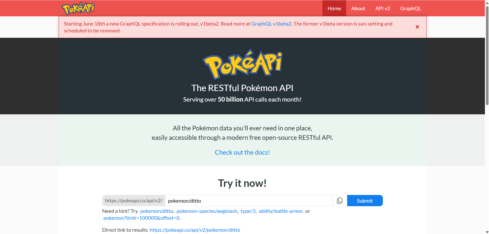

# persona-2

tomascatri

## ¿Qué es una API?

Para empezar, **API** significa *Application Programming Interface* o *Interfaz de Programación de Aplicaciones*. Se trata de un conjunto de reglas y protocolos que permiten que diferentes aplicaciones de software se comuniquen e intercambien datos entre sí.

En otras palabras, una API funciona como un intermediario o puente que permite que dos aplicaciones "conversen" y transfieran distintos tipos de información.

## Componentes de una API

Para que esta comunicación ocurra, se necesitan varios elementos:

* **Endpoint:** Es la URL a la que se envían las solicitudes.
* **Métodos HTTP:** Indican la acción que se desea realizar.
  * **GET:** Solicitar u obtener información.
  * **POST:** Enviar información para crear un nuevo registro.
  * **PUT / PATCH:** Actualizar información existente.
  * **DELETE:** Eliminar información.
* **Request (Solicitud):** Son los datos que el cliente envía al servidor. El cliente no necesariamente es una persona; puede ser otra aplicación. Los datos pueden incluir imágenes en Base64, código, archivos binarios, entre otros.
* **Response (Respuesta):** Es la información que el servidor devuelve, ya sea una respuesta exitosa o un mensaje de error en caso de que ocurra algún problema.

## Tipos de APIs

Existen tres tipos principales de APIs según su nivel de acceso:

* **APIs Públicas:** Están disponibles para cualquier persona. Como ejemplo, se puede mencionar la API de Google Maps o la API de Google Drive cuando se encuentra configurada como pública.
* **APIs Privadas:** Se utilizan exclusivamente dentro de una organización para conectar sus propios sistemas. Por ejemplo, una aplicación móvil que se comunica con bases de datos internas de una empresa.
* **APIs de Socios:** Son compartidas únicamente con socios comerciales bajo contratos o licencias específicas.

## Beneficios del uso de APIs

### Eficiencia y ahorro de tiempo

Si una aplicación necesita acceder a un sistema o conjunto de datos que ya existe, puede utilizar una API en lugar de desarrollar la funcionalidad desde cero. Por ejemplo, en nuestro proyecto utilizamos una API de Google Drive.

### Automatización

Permiten que diferentes sistemas trabajen juntos de manera automática, reduciendo la intervención manual y mejorando la productividad.

### Seguridad

Las APIs suelen utilizar claves de acceso y mecanismos de autenticación. Además, evitan que el cliente acceda directamente a la base de datos, entregando únicamente la información específica que tiene permitido consultar.

## PokéAPI

Investigando, encontré una página interesante llamada **PokéAPI**. Es una API de código abierto, por lo que cualquier persona puede comenzar a realizar peticiones a sus servicios.



Además, es una API de solo lectura, lo que significa que únicamente permite solicitudes **GET**. No es posible utilizar métodos como **POST**, **PUT** o **DELETE** para crear, modificar o eliminar información de los Pokémon.

Lo interesante de esta API es que posee una base de datos muy extensa. Se puede encontrar información sobre:

- Pokémon.
- Sprites e ilustraciones.
- Tipos de Pokémon.
- Movimientos o ataques.
- Cadenas evolutivas.
- Grupos huevo.
- Versiones de los juegos.
- Objetos e ítems.
- Bayas.

Por ejemplo, esta sería una parte de la información entregada por la API para el Pokémon **Blaziken**:

```
{
  "abilities": [
    {
      "ability": {
        "name": "blaze",
        "url": "[https://pokeapi.co/api/v2/ability/66/](https://pokeapi.co/api/v2/ability/66/)"
      },
      "is_hidden": false,
      "slot": 1
    }
  ],
  "base_experience": 239,
  "id": 257,
  "name": "blaziken",
  "weight": 520
}
```

## Bibliografía

Google Developers. (s.f.). *Google Drive API*. Recuperado el 21 de junio de 2026, de https://developers.google.com/drive

PokéAPI. (s.f.). *PokéAPI: The RESTful Pokémon API*. Recuperado el 21 de junio de 2026, de https://pokeapi.co/

IBM. (s.f.). *¿Qué es una API (interfaz de programación de aplicaciones)?*. Recuperado el 21 de junio de 2026, de https://www.ibm.com/es-es/topics/api

Red Hat. (2023). *¿Qué es una API y cómo funciona?*. Recuperado el 21 de junio de 2026, de https://www.redhat.com/es/topics/api/what-are-application-programming-interfaces

IBM. (s.f.). *¿Qué es un endpoint de API?*. Recuperado el 21 de junio de 2026, de https://www.ibm.com/es-es/topics/api-endpoint
