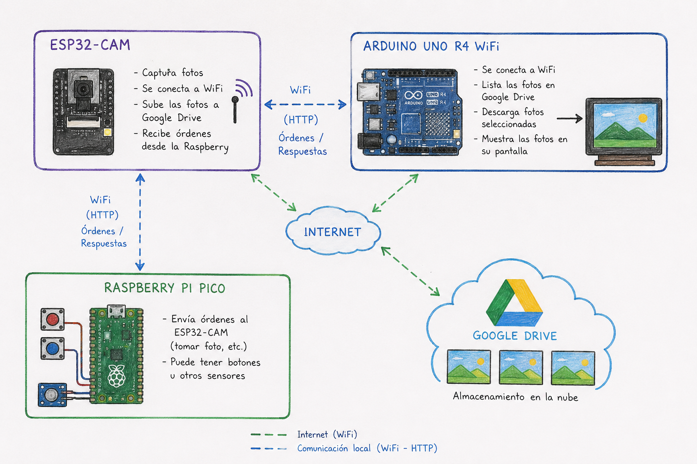

# persona-3

angel-udp

## investigación textual sobre APIs

Siglas API

Significa: Interfaz de Programación de Aplicaciones.

Es un conjunto de reglas que permite que dos programas se comuniquen, intercambien información y utilicen servicios entre ellos. Es decir, en vez de acceder directamente al código interno, se utilizan comandos, métodos o solicitudes definidos por la API.

1. Las más comunes hoy en día son las APIs web o de servicios, como: REST, GraphQL y SOAP.

Ejemplos:

Consultar el clima desde una aplicación.
Iniciar sesión con Google o Facebook.
Obtener datos financieros o deportivos.

Se utilizan enviando una petición a una dirección URL y luego recibiendo una respuesta, generalmente en formato JSON.

JSON: Formato de texto ligero diseñado para almacenar e intercambiar datos estructurados.

**Es fácil de leer y escribir para los humanos, y fácil de procesar para las máquinas**

2. APIs de bibliotecas o frameworks

Son conjuntos de funciones que los programadores utilizan dentro de un lenguaje de programación para realizar tareas específicas sin tener que programarlas desde cero.

3. APIs de sistema operativo

Funcionan como una especie de traductor entre los programas y el sistema operativo. Permiten solicitar servicios sin necesidad de conocer todos los detalles complejos del hardware.

Ejemplos:

- Mostrar una ventana.
- Leer el teclado.
- Acceder al sistema de archivos.

4. APIs de hardware

Sirven para controlar dispositivos físicos como cámaras, micrófonos, GPS o sensores. El software envía comandos al controlador del dispositivo para obtener datos o ejecutar acciones.

Ejemplos:

- Cámaras.
- Micrófonos.
- GPS.
- Sensores.

5. APIs de bases de datos

Permiten leer, escribir y modificar la información almacenada en una base de datos. El programa envía consultas y recibe resultados para trabajar con los datos.

Ejemplos:

- MySQL.
- PostgreSQL.
- MongoDB.

**Importante**

| Concepto             | Definición                                                                        |
| -------------------- | --------------------------------------------------------------------------------- |
| Endpoint             | Dirección específica donde se realiza una petición.                               |
| Solicitud (Request)  | Mensaje enviado a la API.                                                         |
| Respuesta (Response) | Información devuelta por la API.                                                  |
| Autenticación        | Mecanismo para verificar quién está usando la API (por ejemplo, claves o tokens). |
| Documentación        | Guía que explica cómo usar la API correctamente.                                  |

El flujo suele ser:

➥ Leer la documentación.

➥ Obtener credenciales si son necesarias.

➥ Enviar una solicitud con los parámetros adecuados.

➥ Recibir la respuesta.

➥ Procesar los datos en la aplicación.

---

Para el inicio del proyecto usamos un pseudocódigo que ya mostré en mi bitácora personal, donde comenzamos así:

## Pseudocódigo

Nuestra idea está inspirada en el proyecto Pixela. El objetivo es tomar una fotografía y transformarla en una imagen con estilo retro, parecida a los videojuegos antiguos hechos con píxeles.

Cuando una persona toma una foto desde una aplicación web, la imagen se envía a una Raspberry Pi. La Raspberry Pi procesa la fotografía y la convierte en una versión pixelada utilizando una paleta de colores limitada para darle una apariencia retro.

Después de procesar la imagen, esta se guarda en la nube para que pueda ser vista desde otros dispositivos. Además, la Raspberry Pi mostrará la imagen en una pantalla conectada al sistema.

También queremos utilizar un Arduino para crear una galería pública de imágenes. Cada vez que se genere una nueva fotografía pixelada, esta se agregará automáticamente a la galería. Con botones físicos, las personas podrán cambiar entre las distintas imágenes guardadas y ver tanto las más nuevas como las más antiguas.

De esta forma, el proyecto permite transformar fotografías en arte pixelado y compartirlas en una galería que se actualiza constantemente.

INICIO

Tomar foto

Enviar foto a la Raspberry Pi

La Raspberry Pi convierte la foto en pixel art

Guardar imagen

Subir imagen a la galería

Mostrar imagen en la pantalla

SI se presiona el botón siguiente Mostrar siguiente imagen FIN SI

SI se presiona el botón anterior Mostrar imagen anterior FIN SI

SI llega una nueva foto Convertirla a pixel art Agregarla a la galería FIN SI

REPETIR TODO EL TIEMPO

luego procedimos a investigar los materiales que en un principio categorizamos de esta manera:

### Lista de materiales

| Cantidad | Material                          | Función                                          |
| -------- | --------------------------------- | ------------------------------------------------ |
| 1        | Raspberry Pi Pico 2 W             | Controla la interfaz, menús y comunicación Wi-Fi |
| 1        | ESP32-CAM (con cámara OV2640)     | Captura las fotografías                          |
| 1        | Antena Wi-Fi externa IPEX         | Mejora el alcance de la conexión inalámbrica     |
| 1        | Pantalla OLED SSD1306 128×64      | Muestra menús e información de la cámara         |
| 1        | Potenciómetro de 1 kΩ             | Permite navegar por las opciones                 |
| 1        | Botón pulsador                    | Disparador de la cámara                          |
| 1        | Batería LiPo 3.7 V                | Alimentación portátil del sistema                |
| 1        | Módulo TP4056 con protección      | Carga segura de la batería                       |
| 1        | Interruptor deslizante de 3 pines | Encendido y apagado del sistema                  |
| 1        | Arduino UNO R4 WiFi               | Recibe y muestra las fotografías                 |
| 1        | Pantalla TFT LCD SPI 320×240      | Visualización de imágenes en la galería          |
| 3        | Botones pulsadores                | Navegación y generación de código QR             |
| 1        | Cable USB de alimentación         | Alimentación permanente de la galería            |
| 1        | Adaptador FTDI USB a TTL          | Programación del ESP32-CAM                       |
| 1        | Jumper de cortocircuito           | Configuración del FTDI y modo grabación          |
| 1        | Protoboard grande (o 2 medianas)  | Montaje temporal del circuito                    |
| Varios   | Cables Dupont macho-macho         | Conexiones en la protoboard                      |
| Varios   | Cables Dupont macho-hembra        | Conexiones entre módulos                         |

### Dibujo

Esta es más una ejemplificación visual de cómo funciona el proyecto.

### código de prueba con comentarios en consola simulando

Acá un ejemplo bastante funcional del pseudocódigo:

// ================================================================= // LOGICA DE COOPERACIÓN: PIXELA V7 HYBRID // =================================================================
MÓDULO RASPBERRY PI PICO 2 W (Bucle Infinito): Leer valor_potenciometro Calcular paleta_actual ("wish-gb", "ayy4", etc.) según el potenciómetro
Si paleta_actual cambió:
    Actualizar pantalla OLED mostrando Vibe y Dither actual

Si el Botón Shutter es presionado:
    Medir tiempo de presión
    
    Si el tiempo es mayor a 0.6 segundos (Pulsación Larga):
        Cambiar al siguiente algoritmo de Dither de la lista (Bayer, Floyd, Atkinson, etc.)
        Actualizar pantalla OLED con el nuevo Dither
    
    Si el tiempo es menor a 0.6 segundos (Pulsación Corta / Disparo):
        Mostrar barra de progreso en 0%
        Enviar orden por HTTP local: ESP32_IP/disparo?vibe=PALETA&dither=DITHER
        
        Si la conexión falla:
            Esperar 0.5 segundos y reintentar una segunda vez (Parche anti-errores de red)
        
        Recibir confirmación "OK" del ESP32
        
        Mientras el tiempo actual sea menor al tiempo estimado del dither elegido:
            Calcular porcentaje transcurrido
            Actualizar barra de progreso simulada en el OLED ("Subiendo...")
        
        Mostrar en OLED: "¡CAPTURADA! Guardando en SD... Subiendo a Drive..."
        Esperar 1.5 segundos y volver al menú principal
MÓDULO ESP32-CAM (Al recibir la petición "/disparo"): Encender luz de aviso (Flash parpadea 3 veces) Capturar cuadro JPEG crudo desde el sensor de la cámara
// PARCHE ASÍNCRONO LOCAL:
Enviar respuesta "200 OK" a la Pico
Cerrar físicamente la conexión TCP (Cuelga la llamada para liberar a la Pico de inmediato)

// PROCESAMIENTO EN SEGUNDO PLANO:
Asignar memoria en RAM Externa (PSRAM) para el búfer RGB888
Decodificar el JPEG crudo a formato RGB888
Liberar el sensor de la cámara

Aplicar el algoritmo de Dithering seleccionado píxel por píxel:
    Por cada fila de píxeles procesada:
        Alimentar al Watchdog (yield()) para evitar que el chip se reinicie por hardware

Re-comprimir el buffer RGB888 modificado de vuelta a formato JPEG
Liberar memoria RAM Externa (PSRAM)

Guardar el archivo JPEG final en la tarjeta MicroSD local (ej: "0001 - Pics - wish-gb - Floyd.jpg")

Bloque aislado de memoria {
    Convertir los bytes del JPEG filtrado a una cadena Base64
    Aplicar URLEncode (Proteger caracteres especiales como '+' y '=')
    Empaquetar el Payload del formulario
} // Las variables temporales masivas mueren aquí para recuperar RAM libre

Abrir conexión segura SSL tolerante hacia Google Drive (.setInsecure())
Enviar petición HTTP POST con los datos protegidos
Si Google responde con redirección (302):
    Seguir la nueva ruta y empujar los datos al almacenamiento definitivo

Terminar llamada de Google y sumar +1 al contador de fotos

### Los puntos a tener en cuenta son

El doble "disparo", porque si el Wi-Fi es lento y se vuelve a oprimir el botón, el ESP32 recibirá la petición /disparo, donde intentará asignar más RAM a otra foto y podría colapsar por falta de memoria.

O que después de accionar la Raspberry Pi falle la subida de la foto a Drive. En la pantalla se verá como "Subiendo a Drive" y se creería que se guardó en la nube, pero en realidad solo se guardó en la microSD.

---

Al pasar de las semanas fuimos completando parte del código y nos dimos cuenta de que era mejor sacar las fotos con la ESP32-CAM conectada al Arduino, y que el sistema de visualización tipo galería, manejado por botones y que recibe las imágenes editadas en la nube de Drive, era mejor implementarlo con la Raspberry Pi.

Lo que queremos expresar es este Archivo Retro completo que integramos al sistema de captura, donde implementamos materiales como:

| Componente            |
| --------------------- |
| Arduino Uno R4 WiFi   |
| ESP32-CAM             |
| Raspberry Pi Pico 2 W |

Comunicación inalámbrica, procesamiento de imágenes con efectos retro y sincronización con Google Drive. Mostrando los procesos y errores que tuvimos al momento de implementar esta idea en el proyecto, hasta lograr un sistema estable y funcional.
