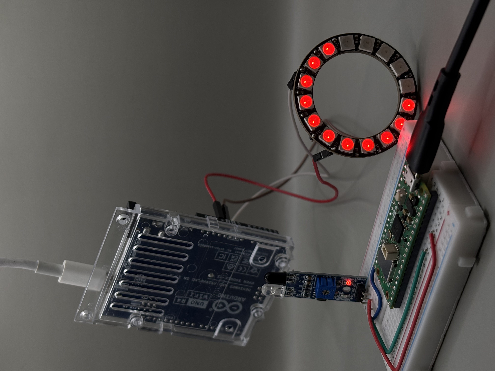

# Examen / grupo-06

Lunes 22 de junio. 

**Integrantes:**

* Sofía Cartes Aravena / <https://github.com/sofiacartes> / github e investigación
* Monserrat Paredes / <https://github.com/Monserrat-Paredes> / github e investigación
* Valentina Ruz Pizarro / <https://github.com/vxlentiinaa> / código, github e investigación

---

## Descripción del proyecto

`PUENTE DIGITAL:`

Nuestro proyecto parte desde la pregunta ¿Cuántos habitan los lugares de trabajo?, nos interesa capturar el conteo de personas que entran al lugar de trabajo en la Universidad; y visualizarlo en el otro edificio. En este caso, ver cuanta gente entra al LID en Salvador Sanfuentes y visualizarlo en Rep180. Dos edificios, dos espacios de trabajo que coexisten sin saber cuánta gente entra en cada una. En la puerta del LID se instala un Sensor Infrarrojo Evasor de Obstáculos conectado a una Raspberry PI Pico 2W, que mide el flujo de gente que entra a este espacio; esto lo denominaremos entrada. Esta información se envía de manera inalámbrica a través de wifi a una base de datos (API o Adafruit) que lleva el conteo de la gente. Finalmente, en Rep180, el sistema responde encendiendo y completando cada píxel de un Anillo LED RGB WS2812 de 16 leds conectada al Arduino UNO R4 wifi; de esta manera, las personas que están en Rep180 pueden ver mediante una señal visual qué tan rápido se va llenando el LID, esto lo denominaremos salida. El mensaje que queremos transmitir es hacer visible el ritmo con que los espacios se llenan, los momentos en que el LID se desborda; es una fluctuación constante que todos vivimos pero nadie registra.

| Entrada | Salida | Medio de visualización |
|----|----|----|
| Sensor Infrarrojo evasor de obstáculos | Anillo LED RGB WS2812 de 16 leds | Adafruit IO (medio de visualización para lectura de datos) |

---

## Pseudocódigo

```mermaid
flowchart LR

    subgraph A["MÓDULO A — Arduino UNO R4 WiFi (LID)"]
        A1[Sensor Infrarrojo]
        A2[Detectar persona]
        A3[Esperar que el sensor quede libre]
        A4[conteo = conteo + 1]
        A5{conteo > 16?}
        A6[conteo = 16]
        A7[Publicar conteo]
        
        A1 --> A2
        A2 --> A3
        A3 --> A4
        A4 --> A5
        A5 -- Sí --> A6
        A5 -- No --> A7
        A6 --> A7
    end

    subgraph IO["Adafruit IO"]
        IO1[(Feed: lid-conteo)]
    end

    subgraph B["MÓDULO B — Arduino UNO R4 WiFi (Rep180)"]
        B1[Recibir conteo]
        B2[Mapear conteo a LEDs activos]
        B3{Cantidad de LEDs}
        B4[Verde<br/>0–5 LEDs]
        B5[Amarillo<br/>6–10 LEDs]
        B6[Rojo<br/>11–16 LEDs]
        B7[Actualizar anillo WS2812]
        
        B1 --> B2
        B2 --> B3
        B3 --> B4
        B3 --> B5
        B3 --> B6
        B4 --> B7
        B5 --> B7
        B6 --> B7
    end

    A7 --> IO1
    IO1 --> B1

    classDef Mint stroke-width:1px,stroke-dasharray:none,stroke:#99F2CC,fill:#EDFFF7,color:#4C7A66;
    classDef Sunset stroke-width:1px,stroke:#FFB38A,fill:#FFF1E8,color:#8A4A2F;
    classDef YellowSoft stroke-width:1px, stroke-dasharray:none, stroke:#E6C84C, fill:#FFF8D9, color:#7A6720

    class A1,A2,A3,A4,A5,A6,A7 Mint;
    class B1,B2,B3,B4,B5,B6,B7 Sunset;
    class IO1 YellowSoft;

```




**Otro pseudocódigo hecho con Claude (aunque le cambiamos algunas cosas)**

```bash
PROYECTO: Puente Digital
EDIFICIO A → LID (Salvador Sanfuentes)
EDIFICIO B → Rep180 (oficina Aarón)

// Raspberry Pi Pico 2 W - Sensor Infrarrojo (LID)

VARIABLES:
  conteo        ← 0
  umbral        ← 16        // máximo del anillo LED
  estadoSensor  ← LIBRE

INICIALIZAR:
  conectar WiFi (SSID, PASSWORD)
  conectar Adafruit IO (usuario, clave, feed: "lid-conteo")
  configurar pin sensor infrarrojo como ENTRADA

BUCLE PRINCIPAL:
  LEER estadoSensor ← sensor infrarrojo

  SI estadoSensor == OBSTRUIDO:
    esperar hasta estadoSensor == LIBRE   // persona cruzó completamente
    conteo ← conteo + 1
    
    SI conteo > umbral:
      conteo ← umbral                    // tope máximo: 16 leds

    PUBLICAR conteo → Adafruit IO (feed: "lid-conteo")
    esperar 500ms                        // evitar lecturas duplicadas

// Arduino R4 WIFI - Anillo led (rep180)

VARIABLES:
  conteo        ← 0
  totalLeds     ← 16
  ledsActivos   ← 0

INICIALIZAR:
  conectar WiFi (SSID, PASSWORD)
  conectar Adafruit IO (usuario, clave, feed: "lid-conteo")
  configurar anillo LED WS2812 (16 leds)
  apagar todos los LEDs

BUCLE PRINCIPAL:
  SUSCRIBIR a Adafruit IO (feed: "lid-conteo")

  SI llega nuevo valor:
    conteo ← valor recibido
    ledsActivos ← MAPEAR(conteo, 0, 16, 0, totalLeds)

    PARA i DESDE 0 HASTA totalLeds - 1:
      SI i < ledsActivos:
        SI ledsActivos <= 5:
          encender LED[i] → color VERDE   // poco ocupado
        SI ledsActivos <= 10:
          encender LED[i] → color AMARILLO // ocupación media
        SI ledsActivos <= 16:
          encender LED[i] → color ROJO    // casi lleno o lleno
      SINO:
        apagar LED[i]

// ADAFRUIT IO — Canal intermedio

  Feed: "lid-conteo"
  Módulo A publica  → conteo actualizado
  Módulo B escucha  → recibe conteo y actualiza LEDs
```

---

## Bill Of Materials (lista de materiales)

|Componente|Cantidad|Precio|Link|
|---|---|---|---|
|Raspberry Pi Pico 2W|1|$14.990|<https://raspberrypi.cl/products/raspberry-pi-pico-2-w-con-headers>|
|Arduino UNO R4 WIFI|1|$38.990|<https://mcielectronics.cl/shop/product/arduino-uno-r4-minima>|
|Anillo LED RGB WS2812 de 16 leds|1|$3.990|<https://afel.cl/products/anillo-led-rgb-neopixel-16-leds-ws2812?_pos=3&_sid=3a945a998&_ss=r>|
|Sensor Infrarrojo Evasor de Obstáculos|1|$2.000|<https://afel.cl/products/sensor-infrarrojo-evasor-de-obstaculos?_pos=1&_sid=96b6bad10&_ss=r>|
|Protoboard|1|$1.500|<https://afel.cl/products/mini-protoboard-400-puntos>|
|cables|4|$1.000|<https://afel.cl/products/pack-20-cables-de-conexion-macho-macho>|

---

## Proceso

Comenzamos armando nuestro primer párrafo, que de hecho lo mandamos por discord. Luego Aarón y compañeros nos hicieron preguntas para modificar y mejorar el párrafo ya hecho.

- Grupo 6: Dos edificios que actúan al unísono, sin saberlo. Un sensor en el LID, otro  en la biblioteca, cada uno contando y midiendo presencia, traduciendo lo humano a pulsos digitales. Entre ellos, no está vacío: viaja un protocolo, una API recibe el conteo, lo procesa, lo devuelve transformado; y un actuador responde: una pantalla que se ilumina, un LED que cambia de color, una señal que dice aquí hay vida. El sistema nervioso oculto de los lugares donde pensamos, construido sobre microcontroladores, WiFi y la pregunta técnicamente precisa pero profundamente humana: ¿cuántos habitan tus pasillos ahora mismo?
- *Párrafo de prueba:* Este proyecto consiste en un sistema que conecta el LID y la biblioteca para medir cuántas personas entran y salen de cada lugar en tiempo real. En la puerta de cada edificio se instalan dos sensores infrarrojos industriales conectados a una placa Arduino con WiFi. Al colocar dos sensores en fila, el sistema detecta de forma automática la dirección de la persona: si pasa primero por el de afuera y luego por el de adentro, cuenta como una entrada; si lo hace al revés, cuenta como una salida. Esta información se envía de manera inalámbrica a través de Internet a una base de datos (API) que lleva el conteo exacto. Finalmente, el sistema responde encendiendo una pantalla o luces LED en el otro edificio; de esta forma, las personas que están en la biblioteca pueden ver mediante una señal visual qué tan lleno está el LID, y viceversa, automatizando el registro de ocupación de los espacios del campus.

Sensor Infrarrojo Evasor de Obstáculos y Anillo LED RGB WS2812 de 16 leds.

Dos edificios que actúan al unísono, sin saberlo. **¿Cuántos habitan los lugares de trabajo? ¿Cuál es el flujo durante el día?**

`Preguntas hechas por compañeros y Aarón:`

- [ ] está a medio camino entre no tener implementación técnica concreta, hablando de sensor y actuador, pero solamente mencionar presencia, pero no describir el contexto de uso, los mensajes que quieran transmitir, las velocidades que quieran usar, o la poética detrás, recomiendo nombrar el proyecto
- [ ] ¿cómo se comunica visualmente el conteo al usuario final? ¿qué significan los distintos colores del led?
- [ ] ¿qué sensor van a ocupar para detectar a un ser vivo?

Luego, el 15 de junio, comenzamos a armar nuestros códigos y definir bien las conexiones de cada componente. Además nos preocupamos de escribir todos los pasos para la conexión de ambos códigos. 

### Conexiones

**Sensor IR → Raspberry Pi Pico 2W**

|Pin del sensor|Pin de la Pico 2W|
|---|---|
|VCC|3.3V (pin 36)|
|GND|GND (cualquier pin GND)|
|OUT (señal digital)|GP15 (pin 20)|

**Anillo LED WS2812 → Arduino UNO R4 WiFi**

|Pin del anillo|Pin del Arduino|
|---|---|
|VCC (5V)|5V|
|GND|GND|
|DIN (dato)|Pin digital 6|

### Colores rgb para el anillo

- Magenta (255, 0, 255) <--
- Rojo (255, 0, 0)
- Verde (0, 255, 0) <--
- Azul (0, 0, 255)
- Cian (0, 255, 255) <--
- Rosa pastel (255, 182, 193)
- Verde Neón (57, 255, 20)
- Rosa Neón (255, 20, 147)

`Puntos importantes a considerar:`

- Adafruit IO: generar un feed llamado lid-conteo, y obtener mi AIO Username y AIO Key desde la sección "My Key" del dashboard. Reemplazar esos valores en ambos códigos junto con el SSID/contraseña de WiFi.
- Lógica del sensor: el código actual incrementa el contador cada vez que detecta un objeto (cada persona = +1) y reinicia a 0 al llegar a 16. Si quieren un conteo neto real (entradas - salidas), necesitarían dos sensores (uno detectando dirección de entrada, otro de salida) ya que un solo sensor IR no puede distinguir la dirección del movimiento.
- Colores del anillo: verde (1-5 personas), amarillo (6-10), rojo (11-16). Pueden cambiar los rangos o usar un solo color según su mensaje visual.

### Pasos para conectar todo :)

1. Conectar el anillo led al arduino

|Pin del anillo|Pin del Arduino|
|---|---|
|VCC (5V)|5V|
|GND|GND|
|INPUT (dato)|Pin digital 6|

2. Conectar el sensor infrarojo a la Raspberry PI
   
|Pin del sensor|Pin de la Pico 2W|
|---|---|
|VCC|3.3V (pin 36)|
|GND|GND (cualquier pin GND)|
|OUT (señal digital)|GP15 (pin 20)|

3. Mantener presionado el botón `BOOTSEL` de la Pico mientras lo conectamos al Mac por USB.

4. Descargar el archivo *.uf2* de `CircuitPython` para Pico 2W desde su página oficial. 
5. Arrastrar el archivo *.uf2* a la carpeta de la Raspberry desde el Finder.
6. La Pico se reiniciará y aparecerá como una nueva unidad llamada CIRCUITPY.
7. Subir el código UNA vez con Circuit python de la siguiente manera

```bash
# Ver dónde está montada
ls /Volumes/

# Copiar tu código (debe llamarse exactamente "code.py")
cp pico_sensor_entrada.py /Volumes/CIRCUITPY/code.py
```

8. Para instalar la librería adafruit_minimqtt, desde la terminal

```bash
bashcp -r adafruit_minimqtt /Volumes/CIRCUITPY/lib/
```

9. Para ver donde se ubica el usb es:

```bash
# Encuentra el puerto serie
ls /dev/tty.*

# Conéctate (ajusta el nombre del puerto)
screen /dev/tty.usbmodem* 115200
```

10. Para verificar que el archivo esté ahí:

```bash
ls /Volumes/CIRCUITPY/
```

11. Revisar los mensajes (logs) en tiempo real:

```bash
ls /dev/tty.*
```

Y luego buscar algo tipo:

```cpp
screen /dev/tty.usbmodem14201 115200
```

12. Para verificar el nombre exacto del archivo:

- Presionar Ctrl+D para recargar
- Revisa el contenido de CIRCUITPY desde otra terminal (sin cerrar screen, abre una pestaña nueva en Terminal):

```bash
ls -la /Volumes/CIRCUITPY/
ls /Volumes/CIRCUITPY/lib/
```

13. Si queremos ejecutarlo manualmente desde el REPL para ver el error exacto:

```bash
import code
```

---

### Códigos anteriores

Primero, probamos con este código que nos generó claude, para ver si el anillo led funcionaba. Y si, funcionaba, no tenía ningún led quemado :D

```cpp
// Librería necesaria (Library Manager):
// Adafruit NeoPixel

#include <Adafruit_NeoPixel.h>

#define LED_PIN   6     // Pin de datos (DIN) conectado al anillo
#define NUM_LEDS  16    // Cantidad de LEDs del anillo

Adafruit_NeoPixel ring(NUM_LEDS, LED_PIN, NEO_GRB + NEO_KHZ800);

void setup() {
  Serial.begin(115200);
  ring.begin();
  ring.setBrightness(50);  // brillo (0-255), bajarlo si calienta mucho
  ring.show();             // apaga todos los LEDs al inicio
  Serial.println("Anillo inicializado. Iniciando prueba...");
}

void loop() {
  // 1) Prueba de colores: todo el anillo en ROJO, VERDE, AZUL y BLANCO
  llenarTodo(255, 0, 0);   // Rojo
  delay(800);
  llenarTodo(0, 255, 0);   // Verde
  delay(800);
  llenarTodo(0, 0, 255);   // Azul
  delay(800);
  llenarTodo(255, 255, 255); // Blanco
  delay(800);
  apagarTodo();
  delay(500);

  // 2) Prueba LED por LED (verifica que los 16 funcionen)
  for (int i = 0; i < NUM_LEDS; i++) {
    apagarTodo();
    ring.setPixelColor(i, ring.Color(0, 150, 255)); // celeste
    ring.show();
    delay(100);
  }
  apagarTodo();
  delay(500);

  // 3) Prueba de "llenado" progresivo (como en el proyecto final)
  for (int i = 0; i <= NUM_LEDS; i++) {
    actualizarAnillo(i);
    delay(150);
  }
  delay(500);
  apagarTodo();
  delay(1000);
}

// Funciones auxiliares 

void llenarTodo(int r, int g, int b) {
  for (int i = 0; i < NUM_LEDS; i++) {
    ring.setPixelColor(i, ring.Color(r, g, b));
  }
  ring.show();
}

void apagarTodo() {
  llenarTodo(0, 0, 0);
}

// Misma lógica de colores que el proyecto final, para probarla
void actualizarAnillo(int conteo) {
  conteo = constrain(conteo, 0, NUM_LEDS);

  for (int i = 0; i < NUM_LEDS; i++) {
    if (i < conteo) {
      if (conteo <= 5) {
        ring.setPixelColor(i, ring.Color(0, 255, 0));     // verde
      } else if (conteo <= 10) {
        ring.setPixelColor(i, ring.Color(255, 255, 0));   // amarillo
      } else {
        ring.setPixelColor(i, ring.Color(255, 0, 0));     // rojo
      }
    } else {
      ring.setPixelColor(i, ring.Color(0, 0, 0));
    }
  }
  ring.show();
}
```

### Arduino

- Teníamos este código para el anillo led, donde Arduino se tardaba en leer los valores desde Adafruit IO.
  - El problema es que `mqttClient.poll()` en el loop() compite con otras tareas (reconexión WiFi, actualización del anillo, etc.), y MQTT sobre TCP tiene latencia natural. Entonces, lo que hicimos fue: reducir `keep alive`así evitamos "bloqueos" en el loop.
  - El problema principal está en las líneas 95-107: cada vuelta del loop() revisa WiFi.status() y mqttClient.connected(), lo cual añade overhead constante incluso cuando todo está bien. Es decir, vuelve a conectar cada vez que se manda un dato.

```cpp
#include <WiFiS3.h>
#include <ArduinoMqttClient.h>
#include <Adafruit_NeoPixel.h>

// CONFIGURACI=N ANILLO LED
#define LED_PIN   6
#define NUM_LEDS  16

Adafruit_NeoPixel ring(NUM_LEDS, LED_PIN, NEO_GRB + NEO_KHZ800);

// CONFIGURACION WIFI
char ssid[] = "blabla";
char pass[] = "blabla";

// CONFIGURACION ADAFRUIT IO
const char broker[]  = "io.adafruit.com";
int        port      = 1883;
const char* aio_user = "blabla";
const char* aio_key  = "blabla";

// Aqui llamamos al feed creado o se crea solo
String feedTopic = String(aio_user) + "/feeds/lid-conteo";

WiFiClient   wifiClient;
MqttClient   mqttClient(wifiClient);

// Comenzamos con el codigo, ¿que es lo que hace realmente?
// ¿cuales son sus pasos?
void setup() {
  Serial.begin(115200);

  // Inicializar anillo LED
  ring.begin();
  ring.setBrightness(50);
  ring.show(); // apagado al inicio

  // Conectar WiFi
  Serial.print("Conectando a WiFi");
  while (WiFi.begin(ssid, pass) != WL_CONNECTED) {
    Serial.print(".");
    delay(1000);
  }
  // Imprime si la conexion se realizo o no
  Serial.println();
  Serial.println("WiFi conectado");
  Serial.print("IP: ");
  Serial.println(WiFi.localIP());

  // Conectar a Adafruit IO via MQTT
  mqttClient.setUsernamePassword(aio_user, aio_key);

  Serial.print("Conectando a Adafruit IO");
  while (!mqttClient.connect(broker, port)) {
    Serial.print(".");
    delay(1000);
  }
  Serial.println();
  Serial.println("Conectado a Adafruit IO");

  // Suscribirse al feed
  // da señales de que ya esta mandando datos a adafruit
  mqttClient.subscribe(feedTopic);
  Serial.print("Suscrito a: ");
  Serial.println(feedTopic);
}

// Pasos del codigo
void loop() {
  mqttClient.poll();

// Se realiza la conexion mqtt para captar los adatos de adafruit io
  int messageSize = mqttClient.parseMessage();
  if (messageSize > 0) {
    String payload = "";
    while (mqttClient.available()) {
      payload += (char)mqttClient.read();
    }

// Al recibir los datos, los imprime como "conteo recibido"
    int conteo = payload.toInt();
    Serial.print("Conteo recibido: ");
    Serial.println(conteo);

// Si se llena el led y pasa una persona mas
// el led vuelve a cero
    actualizarAnillo(conteo);
  }

  // Reconexión si se pierde WiFi o MQTT
  if (WiFi.status() != WL_CONNECTED) {
    Serial.println("WiFi perdido, reconectando...");
    WiFi.begin(ssid, pass);
    delay(1000);
  }

  if (!mqttClient.connected()) {
    Serial.println("MQTT desconectado, reconectando...");
    if (mqttClient.connect(broker, port)) {
      mqttClient.subscribe(feedTopic);
    }
    delay(1000);
  }
}

// Enciende 'conteo' LEDs del anillo (de 0 a 16)
// Color según nivel de ocupación:
//   1-5   -> verde   (poco ocupado)
//   6-10  -> amarillo (ocupación media)
//   11-16 -> rojo    (casi lleno / lleno)

void actualizarAnillo(int conteo) {
  conteo = constrain(conteo, 0, NUM_LEDS);

// Comienza el coteo oficial, cada vez que pasa alguien se suma 1
  for (int i = 0; i < NUM_LEDS; i++) {
    if (i < conteo) {
      if (conteo <= 5) {
        ring.setPixelColor(i, ring.Color(0, 255, 0));     // verde
      } else if (conteo <= 10) {
        ring.setPixelColor(i, ring.Color(255, 255, 0));   // amarillo
      } else {
        ring.setPixelColor(i, ring.Color(255, 0, 0));     // rojo
      }
    } else {
      ring.setPixelColor(i, ring.Color(0, 0, 0));         // apagado
    }
  }
  ring.show();
}
```

`¿Qué cambió?:` Antes, cada vez que entraba al if de reconexión (línea 95-107 original), había delay(1000) que bloqueaba completamente el loop() por 1 segundo entero. Durante ese segundo, mqttClient.poll() no se llamaba, así que cualquier mensaje nuevo de Adafruit IO se acumulaba o se perdía. Ahora la revisión de conexión solo ocurre cada 5 segundos y sin delay(), dejando que mqttClient.poll() corra libremente en cada vuelta del loop

- **Debemos tener en cuenta que:** la verdadera limitación es Adafruit IO, no el código. La cuenta gratuita de Adafruit IO tiene un límite de 30 mensajes por minuto (1 cada 2 segundos aprox). Si el sensor cuenta personas más rápido que eso, los mensajes se encolan o se descartan del lado del servidor, sin importar qué tan optimizado esté el Arduino.

Este código a continuación, está bien, pero los LEDS no se prenden hasta que pasen 4 personas. Cuándo pasan estas 4 personas, se prenden los 4 leds.

```cpp
// PUENTE DIGITAL — Grupo 6 - Examen
// Lunes 22 de junio
// Recibe el conteo desde Adafruit IO (MQTT) y lo representa
// encendiendo el Anillo LED RGB WS2812 de 16 LEDs ("salida").
// Librerias necesarias:
//  - WiFiS3 (incluida con el core de UNO R4)
//  - ArduinoMqttClient
//  - Adafruit NeoPixel

#include <WiFiS3.h>
#include <ArduinoMqttClient.h>
#include <Adafruit_NeoPixel.h>

// CONFIGURACION ANILLO LED
// definir el pin digital al que va conectado
#define LED_PIN   6
#define NUM_LEDS  16

Adafruit_NeoPixel ring(NUM_LEDS, LED_PIN, NEO_GRB + NEO_KHZ800);

// CONFIGURACION WIFI
char ssid[] = "blabla";
char pass[] = "blabla";

// CONFIGURACION ADAFRUIT IO
const char broker[]  = "io.adafruit.com";
int        port      = 1883;
const char* aio_user = "blabla";
const char* aio_key  = "blabla";

// se crea el feed en Adafruit
String feedTopic = String(aio_user) + "/feeds/lid-conteo";

WiFiClient   wifiClient;
MqttClient   mqttClient(wifiClient);

// COMENZAMOS CON LOS PASOS DEL CODIGO
void setup() {
  Serial.begin(115200);

  // inicializar anillo LED
  ring.begin();
  ring.setBrightness(50);
  ring.show(); // apagado al inicio

  // conectar WiFi
  Serial.print("Conectando a WiFi");
  while (WiFi.begin(ssid, pass) != WL_CONNECTED) {
    Serial.print(".");
    delay(1000);
  }
  // se imprime en el serial monitor si esta conectado o no
  Serial.println();
  Serial.println("WiFi conectado");
  Serial.print("IP: ");
  Serial.println(WiFi.localIP());

  // conectar a Adafruit IO via MQTT
  mqttClient.setUsernamePassword(aio_user, aio_key);

  Serial.print("Conectando a Adafruit IO");
  while (!mqttClient.connect(broker, port)) {
    Serial.print(".");
    delay(1000);
  }
  Serial.println();
  Serial.println("Conectado a Adafruit IO");

  // suscribirse al feed
  // imprime si ya se conecto al feed correspondiente
  mqttClient.subscribe(feedTopic);
  Serial.print("Suscrito a: ");
  Serial.println(feedTopic);
}

// esto fue lo que se agrego para que arduino leyera
// mejor los valores de adafruit
// sirve para estabilizar la conexion wifi
unsigned long ultimaRevisionConexion = 0;
const unsigned long INTERVALO_REVISION = 5000; // revisa conexión cada 5s, no cada loop

// COMENZAMOS CON LAS FUNCIONES DEL CODIGO
void loop() {
  // mqttClient.poll() debe llamarse lo mas seguido posible,
  // sin delays que la bloqueen entremedio.
  mqttClient.poll();

  // se realiza la conexion mqtt para captar los datos de Adafruit IO
  int messageSize = mqttClient.parseMessage();
  if (messageSize > 0) {
    String payload = "";
    while (mqttClient.available()) {
      payload += (char)mqttClient.read();
    }

  // al recibir los datos, los imprime como "conteo recibido"
    int conteo = payload.toInt();
    Serial.print("Conteo recibido: ");
    Serial.println(conteo);

    actualizarAnillo(conteo);
  }

  // revisa la conexion solo cada cierto intervalo, no en cada
  // vuelta del loop -> evita overhead y delays innecesarios
  unsigned long ahora = millis();
  if (ahora - ultimaRevisionConexion >= INTERVALO_REVISION) {
    ultimaRevisionConexion = ahora;

    if (WiFi.status() != WL_CONNECTED) {
      Serial.println("WiFi perdido, reconectando...");
      WiFi.begin(ssid, pass);
    }

    if (!mqttClient.connected()) {
      Serial.println("MQTT desconectado, reconectando...");
      if (mqttClient.connect(broker, port)) {
        mqttClient.subscribe(feedTopic);
      }
    }
  }
}

// Convierte el conteo de personas (0-16) a cantidad de LEDs
// encendidos, usando dos tramos:
//   0  personas  -> 4  LEDs  (vacío, nunca apagado por completo)
//   8  personas  -> 8  LEDs  (medio lleno)
//   16 personas  -> 16 LEDs  (lleno)

int conteoALeds(int conteo) {
  conteo = constrain(conteo, 0, 16);

  if (conteo <= 8) {
    // tramo 1: 0->8 personas equivale a 4->8 LEDs
    return map(conteo, 0, 8, 4, 8);
  } else {
    // tramo 2: 8->16 personas equivale a 8->16 LEDs
    return map(conteo, 8, 16, 8, 16);
  }
}

// Enciende los LEDs correspondientes según el conteo recibido
// Color según nivel de ocupación:
//   1-5   -> verde   (poco ocupado)
//   6-10  -> amarillo (ocupación media)
//   11-16 -> rojo    (casi lleno / lleno)
// los colores pueden variar :)

void actualizarAnillo(int conteo) {
  int ledsActivos = conteoALeds(conteo);

  for (int i = 0; i < NUM_LEDS; i++) {
    if (i < ledsActivos) {
      if (ledsActivos <= 5) {
        ring.setPixelColor(i, ring.Color(0, 255, 0));     // verde
      } else if (ledsActivos <= 10) {
        ring.setPixelColor(i, ring.Color(255, 255, 0));   // amarillo
      } else {
        ring.setPixelColor(i, ring.Color(255, 0, 0));     // rojo
      }
    } else {
      ring.setPixelColor(i, ring.Color(0, 0, 0));         // apagado
    }
  }
  ring.show();
}
```

---

### Raspberry

- Por el lado de la Raspberry, la conexión fue demasiado inestable cuando la probamos en clases. Nos demoramos mucho en conectar al wifi y que mandara los datos a adafruit.
- El puerto 8883 (SSL/MQTT) estaba siendo bloqueado por la red de la universidad, por eso salía el mensaje:

```bash
Exception: ('Unable to receive 1 bytes within 10 seconds.', None)
```

 - Esto se debe a que la conexión TCP nunca se completaba, los datos se enviaba pero nunca llegaba respuesta. Según claude: "Las redes académicas (eduroam y similares) suelen tener firewalls que solo permiten tráfico saliente por puertos estándar (80, 443) y bloquean o limitan puertos no comunes como 1883/8883, especialmente para dispositivos IoT no gestionados por la universidad."
 - Por otra parte, el puerto serie quedaba "atrapado" por sesiones de screen sin cerrar:
   - El error `Resource busy` que tuvimos varias veces fue porque cada vez que abríamos `screen` y lo cerrábamos mal (cerrando la ventana de Terminal en vez de salir con (Ctrl+A + K), la sesión quedaba corriendo en background, reteniendo el puerto. Esto no es un problema de la Pico ni de WiFi, es un problema de gestión de procesos en el Mac, pero genera la sensación de "se desconectó todo".
- Y por último, `mqtt_client.reconnect()` no maneja bien fallos repetidos.
  - En el código original, si fallaba la reconexión, simplemente lo volvíamos a intentar sin límites, esto puede generar bucles donde la Pico parece "colgada" pero en realidad está reintentando sin parar contra una red que sigue bloqueando el puerto.

```cpp
# PUENTE DIGITAL — Grupo 6
# Raspberry Pi Pico 2W (CircuitPython)
# Lee el Sensor Infrarrojo Evasor de Obstáculos y publica el
# conteo de personas ("entrada") a Adafruit IO via MQTT.
# y Arduino lee los valores para luego encender el Anillo led

import time
import board # type: ignore
import digitalio # type: ignore
import wifi # type: ignore
import socketpool # type: ignore
import ssl
import adafruit_minimqtt.adafruit_minimqtt as MQTT # type: ignore

# CONFIGURACION WIFI
WIFI_SSID = "blabla"
WIFI_PASSWORD = "blabla"

# CONFIGURACION ADAFRUIT IO
ADAFRUIT_IO_USER = "blabla"
ADAFRUIT_IO_KEY  = "blabla"
FEED_ID = "lid-conteo"   # nombre del feed creado en Adafruit IO

# CONFIGURACION SENSOR INFRARROJO
# El sensor IR evasor de obstáculos entrega:
#  - HIGH (3.3V) cuando NO hay obstáculo
#  - LOW  (0V)   cuando detecta un obstáculo (persona pasando)
ir_sensor = digitalio.DigitalInOut(board.GP15)
ir_sensor.direction = digitalio.Direction.INPUT
ir_sensor.pull = digitalio.Pull.UP

# VARIABLES DE CONTEO
contador = 0
MAX_CONTEO = 16          # tope = cantidad de LEDs del anillo
estado_anterior = True   # True = sin obstáculo (reposo)

# CONEXION WIFI
print("Conectando a WiFi...")
wifi.radio.connect(WIFI_SSID, WIFI_PASSWORD)
print("WiFi conectado. IP:", wifi.radio.ipv4_address)

# CONEXION MQTT (ADAFRUIT IO)
# para mandar los valores a adafruit y que arduino los reciba
pool = socketpool.SocketPool(wifi.radio)
mqtt_client = MQTT.MQTT(
    broker="io.adafruit.com",
    port=1883,
    username=ADAFRUIT_IO_USER,
    password=ADAFRUIT_IO_KEY,
    socket_pool=pool,
    ssl_context=ssl.create_default_context(),
)

print("Conectando a Adafruit IO...")
mqtt_client.connect()
print("Conectado a Adafruit IO.")

# Se crea el feed en adafruit o lo podemos crear nosotros
feed_topic = ADAFRUIT_IO_USER + "/feeds/" + FEED_ID

# BUCLE PRINCIPAL
# viene siendo lo que hace realmente el codigo, sus pasos.
while True:
    try:
        mqtt_client.loop()

        estado_actual = ir_sensor.value

        # Detecta flanco de bajada: HIGH -> LOW = persona pasando
        if estado_anterior is True and estado_actual is False:
            contador += 1

            # Si llega al maximo, vuelve a 0 (ciclo)
            if contador > MAX_CONTEO:
                contador = 0

            print("Persona detectada -> conteo:", contador)
            mqtt_client.publish(feed_topic, contador)

            # Antirebote: evita contar la misma persona dos veces
            time.sleep(0.5)

        estado_anterior = estado_actual
        time.sleep(0.05)

        # Si hay alguna falla, se vuelve a conectar
    except (ValueError, RuntimeError) as e:
        print("Error de conexión, reintentando...", e)
        time.sleep(2)
        mqtt_client.reconnect()
```

---

### Nuevos pasos para la conexión oficial

1. Subir cada código al microcontrolador correspondiente (`Envía` a Raspberry) (`Recibe` a Arduino)
2. Cambiar claves WIFI (funciona mejor que cada microcontrolador tenga su propio wifi)
3. Y listo, dejamos que fluya!

---

## INput - Sensor Infrarrojo (código en Raspberry) / código que envía

**Recomendaciones:**

- No subir tu clave Adafruit a github, ni a ninguna parte!!
- Utilizar un wifi solo para la Raspberry
- No pasar tan lejos del sensor
- Pasar de a poquitos y lento, porque el Sensor Infrarojo le cuesta un poquito, pero se puede!!
- No te estreses con la Raspberry, a veces no se conecta a WIFI, pero solo reinicienlo y funcionará

```cpp
# PUENTE DIGITAL - Grupo 6 - Examen
# Lunes 22 de junio
# Raspberry Pi Pico 2W (CircuitPython)
# Lee el Sensor Infrarrojo Evasor de Obstaculos y publica el
# conteo de personas ("entrada") a Adafruit IO via MQTT.

import time
import board # type: ignore
import digitalio # type: ignore
import wifi # type: ignore
import socketpool # type: ignore
import ssl
import adafruit_minimqtt.adafruit_minimqtt as MQTT # type: ignore

# CONFIGURACION WIFI 
WIFI_SSID = "blabla"
WIFI_PASSWORD = "blabla"

# CONFIGURACION ADAFRUIT IO 
ADAFRUIT_IO_USER = "blabla"
ADAFRUIT_IO_KEY  = "blabla"
FEED_ID = "lid-conteo"   # nombre del feed creado en Adafruit IO

# CONFIGURACION SENSOR 
# El sensor IR evasor de obstaculos entrega:
#  - HIGH (3.3V) cuando NO hay obstaculo
#  - LOW  (0V)   cuando detecta un obstaculo (persona pasando)
ir_sensor = digitalio.DigitalInOut(board.GP15)
ir_sensor.direction = digitalio.Direction.INPUT
ir_sensor.pull = digitalio.Pull.UP

# VARIABLES DE CONTEO 
contador = 0
MAX_CONTEO = 16          # tope = cantidad de LEDs del anillo
estado_anterior = True   # True = sin obstaculo (reposo)
ANTIREBOTE = 0.2         # segundos; baja si necesitas detectar personas muy rapidas

# FUNCION DE CONEXION (sirve para reconectar)
def conectar_wifi():
    print("Conectando a WiFi...")
    intentos = 0
    while not wifi.radio.connected and intentos < 10:
        try:
            wifi.radio.connect(WIFI_SSID, WIFI_PASSWORD)
        except ConnectionError as e:
            print("Fallo WiFi, reintentando...", e)
            intentos += 1
            time.sleep(2)
    print("WiFi conectado. IP:", wifi.radio.ipv4_address)

# FUNCION DE CONEXION MQTT (adafruit io)
def conectar_mqtt(client):
    print("Conectando a Adafruit IO...")
    intentos = 0
    conectado = False
    while not conectado and intentos < 5:
        try:
            client.connect()
            conectado = True
            print("Conectado a Adafruit IO.")
        except (MQTT.MMQTTException, OSError) as e:
            intentos += 1
            print("Fallo MQTT (intento {}), reintentando...".format(intentos), e)
            time.sleep(3)
    return conectado


# CONEXION WIFI
conectar_wifi()

# CONEXION MQTT (ADAFRUIT IO)
# Puerto 1883 (sin SSL): mas compatible con redes universitarias
# que suelen bloquear el puerto 8883 (SSL/TLS) para MQTT.
pool = socketpool.SocketPool(wifi.radio)
mqtt_client = MQTT.MQTT(
    broker="io.adafruit.com",
    port=1883,
    username=ADAFRUIT_IO_USER,
    password=ADAFRUIT_IO_KEY,
    socket_pool=pool,
)

conectar_mqtt(mqtt_client)

# aqui se define el topic completo para publicar el conteo en el feed de Adafruit IO
feed_topic = ADAFRUIT_IO_USER + "/feeds/" + FEED_ID

# BUCLE PRINCIPAL / FUNCION PRINCIPAL DEL CODIGO
while True:
    try:
        mqtt_client.loop()

        estado_actual = ir_sensor.value

        # detecta flanco de bajada: HIGH -> LOW = persona pasando
        if estado_anterior is True and estado_actual is False:
            contador += 1

            # si llega al maximo, vuelve a 0 (ciclo)
            if contador > MAX_CONTEO:
                contador = 0

            print("Persona detectada -> conteo:", contador)
            mqtt_client.publish(feed_topic, contador)

            # antirebote reducido: evita contar la misma persona dos
            # veces sin perder detecciones rapidas consecutivas
            time.sleep(ANTIREBOTE)

        estado_anterior = estado_actual
        time.sleep(0.02)  # lectura mas frecuente del sensor

# si llegase a fallar la conexion MQTT, intenta reconectar sin reiniciar el dispositivo
    except (ValueError, RuntimeError, OSError, MQTT.MMQTTException) as e:
        print("Error de conexión, reintentando...", e)
        time.sleep(2)
        try:
            mqtt_client.reconnect()
        except (RuntimeError, OSError, MQTT.MMQTTException):
            # si reconnect() falla, reintenta conexion completa
            if not wifi.radio.connected:
                conectar_wifi()
            conectar_mqtt(mqtt_client)
```

---

## OUTput - Anillo LED (código en Arduino) / código que recibe

**Recomendaciones:**

- Tratar con cariño y calma el Arduino...
- Se demora en leer los valores de Adafruit, así que no se estresen!!
- Le pueden cambiar los colores

```cpp
// PUENTE DIGITAL — Grupo 6 - Examen
// Lunes 22 de junio
// Recibe el conteo desde Adafruit IO (MQTT) y lo representa
// encendiendo el Anillo LED RGB WS2812 de 16 LEDs ("salida").
// Librerias necesarias:
//  - WiFiS3 (incluida con el core de UNO R4)
//  - ArduinoMqttClient
//  - Adafruit NeoPixel

#include <WiFiS3.h>
#include <ArduinoMqttClient.h>
#include <Adafruit_NeoPixel.h>

// CONFIGURACION ANILLO LED
// definir el pin digital al que va conectado
#define LED_PIN   6
#define NUM_LEDS  16

Adafruit_NeoPixel ring(NUM_LEDS, LED_PIN, NEO_GRB + NEO_KHZ800);

// CONFIGURACION WIFI - anota tu wifi
char ssid[] = "blabla";
char pass[] = "blabla";

// CONFIGURACION ADAFRUIT IO - anota tu adafruit
const char broker[]  = "io.adafruit.com";
int        port      = 1883;
const char* aio_user = "blabla";
const char* aio_key  = "blabla";

// se crea el feed en Adafruit
String feedTopic = String(aio_user) + "/feeds/lid-conteo";

WiFiClient   wifiClient;
MqttClient   mqttClient(wifiClient);

// COMENZAMOS CON LOS PASOS DEL CODIGO
void setup() {
  Serial.begin(115200);

   // inicializar anillo LED
  ring.begin();
  ring.setBrightness(50);
  ring.show(); // apagado al inicio

  // conectar WiFi
  Serial.print("Conectando a WiFi");
  while (WiFi.begin(ssid, pass) != WL_CONNECTED) {
    Serial.print(".");
    delay(1000);
  }

  // se imprime en el serial monitor si esta conectado o no
  Serial.println();
  Serial.println("WiFi conectado");
  Serial.print("IP: ");
  Serial.println(WiFi.localIP());

  // conectar a Adafruit IO via MQTT
  mqttClient.setUsernamePassword(aio_user, aio_key);

  Serial.print("Conectando a Adafruit IO");
  while (!mqttClient.connect(broker, port)) {
    Serial.print(".");
    delay(1000);
  }
  Serial.println();
  Serial.println("Conectado a Adafruit IO");

  // suscribirse al feed
  // imprime si ya se conecto al feed correspondiente
  mqttClient.subscribe(feedTopic);
  Serial.print("Suscrito a: ");
  Serial.println(feedTopic);
}

// esto fue lo que se agrego para que arduino leyera
// mejor los valores de adafruit
// sirve para estabilizar la conexion wifi
unsigned long ultimaRevisionConexion = 0;
const unsigned long INTERVALO_REVISION = 5000; // revisa conexión cada 5s, no cada loop

// COMENZAMOS CON LAS FUNCIONES DEL CODIGO
void loop() {
  // mqttClient.poll() debe llamarse lo mas seguido posible,
  // sin delays que la bloqueen entremedio.
  mqttClient.poll();

// se realiza la conexion mqtt para captar los datos de Adafruit IO
  int messageSize = mqttClient.parseMessage();
  if (messageSize > 0) {
    String payload = "";
    while (mqttClient.available()) {
      payload += (char)mqttClient.read();
    }

    // al recibir los datos, los imprime como "conteo recibido"
    int conteo = payload.toInt();
    Serial.print("Conteo recibido: ");
    Serial.println(conteo);

    actualizarAnillo(conteo);

    // revisa si quedo otro mensaje mas encolado
    messageSize = mqttClient.parseMessage();
  }

  // revisa la conexion solo cada cierto intervalo, no en cada
  // vuelta del loop -> evita overhead y delays innecesarios
  unsigned long ahora = millis();
  if (ahora - ultimaRevisionConexion >= INTERVALO_REVISION) {
    ultimaRevisionConexion = ahora;

    if (WiFi.status() != WL_CONNECTED) {
      Serial.println("WiFi perdido, reconectando...");
      WiFi.begin(ssid, pass);
    }

    if (!mqttClient.connected()) {
      Serial.println("MQTT desconectado, reconectando...");
      if (mqttClient.connect(broker, port)) {
        mqttClient.subscribe(feedTopic);
      }
    }
  }
}

// Enciende los LEDs correspondientes según el conteo recibido
// Relacion directa: 1 persona = 1 LED encendido
//   1 persona  -> LED 1 encendido
//   2 personas -> LEDs 1 y 2 encendidos
//   ...
//   16 personas -> los 16 LEDs encendidos (anillo lleno)
// Color segun nivel de ocupacion:
//   1-5   -> verde   (poco ocupado)
//   6-10  -> amarillo (ocupación media)
//   11-16 -> rojo    (casi lleno / lleno)
void actualizarAnillo(int conteo) {
  int ledsActivos = constrain(conteo, 0, NUM_LEDS);

  for (int i = 0; i < NUM_LEDS; i++) {
    if (i < ledsActivos) {
      if (ledsActivos <= 5) {
        ring.setPixelColor(i, ring.Color(0, 255, 0));     // verde
      } else if (ledsActivos <= 10) {
        ring.setPixelColor(i, ring.Color(255, 255, 0));   // amarillo
      } else {
        ring.setPixelColor(i, ring.Color(255, 0, 0));     // rojo
      }
    } else {
      ring.setPixelColor(i, ring.Color(0, 0, 0));         // apagado
    }
  }
  ring.show();
}
```

---

## Demostraciones en vivo 

 



| LID (casa sofi) | Rep180 (casa vale) |
|-----------------|--------------------|
|  |  |

---

### Bibliografía

- <https://afel.cl/>
- <https://www.adafruit.com/>
- <https://www.arduino.cc/>
- <https://mcielectronics.cl/>
- <https://www.raspberrypi.com/>
