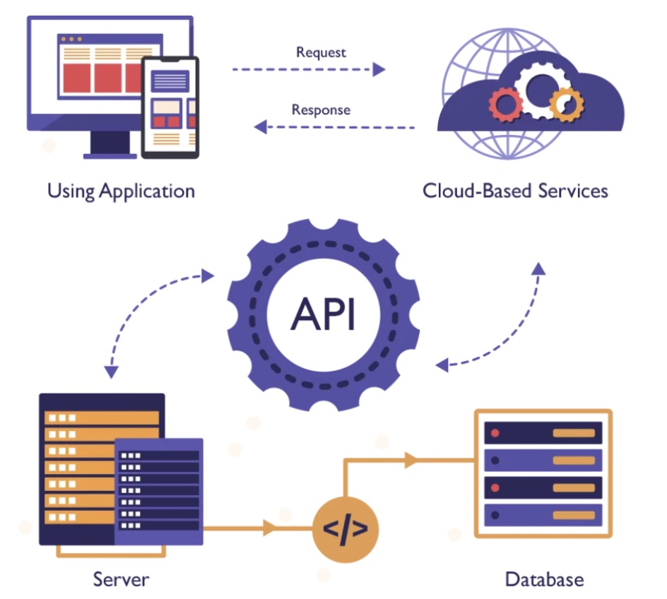

# persona-1

sofiacartes / <https://github.com/sofiacartes>

## Investigación sobre APIs

¿Qué son las APIs?

Las APIs son herramientas que permiten que diferentes aplicaciones o programas se
comuniquen entre sí. Funcionan como un puente para compartir información y usar funciones
de otro sistema sin tener que entender cómo está hecho por dentro. Gracias a esto, los
desarrolladores pueden crear aplicaciones más rápido, reutilizar herramientas ya
existentes y hacer que distintos sistemas trabajen juntos de forma más fácil.

Imagen de: <https://itsqmet.edu.ec/api/>

### Tipos de APIs

- API web: Una API Web es una herramienta que permite que dos aplicaciones intercambien
información por Internet de forma rápida y automática.
- REST: Permite que los sistemas intercambien información de manera simple y rápida,
generalmente utilizando HTTP y formato JSON.
- SOAP: Es un protocolo más estructurado y estricto para intercambiar información entre
- sistemas. Utiliza XML y suele emplearse en servicios empresariales donde se requiere
mayor seguridad y control.

¿Cómo funcionan las APIs?

Funcionan como un puente que permite que diferentes aplicaciones se comuniquen entre sí.
Cuando una aplicación necesita información o una función de otra, envía una solicitud a
través de la API. Luego, la API procesa esa solicitud y devuelve una respuesta con los
datos necesarios. Para intercambiar información, las APIs utilizan formatos estándar como JSON o XML. Además, pueden incluir medidas de seguridad para controlar quién puede acceder a los datos.

Gracias a las APIs, es posible reutilizar funciones ya existentes, integrar diferentes
servicios y desarrollar aplicaciones de manera más rápida, flexible y escalable.

### Protocolos más comunes

- `HTTP` Hypertext Transfer Protocol
- `REST` Representational State Transfer
- `JSON-RPC` Remote Procedure Call
- `SOAP` Simple Object Access Protocol
- `GraphQL` Graph Query Language

¿Porqué son importantes las APIs?

Permiten integrar distintas aplicaciones de forma sencilla, facilitando que compartan
información y trabajen juntas. Además, ayudan a reutilizar funciones y servicios ya
existentes, lo que reduce el tiempo y esfuerzo de desarrollo

#### Bibliografía

- <https://immune.institute/blog/que-es-la-api/>
- <https://itsqmet.edu.ec/api/>
