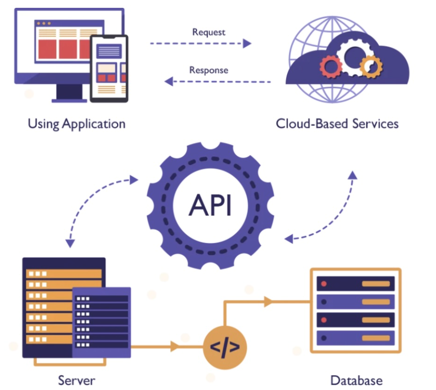

# persona-3

Valentina Ruz Pizarro / <https://github.com/vxlentiinaa>

---

## API

- Una API (Application Programming Interface o Interfaz de Programación de Aplicaciones) es un conjunto de reglas y protocolos que permite que diferentes aplicaciones de software se comuniquen y compartan información entre sí.
  - <https://openweathermap.org/api>
  - <https://www.ibm.com/es-es/think/topics/api>
  - weird apis for the arts

---

**¿Qué es una API?**

`API:` *Application Programming Interface*

imagen sacada de: <https://itsqmet.edu.ec/api/>

Una API, o interfaz de programación de aplicaciones, es un conjunto de reglas o protocolos que permite a las aplicaciones informáticas comunicarse entre sí para intercambiar datos, características y funcionalidades.

Las API simplifican y aceleran el desarrollo de aplicaciones y software permitiendo a los desarrolladores integrar datos, servicios y capacidades de otras aplicaciones, en vez de hacerlas desde cero.

Las API permiten compartir solo la información necesaria, manteniendo ocultos otros detalles internos del sistema, lo que ayuda a la seguridad del sistema. Los servidores o dispositivos no tienen que exponer completamente los datos: las API permiten compartir pequeños paquetes de datos, relevantes para la solicitud específica.

A diferencia de una interfaz de usuario (UX), que conecta a una persona con un computador, una *API* conecta a dos softwares o partes de un software. 

---

**¿Para qué sirve una API?**

Las APIs sirven para establecer un punto de conexión o interacción entre dos sistemas software. Sin ellas, no sería posible la conexión entre redes sociales, plataformas online, sistemas operativos o bases de datos.

El uso que se le dé dependerá de los permisos otorgados por el propietario de la API. La forma en la que una de las partes envía la solicitud de respuesta determinará cómo responderá el software de la otra parte.

En función del tipo de API, el funcionamiento de esta cambiará. Sin embargo, de forma general, podemos decir que una API actúa como mensajero mandando una solicitud a un servidor, traduciendo el mensaje y entregando la respuesta al usuario

---

**¿Cómo funciona una API?**

La API es el puente que establece la conexión entre ellos.

`Ejemplo:` El procesamiento de pagos a terceros. Cuando alguien compra por internet, a veces te piden "pague con Paypal" u otro tipo de sistema. Bueno, esta función depende de las API para realizar el pago o la conexión.

Si bien la transferencia de datos es según el servicio web utilizado, las solicitudes y respuestas se realizan a través de una API. No hay visibilidad en la interfaz de usuario, lo que significa que las API intercambian datos dentro del ordenador o la aplicación, y aparecen ante el usuario como una conexión sin fisuras.

imagen sacada de: <https://outvio.com/es/blog/que-es-una-api/>

Entonces, las APIs actúan como intermediarios que permiten la comunicación y la integración entre diferentes aplicaciones.

**Funcionamiento**

1. `Definición de funciones y métodos:` las APIs proporcionan una interfaz clara y definida que expone funciones y métodos específicos que pueden ser utilizados por otras aplicaciones.
2. `Solicitud y respuesta:` una aplicación hace una solicitud a través de la API indicando qué función o recurso necesita acceder. La API procesa la solicitud y devuelve una respuesta con la información o los resultados solicitados.
3. `Transferencia de datos:` las APIs transfieren datos entre aplicaciones utilizando formatos estandarizados como JSON o XML. Estos datos pueden ser enviados en tiempo real o de forma asíncrona, dependiendo de la naturaleza de la API y la aplicación.
4. `Seguridad y autenticación:` la interfaces pueden implementar medidas de seguridad, como autenticación y autorización, para controlar el acceso a los recursos y proteger la información sensible.
5. `Documentación y versionado:` las APIs suelen estar documentadas para que los desarrolladores comprendan cómo utilizarlas correctamente. Además, pueden tener diferentes versiones para garantizar la retrocompatibilidad y permitir la evolución de las aplicaciones sin romper la funcionalidad existente.
6. `Reutilización y escalabilidad:` fomentan la reutilización de código y la modularidad en el desarrollo de software. Las aplicaciones pueden utilizar múltiples APIs para acceder a diferentes servicios y funcionalidades, lo que facilita la creación de sistemas escalables y flexibles.

---

**Tipos de APIs**

- [ ] ***HTTP*** (Hypertext Transfer Protocol): es el protocolo de capa de aplicación fundamental utilizado para transmitir documentos hipermedia como HTML
- [ ] ***REST*** (Representational State Transfer): es un estilo arquitectónico para diseñar aplicaciones en red. Se basa en un modelo de comunicación cliente-servidor sin estado, donde los servicios web se consideran recursos que se pueden crear, leer, actualizar o eliminar utilizando métodos HTTP estándar.
- [ ] ***JSON-RPC*** (Remote Procedure Call): un protocolo de llamada a procedimiento remoto (RPC) ligero y sin estado, codificado en JSON, que permite a las aplicaciones ejecutar funciones en un servidor remoto como si fueran locales.
- [ ] ***SOAP*** (Simple Object Access Protocol): es un protocolo de mensajería altamente estandarizado para intercambiar información estructurada entre aplicaciones a través de una red.
- [ ] ***GraphQL*** (Graph Query Language): es un lenguaje de consulta de datos de código abierto y un entorno de ejecución del lado del servidor diseñado para API. A diferencia de los lenguajes de bases de datos tradicionales como SQL, GraphQL no interactúa directamente con un motor de almacenamiento; en cambio, actúa como una capa intermedia entre los clientes front-end y los servicios back-end.

**Categorías de las APIs**

Según el nivel de acceso que permitan, podemos diferenciar entre:

- [ ] API privada: es utilizada de forma interna
- [ ] API para partners: accesible solamente para desarrolladores externos autorizados
- [ ] API pública: es aquella creada para ser utilizada por cualquier desarrollador

Según la localización de ambos sistemas, pueden ser:

- [ ] APIs locales: para aplicaciones que se comunican dentro de un mismo ecosistema 
- [ ] APIs remotas: para aquellas conexiones que se realizan desde un sistema en un punto diferente

---

### Bibliografía

- <https://immune.institute/blog/que-es-la-api/>
- <https://outvio.com/es/blog/que-es-una-api/>
- <https://www.sensedia.com.es/pillar/tipos-de-apis>
- <https://itsqmet.edu.ec/api/>
