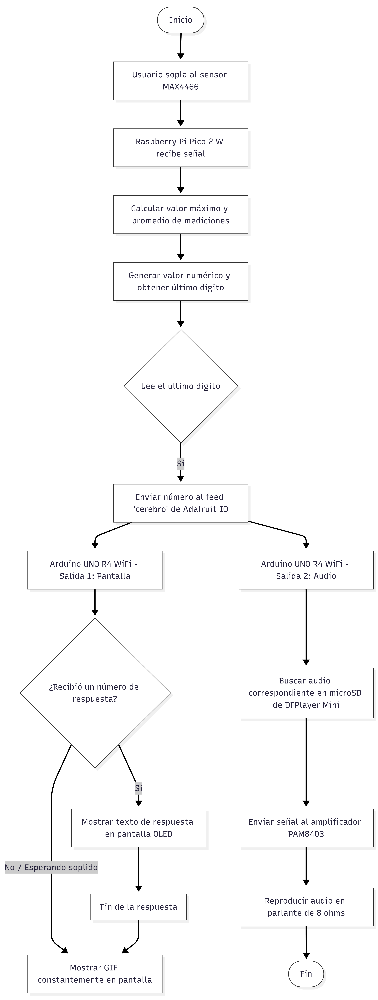

# grupo-9

* agustinaaceituno
* benjaminalvarez21
* Anaysval
* AntFuentealba

---

## ORÁCULO, CROACARDO EL SABIO


### Descripción conceptual

El Oráculo es una experiencia interactiva y compartida, donde una misma pregunta es realizada en voz alta desde distintos lugares. Para esto, dos participantes deben ponerse de acuerdo previamente y formularla de manera simultánea.

La propuesta se plantea como una reinterpretación de los oráculos tradicionales, que suelen entregar respuestas abiertas que cada quien interpreta a su manera. En este caso, esa lógica se aborda desde una perspectiva más ligera y paródica, generando mensajes ambiguos, irónicos o graciosos.

Luego, mediante la intervención de una tercera persona —representación de Croacardo el Sabio — se activa la consulta a través de un soplido, dando inicio al proceso de respuesta. Esta respuesta se entrega tanto en formato de audio como mediante texto en una pantalla OLED, donde además se visualiza al Sabio saltando.

Durante la experiencia, el sistema incorpora mensajes que orientan el uso. Al inicio, una frase de bienvenida —“Di tu pregunta y sopla, el Sabio te responderá”— Posteriormente, tras la primera interacción, un segundo mensaje —“Alakasim, Alakasom, otra preguntita por favor”— indicando que ya es posible realizar una nueva pregunta. 

### Descripción técnica 

Todo comienza con una Raspberry Pi Pico 2 W conectada a un sensor de sonido MAX4466. Cuando una persona sopla hacia el sensor, la señal capturada es procesada calculando tanto el valor máximo como el promedio de las mediciones obtenidas durante el soplido. A partir de estos datos se genera un valor numérico y se obtiene su último dígito, resultando en un número entre 0 y 9.

Este número es enviado a un feed de Adafruit IO llamado “cerebro”, que actúa como punto de comunicación entre los distintos dispositivos del sistema.

Por otro lado, el proyecto cuenta con dos placas Arduino UNO R4 WiFi que funcionan como dispositivos de salida. Una de ellas está conectada a una pantalla OLED, mientras que la otra está conectada a un DFPlayer Mini con una tarjeta microSD que contiene los audios de respuesta. El DFPlayer se encuentra conectado a un amplificador PAM8403 y a un parlante de 8 ohms para reproducir el sonido.

Ambas placas Arduino reciben el número publicado en el feed “cerebro” y generan una respuesta correspondiente a ese valor. La diferencia es que una de ellas presenta la respuesta de manera visual mediante texto en la pantalla OLED, mientras que la otra la reproduce en formato de audio a través del parlante. De esta forma, el Sabio responde simultáneamente mediante texto y voz.

### Primeros acercamientos

Al inicio, nuestra idea era utilizar dos placas Arduino UNO R4 WiFi. La primera estaría conectada al sensor de sonido y al DFPlayer, mientras que la segunda tendría una pantalla OLED y dos LEDs indicadores. Estos LEDs mostrarían cuándo una señal era recibida y cuándo era enviada de vuelta. En este diseño, el primer Arduino detectaría el sonido y enviaría la información al segundo Arduino, que actuaría como un "cerebro" encargado de procesar la señal y devolver una respuesta a la placa principal para reproducir el audio correspondiente.

Queríamos que la activación se realizará mediante un aplauso o un chasquido de dedos. Sin embargo, tras numerosas pruebas descubrimos que estos sonidos eran demasiado breves y el sensor no lograba detectarlos de manera correcta. Debido a esto, decidimos reemplazarlos por un soplido, ya que generaba una señal más estable y fácil de capturar.

Durante el desarrollo nos dimos cuenta de que el Arduino que actuaba como cerebro no aportaba una función realmente necesaria al sistema. Conversando con Mateo, llegamos a dos posibles soluciones.

La primera consistía en mantener dos Arduino UNO R4 WiFi: uno conectado al sensor de sonido y otro conectado tanto a la pantalla OLED como al DFPlayer. De esta forma, una persona realizaría la pregunta y soplaría al sensor, mientras que el segundo Arduino recibiría la información y entregaría la respuesta mediante texto en la pantalla y audio por el parlante.

La segunda propuesta era más ambiciosa y consistía en utilizar tres placas: una Raspberry Pi Pico 2 W conectada al sensor de sonido, un Arduino UNO R4 WiFi conectado al DFPlayer y otro Arduino UNO R4 WiFi conectado a la pantalla OLED. Esta configuración permitía una interacción más compleja, donde dos personas podían formular una misma pregunta mientras una tercera asumía el rol del Oráculo y activaba el sistema soplando al sensor.

Finalmente decidimos asumir el desafío y optar por la segunda alternativa, ya que nos parecía una propuesta más interesante y nos permitía explorar una comunicación distribuida entre tres dispositivos conectados a través de la red.

## Conexiones

### Arduino UNO R4 WiFi ↔ Pantalla OLED

| Arduino UNO R4 WiFi | Pantalla OLED |
|---------------------|---------------|
| 5V                  | VCC           |
| GND                 | GND           |
| SCL                 | SCL           |
| SDA                 | SDA           |

### Raspberry Pi Pico 2 W ↔ Sensor MAX4466

| Raspberry Pi Pico 2 W | Sensor MAX4466 |
|-----------------------|----------------|
| 3V3                   | VCC            |
| GND                   | GND            |
| ADC0                  | OUT            |

### Arduino UNO R4 WiFi ↔ DFPlayer Mini

| Arduino UNO R4 WiFi | DFPlayer Mini |
|---------------------|---------------|
| TX                  | RX            |
| RX                  | TX            |
| A4                  | IO1           |

### DFPlayer Mini ↔ Amplificador PAM8403

| DFPlayer Mini | Amplificador PAM8403 |
|---------------|----------------------|
| SPK2          | R_IN                 |
| SPK1          | L_IN                 |

### Amplificador PAM8403 ↔ Parlante

| Amplificador PAM8403 | Parlante |
|----------------------|----------|
| OUT+                 | +        |
| OUT-                 | -        |

## Códigos

### Código Raspberry Pi Pico 2 W + Sensor de Sonido MAX4466

```python
import time
import wifi
import socketpool
import ssl
import analogio
import board

import adafruit_minimqtt.adafruit_minimqtt as MQTT

# ==========================
# WIFI
# ==========================

SSID = "bla"
PASSWORD = "bla"

# ==========================
# ADAFRUIT IO
# ==========================

AIO_USERNAME = "bla"
AIO_KEY = "bla"

FEED_CEREBRO = f"{AIO_USERNAME}/feeds/cerebro"

# ==========================
# MICROFONO MAX4466
# ==========================

mic = analogio.AnalogIn(board.GP26)

UMBRAL = 40000

# ==========================
# WIFI
# ==========================

print("Conectando WiFi...")

wifi.radio.connect(SSID, PASSWORD)

print("WiFi OK")
print("IP:", wifi.radio.ipv4_address)

# ==========================
# MQTT
# ==========================

pool = socketpool.SocketPool(wifi.radio)

mqtt = MQTT.MQTT(
   broker="io.adafruit.com",
   username=AIO_USERNAME,
   password=AIO_KEY,
   socket_pool=pool,
   ssl_context=ssl.create_default_context()
)

print("Conectando MQTT...")

mqtt.connect()

print("Conectado a Adafruit IO")
print("Esperando soplidos...")

# ==========================
# LOOP
# ==========================

while True:

   lectura = mic.value

   if lectura > UMBRAL:

       maximo = lectura
       suma = 0
       cantidad = 0

       inicio = time.monotonic()

       # Captura durante 150 ms
       while (time.monotonic() - inicio) < 0.15:

           muestra = mic.value

           suma += muestra
           cantidad += 1

           if muestra > maximo:
               maximo = muestra

       promedio = suma // cantidad

       ultimo_digito = (maximo + promedio) % 10

       print("----------------")
       print("Maximo:", maximo)
       print("Promedio:", promedio)
       print("Ultimo digito:", ultimo_digito)

       mqtt.publish(FEED_CEREBRO, str(ultimo_digito))

       print("Enviado a feed cerebro")

       # Evita múltiples detecciones
       time.sleep(5)

   time.sleep(0.01)
```

### Código Arduino UNO R4 WiFi + pantalla OLED

```cpp
#include <Wire.h>
#include <Adafruit_GFX.h>
#include <Adafruit_SSD1306.h>
#include "AdafruitIO_WiFi.h"


#define WIFI_SSID    "XXX"
#define WIFI_PASS    "XXX"
#define IO_USERNAME  "benjaminalvarez21"
#define IO_KEY       "XXX"


#define SCREEN_WIDTH   128
#define SCREEN_HEIGHT  64
#define SCREEN_ADDRESS 0x3C


Adafruit_SSD1306 display(SCREEN_WIDTH, SCREEN_HEIGHT, &Wire, -1);
AdafruitIO_WiFi io(IO_USERNAME, IO_KEY, WIFI_SSID, WIFI_PASS);


AdafruitIO_Feed *cerebro = io.feed("cerebro");


const char* respuestas[11] = {
 "",
 "La respuesta existe, pero esta ocupada",
 "No insista, siguiente pregunta",
 "No se, pero seria chistoso",
 "El sabio esta comiendo, vuelve pronto",
 "Jijiji",
 "Si se, pero no te voy a decir",
 "Cuestionable",
 "No puedo hablar, solo whatsapp",
 "Complicadito",
 "MIAU",
};


const unsigned char epd_bitmap_frames_01[] PROGMEM = {
0xff, 0xff, 0xff, 0xff, 0xff, 0xff, 0xff, 0xff, 0xff, 0xff, 0xff, 0xff, 0xff, 0xff, 0xff, 0xff,
0xff, 0xff, 0xff, 0xff, 0xff, 0xff, 0xff, 0xff, 0xff, 0xff, 0xff, 0xff, 0xff, 0xff, 0xff, 0xff,
0xff, 0xff, 0xff, 0xff, 0xff, 0xff, 0xff, 0xff, 0xff, 0xff, 0xff, 0xff, 0xff, 0xff, 0xff, 0xff,
0xff, 0xff, 0xff, 0xff, 0xff, 0xff, 0xff, 0xff, 0xff, 0xff, 0xff, 0xff, 0xff, 0xff, 0xff, 0xff,
0xff, 0xff, 0xff, 0xff, 0xff, 0xff, 0xff, 0xff, 0xff, 0xff, 0xff, 0xff, 0xff, 0xff, 0xff, 0xff,
0xff, 0xff, 0xff, 0xff, 0xff, 0xff, 0xff, 0xff, 0xff, 0xff, 0xff, 0xff, 0xff, 0xff, 0xff, 0xff,
0xff, 0xff, 0xff, 0xff, 0xff, 0xff, 0xff, 0xff, 0xff, 0xff, 0xff, 0xff, 0xff, 0xff, 0xff, 0xff,
0xff, 0xff, 0xff, 0xff, 0xff, 0xff, 0xff, 0xff, 0xff, 0xff, 0xff, 0xff, 0xff, 0xff, 0xff, 0xff,
0xff, 0xff, 0xff, 0xff, 0xff, 0xff, 0xff, 0xff, 0xff, 0xff, 0xff, 0xff, 0xff, 0xff, 0xff, 0xff,
0xff, 0xff, 0xff, 0xff, 0xff, 0xff, 0xff, 0xff, 0xff, 0xff, 0xff, 0xff, 0xff, 0xff, 0xff, 0xff,
0xff, 0xff, 0xff, 0xff, 0xff, 0xff, 0xff, 0xff, 0xff, 0xff, 0xff, 0xff, 0xff, 0xff, 0xff, 0xff,
0xff, 0xff, 0xff, 0xff, 0xff, 0xff, 0xff, 0xff, 0xff, 0xff, 0xff, 0xff, 0xff, 0xff, 0xff, 0xff,
0xff, 0xff, 0xff, 0xff, 0xff, 0xff, 0xff, 0xff, 0xff, 0xff, 0xff, 0xff, 0xff, 0xff, 0xff, 0xff,
0xff, 0xff, 0xff, 0xff, 0xff, 0xff, 0xff, 0xff, 0xff, 0xff, 0xff, 0xff, 0xff, 0xff, 0xff, 0xff,
0xff, 0xff, 0xff, 0xff, 0xff, 0xff, 0xff, 0xff, 0xff, 0xff, 0xff, 0xff, 0xff, 0xff, 0xff, 0xff,
0xff, 0xff, 0xff, 0xff, 0xff, 0xff, 0xff, 0xff, 0xff, 0xff, 0xff, 0xff, 0xff, 0xff, 0xff, 0xff,
0xff, 0xff, 0xff, 0xff, 0xff, 0xff, 0xff, 0xff, 0xff, 0xff, 0xff, 0xff, 0xff, 0xff, 0xff, 0xff,
0xff, 0xff, 0xff, 0xff, 0xff, 0xff, 0xff, 0xff, 0xff, 0xff, 0xff, 0xff, 0xff, 0xff, 0xff, 0xff,
0xff, 0xff, 0xff, 0xff, 0xff, 0xff, 0xf1, 0xff, 0xff, 0xff, 0xff, 0xff, 0xff, 0xff, 0xff, 0xff,
0xff, 0xff, 0xff, 0xff, 0xff, 0xff, 0xff, 0xff, 0xff, 0xff, 0xff, 0xff, 0xff, 0xff, 0xff, 0xff,
0xff, 0xff, 0xff, 0xff, 0xff, 0xff, 0xff, 0xff, 0xf9, 0x3f, 0xff, 0xff, 0xff, 0xff, 0xff, 0xff,
0xff, 0xff, 0xff, 0xff, 0xff, 0xff, 0xc6, 0x7f, 0xf7, 0x9f, 0xff, 0xff, 0xff, 0xff, 0xff, 0xff,
0xff, 0xff, 0xff, 0xff, 0xff, 0xff, 0xc4, 0x7f, 0xcf, 0xcf, 0xff, 0xff, 0xff, 0xff, 0xff, 0xff,
0xff, 0xff, 0xff, 0xff, 0xff, 0xff, 0xff, 0xff, 0xbe, 0x07, 0xff, 0xff, 0xff, 0xff, 0xff, 0xff,
0xff, 0xff, 0xff, 0xff, 0xff, 0xff, 0xe4, 0xff, 0x7c, 0xff, 0xff, 0xff, 0xff, 0xff, 0xff, 0xff,
0xff, 0xff, 0xff, 0xff, 0xff, 0xff, 0xe4, 0xff, 0xfe, 0xff, 0xff, 0xff, 0xff, 0xff, 0xff, 0xff,
0xff, 0xff, 0xff, 0xff, 0xff, 0xff, 0xf1, 0xfe, 0x78, 0xff, 0xff, 0xff, 0xff, 0xff, 0xff, 0xff,
0xff, 0xff, 0xff, 0xff, 0xff, 0xff, 0xf5, 0xfd, 0xfc, 0xff, 0xff, 0xff, 0xff, 0xff, 0xff, 0xff,
0xff, 0xff, 0xff, 0xff, 0xff, 0xff, 0xf1, 0xfd, 0x70, 0x7f, 0xff, 0xff, 0xff, 0xff, 0xff, 0xff,
0xff, 0xff, 0xff, 0xff, 0xff, 0xff, 0xf3, 0xf8, 0x70, 0x7f, 0xff, 0xff, 0xff, 0xff, 0xff, 0xff,
0xff, 0xff, 0xff, 0xff, 0xff, 0xff, 0xfb, 0xe0, 0x5c, 0x7f, 0xff, 0xff, 0xff, 0xff, 0xff, 0xff,
0xff, 0xff, 0xff, 0xff, 0xff, 0xff, 0xfb, 0x07, 0x0e, 0x07, 0xff, 0xff, 0xff, 0xff, 0xff, 0xff,
0xff, 0xff, 0xff, 0xff, 0xff, 0xff, 0xfb, 0x01, 0xf8, 0x03, 0xff, 0xff, 0xff, 0xff, 0xff, 0xff,
0xff, 0xff, 0xff, 0xff, 0xff, 0xff, 0xfb, 0xc9, 0xf1, 0x0f, 0xff, 0xff, 0xff, 0xff, 0xff, 0xff,
0xff, 0xff, 0xff, 0xff, 0xff, 0xff, 0xfb, 0xf9, 0xf1, 0xbf, 0xff, 0xff, 0xff, 0xff, 0xff, 0xff,
0xff, 0xff, 0xff, 0xff, 0xff, 0xff, 0xfb, 0xdf, 0xff, 0xbf, 0xff, 0xff, 0xff, 0xff, 0xff, 0xff,
0xff, 0xff, 0xff, 0xff, 0xff, 0xff, 0xf1, 0xee, 0x07, 0x3f, 0xff, 0xff, 0xff, 0xff, 0xff, 0xff,
0xff, 0xff, 0xff, 0xff, 0xff, 0xff, 0xf0, 0xcf, 0xff, 0x3f, 0xff, 0xff, 0xff, 0xff, 0xff, 0xff,
0xff, 0xff, 0xff, 0xff, 0xff, 0xff, 0xf1, 0x87, 0xfe, 0x3f, 0xff, 0xff, 0xff, 0xff, 0xff, 0xff,
0xff, 0xff, 0xff, 0xff, 0xff, 0xff, 0xf1, 0x29, 0xf1, 0x1f, 0xff, 0xff, 0xff, 0xff, 0xff, 0xff,
0xff, 0xff, 0xff, 0xff, 0xff, 0xff, 0xf1, 0xf2, 0x4e, 0xdf, 0xff, 0xff, 0xff, 0xff, 0xff, 0xff,
0xff, 0xff, 0xff, 0xff, 0xff, 0xff, 0xf8, 0xdc, 0x31, 0xef, 0xff, 0xff, 0xff, 0xff, 0xff, 0xff,
0xff, 0xff, 0xff, 0xff, 0xff, 0xff, 0xf8, 0xde, 0x0f, 0xe7, 0xff, 0xff, 0xff, 0xff, 0xff, 0xff,
0xff, 0xff, 0xff, 0xff, 0xff, 0xff, 0xf0, 0x1c, 0x0f, 0xf7, 0xff, 0xff, 0xff, 0xff, 0xff, 0xff,
0xff, 0xff, 0xff, 0xff, 0xff, 0xff, 0xf8, 0x3c, 0x8f, 0xf3, 0xff, 0xff, 0xff, 0xff, 0xff, 0xff,
0xff, 0xff, 0xff, 0xff, 0xff, 0xff, 0xf8, 0x3e, 0x3f, 0x73, 0xff, 0xff, 0xff, 0xff, 0xff, 0xff,
0xff, 0xff, 0xff, 0xff, 0xff, 0xff, 0xfb, 0xbf, 0x3e, 0x63, 0xff, 0xff, 0xff, 0xff, 0xff, 0xff,
0xff, 0xff, 0xff, 0xff, 0xff, 0xff, 0xfb, 0xbf, 0xff, 0x1f, 0xff, 0xff, 0xff, 0xff, 0xff, 0xff,
0xff, 0xff, 0xff, 0xff, 0xff, 0xff, 0xfb, 0xff, 0x3e, 0x07, 0xff, 0xff, 0xff, 0xff, 0xff, 0xff,
0xff, 0xff, 0xff, 0xff, 0xff, 0xff, 0xfb, 0xff, 0xff, 0x0f, 0xff, 0xff, 0xff, 0xff, 0xff, 0xff,
0xff, 0xff, 0xff, 0xff, 0xff, 0xff, 0xfb, 0x7f, 0x7f, 0x0f, 0xff, 0xff, 0xff, 0xff, 0xff, 0xff,
0xff, 0xff, 0xff, 0xff, 0xff, 0xff, 0xfb, 0x7f, 0x7f, 0x0f, 0xff, 0xff, 0xff, 0xff, 0xff, 0xff,
0xff, 0xff, 0xff, 0xff, 0xff, 0xff, 0xfb, 0x8b, 0x0a, 0x0f, 0xff, 0xff, 0xff, 0xff, 0xff, 0xff,
0xff, 0xff, 0xff, 0xff, 0xff, 0xff, 0xff, 0xc1, 0x00, 0x3f, 0xff, 0xff, 0xff, 0xff, 0xff, 0xff,
0xff, 0xff, 0xff, 0xff, 0xff, 0xff, 0xff, 0xe3, 0xf8, 0x7f, 0xff, 0xff, 0xff, 0xff, 0xff, 0xff,
0xff, 0xff, 0xff, 0xff, 0xff, 0xff, 0xff, 0xff, 0xff, 0xff, 0xff, 0xff, 0xff, 0xff, 0xff, 0xff,
0xff, 0xff, 0xff, 0xff, 0xff, 0xff, 0xff, 0xff, 0xff, 0xff, 0xff, 0xff, 0xff, 0xff, 0xff, 0xff,
0xff, 0xff, 0xff, 0xff, 0xff, 0xff, 0xff, 0xff, 0xff, 0xff, 0xff, 0xff, 0xff, 0xff, 0xff, 0xff,
0xff, 0xff, 0xff, 0xff, 0xff, 0xff, 0xff, 0xff, 0xff, 0xff, 0xff, 0xff, 0xff, 0xff, 0xff, 0xff,
0xff, 0xff, 0xff, 0xff, 0xff, 0xff, 0xff, 0xff, 0xff, 0xff, 0xff, 0xff, 0xff, 0xff, 0xff, 0xff,
0xff, 0xff, 0xff, 0xff, 0xff, 0xff, 0xff, 0xff, 0xff, 0xff, 0xff, 0xff, 0xff, 0xff, 0xff, 0xff,
0xff, 0xff, 0xff, 0xff, 0xff, 0xff, 0xff, 0xf0, 0x01, 0xff, 0xff, 0xff, 0xff, 0xff, 0xff, 0xff,
0xff, 0xff, 0xff, 0xff, 0xff, 0xff, 0xff, 0xff, 0xff, 0xff, 0xff, 0xff, 0xff, 0xff, 0xff, 0xff,
0xff, 0xff, 0xff, 0xff, 0xff, 0xff, 0xff, 0xff, 0xff, 0xff, 0xff, 0xff, 0xff, 0xff, 0xff, 0xff
};


const unsigned char epd_bitmap_frames_02[] PROGMEM = {
0xff, 0xff, 0xff, 0xff, 0xff, 0xff, 0xff, 0xff, 0xff, 0xff, 0xff, 0xff, 0xff, 0xff, 0xff, 0xff,
0xff, 0xff, 0xff, 0xff, 0xff, 0xff, 0xff, 0xff, 0xff, 0xff, 0xff, 0xff, 0xff, 0xff, 0xff, 0xff,
0xff, 0xff, 0xff, 0xff, 0xff, 0xff, 0xff, 0xff, 0xff, 0xff, 0xff, 0xff, 0xff, 0xff, 0xff, 0xff,
0xff, 0xff, 0xff, 0xff, 0xff, 0xff, 0xff, 0xff, 0xff, 0xff, 0xff, 0xff, 0xff, 0xff, 0xff, 0xff,
0xff, 0xff, 0xff, 0xff, 0xff, 0xff, 0xff, 0xff, 0xff, 0xff, 0xff, 0xff, 0xff, 0xff, 0xff, 0xff,
0xff, 0xff, 0xff, 0xff, 0xff, 0xff, 0xff, 0xff, 0xff, 0xff, 0xff, 0xff, 0xff, 0xff, 0xff, 0xff,
0xff, 0xff, 0xff, 0xff, 0xff, 0xff, 0xdf, 0x7f, 0xff, 0xff, 0xff, 0xff, 0xff, 0xff, 0xff, 0xff,
0xff, 0xff, 0xff, 0xff, 0xff, 0xff, 0xcc, 0x7f, 0xff, 0xff, 0xff, 0xff, 0xff, 0xff, 0xff, 0xff,
0xff, 0xff, 0xff, 0xff, 0xff, 0xff, 0xde, 0xff, 0xff, 0xff, 0xff, 0xff, 0xff, 0xff, 0xff, 0xff,
0xff, 0xff, 0xff, 0xff, 0xff, 0xff, 0xe6, 0xff, 0xff, 0xff, 0xff, 0xff, 0xff, 0xff, 0xff, 0xff,
0xff, 0xff, 0xff, 0xff, 0xff, 0xff, 0xe4, 0xff, 0xff, 0xff, 0xff, 0xff, 0xff, 0xff, 0xff, 0xff,
0xff, 0xff, 0xff, 0xff, 0xff, 0xff, 0xe7, 0xef, 0xff, 0x7f, 0xff, 0xff, 0xff, 0xff, 0xff, 0xff,
0xff, 0xff, 0xff, 0xff, 0xff, 0xff, 0xf3, 0xff, 0xbf, 0x9f, 0xff, 0xff, 0xff, 0xff, 0xff, 0xff,
0xff, 0xff, 0xff, 0xff, 0xff, 0xff, 0xf3, 0xff, 0x7c, 0x0f, 0xff, 0xff, 0xff, 0xff, 0xff, 0xff,
0xff, 0xff, 0xff, 0xff, 0xff, 0xff, 0xf3, 0xfe, 0xf8, 0xdf, 0xff, 0xff, 0xff, 0xff, 0xff, 0xff,
0xff, 0xff, 0xff, 0xff, 0xff, 0xff, 0xf3, 0x7d, 0xfd, 0xff, 0xff, 0xff, 0xff, 0xff, 0xff, 0xff,
0xff, 0xff, 0xff, 0xff, 0xff, 0xff, 0xf7, 0xfb, 0xf9, 0xff, 0xff, 0xff, 0xff, 0xff, 0xff, 0xff,
0xff, 0xff, 0xff, 0xff, 0xff, 0xff, 0xf7, 0xf6, 0xf1, 0xff, 0xff, 0xff, 0xff, 0xff, 0xff, 0xff,
0xff, 0xff, 0xff, 0xff, 0xff, 0xff, 0xf7, 0xc0, 0x41, 0xff, 0xff, 0xff, 0xff, 0xff, 0xff, 0xff,
0xff, 0xff, 0xff, 0xff, 0xff, 0xff, 0xe2, 0x3f, 0x80, 0xff, 0xff, 0xff, 0xff, 0xff, 0xff, 0xff,
0xff, 0xff, 0xff, 0xff, 0xff, 0xff, 0xe8, 0x00, 0x3c, 0xff, 0xff, 0xff, 0xff, 0xff, 0xff, 0xff,
0xff, 0xff, 0xff, 0xff, 0xff, 0xff, 0xf2, 0x1e, 0x23, 0x3f, 0xff, 0xff, 0xff, 0xff, 0xff, 0xff,
0xff, 0xff, 0xff, 0xff, 0xff, 0xff, 0xc0, 0xa3, 0xf8, 0x1f, 0xff, 0xff, 0xff, 0xff, 0xff, 0xff,
0xff, 0xff, 0xff, 0xff, 0xff, 0xff, 0xe3, 0x23, 0xc4, 0x0f, 0xff, 0xff, 0xff, 0xff, 0xff, 0xff,
0xff, 0xff, 0xff, 0xff, 0xff, 0xff, 0xe3, 0x37, 0xc6, 0x1f, 0xff, 0xff, 0xff, 0xff, 0xff, 0xff,
0xff, 0xff, 0xff, 0xff, 0xff, 0xff, 0xe3, 0xbf, 0xfe, 0xff, 0xff, 0xff, 0xff, 0xff, 0xff, 0xff,
0xff, 0xff, 0xff, 0xff, 0xff, 0xff, 0xe3, 0xb0, 0x7e, 0xff, 0xff, 0xff, 0xff, 0xff, 0xff, 0xff,
0xff, 0xff, 0xff, 0xff, 0xff, 0xff, 0xe3, 0x9f, 0xfc, 0xff, 0xff, 0xff, 0xff, 0xff, 0xff, 0xff,
0xff, 0xff, 0xff, 0xff, 0xff, 0xff, 0xe3, 0xcf, 0xf8, 0x7f, 0xff, 0xff, 0xff, 0xff, 0xff, 0xff,
0xff, 0xff, 0xff, 0xff, 0xff, 0xff, 0xf1, 0xc7, 0xf0, 0x7f, 0xff, 0xff, 0xff, 0xff, 0xff, 0xff,
0xff, 0xff, 0xff, 0xff, 0xff, 0xff, 0xfe, 0x73, 0x0d, 0x3f, 0xff, 0xff, 0xff, 0xff, 0xff, 0xff,
0xff, 0xff, 0xff, 0xff, 0xff, 0xff, 0xdf, 0x79, 0xff, 0x9f, 0xff, 0xff, 0xff, 0xff, 0xff, 0xff,
0xff, 0xff, 0xff, 0xff, 0xff, 0xff, 0xcf, 0x70, 0xff, 0xc7, 0xff, 0xff, 0xff, 0xff, 0xff, 0xff,
0xff, 0xff, 0xff, 0xff, 0xff, 0xff, 0xcf, 0x78, 0x7f, 0xf7, 0xff, 0xff, 0xff, 0xff, 0xff, 0xff,
0xff, 0xff, 0xff, 0xff, 0xff, 0xff, 0xcf, 0x70, 0x7d, 0xf3, 0xff, 0xff, 0xff, 0xff, 0xff, 0xff,
0xff, 0xff, 0xff, 0xff, 0xff, 0xff, 0xdf, 0x74, 0xfc, 0xff, 0xff, 0xff, 0xff, 0xff, 0xff, 0xff,
0xff, 0xff, 0xff, 0xff, 0xff, 0xff, 0xff, 0xf5, 0xfc, 0x4f, 0xff, 0xff, 0xff, 0xff, 0xff, 0xff,
0xff, 0xff, 0xff, 0xff, 0xff, 0xff, 0xff, 0xfd, 0xfe, 0x03, 0xff, 0xff, 0xff, 0xff, 0xff, 0xff,
0xff, 0xff, 0xff, 0xff, 0xff, 0xff, 0xff, 0xfd, 0xfe, 0x1f, 0xff, 0xff, 0xff, 0xff, 0xff, 0xff,
0xff, 0xff, 0xff, 0xff, 0xff, 0xff, 0xff, 0xff, 0xfe, 0x1f, 0xff, 0xff, 0xff, 0xff, 0xff, 0xff,
0xff, 0xff, 0xff, 0xff, 0xff, 0xff, 0xff, 0xfe, 0xfe, 0x1f, 0xff, 0xff, 0xff, 0xff, 0xff, 0xff,
0xff, 0xff, 0xff, 0xff, 0xff, 0xff, 0xff, 0x7e, 0xff, 0x0f, 0xff, 0xff, 0xff, 0xff, 0xff, 0xff,
0xff, 0xff, 0xff, 0xff, 0xff, 0xff, 0xff, 0x7e, 0x7e, 0x0f, 0xff, 0xff, 0xff, 0xff, 0xff, 0xff,
0xff, 0xff, 0xff, 0xff, 0xff, 0xff, 0xff, 0x8e, 0x7f, 0x9f, 0xff, 0xff, 0xff, 0xff, 0xff, 0xff,
0xff, 0xff, 0xff, 0xff, 0xff, 0xff, 0xff, 0xe0, 0x30, 0x1f, 0xff, 0xff, 0xff, 0xff, 0xff, 0xff,
0xff, 0xff, 0xff, 0xff, 0xff, 0xff, 0xff, 0xf8, 0x0c, 0x3f, 0xff, 0xff, 0xff, 0xff, 0xff, 0xff,
0xff, 0xff, 0xff, 0xff, 0xff, 0xff, 0xff, 0xfc, 0xbe, 0xdf, 0xff, 0xff, 0xff, 0xff, 0xff, 0xff,
0xff, 0xff, 0xff, 0xff, 0xff, 0xff, 0xff, 0xfe, 0x7f, 0x7f, 0xff, 0xff, 0xff, 0xff, 0xff, 0xff,
0xff, 0xff, 0xff, 0xff, 0xff, 0xff, 0xff, 0xff, 0xff, 0xfb, 0xff, 0xff, 0xff, 0xff, 0xff, 0xff,
0xff, 0xff, 0xff, 0xff, 0xff, 0xff, 0xff, 0xff, 0xff, 0xfb, 0xff, 0xff, 0xff, 0xff, 0xff, 0xff,
0xff, 0xff, 0xff, 0xff, 0xff, 0xff, 0xff, 0xff, 0xbd, 0xff, 0xff, 0xff, 0xff, 0xff, 0xff, 0xff,
0xff, 0xff, 0xff, 0xff, 0xff, 0xff, 0xff, 0xff, 0xbf, 0xff, 0xff, 0xff, 0xff, 0xff, 0xff, 0xff,
0xff, 0xff, 0xff, 0xff, 0xff, 0xff, 0xff, 0xff, 0xff, 0xff, 0xff, 0xff, 0xff, 0xff, 0xff, 0xff,
0xff, 0xff, 0xff, 0xff, 0xff, 0xff, 0xff, 0xff, 0xff, 0xff, 0xff, 0xff, 0xff, 0xff, 0xff, 0xff,
0xff, 0xff, 0xff, 0xff, 0xff, 0xff, 0xff, 0xff, 0xff, 0xff, 0xff, 0xff, 0xff, 0xff, 0xff, 0xff,
0xff, 0xff, 0xff, 0xff, 0xff, 0xff, 0xff, 0xff, 0xff, 0xff, 0xff, 0xff, 0xff, 0xff, 0xff, 0xff,
0xff, 0xff, 0xff, 0xff, 0xff, 0xff, 0xff, 0xff, 0xff, 0xff, 0xff, 0xff, 0xff, 0xff, 0xff, 0xff,
0xff, 0xff, 0xff, 0xff, 0xff, 0xff, 0xff, 0xff, 0xff, 0xff, 0xff, 0xff, 0xff, 0xff, 0xff, 0xff,
0xff, 0xff, 0xff, 0xff, 0xff, 0xff, 0xff, 0xff, 0xff, 0xff, 0xff, 0xff, 0xff, 0xff, 0xff, 0xff,
0xff, 0xff, 0xff, 0xff, 0xff, 0xff, 0xff, 0xff, 0xff, 0xff, 0xff, 0xff, 0xff, 0xff, 0xff, 0xff,
0xff, 0xff, 0xff, 0xff, 0xff, 0xff, 0xff, 0xfe, 0x00, 0xff, 0xff, 0xff, 0xff, 0xff, 0xff, 0xff,
0xff, 0xff, 0xff, 0xff, 0xff, 0xff, 0xff, 0xff, 0xff, 0xff, 0xff, 0xff, 0xff, 0xff, 0xff, 0xff,
0xff, 0xff, 0xff, 0xff, 0xff, 0xff, 0xff, 0xff, 0xff, 0xff, 0xff, 0xff, 0xff, 0xff, 0xff, 0xff
};


const unsigned char epd_bitmap_frames_03[] PROGMEM = {
0xff, 0xff, 0xff, 0xff, 0xff, 0xff, 0xff, 0xff, 0xff, 0xff, 0xff, 0xff, 0xff, 0xff, 0xff, 0xff,
0xff, 0xff, 0xff, 0xff, 0xff, 0xff, 0xfe, 0x3f, 0xff, 0xff, 0xff, 0xff, 0xff, 0xff, 0xff, 0xff,
0xff, 0xff, 0xff, 0xff, 0xff, 0xff, 0xff, 0xdf, 0xff, 0xff, 0xff, 0xff, 0xff, 0xff, 0xff, 0xff,
0xff, 0xff, 0xff, 0xff, 0xff, 0xff, 0xff, 0xff, 0x7f, 0xff, 0xff, 0xff, 0xff, 0xff, 0xff, 0xff,
0xff, 0xff, 0xff, 0xff, 0xff, 0xff, 0xf9, 0xef, 0x7f, 0xff, 0xff, 0xff, 0xff, 0xff, 0xff, 0xff,
0xff, 0xff, 0xff, 0xff, 0xff, 0xff, 0xf9, 0x8f, 0xff, 0xff, 0xff, 0xff, 0xff, 0xff, 0xff, 0xff,
0xff, 0xff, 0xff, 0xff, 0xff, 0xff, 0xfb, 0xff, 0xff, 0xff, 0xff, 0xff, 0xff, 0xff, 0xff, 0xff,
0xff, 0xff, 0xff, 0xff, 0xff, 0xff, 0xfb, 0x3f, 0xff, 0xff, 0xff, 0xff, 0xff, 0xff, 0xff, 0xff,
0xff, 0xff, 0xff, 0xff, 0xff, 0xff, 0xf9, 0x3d, 0xff, 0xff, 0xff, 0xff, 0xff, 0xff, 0xff, 0xff,
0xff, 0xff, 0xff, 0xff, 0xff, 0xff, 0xfd, 0x3f, 0xff, 0xff, 0xff, 0xff, 0xff, 0xff, 0xff, 0xff,
0xff, 0xff, 0xff, 0xff, 0xff, 0xff, 0xfc, 0xff, 0xff, 0xff, 0xff, 0xff, 0xff, 0xff, 0xff, 0xff,
0xff, 0xff, 0xff, 0xff, 0xff, 0xff, 0xf8, 0xf7, 0xff, 0xff, 0xff, 0xff, 0xff, 0xff, 0xff, 0xff,
0xff, 0xff, 0xff, 0xff, 0xff, 0xff, 0xfc, 0xf7, 0xfd, 0xdf, 0xff, 0xff, 0xff, 0xff, 0xff, 0xff,
0xff, 0xff, 0xff, 0xff, 0xff, 0xff, 0xf9, 0xff, 0xe7, 0xef, 0xff, 0xff, 0xff, 0xff, 0xff, 0xff,
0xff, 0xff, 0xff, 0xff, 0xff, 0xff, 0xf9, 0xff, 0xbf, 0xff, 0xff, 0xff, 0xff, 0xff, 0xff, 0xff,
0xff, 0xff, 0xff, 0xff, 0xff, 0xff, 0xfb, 0xff, 0x3f, 0x97, 0xff, 0xff, 0xff, 0xff, 0xff, 0xff,
0xff, 0xff, 0xff, 0xff, 0xff, 0xff, 0xfb, 0xfd, 0xff, 0x03, 0xff, 0xff, 0xff, 0xff, 0xff, 0xff,
0xff, 0xff, 0xff, 0xff, 0xff, 0xff, 0xf3, 0x81, 0xbe, 0x71, 0xff, 0xff, 0xff, 0xff, 0xff, 0xff,
0xff, 0xff, 0xff, 0xff, 0xff, 0xff, 0xf0, 0x3e, 0x3e, 0x7f, 0xff, 0xff, 0xff, 0xff, 0xff, 0xff,
0xff, 0xff, 0xff, 0xff, 0xff, 0xff, 0xe0, 0x03, 0xc0, 0x7f, 0xff, 0xff, 0xff, 0xff, 0xff, 0xff,
0xff, 0xff, 0xff, 0xff, 0xff, 0xff, 0xe0, 0x8e, 0x70, 0x7f, 0xff, 0xff, 0xff, 0xff, 0xff, 0xff,
0xff, 0xff, 0xff, 0xff, 0xff, 0xff, 0xe2, 0xc3, 0x8c, 0x7f, 0xff, 0xff, 0xff, 0xff, 0xff, 0xff,
0xff, 0xff, 0xff, 0xff, 0xff, 0xff, 0xe3, 0x23, 0xe3, 0x7f, 0xff, 0xff, 0xff, 0xff, 0xff, 0xff,
0xff, 0xff, 0xff, 0xff, 0xff, 0xff, 0xe1, 0x27, 0xe0, 0xbf, 0xff, 0xff, 0xff, 0xff, 0xff, 0xff,
0xff, 0xff, 0xff, 0xff, 0xff, 0xff, 0xe3, 0xbd, 0xc4, 0x1f, 0xff, 0xff, 0xff, 0xff, 0xff, 0xff,
0xff, 0xff, 0xff, 0xff, 0xff, 0xff, 0xe7, 0xb7, 0xc4, 0x0f, 0xff, 0xff, 0xff, 0xff, 0xff, 0xff,
0xff, 0xff, 0xff, 0xff, 0xff, 0xff, 0xf7, 0xbc, 0x7c, 0x0f, 0xff, 0xff, 0xff, 0xff, 0xff, 0xff,
0xff, 0xff, 0xff, 0xff, 0xff, 0xff, 0xd7, 0x9f, 0xfe, 0xff, 0xff, 0xff, 0xff, 0xff, 0xff, 0xff,
0xff, 0xff, 0xff, 0xff, 0xff, 0xff, 0xc9, 0xcf, 0xf8, 0xff, 0xff, 0xff, 0xff, 0xff, 0xff, 0xff,
0xff, 0xff, 0xff, 0xff, 0xff, 0xff, 0xcc, 0x67, 0xf0, 0xff, 0xff, 0xff, 0xff, 0xff, 0xff, 0xff,
0xff, 0xff, 0xff, 0xff, 0xff, 0xff, 0xce, 0x71, 0x0c, 0x7f, 0xff, 0xff, 0xff, 0xff, 0xff, 0xff,
0xff, 0xff, 0xff, 0xff, 0xff, 0xff, 0x9f, 0xf1, 0xf7, 0x3f, 0xff, 0xff, 0xff, 0xff, 0xff, 0xff,
0xff, 0xff, 0xff, 0xff, 0xff, 0xff, 0x9f, 0xf1, 0xbf, 0x9f, 0xff, 0xff, 0xff, 0xff, 0xff, 0xff,
0xff, 0xff, 0xff, 0xff, 0xff, 0xff, 0x9e, 0xe0, 0xff, 0xef, 0xff, 0xff, 0xff, 0xff, 0xff, 0xff,
0xff, 0xff, 0xff, 0xff, 0xff, 0xff, 0xff, 0xe4, 0xff, 0xe7, 0xff, 0xff, 0xff, 0xff, 0xff, 0xff,
0xff, 0xff, 0xff, 0xff, 0xff, 0xff, 0xff, 0xe5, 0xfb, 0xf7, 0xff, 0xff, 0xff, 0xff, 0xff, 0xff,
0xff, 0xff, 0xff, 0xff, 0xff, 0xff, 0xff, 0xfd, 0xfc, 0xeb, 0xff, 0xff, 0xff, 0xff, 0xff, 0xff,
0xff, 0xff, 0xff, 0xff, 0xff, 0xff, 0xff, 0xff, 0xf8, 0x0b, 0xff, 0xff, 0xff, 0xff, 0xff, 0xff,
0xff, 0xff, 0xff, 0xff, 0xff, 0xff, 0xff, 0xfb, 0xfc, 0x07, 0xff, 0xff, 0xff, 0xff, 0xff, 0xff,
0xff, 0xff, 0xff, 0xff, 0xff, 0xff, 0xff, 0xfb, 0xfe, 0x3f, 0xff, 0xff, 0xff, 0xff, 0xff, 0xff,
0xff, 0xff, 0xff, 0xff, 0xff, 0xff, 0xff, 0xfb, 0xfc, 0x3f, 0xff, 0xff, 0xff, 0xff, 0xff, 0xff,
0xff, 0xff, 0xff, 0xff, 0xff, 0xff, 0xfe, 0x39, 0xfe, 0x1f, 0xff, 0xff, 0xff, 0xff, 0xff, 0xff,
0xff, 0xff, 0xff, 0xff, 0xff, 0xff, 0xff, 0x89, 0xfb, 0x1f, 0xff, 0xff, 0xff, 0xff, 0xff, 0xff,
0xff, 0xff, 0xff, 0xff, 0xff, 0xff, 0xff, 0xc0, 0xff, 0x3f, 0xff, 0xff, 0xff, 0xff, 0xff, 0xff,
0xff, 0xff, 0xff, 0xff, 0xff, 0xff, 0xff, 0xe5, 0x0c, 0x7f, 0xff, 0xff, 0xff, 0xff, 0xff, 0xff,
0xff, 0xff, 0xff, 0xff, 0xff, 0xff, 0xff, 0xf3, 0x80, 0x7f, 0xff, 0xff, 0xff, 0xff, 0xff, 0xff,
0xff, 0xff, 0xff, 0xff, 0xff, 0xff, 0xff, 0xff, 0xf0, 0xff, 0xff, 0xff, 0xff, 0xff, 0xff, 0xff,
0xff, 0xff, 0xff, 0xff, 0xff, 0xff, 0xff, 0xff, 0xfb, 0x7f, 0xff, 0xff, 0xff, 0xff, 0xff, 0xff,
0xff, 0xff, 0xff, 0xff, 0xff, 0xff, 0xff, 0xff, 0xfd, 0xff, 0xff, 0xff, 0xff, 0xff, 0xff, 0xff,
0xff, 0xff, 0xff, 0xff, 0xff, 0xff, 0xff, 0xff, 0xbf, 0xff, 0xff, 0xff, 0xff, 0xff, 0xff, 0xff,
0xff, 0xff, 0xff, 0xff, 0xff, 0xff, 0xff, 0xff, 0xbf, 0xff, 0xff, 0xff, 0xff, 0xff, 0xff, 0xff,
0xff, 0xff, 0xff, 0xff, 0xff, 0xff, 0xff, 0xff, 0xff, 0xff, 0xff, 0xff, 0xff, 0xff, 0xff, 0xff,
0xff, 0xff, 0xff, 0xff, 0xff, 0xff, 0xff, 0xff, 0xff, 0xff, 0xff, 0xff, 0xff, 0xff, 0xff, 0xff,
0xff, 0xff, 0xff, 0xff, 0xff, 0xff, 0xff, 0xff, 0xff, 0xff, 0xff, 0xff, 0xff, 0xff, 0xff, 0xff,
0xff, 0xff, 0xff, 0xff, 0xff, 0xff, 0xff, 0xff, 0xff, 0xff, 0xff, 0xff, 0xff, 0xff, 0xff, 0xff,
0xff, 0xff, 0xff, 0xff, 0xff, 0xff, 0xff, 0xff, 0xff, 0xff, 0xff, 0xff, 0xff, 0xff, 0xff, 0xff,
0xff, 0xff, 0xff, 0xff, 0xff, 0xff, 0xff, 0xff, 0xff, 0xff, 0xff, 0xff, 0xff, 0xff, 0xff, 0xff,
0xff, 0xff, 0xff, 0xff, 0xff, 0xff, 0xff, 0xff, 0xff, 0xff, 0xff, 0xff, 0xff, 0xff, 0xff, 0xff,
0xff, 0xff, 0xff, 0xff, 0xff, 0xff, 0xff, 0xff, 0xff, 0xff, 0xff, 0xff, 0xff, 0xff, 0xff, 0xff,
0xff, 0xff, 0xff, 0xff, 0xff, 0xff, 0xff, 0xff, 0xff, 0xff, 0xff, 0xff, 0xff, 0xff, 0xff, 0xff,
0xff, 0xff, 0xff, 0xff, 0xff, 0xff, 0xff, 0xf8, 0x03, 0xff, 0xff, 0xff, 0xff, 0xff, 0xff, 0xff,
0xff, 0xff, 0xff, 0xff, 0xff, 0xff, 0xff, 0xff, 0xff, 0xff, 0xff, 0xff, 0xff, 0xff, 0xff, 0xff,
0xff, 0xff, 0xff, 0xff, 0xff, 0xff, 0xff, 0xff, 0xff, 0xff, 0xff, 0xff, 0xff, 0xff, 0xff, 0xff
};


const unsigned char* frames[] = {
 epd_bitmap_frames_01,
 epd_bitmap_frames_02,
 epd_bitmap_frames_03
};
const int TOTAL_FRAMES = 3;


// --- VARIABLES GLOBALES ---
bool mostrandoTexto       = false;
unsigned long inicioTexto = 0;
const unsigned long TIEMPO_TEXTO = 5000;


unsigned long ultimoFrame = 0;
int frameActual           = 0;


int respuestaActual       = 1;
int ultimoValorRecibido   = -1;


// --- CALLBACK ---
void handleMessage(AdafruitIO_Data *data) {
 int numero = data->toInt();


 // Ignorar si es el mismo valor
 if (numero == ultimoValorRecibido) return;
 ultimoValorRecibido = numero;


 // 0 -> respuesta 10, 1-9 -> respuestas 1-9
 respuestaActual = (numero == 0) ? 10 : numero;


 Serial.print("Dato recibido: ");
 Serial.println(numero);
 Serial.print("Respuesta: ");
 Serial.println(respuestas[respuestaActual]);


 // Mostrar texto inmediatamente
 display.clearDisplay();
 display.setTextSize(1);
 display.setTextColor(SSD1306_WHITE);
 display.setCursor(0, 10);
 display.setTextWrap(true);
 display.println(respuestas[respuestaActual]);
 display.display();


 mostrandoTexto = true;
 inicioTexto    = millis();
}


// --- SETUP ---
void setup() {
 Serial.begin(115200);


 if (!display.begin(SSD1306_SWITCHCAPVCC, SCREEN_ADDRESS)) {
   Serial.println(F("Error: pantalla SSD1306 no encontrada"));
   while (true);
 }


 display.clearDisplay();
 display.display();


 cerebro->onMessage(handleMessage);


 Serial.println("Conectando a Adafruit IO...");
 io.connect();
 while (io.status() < AIO_CONNECTED) {
   Serial.print(".");
   delay(500);
 }
 Serial.println();
 Serial.println("Conectado a Adafruit IO");
}


// --- LOOP ---
void loop() {
 io.run();


 // Volver al GIF después de 5 segundos
 if (mostrandoTexto && millis() - inicioTexto >= TIEMPO_TEXTO) {
   mostrandoTexto = false;
   Serial.println("Volviendo al GIF");
 }


 // GIF o texto
 if (!mostrandoTexto) {
   if (millis() - ultimoFrame >= 120) {
     ultimoFrame = millis();
     display.clearDisplay();
     display.drawBitmap(0, 0, frames[frameActual], SCREEN_WIDTH, SCREEN_HEIGHT, SSD1306_WHITE);
     display.display();
     frameActual = (frameActual + 1) % TOTAL_FRAMES;
   }
 }
}
```

### Código Arduino UNO R4 WiFi + DFPlayer

```cpp
#include <DFRobotDFPlayerMini.h>
#include "AdafruitIO_WiFi.h"

// ================== ADAFRUIT IO ==================
#define IO_USERNAME "bla"
#define IO_KEY      "bla"

#define WIFI_SSID   "bla"
#define WIFI_PASS   "bla"

AdafruitIO_WiFi io(IO_USERNAME, IO_KEY, WIFI_SSID, WIFI_PASS);

// Feed cerebro
AdafruitIO_Feed *cerebro = io.feed("cerebro");

// ================== DFPLAYER ==================
DFRobotDFPlayerMini player;

// ================== CALLBACK ==================
void handleMessage(AdafruitIO_Data *data) {

 int numero = data->toInt();

 Serial.print("Dato recibido: ");
 Serial.println(numero);

 // 0 -> audio 010
 // 1 -> audio 001
 // ...
 // 9 -> audio 009
 int audio = (numero == 0) ? 10 : numero;

 Serial.print("Reproduciendo audio ");
 Serial.println(audio);

 player.playFolder(1, audio);

 // Esperar 5 segundos
 delay(5000);

 // Reproducir audio 011
 player.playFolder(1, 11);
}

void setup() {

 Serial.begin(115200);
 Serial1.begin(9600);

 Serial.println("Iniciando DFPlayer...");

 if (!player.begin(Serial1)) {
   Serial.println("ERROR DFPlayer");
   while (true);
 }

 player.volume(10);

 Serial.println("DFPlayer listo");

 // Escuchar feed cerebro
 cerebro->onMessage(handleMessage);

 Serial.println("Conectando a Adafruit IO...");

 io.connect();

 while (io.status() < AIO_CONNECTED) {
   Serial.print(".");
   delay(500);
 }

 Serial.println();
 Serial.println("Conectado a Adafruit IO");

 // Esperar 3 segundos después de conectar
 delay(3000);

 // Reproducir audio 012 una sola vez
 player.playFolder(1, 12);
}

void loop() {

 io.run();

}
```

## Pseudocódigo

```text
INICIO

├─ Raspberry Pi Pico 2 W
│
├─ Conectar a WiFi
├─ Conectar a Adafruit IO
├─ Inicializar sensor MAX4466
│
└─ MIENTRAS el sistema esté activo HACER
    │
    ├─ Leer sensor de sonido
    │
    ├─ SI la lectura supera el umbral ENTONCES
    │   │
    │   ├─ Capturar mediciones del soplido
    │   ├─ Obtener valor máximo
    │   ├─ Obtener promedio de las mediciones
    │   │
    │   ├─ resultado ← máximo + promedio
    │   ├─ resultado ← obtener último dígito del resultado
    │   │
    │   ├─ Enviar resultado al feed "cerebro"
    │   └─ Esperar 5 segundos
    │
    └─ FIN SI

Feed "cerebro"

├─ Arduino UNO R4 WiFi + OLED
│   │
│   ├─ Conectar a Adafruit IO
│   ├─ Mostrar GIF del Sabio
│   │
│   ├─ Recibir resultado desde el feed "cerebro"
│   ├─ Mostrar texto asociado al número recibido
│   │
│   └─ Al finalizar la respuesta
│       └─ Mostrar nuevamente GIF del Sabio
│
└─ Arduino UNO R4 WiFi + DFPlayer
    │
    ├─ Conectar a Adafruit IO
    ├─ Esperar 3 segundos
    ├─ Reproducir audio 012
    │
    ├─ Recibir resultado desde el feed "cerebro"
    │
    ├─ SI resultado = 0 → Reproducir audio 010
    ├─ SI resultado = 1 → Reproducir audio 001
    ├─ SI resultado = 2 → Reproducir audio 002
    ├─ SI resultado = 3 → Reproducir audio 003
    ├─ SI resultado = 4 → Reproducir audio 004
    ├─ SI resultado = 5 → Reproducir audio 005
    ├─ SI resultado = 6 → Reproducir audio 006
    ├─ SI resultado = 7 → Reproducir audio 007
    ├─ SI resultado = 8 → Reproducir audio 008
    └─ SI resultado = 9 → Reproducir audio 009
        │
        ├─ Esperar 5 segundos
        └─ Reproducir audio 011

FIN
```

## Diagrama de Flujo



## BOM (Bill of Materials)

| Componentes | Cantidad | Valor unitario (CLP) | Link |
|------------|----------|----------------------|------|
| Arduino UNO R4 WiFi | 2 | $38.990 | https://mcielectronics.cl/shop/product/43402/ |
| Raspberry Pi Pico 2 W | 1 | $14.990 | https://mcielectronics.cl/shop/product/74358/ |
| Sensor de sonido MAX4466 | 1 | $2.990 | https://afel.cl/products/modulo-microfono-amplificador-max4466 |
| PAM8403 | 1 | $1.000 | https://afel.cl/products/amplificador-stereo-clase-d-2x3w-pam8403 |
| Parlante 8 ohms 1 W | 1 | $2.590 | https://www.mechatronicstore.cl/altavoz-8-ohm-1w/ |
| Pantalla OLED | 1 | $4.500 | https://mcielectronics.cl/shop/product/display-oled-de-128-x-64-pixeles-controlable-por-i2c-29546/ |
| Protoboard grande | 1 | $2.500 | https://afel.cl/products/protoboard-mb-102-830-puntos |
| Protoboard pequeña | 2 | $1.500 | https://afel.cl/products/mini-protoboard-400-puntos |
| Micro SD | 1 | $10.440 | https://www.fsnstore.cl/producto/microsdhc-sandisk-ultra-32gb-class10-uhs1 |
| DFPlayer Mini | 1 | $2.990 | https://afel.cl/products/modulo-reproductor-mp3-dfplayer-mini |
| Cables Dupont (pack 20 unidades) | 1 | $1.000 | https://afel.cl/products/pack-20-cables-de-conexion-macho-macho |
| Kit 10 Cables Conectores Tipo Caimán | 1 | $3.000 | https://afel.cl/products/kit-10-cables-conectores-tipo-caiman |

## Aprendizajes

Aprendimos a utilizar el DFPlayer, que suele ser un módulo algo complicado de manejar al principio, pero con la ayuda de nuestro compañero Sebastian Saez y Nicolas Miranda (humildad) logramos entenderlo y hacerlo funcionar correctamente dentro del proyecto.

También descubrimos que el sensor de sonido MAX4466 tiene un potenciómetro en la parte de atrás, el cual permite ajustar la sensibilidad del micrófono. Esto fue clave para poder calibrarlo según lo que necesitábamos.

Por último, entendimos que los archivos de audio del DFPlayer deben tener nombres específicos y estar bien organizados, ya que si no cumplen con ese formato el módulo no los reconoce ni reproduce.

## Errores y soluciones

Uno de los errores que cometimos fue conectar el módulo PAM8403 únicamente entre el DFPlayer y los parlantes. Debido a esta conexión incorrecta, al principio no se escuchaba ningún sonido. Posteriormente, nos dimos cuenta de que el PAM8403 también debía estar alimentado, por lo que lo conectamos a la alimentación positiva y a tierra. Después de realizar esta corrección, el audio comenzó a funcionar correctamente.

Otro de los problemas que enfrentamos fue que el sistema quedaba detenido en una sola frase y, después de reproducirla, no volvía a leer los nuevos dígitos recibidos. Tras revisar el funcionamiento del código, identificamos que el Arduino solo leía la información de Adafruit IO al momento de establecer la conexión. Para solucionar este problema, modificamos el código para que el Arduino estuviera consultando constantemente los datos recibidos desde Adafruit IO y pudiera detectar nuevos valores en todo momento.

Posteriormente, surgió otro inconveniente: aunque el sistema ya leía los nuevos datos, en ocasiones se quedaba "pegado" en un mismo número y aparecía en la pantalla la misma frase continuamente. Para evitar este comportamiento, incorporamos un pequeño delay en el código, permitiendo que el sistema tuviera el tiempo suficiente para actualizar la lectura y evitar la repetición constante del mismo dígito.

En cuanto al sensor de sonido, inicialmente queríamos activar el Oráculo mediante un aplauso o un chasquido de dedos. Sin embargo, debido a las dificultades para ajustar correctamente la sensibilidad del sensor, decidimos cambiar la interacción a un soplido, que resultó más fácil de detectar y calibrar.

Aun así, observamos que la mayoría de los valores obtenidos terminaban en el dígito 5, por lo que el sistema repetía constantemente la misma respuesta. Para solucionarlo, modificamos el código para que, además del valor máximo detectado, también considerara el promedio de las mediciones realizadas durante el soplido. Al combinar ambos valores y obtener el último dígito del resultado, logramos una mayor variedad de respuestas y una experiencia más interesante para el usuario.

## Uso de IA

En este trabajo usamos 3 IAs distintas. Principalmente utilizamos ChatGPT para generar el código de las tres placas: una Raspberry Pi Pico 2 W y dos Arduino UNO R4 WiFi. También usamos Claude IA para algunos códigos y, por último, Deevid AI para crear los audios con voz de anciano.

## Prompts

- “arreglame este código para que haya un gif constante hasta que el arduino lea el último dígito de los números y de las respuestas según el número para después volver al gif:”  
  Usado para arreglar la lectura de los dígitos de los números y la duración del gif.

- “tengo un arduino uno r4 wifi con una pantalla oled ssd1306 y adafruit io y quiero que: un gif se reproduzca continuamente como estado de reposo, el arduino reciba datos desde el feed "prueba-micro", al recibir un valor, obtenga el último dígito (abs(valor) % 10), según ese dígito (0-9), muestre una frase distinta en la oled, también envíe ese dígito al feed "cerebro", la frase permanezca visible 5 segundos, luego vuelva automáticamente al gif, no debe usar delay() largos. Pero el problema actual es que recibe un mensaje, muestra la frase y vuelve al gif, pero después deja de recibir nuevos datos desde adafruit io. necesito encontrar y corregir el problema.”  
  Usado para que reciba todos los datos de Adafruit IO.

- “puedes hacer un código en circuit python, la idea es que al soplar el sensor max4466 detecte la intensidad y envíe solo el último dígito, la idea es que se dependa del soplido por lo que no quiero que sea random el resultado, estoy usando una raspberry pi pico 2 w y un sensor de sonido max4466, aparte estoy mandando la señal a adafruit io en un feed llamado cerebro”  
  Código usado para Raspberry Pi Pico 2 W con sensor MAX4466.

- “queremos probar el sensor de sonido y que mande el decibel del aplauso recibido”  
  Código de los primeros intentos con aplauso.

## Respuestas obtenidas

1. “Si ya tienes:

- Un GIF animado en la OLED (`actualizarAnimacion()`).
- Un feed `pruebaMicro` que recibe la intensidad del aplauso.
- Un feed `cerebro` que devuelve una respuesta.

Entonces la lógica puede ser:

- Mostrar el GIF de forma continua.
- Esperar una respuesta desde Adafruit IO.
- Guardar el texto recibido.
- Mostrar la respuesta durante algunos segundos.
- Volver automáticamente al GIF.”

2. “El problema probablemente estaba relacionado con que el programa dejaba de actualizar la conexión con Adafruit IO después de recibir el primer mensaje.

Algunas causas comunes pueden ser:

- Utilizar `delay()` largos para mantener una respuesta en pantalla.
- Crear ciclos `while` que bloqueen la ejecución normal del programa.
- No ejecutar `io.run()` de forma continua dentro del `loop()`.

Como solución se recomendó utilizar una máquina de estados controlada con `millis()`, separando el funcionamiento en dos modos:

- Estado GIF: mostrar la animación mientras se sigue ejecutando `io.run()`.
- Estado MENSAJE: mostrar la respuesta recibida sin detener la comunicación.

Además, el tiempo de visualización debía controlarse con `millis()` en lugar de usar retrasos bloqueantes.

La recomendación principal fue mantener el `loop()` funcionando constantemente para que la conexión con Adafruit IO nunca se interrumpiera y el sistema pudiera seguir recibiendo nuevos mensajes.”

3. “Sí bro, aquí va el código completo en CircuitPython para la Raspberry Pi Pico 2 W + MAX4466, enviando al feed `cerebro` y sin random:”

```python
import time
import wifi
import socketpool
import ssl
import analogio
import board

import adafruit_minimqtt.adafruit_minimqtt as MQTT

# ==========================
# WIFI
# ==========================

SSID = "bla"
PASSWORD = "bla"

# ==========================
# ADAFRUIT IO
# ==========================

AIO_USERNAME = "bla"
AIO_KEY = "bla"

FEED_CEREBRO = f"{AIO_USERNAME}/feeds/cerebro"

# ==========================
# MICROFONO MAX4466
# ==========================

mic = analogio.AnalogIn(board.GP26)

# Ajusta este valor según tus pruebas
UMBRAL = 40000

# ==========================
# WIFI
# ==========================

print("Conectando WiFi...")
wifi.radio.connect(SSID, PASSWORD)

print("WiFi OK")
print("IP:", wifi.radio.ipv4_address)

# ==========================
# MQTT / ADAFRUIT IO
# ==========================

pool = socketpool.SocketPool(wifi.radio)

mqtt = MQTT.MQTT(
    broker="io.adafruit.com",
    username=AIO_USERNAME,
    password=AIO_KEY,
    socket_pool=pool,
    ssl_context=ssl.create_default_context()
)

print("Conectando MQTT...")
mqtt.connect()

print("Conectado a Adafruit IO")
print("Esperando soplidos...")

# ==========================
# LOOP
# ==========================

while True:

    lectura = mic.value

    if lectura > UMBRAL:

        maximo = lectura
        suma = 0
        cantidad = 0

        inicio = time.monotonic()

        # Captura varias muestras del soplido durante 150 ms
        while (time.monotonic() - inicio) < 0.15:

            muestra = mic.value

            suma += muestra
            cantidad += 1

            if muestra > maximo:
                maximo = muestra

        promedio = suma // cantidad

        # Sigue dependiendo del soplido, pero varía más que solo maximo % 10
        ultimo_digito = (maximo + promedio) % 10

        print("----------------")
        print("Maximo:", maximo)
        print("Promedio:", promedio)
        print("Ultimo digito:", ultimo_digito)

        mqtt.publish(FEED_CEREBRO, str(ultimo_digito))

        print("Enviado a feed cerebro")

        # Evita múltiples detecciones del mismo soplido
        time.sleep(5)

    time.sleep(0.01)
```

4. “El MAX4466 no mide decibeles reales (`dB`), sino que entrega un valor analógico de voltaje proporcional a la intensidad del sonido.

Para una primera prueba, el objetivo era detectar un aplauso y enviar por el Monitor Serie el valor de intensidad capturado por el sensor.”

### Conexiones Arduino UNO R4 WiFi + MAX4466

| MAX4466 | Arduino UNO R4 WiFi |
|---|---|
| VCC | 5V |
| GND | GND |
| OUT | A0 |

### Código de prueba

```cpp
const int micPin = A0;

void setup() {
 Serial.begin(115200);
}

void loop() {
 int valor = analogRead(micPin);

 Serial.println(valor);

 delay(10);
}
```

### Valores esperados

```text
500–520 → silencio
Más alto o más bajo → ruido
Pico importante → aplauso cerca del micrófono
```

### Detección de aplauso

```cpp
const int micPin = A0;
const int umbral = 650;

void setup() {
 Serial.begin(115200);
}

void loop() {

 int valor = analogRead(micPin);

 if (valor > umbral) {
   Serial.print("Aplauso detectado. Valor: ");
   Serial.println(valor);

   delay(500);
 }
}
```

### Lógica recomendada

```text
Detectar ruido
↓
Durante 100 ms guardar el valor máximo
↓
Enviar valor máximo
↓
Generar respuesta
```

```text
620 → respuesta A
750 → respuesta B
900 → respuesta C
```

“El Oráculo puede usar la intensidad del aplauso para elegir distintas respuestas.”

## Demo Video

[](https://www.youtube.com/watch?v=yxu-TvtT8hc)

## Bibliografía

Adafruit. (s.f.-a). Adafruit IO Basics: Feeds. <https://learn.adafruit.com/adafruit-io-basics-feeds>

Adafruit. (s.f.-b). Adafruit SSD1306 OLED Displays for Arduino. <https://learn.adafruit.com/monochrome-oled-breakouts>

AG Electrónica. (s.f.). Módulo MP3 player - Hoja técnica. <https://agelectronica.lat/pdfs/textos/M/MP3-PLAYER-MODULE.PDF>

DFRobot. (s.f.). DFPlayer Mini MP3 Player Module For Arduino. <https://wiki.dfrobot.com/DFPlayer_Mini_SKU_DFR0299>

GitHub. (s.f.). Repositorio dis8645-2025-2-proyectos, grupo 06. <https://github.com/disenoUDP/dis8645-2025-2-proyectos/tree/main/00-examen/grupo-06>

HiveMQ. (s.f.). What is MQTT and Why is it so Popular in IoT? <https://www.hivemq.com/mqtt/>

Javl. (s.f.). image2cpp [Software]. GitHub. <https://github.com/javl/image2cpp>

Pixilart. (s.f.). Pond. <https://www.pixilart.com/art/pond-sr5z6be59ee9f2aws3?ft=topic&ft_id=5>

Raspberry Pi Foundation. (s.f.-a). Getting Started with Raspberry Pi Pico. <https://projects.raspberrypi.org/en/projects/getting-started-with-the-pico>

Raspberry Pi Foundation. (s.f.-b). Raspberry Pi Pico 2 W Documentation. <https://www.raspberrypi.com/documentation/microcontrollers/pico-series.html>

SparkFun Electronics. (s.f.). Electret Microphone Amplifier - MAX4466 Hookup Guide. <https://learn.sparkfun.com/tutorials/electret-mic-breakout-board-hookup-guide>

Tecneu. (s.f.). Cómo utilizar el DFPlayer Mini con Arduino para proyectos de audio. <https://www.tecneu.com/blogs/tutoriales-de-electronica/como-utilizar-el-dfplayer-mini-con-arduino-para-proyectos-de-audio>

Texas Instruments. (s.f.). PAM8403 Class-D Audio Amplifier Datasheet. <https://www.ti.com/>

