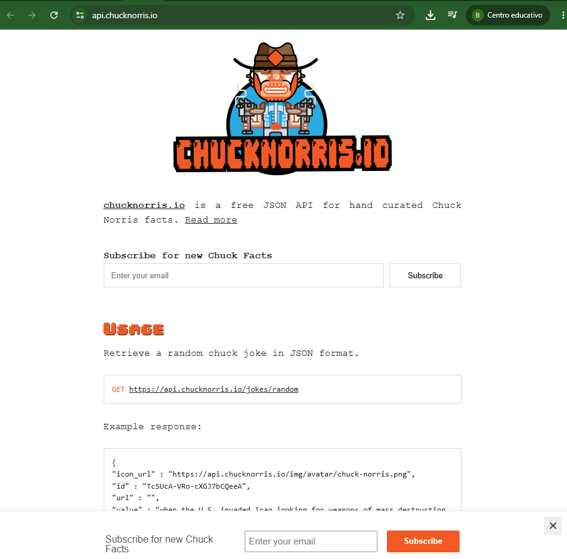

# persona-2

benjaminalvarez21

## API

Una API es una interfaz de programación de aplicación, en otras palabras, es un conjunto de reglas y protocolos que permiten que distintas aplicaciones interactúen entre sí. Son puentes entre que facilitan la comunicación entre diferentes tecnologías y que garantizan una fluidez su funcionamiento.

### Origen

El concepto de API nace en  la década de 1950, esta se entendía como un método potencial para facilitar la comunicación entre dos computadores y la primera vez que se menciona fue en 1951 por MAurice Wilkes y David Wheeler en un libro llamado "The Preparation of Programs for an Electronic Digital Computer".

Las API cada vez evolucionaban más y con el nacimiento del internet en 1990 las API ganaron mucha popularidad.

### Tipos de API

Las API se clasifican según el uso, están las API web que permiten la transferencia de datos y funcionalidades a través de Internet mediante HTTP, un protocolo que utilizan estas API. Las API web son las más comunes y existen 4 tipos de estas. Están las API abiertas que son de código abierto y se puede acceder mediante HTTP, las API de socios que conectan a socios comerciales estratégicos, las API internas que son privadas y permanecen ocultas para los usuarios externos y las API compuestas que combinan varias API de datos y servicios.

También existen otro tipo de API como las API de datos que conectan sistemas y aplicaciones de gestión de datos, las API del sistema operativo que se usan para definir cómo las aplicaciones usan servicios y recursos del sistema operativo y por último las API remotas se usan para definir cómo las aplicaciones interactúan entre distintos dispositivos.

### Protocolos de API

Las API son diseñadas para funcionar mediante protocolos, las más común es HTTP que es un protocolo de transferencia de hipertexto, pero existen más como SOAP que significa protocolo simple de acceso de objetos, este permite que los dispositivos envíen y reciban datos a traves de SMTP o HTTP.

También está RCP o llamada de procedimiento remoto, este permite que los usuarios trabajen con procedimientos remotos como si estos fuesen locales.

### Ejemplos de API

### PokéAPI

Esta API tiene mucha información de los Pokémon como sus movimientos, habilidades, tipos, poderes, hábitat y más. Puedes enviar una solicitud con el nombre de un Pokémon y recibirás una respuesta en formato JSON con toda su información. 

Screenshot tomado por mi en la web de PokéAPI

### API de Chuck Norris

Es una API de Chuck Norris donde puedes encontrar datos sobre él. Puedes preguntar por una broma de él y te la entrega en formato JSON.

Screenshot tomado por mi en la web de la API de Chuck Norris

### Bibliografía

Mikula, K. (2023, 7 de febrero). The history and evolution of APIs. Traefik Labs. https://traefik.io/blog/the-history-and-evolution-of-apis 

Goodwin, M. (2024, 9 de abril). What is an API (application programming interface)? IBM. https://www.ibm.com/think/topics/api 

Satyaprakash, A. B. (2022, 27 de junio). 15 fun and interesting APIs to use for your next coding project in 2022. Medium (Codex). https://medium.com/codex/15-fun-and-interesting-apis-to-use-for-your-next-coding-project-in-2022-86a4ff3a2742 

PokéAPI. (s.f.). PokéAPI. https://pokeapi.co/ 

chucknorris.io. (s.f.). Chuck Norris jokes API. https://api.chucknorris.io/ 

TICnoticos. (s.f.). Qué es una API | Ejemplos fáciles sobre application programming interface [Video]. YouTube. https://www.youtube.com/watch?v=eQxBA-GtdS8 
