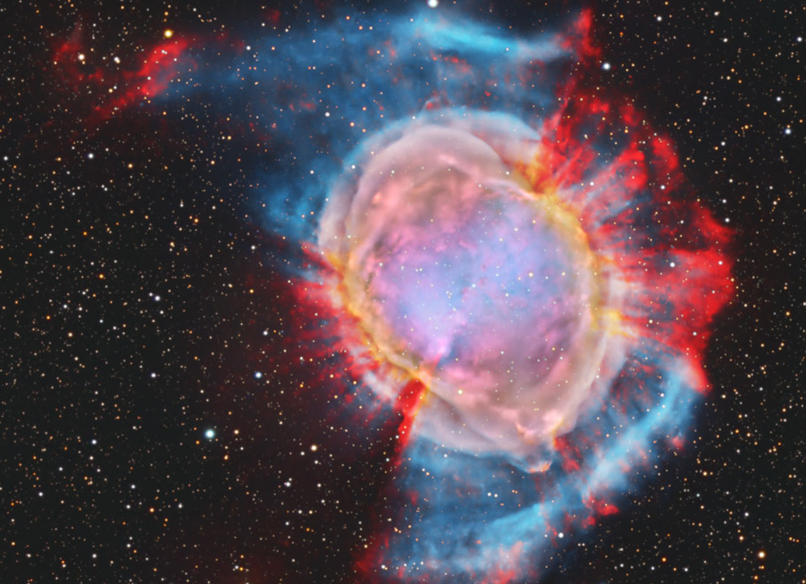

# persona-3

Anaysval

---

## ¿Qué es una API?

Una API (Interfaz de Programación de Aplicaciones) es un conjunto de reglas que permite que distintos sistemas se comuniquen entre sí de manera estructurada. Gracias a esto, aplicaciones diferentes pueden intercambiar datos sin necesidad de conocer su funcionamiento interno.

Una definición clave es que una API es “un conjunto de reglas o protocolos que permite a las aplicaciones informáticas comunicarse entre sí para intercambiar datos, características y funcionalidades” (IBM, 2024).

También se puede entender como un intermediario, ya que “la interfaz puede considerarse como un contrato de servicio entre dos aplicaciones” (AWS, s.f.), lo que implica que ambas partes siguen una estructura definida para comunicarse correctamente.

## Origen y evolución de las API

El concepto de API ha evolucionado junto con el desarrollo del software y el crecimiento de internet. En sus inicios, las API eran principalmente internas y servían para conectar componentes dentro de un mismo sistema.

Con el tiempo, su uso se expandió hacia la web, permitiendo la comunicación entre aplicaciones diferentes mediante estándares más abiertos y estructurados. Este proceso ha estado ligado al avance de la tecnología y la necesidad de integrar sistemas de manera más eficiente.

La evolución de las API ha estado marcada por el crecimiento de internet y la necesidad de crear sistemas más conectados, pasando de estructuras cerradas a modelos más abiertos y estandarizados.

En etapas posteriores, surgieron enfoques como SOAP y REST, que facilitaron la integración entre sistemas distintos y simplificaron el desarrollo de aplicaciones conectadas. Actualmente, las API son fundamentales en la arquitectura de software moderna, especialmente en servicios web y aplicaciones distribuidas.

## ¿Cómo funcionan las API?

Las API funcionan bajo un modelo de cliente-servidor, donde una aplicación solicita información y otra la entrega.

En este sistema, “la aplicación que envía la solicitud se llama cliente, y la que envía la respuesta se llama servidor” (AWS, s.f.). Esto permite entender claramente los roles dentro de la comunicación.

### Flujo básico

- El cliente envía una solicitud
- La API procesa la solicitud
- Se comunica con el servidor
- El servidor genera una respuesta
- La API devuelve los datos al cliente

Esta comunicación ocurre comúnmente mediante HTTP o HTTPS, y los datos se estructuran en formatos como JSON, lo que facilita su uso en aplicaciones modernas.

#### Ejemplo de respuesta (JSON)

```json
{
  "location": {
    "name": "Santiago",
    "country": "Chile"
  },
  "current": {
    "temperature": 18,
    "weather_descriptions": ["Partly cloudy"],
    "wind_speed": 12,
    "humidity": 65
  }
}

```

### Tipos de API (según arquitectura)

#### API REST

Es la más utilizada actualmente por su flexibilidad y simplicidad. Funciona mediante solicitudes HTTP y usa principalmente JSON.

- Flexible
- Escalable
- Muy usada en aplicaciones web

#### API SOAP

Es más estructurada y utiliza XML.

- Más estricta
- Menos flexible
- Utilizada en sistemas formales

#### API RPC

Permite ejecutar funciones en sistemas remotos.

- Comunicación directa
- Respuesta inmediata

#### API WebSocket

Permite la comunicación en tiempo real.

- Conexión continua
- Intercambio bidireccional

Permite que el servidor envíe información sin esperar una nueva solicitud, lo que mejora la eficiencia.

### Tipos de API (según acceso)

Las API también se clasifican según quién puede utilizarlas:

- API privadas: utilizadas dentro de una empresa para conectar sistemas internos.
- API públicas: disponibles para cualquier persona o desarrollador, a veces con autenticación o costos asociados.
- API de socios: accesibles solo para desarrolladores autorizados en contextos de colaboración.
- API compuestas: combinan múltiples API para realizar procesos más complejos.

### Endpoint (punto de conexión)

Un endpoint es una dirección específica dentro de una API donde se realizan las solicitudes y se reciben respuestas. Es el punto donde ocurre el intercambio de información entre sistemas.

#### Importancia

- Seguridad: pueden representar vulnerabilidades si no se protegen adecuadamente.
- Rendimiento: un alto número de solicitudes puede generar cuellos de botella.

### Ventajas de las API

Las API permiten acelerar el desarrollo de software al facilitar la integración de servicios externos. También permiten reutilizar funcionalidades sin necesidad de desarrollarlas desde cero.

#### Principales ventajas

- Ahorro de tiempo
- Reutilización
- Integración
- Escalabilidad

### Ejemplo

### APIs de la NASA

La NASA ofrece distintas APIs que permiten acceder a datos del espacio, la Tierra y otros planetas para usarlos en proyectos interactivos o informativos. Por ejemplo, con APOD se puede ver la imagen astronómica del día junto con su explicación científica, directamente desde la NASA (conocía esta página desde hace años y la usaba harto, las imágenes son hermosas, y recién ahora me entero de que lo que está detrás se llama API, muy cool)

Con esta API también se puede:

- Ver la imagen astronómica del día (APOD)
- Seguir asteroides cercanos a la Tierra (Asteroids NeoWs)
- Consultar eventos de clima espacial como tormentas solares (DONKI)
- Explorar eventos naturales en la Tierra como incendios o huracanes (EONET)
- Ver imágenes diarias de la Tierra desde el espacio (EPIC)
- Acceder a datos de exoplanetas fuera del sistema solar (Exoplanet Archive)
- Explorar imágenes satelitales de la Tierra en alta resolución (GIBS)
- Ver información del clima en Marte (Perspectiva)
- Acceder a fotos y videos oficiales de la NASA (Image and Video Library)
- Usar datos científicos abiertos para investigación (Open Science Data Repository)
- Ver información de proyectos tecnológicos de la NASA (Techport)
- Consultar patentes y desarrollos tecnológicos (TechTransfer)
- Obtener datos de órbitas de satélites (API TLE)
- Explorar mapas de la Luna, Marte y otros cuerpos (Trek WMTS)

Omg foto del día 22 de junio 2026!!!



>Foto por: NASA. (s.f.). Astronomy Picture of the Day (APOD). <https://apod.nasa.gov/apod/astropix.html>

### Conclusión

Las APIs básicamente permiten que distintos sistemas se conecten y compartan información de forma rápida, haciendo más fácil crear aplicaciones más completas, flexibles y escalables, además de reutilizar código y mejorar cómo funcionan los servicios digitales.

No tenía idea de lo útiles y cool que son, (ya que no conocía este término) ni de la enorme cantidad de ideas y usos que existen alrededor de las APIs.

### Bibliografía

- Appleute. (s.f.). What is REST API. <https://www.appleute.de/es/biblioteca-para-desarrolladores-de-aplicaciones/what-is-rest-api>
- Amazon Web Services. (s.f.). What is an API. <https://aws.amazon.com/what-is/api/>
- Delta Protect. (s.f.). Introducción a APIs. <https://www.deltaprotect.com/blog/que-es-una-api>
- IBM. (2024). What is an API. <https://www.ibm.com/think/topics/api>
- NASA. (s.f.). Astronomy Picture of the Day (APOD). <https://apod.nasa.gov/apod/astropix.html>
- NASA. (s.f.). NASA APIs. <https://api.nasa.gov/>
- Outvio. (s.f.). ¿Qué es una API?. <https://outvio.com/es/blog/que-es-una-api>
- Traefik Labs. (2023, 7 de febrero). The history and evolution of APIs. <https://traefik.io/blog/the-history-and-evolution-of-apis>
