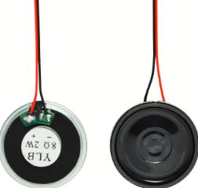
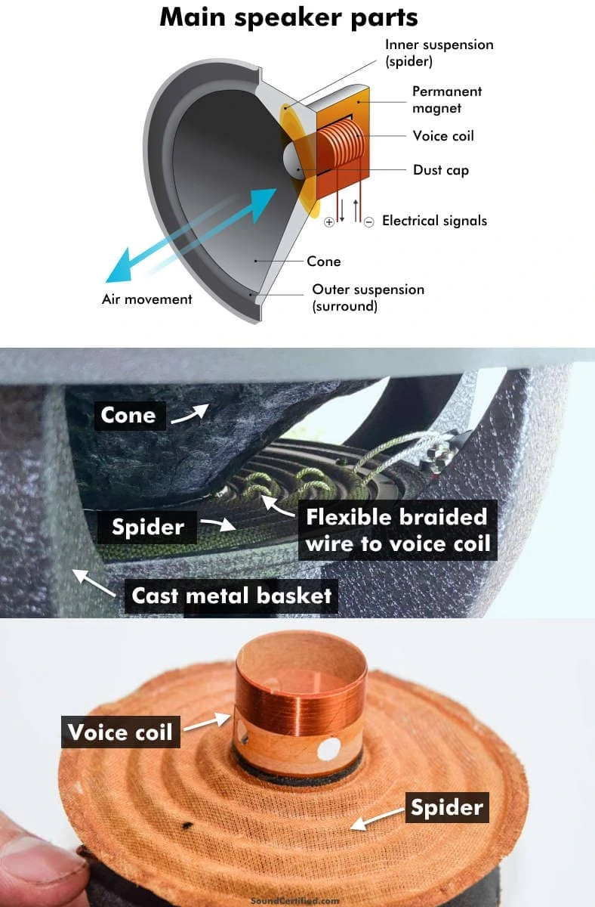
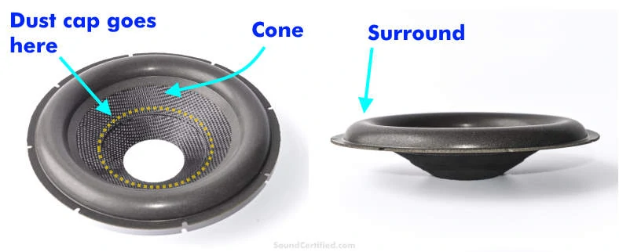
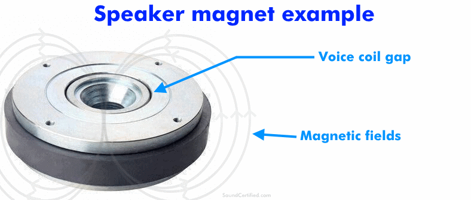
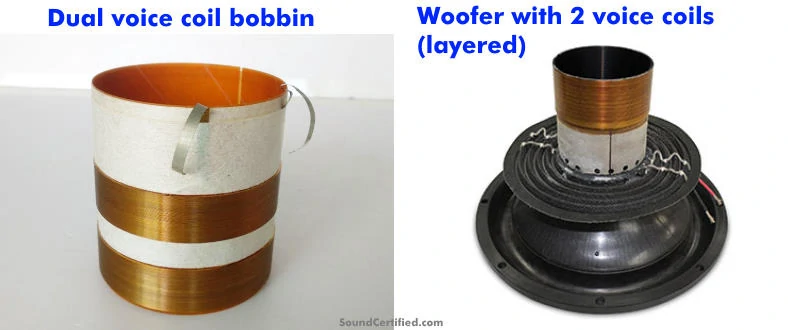

# investigaciones individuales

braulio figueroa vega / github: brauliofigueroa2001

## Sensor

Pushbutton de 4 pines

**Imagen 1** *Pushbutton de 4 pines, fuente: Made in China*

¿Qué es Push Button 4 pines?
Push Button 4 pines también conocido como MicroSwitch, botón o pulsador es un dispositivo táctil que sirve como interruptor ya que puede ser activado, al ser pulsado con el dedo y permiten el flujo de corriente mientras es accionado. Los pulsadores son de diversas formas y tamaños y se encuentran en todo tipo de dispositivos, aunque principalmente en aparatos eléctricos y electrónicos.

¿Para qué sirve? 

Los botones son de propósito general y son utilizados en diversos dispositivos electrónicos. Ideales para realizar practicas de electrónica para armar circuitos en protoboards, así como integrar a placas de circuito impreso PCB.

Especificaciones del Pushbutton de 4 pines

- Rango de temperatura: -20°C  a 70°C
- Voltaje máximo: 24V
- Corriente máxima: 50 mA
- Resistencia de aislamiento: 100MΩ
- Rebote: 5 ms
- Fuerza de operación: 1.57 ± 0.49 N
- Dimensiones: 6mm x 6mm x 4.3 mm

*Info sacada de [unitelectronics](https://uelectronics.com/producto/push-button-4-pines-microswitch/)

Me llamó la atención el concepto de "rebote" ya que lo ví en hartos lados a medida que trabajábamos con el botón, los códigos con botones siempre incorporan un "anti-rebote" y quiero ahondar específicamente en cómo y por qué se produce ese rebote

### Concepto de rebote

**¿Qué es el switch bouncing?**

Cuando presionamos un botón, un interruptor de palanca o un microinterruptor, dos partes metálicas entran en contacto para cortar el suministro. Pero no se conectan instantáneamente, sino que las partes metálicas se conectan y desconectan varias veces antes de que se realice la conexión estable real. Lo mismo sucede al soltar el botón. Esto da como resultado la activación falsa o activación múltiple, como si se presionara el botón varias veces. Es como caer una pelota que rebota desde una altura y sigue rebotando en la superficie, hasta que se detiene.

**Imagen 02** *Diagrama de Switch Bounce*

Simplemente, podemos decir que el rebote del interruptor es el comportamiento no ideal de cualquier interruptor que genera múltiples transiciones de una sola entrada. El rebote del interruptor no es un problema importante cuando nos ocupamos de los circuitos de potencia, pero causa problemas mientras tratamos con los circuitos lógicos o digitales. Por lo tanto, para eliminar el rebote del circuito , se utiliza el circuito de rebote del interruptor.

**El rebote también puede ocurrir en Software, cómo?**

El rebote también ocurre en el software, mientras que los programadores de programación agregan retrasos para eliminar el rebote del software. Agregar un retraso fuerza al controlador a detenerse durante un período de tiempo en particular, pero agregar retrasos no es una buena opción en el programa, ya que pausa el programa y aumenta el tiempo de procesamiento. La mejor forma es utilizar interrupciones en el código para el rebote del software. Arduino tiene un código para evitar que el software rebote.

*Info sacada de [es-amentechnologies](https://es.amen-technologies.com/what-is-switch-bouncing)

## Actuador

**Speaker**

Para mi investigación sobre un actuador, quise buscar información sobre algo distinto a lo que estábamos trabajando como grupo, ya que, desde hace un tiempo que quiero poder hacer algo con sonido y quizá el examen podría ser la oportunidad de realizarlo

**Imagen 3** fuente: [Amazon](https://www.amazon.co.uk/Gikfun-Speaker-Diameter-Arduino-Speakers/dp/B07DJ9X5T6)

### ¿Qué hay dentro de un parlante?

**Imagen 4** *partes de un parlante, fuente: [soundcertified](https://soundcertified.com/how-do-speakers-work/)*

La mayoría de los parlantes están hechos de las siguientes partes que trabajan juntas para crear sonido:

- Imán permanente: se utiliza un imán para proporcionar un campo magnético fijo alrededor de la bobina de voz y hacer posible el movimiento.

- Bobina de voz y carrete (bobbin): el carrete es un tubo redondo unido a la parte inferior del cono. Una bobina de alambre muy larga y estrechamente enrollada, llamada bobina de voz, crea un campo magnético cuando la electricidad fluye a través de ella desde la señal musical proveniente de un amplificador.

- Araña o suspensión (spider): la araña es un material delgado tejido con forma ondulada que sostiene el conjunto del carrete de la bobina de voz y ayuda a empujar el cono de vuelta a su posición mientras se mueve.

- Cono (diafragma) y tapa antipolvo: este es un material rígido con forma de cono que es movido por el imán y la bobina de voz juntos para desplazar aire y crear sonido. La tapa antipolvo es un material delgado (como una “tapa”) que cubre la abertura en el centro para evitar la entrada de polvo y suciedad.

- Canasta del parlante: la canasta es una estructura de metal fundido o estampado a la que se fijan las partes del parlante y mantiene todo alineado. También proporciona una forma de montar el conjunto del parlante en una caja.

- Terminales del parlante y cable trenzado: los terminales del parlante son pestañas o conectores metálicos que conectan el cable del parlante al mismo. Estos se conectan a la bobina de voz mediante un cable trenzado flexible que se mueve junto con el cono.

- Borde o suspensión exterior (surround): este es un material circular flexible y duradero (generalmente goma o algún tipo de espuma) que une el borde superior del cono con la canasta.

### ¿Para qué sirve el cono de un parlante?

**Imagen 5** *partes de un parlante, fuente: [soundcertified](https://soundcertified.com/how-do-speakers-work/)*

Un cono de parlante (también llamado diafragma) es el componente principal del parlante responsable de crear una onda sonora cada vez que mueve aire rápidamente hacia adelante y hacia atrás. Normalmente están hechos de materiales livianos pero rígidos, como papel prensado, plásticos, fibra de carbono o incluso metal delgado.

El nombre “cono” del parlante se refiere a su forma: una forma de cono invertido con una abertura central donde se une el conjunto del carrete y la bobina de voz. Una tapa antipolvo se fija al cono sobre esta abertura en la parte inferior para evitar que entren contaminantes. Ambos son sostenidos en la parte inferior por un material rígido pero flexible, a veces llamado “araña” (spider).

El tipo y diseño dependen del parlante. Por ejemplo, los subwoofers producen ondas de sonido de graves muy grandes y un movimiento de aire considerable, por lo que necesitan un diseño más grueso y rígido.

En cambio, los tweeters utilizan un diseño muy pequeño, liviano y con forma de domo para el rendimiento en frecuencias altas, ya que este rango de sonido utiliza ondas sonoras más pequeñas.

### ¿Qué hace el imán de un parlante?

**Imagen 6**, *partes de un parlante, fuente: [soundcertified](https://soundcertified.com/how-do-speakers-work/)*

Los imanes de los parlantes generalmente son imanes permanentes (normalmente de material magnético cerámico o de neodimio) con una delgada abertura circular en la que se encuentra suspendida la bobina de voz. El imán proporciona un área de campo magnético estable que atrae o repele la bobina de voz.

Debido a que la bobina desarrolla un campo magnético, funciona de cierta manera como un electroimán. Los imanes de neodimio son más fuertes para su tamaño (campos magnéticos más densos), pero los imanes cerámicos, aunque son más grandes, son más económicos. Esa es una de las razones por las que los imanes cerámicos son más populares en el uso de parlantes.

Algunos imanes de parlantes, aunque no todos, tienen un orificio en el centro para ayudar a ventilar la bobina de voz y mantenerla fría.

- Este elemento en particular me trae recuerdos cuando nos pasaron nuestra primera caja de materiales en el taller de máquinas electrónicas el primer semestre del 2025. En esta caja venía un parlante envuelto en cartón y scotch, era pequeño. Cuando mi caja se comenzó a desordenar y las resistencias, condensadores,leds, estaban por todos lados, el imán del parlante hacía que se pegaran todas las cosas sobre este mismo, fueron momentos memorables

### ¿Qué es un parlante de doble bobina de voz? 

**Imagen 7**, *partes de un parlante, fuente: [soundcertified](https://soundcertified.com/how-do-speakers-work/)*

Los parlantes de doble bobina de voz ofrecen un segundo enrollado de bobina de voz en el mismo parlante y sobre el mismo conjunto del carrete de la bobina de voz. Este tipo de parlantes permite algunas opciones adicionales que los parlantes de bobina simple no tienen:

- Flexibilidad en la forma en que se conectan (2 ohms, 4 ohms, 8 ohms, etc.) para una mejor compatibilidad con amplificadores y receptores estéreo.
Para subwoofers u otros parlantes más grandes, pueden alimentarse con más configuraciones de cableado o incluso con 2 amplificadores cada uno, algo que no se puede hacer con modelos de una sola bobina de voz.

- Pueden ser alimentados con 2 canales de amplificadores que no pueden conectarse en puente (bridge) para obtener más potencia.

- Con mayor frecuencia encontrarás subwoofers disponibles en una versión de doble bobina de voz por un poco más de dinero.

- Aunque ofrecen más opciones de configuración de cableado, los parlantes de doble bobina de voz (DVC) no ofrecen un mejor rendimiento que sus equivalentes de bobina de voz simple (SVC).

- Además, parlantes como los tweeters para sonidos agudos y los parlantes de rango medio para instrumentos y voces normalmente no se fabrican en una versión de doble bobina de voz.

**Imagen 8**, *partes de un parlante, fuente: [soundcertified](https://soundcertified.com/how-do-speakers-work/)*

-  Ejemplos de dos carretes de parlante con doble bobina de voz. Izquierda: las dos bobinas no están juntas, mientras que (derecha) en este ejemplo están colocadas en capas una sobre la otra.

### Diagrama de cómo funcionan los parlantes

**Imagen 9**, *diagrama de funcionamiento del parlante, fuente: [soundcertified](https://soundcertified.com/how-do-speakers-work/)*

*

## Bibliografía

[unitelectronics](https://uelectronics.com/producto/push-button-4-pines-microswitch/)

[es-amentechnologies](https://es.amen-technologies.com/what-is-switch-bouncing)
