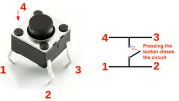

# investigaciones individuales

braulio figueroa vega / github: brauliofigueroa2001

## Sensor

Pushbutton de 4 pines

**Imagen 1** *Pushbutton de 4 pines, fuente: Made in China*

¿Qué es Push Button 4 pines?
Push Button 4 pines también conocido como MicroSwitch, botón o pulsador es un dispositivo táctil que sirve como interruptor ya que puede ser activado, al ser pulsado con el dedo y permiten el flujo de corriente mientras es accionado. Los pulsadores son de diversas formas y tamaños y se encuentran en todo tipo de dispositivos, aunque principalmente en aparatos eléctricos y electrónicos.

¿Para qué sirve? 

Los botones son de propósito general y son utilizados en diversos dispositivos electrónicos. Ideales para realizar practicas de electrónica para armar circuitos en protoboard´s, así como integrar a placas de circuito impreso PCB.

Especificaciones del Pushbutton de 4 pines

- Rango de temperatura: -20°C  a 70°C
- Voltaje máximo: 24V
- Corriente máxima: 50 mA
- Resistencia de aislamiento: 100MΩ
- Rebote: 5 ms
- Fuerza de operación: 1.57 ± 0.49 N
- Dimensiones: 6mm x 6mm x 4.3 mm

*Info sacada de [unitelectronics](https://uelectronics.com/producto/push-button-4-pines-microswitch/)

Me llamó la atención el concepto de "rebote" ya que lo ví en hartos lados a medida que trabajábamos con el botón, los códigos con botones siempre incorporan un "anti-rebote" y quiero ahondar específicamente en cómo y por qué se produce ese rebote

### Concepto de rebote

**¿Qué es el switch bouncing?**

Cuando presionamos un botón, un interruptor de palanca o un microinterruptor, dos partes metálicas entran en contacto para cortar el suministro. Pero no se conectan instantáneamente, sino que las partes metálicas se conectan y desconectan varias veces antes de que se realice la conexión estable real. Lo mismo sucede al soltar el botón. Esto da como resultado la activación falsa o activación múltiple, como si se presionara el botón varias veces. Es como caer una pelota que rebota desde una altura y sigue rebotando en la superficie, hasta que se detiene.

## Actuador

## Bibliografía

[unitelectronics](https://uelectronics.com/producto/push-button-4-pines-microswitch/)
