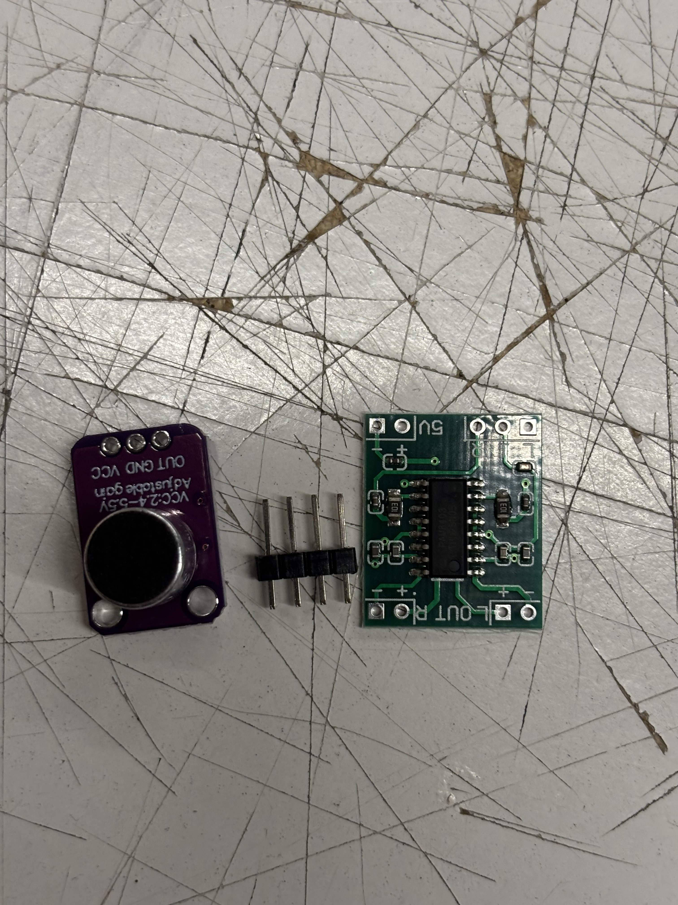
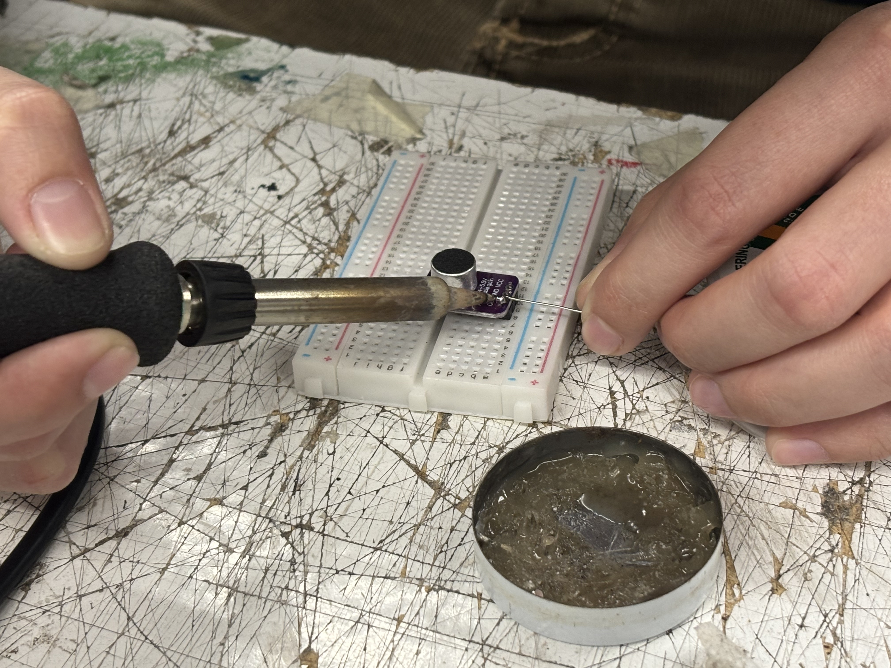
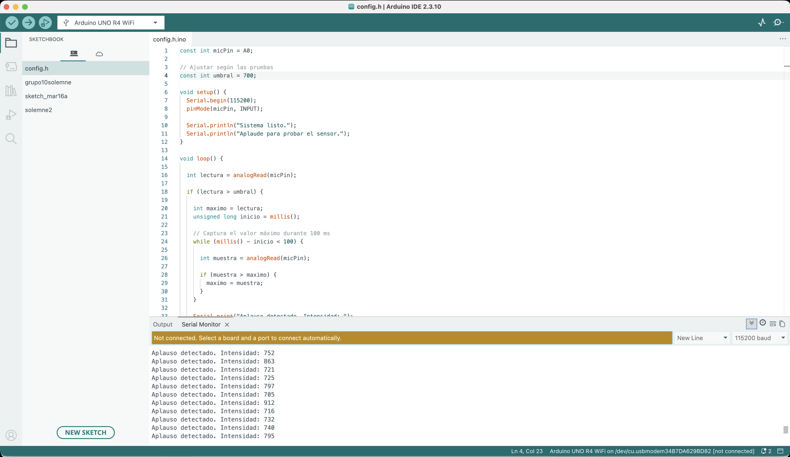
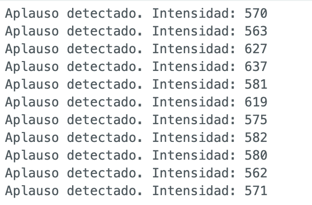

# sesion-14

lunes 15 junio 2026

## Compras materiales


### MAX4466
es un **amplificador operacional** de bajo ruido diseñado para trabajar con micrófonos. Se utiliza para capturar audio y convertirlo en una señal analógica que puede ser leída por microcontroladores como Arduino
### PAM8403
Es un **amplificador de audio** que permite aumentar la potencia de señales de audio para reproducirlas a través de parlantes. Funciona con una alimentación de 2,5 V a 5,5 V y puede entregar hasta 3 W por canal.
### DF PLAYER (no lo encontramos)
Es un **módulo reproductor de audio** que puede leer archivos MP3 almacenados en tarjetas microSD y reproducirlos sin necesidad de un procesador de audio externo. Se controla mediante comunicación serial desde Arduino u otros microcontroladores.




## Códigos micrófono

```cpp
const int micPin = A0;

// Ajustar según las pruebas
const int umbral = 700;

void setup() {
  Serial.begin(115200);
  pinMode(micPin, INPUT);

  Serial.println("Sistema listo.");
  Serial.println("Aplaude para probar el sensor.");
}

void loop() {

  int lectura = analogRead(micPin);

  if (lectura > umbral) {

    int maximo = lectura;
    unsigned long inicio = millis();

    // Captura el valor máximo durante 100 ms
    while (millis() - inicio < 100) {

      int muestra = analogRead(micPin);

      if (muestra > maximo) {
        maximo = muestra;
      }
    }

    Serial.print("Aplauso detectado. Intensidad: ");
    Serial.println(maximo);

    // Evita múltiples detecciones del mismo aplauso
    delay(500);
  }
}
```
```cpp
const int micPin = A0;

// Ajustar según las pruebas
const int umbral = 200;

void setup() {
  Serial.begin(115200);
  pinMode(micPin, INPUT);

  Serial.println("Sistema listo.");
  Serial.println("Aplaude para probar el sensor.");
}

void loop() {

  int lectura = analogRead(micPin);

  if (lectura > umbral) {

    int maximo = lectura;
    unsigned long inicio = millis();

    // Captura el valor máximo durante 100 ms
    while (millis() - inicio < 100) {

      int muestra = analogRead(micPin);

      if (muestra > maximo) {
        maximo = muestra;
      }
    }

    Serial.print("Aplauso detectado. Intensidad: ");
    Serial.println(maximo);

    // Evita múltiples detecciones del mismo aplauso
    delay(500);
  }
}


—-----------------------

const int micPin = A0;

// Ajustar según las pruebas
const int umbral = 400;

void setup() {
  Serial.begin(115200);
  pinMode(micPin, INPUT);

  Serial.println("Sistema listo.");
  Serial.println("Aplaude para probar el sensor.");
}

void loop() {

  int lectura = analogRead(micPin);

  if (lectura > umbral) {

    int maximo = lectura;
    unsigned long inicio = millis();

    // Captura el valor máximo durante 100 ms
    while (millis() - inicio < 100) {

      int muestra = analogRead(micPin);

      if (muestra > maximo) {
        maximo = muestra;
      }
    }

    Serial.print("Aplauso detectado. Intensidad: ");
    Serial.println(maximo);

    // Evita múltiples detecciones del mismo aplauso
    delay(500);
  }
}

```
```cpp
const int micPin = A0;

// Ajustar según las pruebas
const int umbral = 600;

void setup() {
  Serial.begin(115200);
  pinMode(micPin, INPUT);

  Serial.println("Sistema listo.");
  Serial.println("Aplaude para probar el sensor.");
}

void loop() {

  int lectura = analogRead(micPin);

  if (lectura > umbral) {

    int maximo = lectura;
    unsigned long inicio = millis();

    // Captura el valor máximo durante 100 ms
    while (millis() - inicio < 100) {

      int muestra = analogRead(micPin);

      if (muestra > maximo) {
        maximo = muestra;
      }
    }

    Serial.print("Aplauso detectado. Intensidad: ");
    Serial.println(maximo);

    // Evita múltiples detecciones del mismo aplauso
    delay(500);
  }
}

```
```cpp
const int micPin = A0;

// Ajustar según las pruebas
const int umbral = 800;

void setup() {
  Serial.begin(115200);
  pinMode(micPin, INPUT);

  Serial.println("Sistema listo.");
  Serial.println("Aplaude para probar el sensor.");
}

void loop() {

  int lectura = analogRead(micPin);

  if (lectura > umbral) {

    int maximo = lectura;
    unsigned long inicio = millis();

    // Captura el valor máximo durante 100 ms
    while (millis() - inicio < 100) {

      int muestra = analogRead(micPin);

      if (muestra > maximo) {
        maximo = muestra;
      }
    }

    Serial.print("Aplauso detectado. Intensidad: ");
    Serial.println(maximo);

    // Evita múltiples detecciones del mismo aplauso
    delay(500);
  }
}

```

```cpp

const int micPin = A0;

// Ajustar según las pruebas
const int umbral = 1000;

void setup() {
  Serial.begin(115200);
  pinMode(micPin, INPUT);

  Serial.println("Sistema listo.");
  Serial.println("Aplaude para probar el sensor.");
}

void loop() {

  int lectura = analogRead(micPin);

  if (lectura > umbral) {

    int maximo = lectura;
    unsigned long inicio = millis();

    // Captura el valor máximo durante 100 ms
    while (millis() - inicio < 100) {

      int muestra = analogRead(micPin);

      if (muestra > maximo) {
        maximo = muestra;
      }
    }

    Serial.print("Aplauso detectado. Intensidad: ");
    Serial.println(maximo);

    // Evita múltiples detecciones del mismo aplauso
    delay(500);
  }
}

```

## Código con Adafruit

```cpp
#include <WiFiS3.h>
#include "AdafruitIO_WiFi.h"


// Tus datos
#define WIFI_SSID "xxx"
#define WIFI_PASS "xxx"


#define IO_USERNAME "xxx"
#define IO_KEY "xxx"


AdafruitIO_WiFi io(IO_USERNAME, IO_KEY, WIFI_SSID, WIFI_PASS);


// Nombre exacto del feed en Adafruit IO
AdafruitIO_Feed *pruebaMicro = io.feed("xxx");


const int micPin = A0;
const int umbral = 200; // Más sensible


unsigned long ultimoEnvio = 0;


void setup() {
 Serial.begin(115200);


 while (!Serial) {
   delay(10);
 }


 Serial.println("Conectando a Adafruit IO...");


 io.connect();


 while (io.status() < AIO_CONNECTED) {
   Serial.print(".");
   delay(500);
 }


 Serial.println();
 Serial.println("Conectado a Adafruit IO");
}


void loop() {
 io.run();


 int lectura = analogRead(micPin);


 // Ver valor del micrófono
 Serial.print("Lectura: ");
 Serial.println(lectura);


 if (lectura > umbral) {


   Serial.print("Sonido detectado. Enviando: ");
   Serial.println(lectura);


   pruebaMicro->save(lectura);


   delay(500); // evita múltiples envíos
 }


 delay(50);
}

```

## Conclusiones

Intentamos varios códigos con distintos umbrales, y llegamos a la conclusión que lo mejor para el proyecto era con umbral de 700 ya que al principio nos marcaba demasiado el número 1023 y no variaba demasiado los datos, pero con umbral en 700 teníamos una mayor variación de números.






