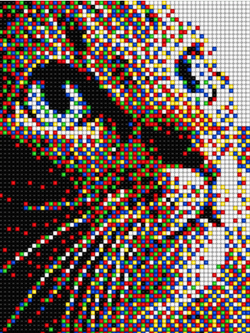

# sesion-13

lunes 08 junio 2026

## proceso examen

decidimos buscar otra idea para el proyecto, algo un poco más "no tan simple" como lo de los temblores

mis compañeros propusieron tener como una cámara en la que al apretar un botón, se toma la foto, y esta se guarda en una especie de carpeta o galería y que quede disponible para después poder verlas, y que la foto no sea así tal como sale sino que se le agregue un efecto "pixel" para que sea más entretenido

falta desarrollar bien la propuesta final y como funciona, ver los materiales que podriamos necesitar y el tema del código que sería lo más importante, qué va a llevar cada microcontrolador y qué hace cada uno, averiguar cómo se puede agregar una cámara, entre otras cosas

### primera descripción del proyecto

Para nuestro proyecto, armamos una experiencia interactiva donde la gente puede tomar una foto y que esta tenga un efecto pixel art. El usuario saca una foto y automáticamente se procesa para convertirla en efecto pixelado, dándole ese estilo clásico de los videojuegos antiguos. Cuando la foto está lista, se sube a la nube y se suma a una galería pública que se va armando en tiempo real con la fotografías que se vayan tomando, para esto utilizaremos la Raspberry conectada a una pantalla. 

Le conectaremos un botón para que el usuario pueda apretarlo y tomar la foto. Esta placa se encargará de conectarse a internet, acceder a nuestra nube y subir las fotos, así cada vez que alguien procesa y sube una foto nueva, esta aparece disponible en una galería para que todos puedan verlas.
Por otro lado, tendremos un Arduino en el cual podremos visualizar esta galería, debe leer en la nube las fotos subidas y mostrarlas en una pantalla, la cual contará con botones para poder navegar en la galería de fotos.

