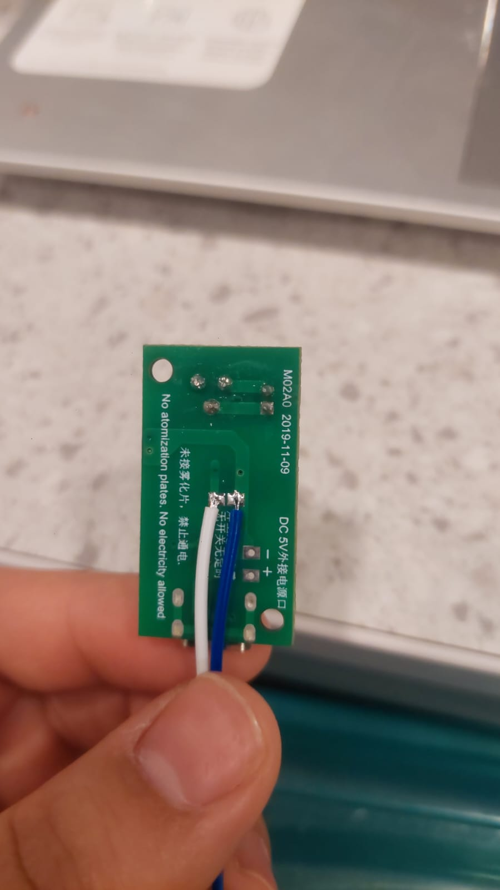

# sesion-14

15 de Junio

Penúltima sesión (triste porque se termina el curso y emocionante por ver el proyecto terminado)

# Apuntes 

Clase solo avance.

Seguimos intentando que nos funcione el humidificador, el cual nos esta trayendo muchos problemas para que funcione con el Arduino UNO R4 WiFi. Como grupo decidimos preguntarle a Cami Parada quien en su examen el año pasado usó el mismo componente, le preguntamos que nos recomendaba hacer ya que no estabamos entendiendo y no encontrabamos respuestas en internet.

Cami muy amablemente nos explico que en esa instancia ellos le sacaron el botón a la placa con USB que viene con el humi y que soldaron un puente para ponerle un cable qué conectaban al arduino a un pin digital.

Ya con la información que nos dio Cami, fuimos al LID a soldar ambos puntos para probar controlarlo.

Después al conectar el humi ya no prendía la luz LED que trae la placa y probamos de varias maneras, probamos con el multimetro, conectándome directo a la corriente y allí prendía un poquito la luz. 

Después nos dimos cuenta el problema era la membrana ultrasónica por lo que compramos más KITs de humidificador para seguir intentando, porque nos cuesta mucho soltar las ideas.

lunes 15 junio 2026
