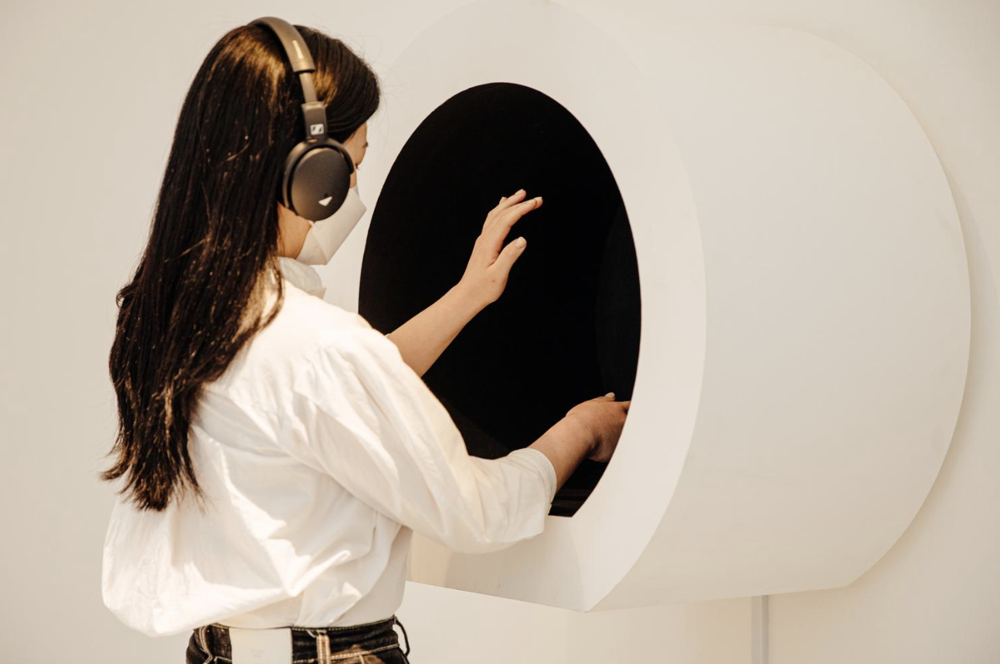
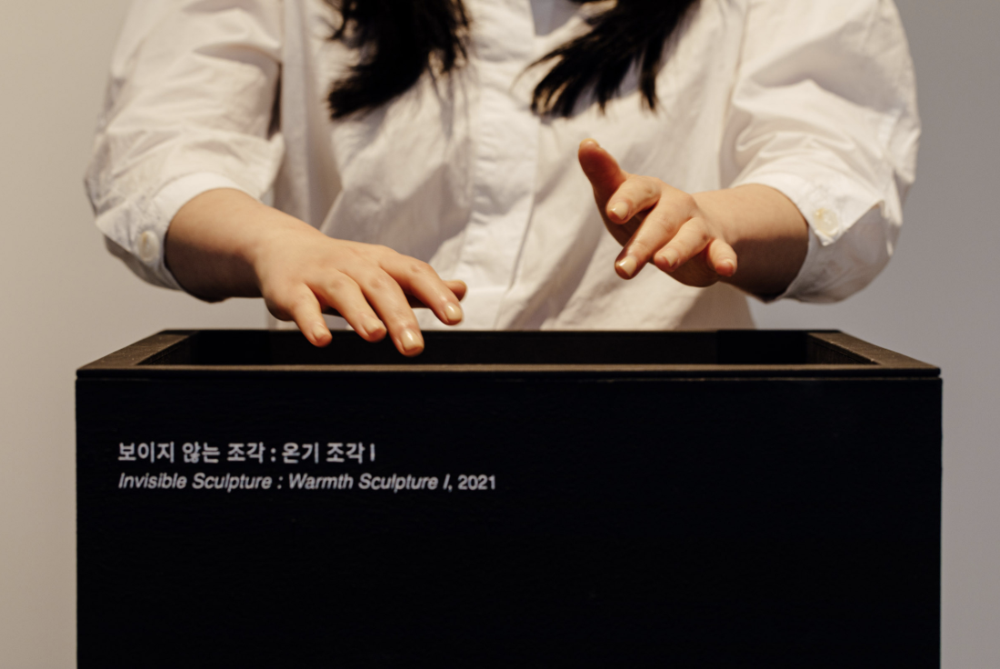

# sesion-12

lunes 01 junio 2026

En esta sesión se abordó el uso de APIs como herramientas que permiten la comunicación entre distintos sistemas digitales. Una API, o Application Programming Interface, funciona como una especie de puente o intermediario que permite que una aplicación, dispositivo o plataforma pueda solicitar información, enviar datos o activar acciones en otro sistema sin necesidad de conocer todo su funcionamiento interno.

La API permite que dos elementos tecnológicos “conversen” entre sí mediante reglas y formatos específicos

A partir de esto, las APIs pueden entenderse no solo como recursos técnicos, sino también como herramientas expresivas. Permiten diseñar sistemas donde la información circula entre cuerpos, objetos y plataformas, generando experiencias sensibles.

**ej: Open-Meteo API**

Open-Meteo es una API de clima gratuita para uso no comercial, no requiere API key y permite consultar datos meteorológicos por coordenadas. 

Por ejemplo, una luz led podría cambiar según:

si está nublado
si está lloviendo
si es de noche
si baja la temperatura
si hay poca luz ambiental

## Referente 

Yeseul Song La escultura hay que ir a verlas pero y si no se ven? 
 
Yeseul Song trabaja justo desde esa pregunta: ¿qué pasa cuando una obra no se entrega completamente a la vista? En sus Invisible Sculptures, la escultura no se mira de manera tradicional, sino que se percibe mediante otros sentidos: sonido, calor, flujo de aire u olor. Es decir, la obra existe, pero no necesariamente aparece como imagen.

la escultura hay que ir a verla, pero ¿qué pasa si no se ve? Esa pregunta desplaza el foco desde el objeto visible hacia la relación entre cuerpo, atención y presencia. La obra ya no depende solo de estar frente a algo, sino de sostener una interacción. No basta con mirar rápido; hay que permanecer, sentir, esperar o incluso dudar de si algo está ocurriendo. 

 

## Propuesta 01 exámen inicial

Grupo 01: El proyecto consiste en una lámpara-altar que reacciona ante la cercanía de una persona, transformando su presencia física en una señal luminosa y afectiva. A medida que alguien se acerca  la luz comienza a encenderse progresivamente, como si el objeto despertara o reconociera esa presencia. Cuando la luz alcanza su máxima intensidad se envía una señal a un segundo dispositivo, comunicando que alguien estuvo ahí, recordó o se hizo presente. La propuesta convierte la luz en un espacio de memoria y compañía, donde acercarse al objeto no solo activa un sistema, sino que construye una forma poética de decir estoy aquí, te recuerdo o sigo vinculado a ti.

La luz no funciona como señal instantánea, sino como prueba de presencia.

Si alguien pasa cerca, el sistema no responde del todo. Solo cuando la persona permanece, la luz comienza a encenderse lentamente, como si el objeto reconociera que esa presencia no fue accidental.

**Correcciones**

>@Montoyamoraga
en vez de lámpara altar, creo que es bello dejarlo en altar, porque un altar no es una figura concreta definida o incluso comercial, entonces puede tener una lámpara / luz sin tener que por eso dejar de ser un altar, no necesita el nombre lámpara-altar

>@Valentina-ruz:
Nos gusta la idea, pero tal vez debería tener condiciones o límites de proximidad o que se encienda cuando realmente pase algo

>@Montoyamoraga
sí pensar en límites, contexto, bordes, comportamientos esperados
vamos a agregar otra regla en el enunciado del examen, es ridícula pero creo que me entenderán, prohibidas las "comillas"

>@valentina-ruz:
Tenemos una duda, dice que la luz es progresiva; si me alejo y me acerco constantemente la luz comenzará a encender y apagar o quedará prendida?

>@jesus-miranda: 
vamos a crear una condición que después de cierta cantidad de segundos que la persona se mantiene cerca la luz se enciende, del caso contrario queda apagada

## Corrección final: 

El proyecto consiste en un altar que reacciona ante la cercanía de una persona, transformando su presencia física en una señal luminosa y afectiva. Sin embargo, la luz no responde a una cercanía casual, sino al gesto de quedarse: no basta con pasar cerca, hay que permanecer. A medida que alguien se aproxima y sostiene su presencia dentro de ciertos límites definidos, la luz comienza a encenderse progresivamente, como si el objeto despertara o reconociera una intención. Si la persona se aleja antes de tiempo, la luz vuelve lentamente a apagarse y no se envía ninguna señal. Solo cuando la presencia se mantiene hasta que la luz alcanza su máxima intensidad, se comunica a un segundo dispositivo que alguien realmente estuvo ahí, recordó o decidió hacerse presente. La propuesta convierte la luz en un ritual de memoria y compañía, donde acercarse al objeto no solo activa un sistema, sino que construye una forma poética de decir: estoy aquí, te recuerdo o sigo vinculado a ti.

Además nos hacemos la pregunta, ¿Qué pasa si la lámpara no solo responde a quien se acerca, sino también a la ausencia de alguien?

¿Puede una presencia ser reconocida aunque no sea visible?

El “fantasma” no tendría que pensarse literalmente como terror, sino como una presencia ausente: alguien que no está físicamente, pero cuya memoria todavía activa el sistema. Si pasan cinco minutos sin que nadie se acerque, la luz podría encenderse sola de manera tenue, como si el altar recordara por sí mismo. Esa activación no diría “alguien está aquí”, sino algo distinto: “alguien falta”, “algo quedó”, “la memoria también puede activar una señal”.
  
