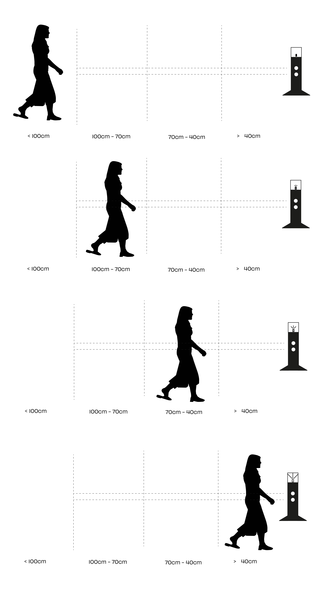
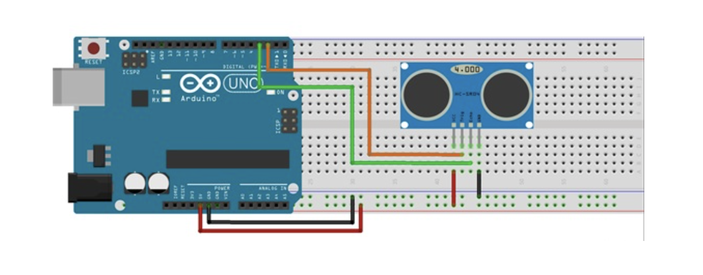
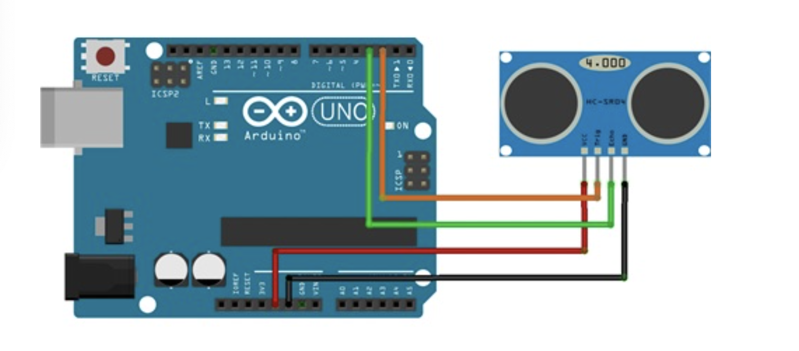
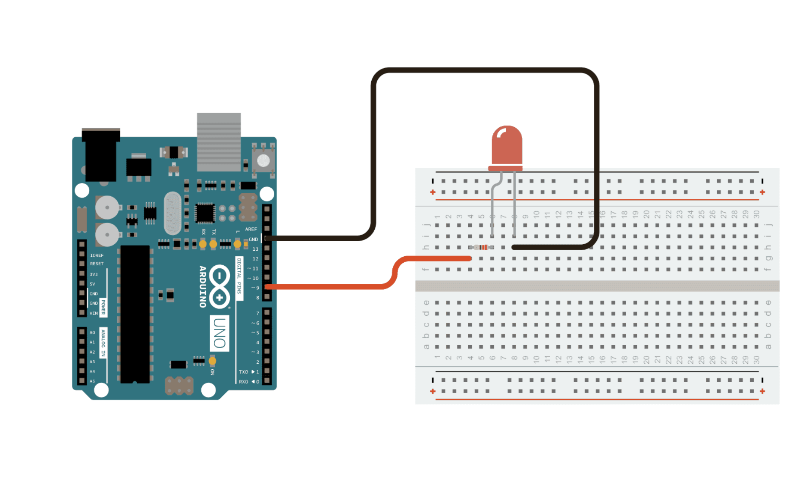

# sesion-13

lunes 08 junio 2026

## Trabajo en clases grupo amistad es amigo

comenzamos aclarando la idea del altar para el examen final. Retomamos la propuesta inicial y la ordenamos mejor, definiendo que el proyecto consiste en un **altar** compuesto por dos tótems conectados entre sí. La intención principal es que el objeto no reaccione solamente ante la presencia de una persona, sino ante el **gesto de permanecer frente a él**. Por eso, conversamos sobre la importancia de diferenciar una cercanía casual de una presencia sostenida, entendiendo la luz como una forma de memoria, compañía y vínculo afectivo.

### Tótem 01

A partir de esta conversación, definimos que el **Tótem 01** funcionará como el punto principal de interacción. Este será construido como un pilar o altar vertical, con un Arduino resguardado en su base y un sensor ultrasónico integrado en su estructura. Este sensor permitirá medir la distancia entre la persona y el altar, para que la luz LED aumente progresivamente según el nivel de cercanía. **Si la persona se mantiene cerca durante el tiempo necesario, la luz llegará a su máxima intensidad, indicando que la presencia fue reconocida por el sistema**.

También definimos su composición, madera, impresión 3d y acrílico 

>agradecimientos a la limda carlita por el boceto: 


### Tótem 02

También aclaramos el funcionamiento del **Tótem 02**, que actuará como receptor de la información enviada desde el primer tótem. Este segundo objeto tendrá una pantalla LED y un servomotor. La información captada por el sensor del Tótem 01 se traducirá en movimiento mediante el servo, generando una respuesta física a la distancia de la persona. Cuando la presencia se complete, el Tótem 02 recibirá un mensaje que indicará que **alguien estuvo ahí, recordó o decidió hacerse presente**.

Quizás este diseño nos falta profundizar en su forma y su composición 

Durante la sesión también discutimos la pregunta que amplía el sentido del proyecto: ¿qué pasa si el altar no solo responde a quien se acerca, sino también a la ausencia de alguien? Esta idea nos permitió pensar en una segunda condición del sistema, donde la luz podría activarse de manera tenue o intermitente si pasa mucho tiempo sin que nadie se acerque. De esta forma, la ausencia también se transforma en una señal, como una presencia fantasma o una memoria que sigue habitando el espacio.

## Lista de compras 

| Elemento | Función dentro de la interacción | Precio |
|---|---|---|
| Sensor ultrasónico | Detecta la distancia entre la persona y el Tótem 01. | |
| LED | Se enciende progresivamente según la cercanía de la persona. | |
| Protoboard mini | Permite conectar y organizar los componentes electrónicos. | |
| Cables Dupont mix | Conectan los sensores, LED, servo, pantalla y Arduino. | |
| Servo | Imita físicamente la distancia detectada por el sensor. | |
| Pantalla OLED | Muestra los mensajes recibidos desde el Tótem 01. | |

## Texto proyecto

El proyecto consiste en un altar lumínico compuesto por dos tótems conectados inalámbricamente entre sí, donde la presencia física de una persona se transforma en una señal luminosa, mecánica y afectiva. La interacción principal ocurre en el Tótem 01, construido como un altar vertical. En su base se encuentra resguardado el Arduino, mientras que en su estructura se integra un sensor ultrasónico capaz de medir la distancia entre el objeto y la persona que se aproxima.

A partir de esta medición, el sistema interpreta distintos rangos de cercanía. No se trata solamente de detectar si alguien está o no está frente al altar, sino de reconocer cómo se aproxima y si decide permanecer. Cuando una persona se acerca, el sensor ultrasónico registra la distancia y envía ese dato al Arduino, que lo traduce en una condición de intensidad lumínica. Mientras más cerca se encuentra la persona, mayor es la intensidad de la luz LED del tótem. De esta manera, la luz se enciende progresivamente, como si el altar despertara lentamente ante la presencia de alguien. Cuando la persona alcanza la distancia más cercana definida por el sistema, la luz llega a su 100%, indicando que la presencia fue sostenida y reconocida.

Si la persona se aleja antes de completar este proceso, la luz disminuye lentamente y no se activa la comunicación final. Esto permite que el sistema distinga entre una cercanía casual y un gesto de permanencia. Así, el funcionamiento técnico refuerza la dimensión ritual del proyecto: no basta con pasar frente al objeto, hay que quedarse el tiempo suficiente para que el altar responda.

Mientras esta interacción ocurre, el Tótem 01 envía información al Tótem 02. Este segundo tótem funciona como un receptor de la presencia detectada en el primero. Su estructura incorpora una pantalla LED y un servomotor. El movimiento del servo está vinculado a la distancia registrada por el sensor ultrasónico del Tótem 01: si la persona está lejos, pero comienza a acercarse, el servo se mueve de manera gradual, traduciendo esa aproximación en un gesto físico. Así, la distancia de una persona frente al primer altar se convierte en movimiento en el segundo tótem.

Cuando la persona llega a la condición de mayor cercanía y la luz del Tótem 01 alcanza su máxima intensidad, el sistema envía un mensaje al Tótem 02. Este mensaje aparece en la pantalla LED como una señal de compañía, indicando que alguien estuvo ahí, recordó o decidió hacerse presente. De esta forma, el segundo tótem no solo recibe datos técnicos, sino una huella simbólica de la interacción ocurrida en el primero.

Además, el proyecto incorpora una pregunta central: ¿qué pasa si el altar no solo responde a quien se acerca, sino también a la ausencia de alguien? Desde esta idea, el sistema puede contemplar una segunda condición: si durante un periodo prolongado nadie se aproxima al altar, la luz puede encenderse por sí sola de manera tenue o intermitente, como una presencia fantasma. Esta activación no representaría una visita física, sino la memoria de una ausencia. En ese caso, el mensaje enviado al Tótem 02 sería distinto, no como señal de compañía presente, sino como una alusión a alguien que falta, que no ha llegado o que sigue habitando el espacio desde la distancia.

## Corrección 

1.Separar la descripción textual en varias secciones. Por ejemplo primero solamente conceptual, luego otra técnica que explique cómo los conceptos se implementan.    
2.Complementar con diagramas de flujo o dibujos   
3.Escribir el pseudocódigo

## Pseudocódigo

# Tótem 01: Arduino
```
INICIO

Definir sensor ultrasónico
Definir LED
Definir conexión inalámbrica con Tótem 02

Definir distancia_lejana = mayor a 100 cm
Definir distancia_media = entre 70 cm y 100 cm
Definir distancia_cercana = entre 40 cm y 70 cm
Definir distancia_muy_cercana = menor a 40 cm

Definir intensidad_LED = 0%

MIENTRAS el sistema esté encendido:

Medir distancia de la persona con el sensor ultrasónico

SI la distancia es mayor a 100 cm:
    La persona está lejos
    LED apagado o con intensidad mínima
    intensidad_LED = 0%
    Enviar al Tótem 02: "sin presencia cercana"

SI la distancia está entre 70 cm y 100 cm:
    La persona comienza a acercarse
    LED se enciende suavemente
    intensidad_LED = 25%
    Enviar al Tótem 02: "presencia lejana"

SI la distancia está entre 40 cm y 70 cm:
    La persona está cerca del altar
    LED aumenta su intensidad
    intensidad_LED = 60%
    Enviar al Tótem 02: "presencia cercana"

SI la distancia es menor a 40 cm:
    La persona está muy cerca del altar
    LED alcanza su máxima intensidad
    intensidad_LED = 100%
    Enviar al Tótem 02: "alguien está aquí"

Actualizar intensidad del LED según el valor definido

Esperar un momento breve antes de volver a medir

FIN 
```
# Tótem 02
```
INICIO

Definir pantalla LED
Definir servomotor
Definir conexión inalámbrica con Tótem 01

Definir posición_servo = 0 grados

MIENTRAS el sistema esté encendido:

Esperar información enviada desde el Tótem 01

Recibir dato de distancia o condición de cercanía

SI el mensaje recibido es "sin presencia cercana":
    Mostrar en pantalla: "Sin presencia"
    Mover servo a 0 grados
    posición_servo = 0 grados

SI el mensaje recibido es "presencia lejana":
    Mostrar en pantalla: "Alguien se aproxima"
    Mover servo a 45 grados
    posición_servo = 45 grados

SI el mensaje recibido es "presencia cercana":
    Mostrar en pantalla: "Presencia cerca"
    Mover servo a 90 grados
    posición_servo = 90 grados

SI el mensaje recibido es "presencia reconocida":
    Mostrar en pantalla: "Estoy aquí"
    Mover servo a 180 grados
    posición_servo = 180 grados

Esperar un momento breve antes de volver a recibir información

FIN 
```
## Diagrama tótem 01

 

## Avance código tótem 01 

Durante esta etapa se avanzó en el desarrollo del código base para el Tótem 01, correspondiente al dispositivo encargado de detectar la presencia de una persona mediante un **sensor ultrasónico HC-SR04** y traducir esa proximidad en una respuesta lumínica a través de un **LED**.

Primero se trabajó únicamente con el sensor ultrasónico, definiendo sus pines de conexión: **TRIG en el pin 2 y ECHO en el pin 3**. 

>https://naylampmechatronics.com/blog/10_tutorial-de-arduino-y-sensor-ultrasonico-hc-sr04.html 

  
   

A partir de esto, se programó la lectura de distancia en centímetros y se establecieron distintas condiciones según la proximidad de la persona frente al tótem. Durante esta etapa, compañeros del *LID* nos ayudaron a revisar el funcionamiento del sensor y nos recomendaron no utilizar **delay()** como método principal para controlar los tiempos, ya que podía volver más lento o poco fluido el comportamiento del sistema. En su lugar, nos sugirieron trabajar con **millis()**, porque permite medir el paso del tiempo sin detener completamente el Arduino. 

Inicialmente se probaron cuatro rangos de distancia, pero luego se simplificó el sistema a tres estados principales para hacerlo más claro y funcional:

**Entre 150 cm y 230 cm: hay alguien lejano.**  
**Entre 50 cm y 150 cm: alguien se acerca.**  
**Menor o igual a 50 cm: hay alguien cerca.**   

  

Posteriormente se incorporó el **LED** como salida visual del sistema, conectado al pin 6, permitiendo que la luz respondiera a las condiciones detectadas por el sensor. En una primera prueba se intentó regular la intensidad lumínica por porcentaje, pero la diferencia visual entre los valores no era suficientemente clara. Por esto, se decidió cambiar la lógica de la luz hacia un comportamiento de parpadeo, ya que permitía representar de manera más evidente los distintos niveles de cercanía.  

>https://docs.arduino.cc/built-in-examples/basics/Fade/

 

De esta forma, el comportamiento lumínico quedó definido así:

**Cuando no hay presencia, el LED permanece apagado.**   
**Cuando hay alguien lejano, el LED parpadea lentamente.**   
**Cuando alguien se acerca, el LED parpadea a una velocidad media.**   
**Cuando hay alguien cerca, el LED se mantiene encendido de forma fija y brillante.**    

     

>Agradecimientos a Carlita y Jesu, que hicieron el corazón en 3D para el tótem. Son unos secos y les quedó bello bello.
 
Además, se agregó una condición adicional relacionada con la **ausencia**. Si el sistema no detecta presencia durante **2 minutos**, el **LED** comienza a encenderse progresivamente y de manera lenta. Esta condición busca representar la idea de una presencia ausente o latente, vinculada al concepto del proyecto, donde *el tótem no solo responde a la cercanía física, sino también al paso del tiempo sin interacción*. 


## Correciones 
Como observación para la siguiente etapa, Aarón recomendó considerar la incorporación de botones físicos que permitan activar rápidamente las distintas condiciones durante el examen. Esto serviría como una herramienta de demostración, permitiendo mostrar los estados del sistema sin depender completamente de las distancias reales frente al sensor.

También queda pendiente mejorar la lógica de envío de datos hacia Adafruit IO. Actualmente, el código trabaja con los valores del sensor en su estado natural, es decir, con lecturas numéricas constantes de distancia. Sin embargo, para no enviar demasiada información a Adafruit, la idea es simplificar y decodificar esos datos. En vez de mandar todas las mediciones del sensor, se podría enviar solo un valor o código por condición, por ejemplo:

**0 = sin presencia**   
**1 = alguien lejano**   
**2 = alguien se acerca**  
**3 = alguien cerca**   
**4 = ausencia prolongada**   

De esta manera, Adafruit recibiría menos información, pero más significativa. Esto permitiría que el Tótem 02 interprete los estados de forma más limpia y eficiente, sin saturar la conexión con datos innecesarios.
