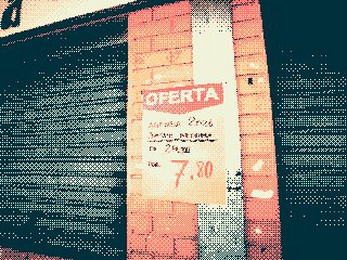
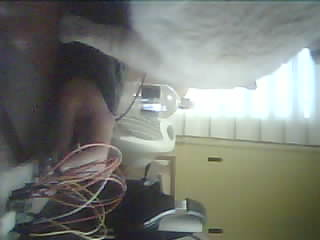
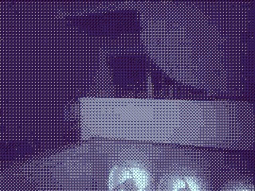
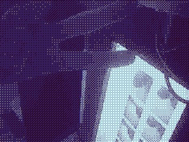
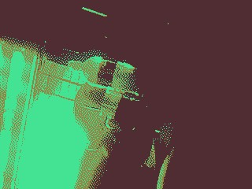

# sesion-14

lunes 15 junio 2026

Hola, tanto tiempo. Sinceramente, estuve tan metido con el código y con que funcionara todo que se me olvidó por completo llenar las bitácoras, por lo que pondré todo el proceso que hice los días anteriores, pero algo resumido para que se tenga contexto sobre el proceso.

## Proceso

### Clase 1 de junio


Ya que falté ese día, mi grupo puso sobre la mesa usar la API de los sismos en Chile. Investigando, me di cuenta de que existe una API que toma de referencia los datos de sismología de la Universidad de Chile y que se podría utilizar para el proyecto. Tenía pensado que podríamos usar unos motores que tenía Kiara de un examen que tuvo para simular la magnitud en miniatura.

* [Documentación API Earthquake](https://docs.boostr.cl/reference/earthquake)
* [Endpoint API Earthquake](https://api.boostr.cl/earthquake.json)

---

### Clase 8 de junio

En clase estuvimos pensando qué podríamos hacer, ya que lo de los sismos era solo una idea. Propusimos que nos basáramos en un proyecto llamado:

* [Pixela](https://rai-lander.itch.io/pixela)

Una plataforma que transforma fotografías en imágenes con estética retro mediante el procesamiento de píxeles y la aplicación de paletas de colores limitadas. A través de la aplicación web alojada directamente en la cámara Pixela, se puede configurar una variedad de funciones, incluidos métodos de procesamiento de imágenes, paletas de colores, diferentes modos de captura, configuraciones de conexión Wi-Fi y otras pequeñas personalizaciones, como paletas de colores favoritas.



Después de aprobar esto, vimos cómo podríamos adaptar este proyecto a nuestro presupuesto, materiales y a la rúbrica.

A partir de esta idea, compramos lo siguiente para el proyecto:

* ESP32-CAM y su base que venía junto a la cámara llamada ESP32-CAM-MB.
* Pantalla TFT LCD 2" de 240x320 (elegimos esa resolución, ya que en el proyecto original es la que da mejores resultados).

Los componentes que ya tenemos y usamos:

* Potenciómetro 100k
* 3 push button
* Pantalla LCD 128 × 64
* Módulo SD
* micro-SD junto a adaptador SD
* Muchos cables jumper

---

### Clase 15 de junio

Ya teníamos una idea de lo que queríamos hacer, lo cual sería de esta forma: Raspberry se encarga de controlar todo lo que tiene que ver con el disparo y selección de filtro y la ESP32-CAM procesa y saca las fotos. Esta foto sería subida a Google Drive automáticamente desde el ESP32. Posteriormente, con el Arduino R4 WiFi haríamos la visualización de las imágenes subidas al Google Drive con la pantalla de 240x320 para que cuando uno se sacara la foto viera el resultado.

La API sería Google Drive. Para eso usamos un script de Google para lograr esto. Este script se basa en el que se usa en Pixela para subir las fotos a Google Drive y funciona así:

```text
Cámara
   │
   │ POST (imagen en Base64)
   ▼
Google Apps Script
   │
   ├── Guarda imagen en Google Drive
   └── Registra metadatos en Google Sheets (opcional)
   │
Arduino UNO R4
   │ GET (solicita imagen)
   ▼
Apps Script
   │
   ├── Busca imágenes en Drive
   ├── Redimensiona → 240×320
   ├── Convierte → RGB565
   └── Devuelve Base64
```

Suena fácil porque fue la solución que encontramos, ya que entre medio hubo muchos flujos de trabajo y descubrimos que lo mejor por ahora era repartir así las funciones de cada microchip para no saturarlos.

Usamos el GitHub oficial de [ESP32](https://github.com/espressif/arduino-esp32) en Arduino para la compatibilidad con el programa.  

En la semana anterior a ese día realicé todo el código de la ESP32-CAM junto a la Raspberry Pi Pico 2 W; más que nada era una maqueta funcional. Ya en otro día mejoré los filtros y añadí un flash a la cámara que permitía saber cuándo iba a sacar la foto.

#### Evolución de pruebas



*No detectaba filtros y también aparece mi gata.*



*El tratamiento de imagen era igual en todos, solo cambiaban los colores mostrados.*



*Ahora ya los píxeles se repartieron de manera más interesante.*



*Se hizo una selección de cómo uno quiere que los píxeles se distribuyan tal como el referente, lo que da más juego al proyecto.*

Dejaré el Drive que usé; hay una carpeta de pruebas en donde se puede ver la evolución de los filtros y de mi locura:

* [Carpeta de pruebas en Google Drive](https://drive.google.com/drive/u/0/folders/1SUIurSYrSJvULb5bxX92DnnLRRc22yIt)

Ya en clases, intentamos probar el Arduino Uno R4 WiFi, pero lamentablemente no estaba funcionando, tampoco la pantalla, por lo que la clase se basó en intentar hacerlo funcionar como fuera.

Según la IA, se necesita una SD para poder poner imágenes de manera consistente en el Arduino dado su baja memoria, por lo que sacamos un módulo SD para usarlo en el Arduino, pero ese día justo no llevé el adaptador, por lo que nos quedamos con las ganas de probar, además de que la pantalla seguía sin funcionar.

## Avances después de clase

### Visualizador de imágenes

Tras la clase, intentamos pedirle a la IA si nos podía hacer un código para el Arduino. El prompt inicial fue este:

### Prompt para Claude

> Quiero que me ayudes a diseñar y programar un proyecto completo de marco de fotos digital que funcione con un Arduino Uno R4 WiFi, un módulo de tarjeta SD (MH-SD Card Module), una pantalla TFT LCD de 2 pulgadas con controlador ST7789V (resolución 240x320) y dos pulsadores.
>
> La idea es que el dispositivo se conecte a una carpeta de Google Drive, detecte automáticamente cuando se sube una nueva imagen (siempre a 240x320 píxeles) y la muestre en pantalla.
>
> Las imágenes se almacenarán localmente en la tarjeta SD para navegar con botones (siguiente / anterior). El sistema debe funcionar de forma continua y autónoma.

Usamos Google Drive API mediante el proyecto:

* [Google Cloud - arduinoviewer](https://console.cloud.google.com/welcome?project=arduinoviewer)

Al contar con una API nativa de Google Drive, no se realizó ningún script externo, a diferencia del que se realizó para la ESP32-CAM.

Otra de las razones fue que se saltaba todo el proceso del script original, porque ya no era necesario transformar la foto a texto (Base64) ni reescalarla.

La Raspberry Pi Pico 2 W se conecta directamente con Google Drive y descarga el archivo JPEG original.

---

### Problemas encontrados

El problema empezó con el hardware, ya que la pantalla se “tildaba” y no cambiaba de negro.

Posteriormente, dio señal, pero se quedó pegada en una imagen totalmente rota y no mostraba nada más aunque cambiara el código.

Esto se debió a varias razones:

* Sospechamos que la pantalla, al ser de Adafruit, quizás no tuviera compatibilidad nativa.
* Los botones tampoco funcionaban y, pese a pedir debug al código, tampoco reaccionaban.
* El Arduino tiene poca memoria incluso para una imagen de 50 KB, por lo que el sistema se saturaba y generaba bastantes fallos.

---

### Soluciones

* La hipótesis de incompatibilidad fue descartada después de descubrir que los pines de la pantalla estaban sueltos y, al ser removibles, puse cables jumper y logró funcionar.

  Lo más seguro es que el código se hubiera pegado o saturado junto con la pantalla.

* Pese a intentar usar librerías para optimizar todo, parecía que sí podía funcionar como visualizador de imágenes, pero demasiado justo en rendimiento.

Por eso decidimos cambiar el enfoque y usar la Raspberry Pi Pico 2 W como visualizador.

Esto nos permitió trabajar con más tranquilidad, ya que tenía mucho más espacio y RAM que el Arduino R4 WiFi.

Gracias a esto logramos un resultado más optimizado, aunque siguieron existiendo fallas menores.

---

### Fallas posteriores

#### Error en la visualización de pantalla

Se veía la imagen, pero una parte aparecía glitcheada o con errores.

Esto se debió a que el lienzo estaba rotado, por lo que devolvimos la rotación a cero.

Además, corregimos otro error: la letra estaba configurada en tamaño **2.5**, pero el procesador intentaba calcular un medio píxel, cosa que no existe.

La solución fue cambiar el tamaño a un número entero.

#### Error en la conexión

La Pico intentaba entrar a internet para descargar desde Google Drive incluso antes de conectarse al WiFi.

Como no encontraba nada, lanzaba errores constantemente.

La solución fue crear un bucle de espera para que primero confirmara conexión y luego procediera.

#### Error en el texto de índice

Simplemente no aparecía y fue por no cambiar correctamente el orden de los elementos.

#### La Pico no mostraba imágenes nuevas

Solo mostraba las que ya estaban en la SD.

El problema fueron restos del código anterior del Arduino.

Las imágenes incompatibles hacían que el sistema cerrara el acceso a nuevas imágenes.

La solución fue eliminar ese comportamiento.

---

También tuvimos que buscar un firmware personalizado (**Pimoroni**) porque necesitábamos que:

* `jpegdec`

Estuviera integrado directamente en el intérprete de la placa.

CircuitPython no tenía soporte suficiente para este flujo.

---

#### Flujo final del sistema

```text
Google Drive (carpeta en la nube)
    │
    │ HTTPS GET (API Key)
    ▼
Raspberry Pi Pico 2 W
    │
    ├── Conexión WiFi local
    ├── Descarga imagen JPEG original
    └── Streaming en bloques de 512 bytes
    │
    ▼
Módulo Tarjeta MicroSD (MH-SD)
    │
    └── Guarda archivos .jpg en /sd/IMGS
    │
    ▼
Control y botones
    │
    ├── Avanzar imagen
    └── Retroceder imagen
    │
    ▼
Decodificador nativo (jpegdec)
    │
    └── Descomprime píxel por píxel
    │
    ▼
Pantalla TFT LCD ST7789V (240x320)
    │
    ├── Renderiza imagen
    ├── Dibuja rectángulo protector
    └── Muestra indicador "X de Y"
```

---

### Cámara con filtro

Se usó la **ESP32-CAM** junto a su base **ESP32-CAM-MB**.

El único cambio realizado fue que intentamos que los microcontroladores se encontraran automáticamente a través de la red y así evitar cambiar IP manualmente.

La solución fue usar **UDP**, que permite enviar paquetes entre dispositivos.

En nuestro caso funcionó como una especie de “megáfono” para encontrar dispositivos dentro de la red.

Hubo algunos fallos de código, pero principalmente fueron errores de escritura o configuraciones mal pegadas.

#### Flujo final del sistema

```text
[ Turno de Red: Escuchando la puerta 80 de forma libre ]
                           │
                           ▼
         Recibe el mensaje POST /foto del Arduino
                           │
                           ▼
      Anota los filtros en su "lista de pendientes"
                           │
                           ▼
      Le grita de vuelta al Arduino: "PROCESSING"
                           │
                           ▼
     Cierra el canal de red (libera al Arduino)
                           │
                           ▼
   [ Turno de Laboratorio: Trabajo en segundo plano ]
       ├── Hace parpadear el flash LED (aviso visual)
       ├── Captura el cuadro de luz del lente directo a la RAM
       ├── Aplica el filtro matemático de puntitos (dithering)
       └── Traduce la imagen final a un texto larguísimo (Base64)
                           │
                           ▼
      Manda el texto pesado mediante un POST a Google
                           │
                           ▼
       Recibe un desvío de Google: redirección 302
                           │
                           ▼
     Cambia de estrategia y viaja con un método suave (GET)
                           │
                           ▼
          ¡La foto se guarda con éxito en tu Drive!
```


---

### Controlador

Se usó el **Arduino Uno R4 WiFi**.

Dada su baja potencia comparada con los otros dos microcontroladores, se le delegó la tarea menos demandante.

Finalmente se le aplicó el protocolo UDP y solo tuvimos un problema con el potenciómetro, donde nos equivocamos de patita.

#### Flujo final del sistema

```text
[ Entrada física: giro de perilla o pulsación del botón ]
                           │
                           ▼
          El Arduino lee el filtro elegido (vibe)
                           │
                           ▼
          Escucha la baliza UDP que flota en el aire
                           │
         ┌─────────────────┴─────────────────┐
         ▼                                   ▼
 ¿La dirección IP viene                ¿La dirección IP viene
 con letras o basura?                  completamente limpia?
         │                                   │
         ▼ (Tijeras virtuales)               ▼
 Recorta y borra la basura            Guarda la IP de destino
         └─────────────────┬─────────────────┘
                           │
                           ▼
             Abre la puerta 80 de internet
                           │
                           ▼
        Manda un mensaje rápido: POST /foto
 (Le entrega las variables elegidas a la cámara)
                           │
                           ▼
      Recibe respuesta: "PROCESSING" (<100 ms)
                           │
                           ▼
      ¡Cuelga el teléfono y libera la línea!
                           │
         ┌─────────────────┴─────────────────┐
         ▼                                   ▼
 Muestra en la pantalla:              Dibuja la barra de
 "¡DISPARADA! Subiendo..."            carga del 1 % al 99 %
```

* Se me olvidó mencionar que, para poder proporcionar información del proyecto de manera más profunda a mi grupo, creé un [NotebookLM](https://notebooklm.google.com/notebook/4f74ab24-d664-4222-bcea-7a99c820a673) en donde dejé todo el proceso, así como los errores, los códigos usados y el pseudocódigo. Lo dejaré aquí por si desean también verlo y preguntar acerca de algo más técnico sobre el proyecto.


