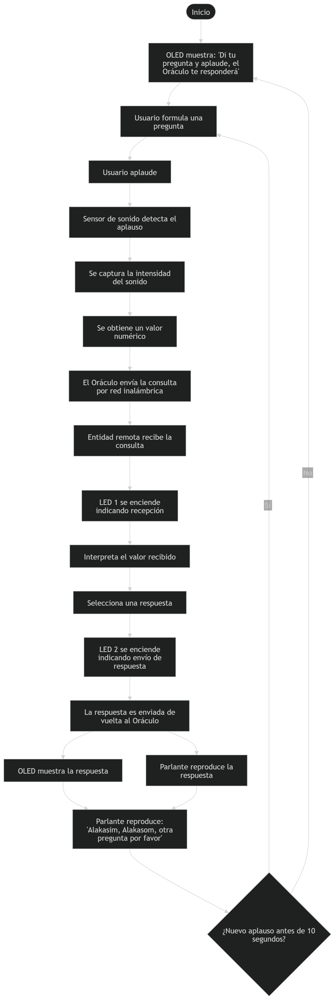

# sesion-13

lunes 08 junio 2026

Esta clase fue dedicada al avance del examen, Aarón nos pidió avanzar algunos ítems. Esto fue lo que alcanzamos a avanzar hoy, ya que queríamos probar el sensor de sonido, pero no funcionaba, así que continuamos con las partes escritas y la investigación.

TODO SIGUE EN PROCESO ദ്ദി◝ ⩊ ◜.ᐟ

### Texto mejorado

El Oráculo es una experiencia interactiva que invita a los participantes a formular una pregunta en voz alta. Al iniciar, una pantalla OLED mostrará un mensaje de bienvenida con las instrucciones de uso: "Di tu pregunta y aplaude, el Oráculo te responderá".

Luego, mediante un aplauso, los participantes activan una consulta a través de una red inalámbrica. La intensidad del aplauso es capturada por un sensor de sonido y utilizada como punto de partida para generar una respuesta.

La propuesta funciona como una interpretación paródica de los oráculos tradicionales. En lugar de buscar respuestas verdaderas o revelaciones, el sistema entrega mensajes ambiguos, irónicos o contradictorios, invitando a cada participante a construir su propio significado.

La consulta es enviada a una entidad remota, entendida como un dispositivo conectado a la red que recibe los datos del aplauso, los interpreta y selecciona una respuesta a partir de la información recibida. Durante este proceso, un LED se encenderá cuando la consulta sea recibida por la entidad remota y otro LED se encenderá cuando la respuesta sea enviada de vuelta al Oráculo, permitiendo visualizar la comunicación entre ambos dispositivos. De esta manera, la "sabiduría" del Oráculo no proviene de una fuente mística, sino de un proceso tecnológico que transforma una señal sonora en un mensaje aparentemente significativo.

Las respuestas serán representadas mediante texto mostrado en una pantalla OLED y mediante audio reproducido por un parlante. La combinación de ambos busca mejorar la experiencia, permitiendo que los mensajes sean recibidos tanto de forma visual como auditiva.

Una vez entregada la respuesta, se reproducirá un segundo audio que dirá: "Alakasim, Alakasom, otra pregunta por favor", indicando que el Oráculo está listo para recibir una nueva consulta. Si transcurren 10 segundos sin que se detecte un nuevo aplauso, la pantalla volverá automáticamente al mensaje inicial de bienvenida.

### Pseudocódigo

```text
INICIO

Escribir "Di tu pregunta y aplaude, el Oráculo te responderá"

Mientras VERDADERO Hacer

Si AplausoDetectado = VERDADERO Entonces

Leer IntensidadSonido

Valor ← Convertir(IntensidadSonido)

Enviar(Valor)

Encender(LED1)

Respuesta ← ProcesarConsulta(Valor)

Encender(LED2)

Enviar(Respuesta)

EscribirOLED(Respuesta)

ReproducirAudio(Respuesta)

ReproducirAudio(
"Alakasim, Alakasom, otra pregunta por favor")

Tiempo ← 0

Mientras Tiempo < 10 Segundos Hacer

Si AplausoDetectado = VERDADERO Entonces
Salir del ciclo
FinSi

FinMientras

EscribirOLED(
"Di tu pregunta y aplaude, el Oráculo te responderá")

FinSi

FinMientras

FIN
```

### Materiales 

| Componentes                         | Cantidad | Valor unitario | Link |
|-----------------------------------|----------|----------------|------|
| Arduino Uno R4 WiFi               | 1        | 38.990         |      |
| Raspberry Pi Pico 2W              | 1        | 14.990         |      |
| Sensor de sonido                  | 1        |                |      |
| PAM 8403                          | 1        |                |      |
| Parlante 8 ohms                   | 1        |                |      |
| Pantalla OLED                     | 1        |                |      |
| Paquete de LEDs                   | 1        |                |      |
| Protoboard grande                 | 1        |                |      |
| Protoboard chica                  | 1        |                |      |
| Micro SD                          | 1        |                |      |
| DFPlayer Mini                     | 1        |                |      |
| Cables Dupont (pack 40 unidades)  | 1        |                |      |

### Diagrama de Flujo



### Diagrama de Flujo textual

INICIO

↓

La pantalla OLED muestra el mensaje:

"Di tu pregunta y aplaude, el Oráculo te responderá"

↓

El usuario formula una pregunta en voz alta

↓

El usuario aplaude

↓

El sensor de sonido detecta el aplauso

↓

Se captura la intensidad del sonido

↓

Se obtiene un valor numérico

↓

El Oráculo envía la consulta mediante la red inalámbrica

↓

La entidad remota recibe la consulta

↓

LED 1 se enciende indicando que la consulta fue recibida

↓

La entidad remota interpreta el valor recibido

↓

La entidad remota selecciona una respuesta

↓

LED 2 se enciende indicando que la respuesta será enviada

↓

La respuesta es enviada de vuelta al Oráculo

↓

La pantalla OLED muestra la respuesta

↓

El parlante reproduce la respuesta

↓

El parlante reproduce el mensaje:

"Alakasim, Alakasom, otra pregunta por favor"

↓

¿Se detecta un nuevo aplauso antes de 10 segundos?

 SÍ

↓

El usuario formula una nueva pregunta

↓

Se repite el proceso

NO

↓

La pantalla OLED vuelve al mensaje de bienvenida:
  
"Di tu pregunta y aplaude, el Oráculo te responderá"
  
↓
 
El sistema queda esperando una nueva consulta
