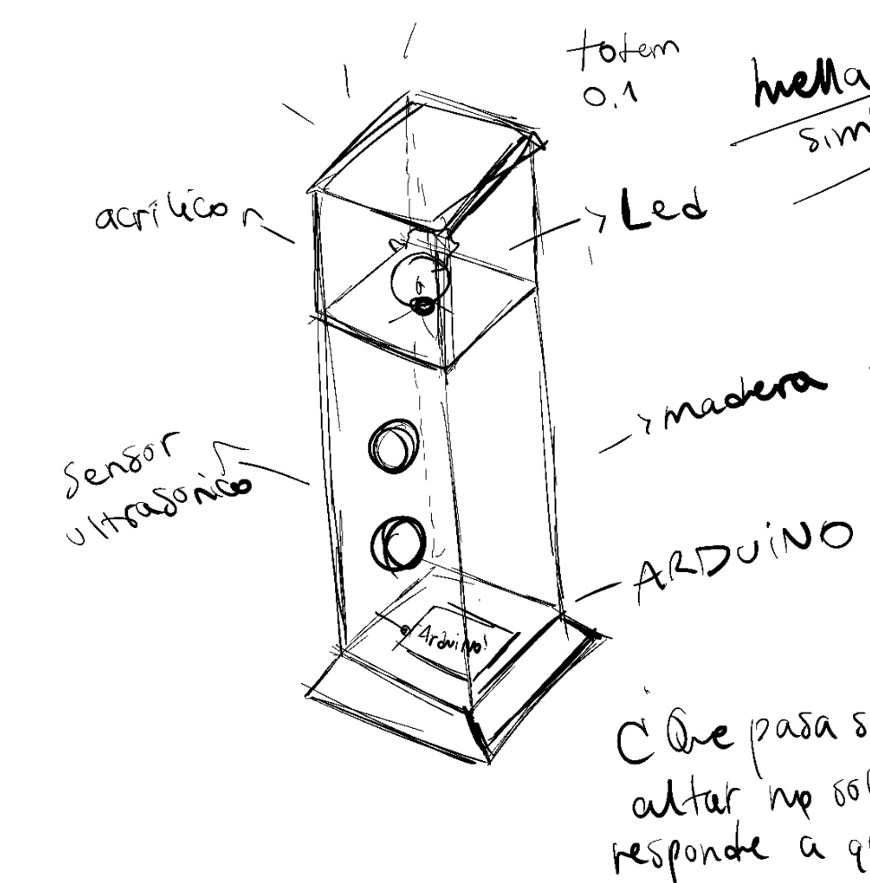
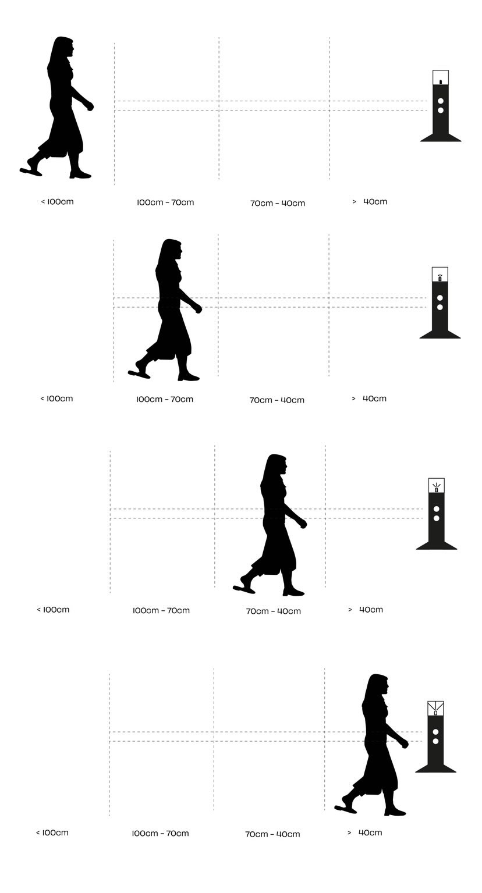

# sesion-13

lunes 08 junio 2026

# Trabajo en clases en grupito - Examen 

En esta clase nos dedicamos a definir de forma más concreta lo que haríamos para el examen. Retomamos la propuesta del altar y la ordenamos mejor, separando la descripción en una parte conceptual y una técnica, que era justamente una de las correcciones que nos habían dado.

Lo que más me gustó fue la dirección que tomó el proyecto: decidimos presentarlo como una especie de muestra museográfica, dos módulos separados como si fueran objetos de exhibición. El primero tiene un sensor ultrasónico y un LED que responde progresivamente a la cercanía de una persona. El segundo tiene una pantalla OLED y un servomotor que recibe lo que detecta el primero y lo traduce en movimiento y en un mensaje. La comunicación entre ambos ocurre de forma inalámbrica a través de Adafruit IO.

También trabajamos el pseudocódigo de ambos módulos y seguimos afinando los textos del proyecto.

## Descripción conceptual proyecto

El proyecto consiste en un altar lumínico compuesto por dos tótems conectados inalámbricamente entre sí, donde la presencia física de una persona se transforma en una señal luminosa, mecánica y afectiva.

La interacción no responde a una cercanía casual, sino al gesto de quedarse: no basta con pasar frente al objeto, hay que permanecer. La luz se enciende progresivamente, como si el altar despertara lentamente ante quien se aproxima. Solo cuando la presencia se sostiene el tiempo suficiente, el altar la reconoce y la comunica al segundo tótem, que responde con movimiento y una señal de compañía.

El proyecto también contempla la ausencia. Si durante un periodo prolongado nadie se aproxima, la luz puede encenderse por sí sola de manera tenue o intermitente, como una presencia fantasma. En ese caso, el mensaje enviado al segundo tótem no sería una señal de compañía presente, sino una alusión a alguien que falta, que no ha llegado o que sigue habitando el espacio desde la distancia.

---

## Descripción técnica

El **Tótem 01** funciona como dispositivo de entrada. En su base se encuentra el Arduino, y en su estructura se integra un sensor ultrasónico que mide la distancia entre el altar y la persona que se aproxima. A partir de esa medición, el sistema interpreta distintos rangos de cercanía y los traduce en intensidad lumínica mediante LEDs. Mientras más cerca se encuentra la persona, mayor es la intensidad de la luz. Si la persona se aleja antes de completar el proceso, la luz disminuye lentamente y no se activa la comunicación.

El **Tótem 02** funciona como dispositivo receptor. Incorpora un servomotor cuyo movimiento está vinculado a la distancia registrada por el sensor del Tótem 01: a medida que la persona se acerca, el servo se mueve gradualmente. Cuando la presencia es reconocida por completo, el Tótem 02 recibe un mensaje que se muestra en pantalla como señal de compañía. La comunicación entre ambos tótems ocurre de forma inalámbrica a través de Adafruit IO.

---

## Bocetos y composición de los tótems

Entre las distintas ideas que fueron surgiendo, empezaron a aparecer los primeros bocetos que le dieron forma al proyecto. También definimos la composición de los materiales: pensamos en impresión 3D o madera para la estructura central, donde irían la protoboard y el sensor ultrasónico; impresión 3D para la base, donde iría el Arduino; y acrílico transparente para la superficie donde iría el corazoncito impreso en 3D junto al LED rojo.

Créditos a Carlita por el boceto:



---

### Tótem 02

También surgió la idea y la función principal del Tótem 02, donde irían la pantalla OLED junto al servomotor, actuando como receptor de la información enviada desde el Tótem 01. La información captada por el sensor del Tótem 01 se traduce en movimiento mediante el servo, generando una respuesta física a la distancia de la persona. Cuando la presencia se completa, el Tótem 02 recibe un mensaje que indica que alguien estuvo ahí, recordó o decidió hacerse presente.

Dejamos pendiente la definición formal de su forma y material.

---

## Pseudocódigo

### Tótem 01 — Arduino

```
INICIO

Definir sensor ultrasónico
Definir LED
Definir conexión inalámbrica con Tótem 02

Definir rangos:
  distancia_lejana    → mayor a 100 cm
  distancia_media     → entre 70 cm y 100 cm
  distancia_cercana   → entre 40 cm y 70 cm
  distancia_muy_cerca → menor a 40 cm

MIENTRAS el sistema esté encendido:

  Medir distancia con sensor ultrasónico

  SI distancia > 100 cm:
    LED apagado
    Enviar al Tótem 02: "sin presencia"

  SI distancia entre 70 y 100 cm:
    LED al 25%
    Enviar al Tótem 02: "presencia lejana"

  SI distancia entre 40 y 70 cm:
    LED al 60%
    Enviar al Tótem 02: "presencia cercana"

  SI distancia < 40 cm:
    LED al 100%
    Enviar al Tótem 02: "alguien está aquí"

  Esperar antes de volver a medir

FIN
```

### Tótem 02 — Arduino

```
INICIO

Definir pantalla OLED
Definir servomotor
Definir conexión inalámbrica con Tótem 01

MIENTRAS el sistema esté encendido:

  Recibir mensaje desde Tótem 01

  SI mensaje = "sin presencia":
    Pantalla: "Sin presencia"
    Servo a 0°

  SI mensaje = "presencia lejana":
    Pantalla: "Alguien se aproxima"
    Servo a 45°

  SI mensaje = "presencia cercana":
    Pantalla: "Presencia cerca"
    Servo a 90°

  SI mensaje = "alguien está aquí":
    Pantalla: "Estoy aquí"
    Servo a 180°

  Esperar antes de volver a recibir

FIN
```
---

Diagrama representativo de distancia hecho por la magda!!



## Avance durante la semana en grupito

Durante la semana dedicamos tiempo a avanzar en el código y a probar los elementos que vamos a usar en el proyecto. El foco estuvo en el Tótem 01, que es el dispositivo encargado de detectar la presencia de una persona mediante un sensor ultrasónico HC-SR04 y traducir esa proximidad en una respuesta lumínica con un LED. Jota, compañero del LID ofreció ayudarnos con la primera prueba de impresión del corazón, ya cuando esta quedó impresa en filamento blanco comenzamos a probar como funcionaba en conjunto con el LED de color rojo, teniendo ya nuestros primeros registros y resultados. 

Primero trabajamos solo con el sensor, definiendo TRIG en el pin 2 y ECHO en el pin 3. A partir de ahí programamos la lectura de distancia en centímetros y fuimos probando distintos rangos según qué tan cerca estaba la persona del tótem. Compañeros del LID nos ayudaron a revisar el funcionamiento del sensor y nos recomendaron no usar `delay()` como método principal para controlar los tiempos, porque eso vuelve el sistema más lento y poco fluido. Nos sugirieron usar `millis()` en su lugar, ya que permite medir el paso del tiempo sin detener completamente el Arduino.


En un comienzo definimos cuatro rangos de distancia, pero terminamos simplificando a tres estados para que quedara más claro y funcional:

- Entre 150 cm y 230 cm → hay alguien lejano
- Entre 50 cm y 150 cm → alguien se acerca
- 50 cm o menos → hay alguien cerca

  

Aquí registros de unas primeras pruebas de distancia con el LED y sensor en funcionamiento: 

 

Así quedó definido el comportamiento del LED:

- Sin presencia → LED apagado
- Alguien lejano → parpadeo lento
- Alguien se acerca → parpadeo medio
- Alguien cerca → encendido fijo y brillante


También agregamos una condición relacionada con la ausencia: si el sistema no detecta presencia durante 2 minutos, el LED empieza a encenderse progresivamente y de forma lenta. Esa condición busca representar una presencia ausente o latente, conectado con la idea central del proyecto, donde el tótem no solo responde a la cercanía física sino también al paso del tiempo sin interacción.

---

## Correcciones para la siguiente etapa

Aarón nos recomendó pensar en incorporar botones físicos que permitan activar rápidamente las distintas condiciones durante el examen, como herramienta de demostración para no depender completamente de las distancias reales frente al sensor.
