# sesion-13

lunes 08 junio 2026

## Trabajo en clases (avance examen)

Examen: 22 de junio / Grupo 6

Edificio A: Salvador Sanfuentes (Medición de datos).

Edificio B: FADD, Republica 180 (Reacción de los datos).

# Contexto proyecto

Puente digital

Nuestro proyecto parte desde la pregunta `¿Cuántos habitan los lugares de trabajo?`, nos interesa capturar el conteo de personas que entran al lugar de trabajo en la Universidad; y visualizarlo en el otro edificio. En este caso, ver cuanta gente entra al LID en Salvador Sanfuentes y visualizarlo en Rep180. Dos edificios, dos espacios de trabajo que coexisten sin saber cuánta gente entra en cada una. En la puerta del LID se instala un *Sensor Infrarrojo Evasor de Obstáculos* conectado a una Raspberry PI Pico 2W, que mide el flujo de gente que entra a este espacio; esto lo denominaremos `entrada`. Esta información se envía de manera inalámbrica a través de wifi a una base de datos (API o Adafruit) que lleva el conteo de la gente. Finalmente, en Rep180, el sistema responde encendiendo y completando cada píxel de un *Anillo LED RGB WS2812 de 16 leds* conectada al Arduino UNO R4 wifi; de esta manera, las personas que están en Rep180 pueden ver mediante una señal visual qué tan rápido se va llenando el LID, esto lo denominaremos `salida`. El mensaje que queremos transmitir es hacer visible el ritmo con que los espacios se llenan, los momentos en que el LID se desborda; es una fluctuación constante que todos vivimos pero nadie registra.

# Pseudocódigo

cómo encontrar el maximo de un numero, estructuras logicos o planificaciones del codigo para saber cómo funciona.

Diagrama de flujo -> mermaid

PROYECTO: Puente Digital
EDIFICIO A → LID (Salvador Sanfuentes)
EDIFICIO B → Rep180

════════════════════════════════════════

MÓDULO A — Arduino UNO R4 WiFi (LID)

════════════════════════════════════════

VARIABLES:
  conteo        ← 0
  umbral        ← 16        // máximo del anillo LED
  estadoSensor  ← LIBRE

INICIALIZAR:
  conectar WiFi (SSID, PASSWORD)
  conectar Adafruit IO (usuario, clave, feed: "lid-conteo")
  configurar pin sensor infrarrojo como ENTRADA

BUCLE PRINCIPAL:
  LEER estadoSensor ← sensor infrarrojo

  SI estadoSensor == OBSTRUIDO:
    esperar hasta estadoSensor == LIBRE   // persona cruzó completamente
    conteo ← conteo + 1
    
    SI conteo > umbral:
      conteo ← umbral                    // tope máximo

    PUBLICAR conteo → Adafruit IO (feed: "lid-conteo")
    esperar 500ms                        // evitar lecturas duplicadas

════════════════════════════════════════

MÓDULO B — Arduino UNO R4 WiFi (Rep180)

════════════════════════════════════════

VARIABLES:
  conteo        ← 0
  totalLeds     ← 16
  ledsActivos   ← 0

INICIALIZAR:
  conectar WiFi (SSID, PASSWORD)
  conectar Adafruit IO (usuario, clave, feed: "lid-conteo")
  configurar anillo LED WS2812 (16 leds)
  apagar todos los LEDs

BUCLE PRINCIPAL:
  SUSCRIBIR a Adafruit IO (feed: "lid-conteo")

  SI llega nuevo valor:
    conteo ← valor recibido
    ledsActivos ← MAPEAR(conteo, 0, 16, 0, totalLeds)

    PARA i DESDE 0 HASTA totalLeds - 1:
      SI i < ledsActivos:
        SI ledsActivos <= 5:
          encender LED[i] → color VERDE   // poco ocupado
        SI ledsActivos <= 10:
          encender LED[i] → color AMARILLO // ocupación media
        SI ledsActivos <= 16:
          encender LED[i] → color ROJO    // casi lleno o lleno
      SINO:
        apagar LED[i]

════════════════════════════════════════

ADAFRUIT IO — Canal intermedio

════════════════════════════════════════

  Feed: "lid-conteo"
  Módulo A publica  → conteo actualizado
  Módulo B escucha  → recibe conteo y actualiza LEDs

# Diagrama en Mermaid de Pseudocódigo

```mermaid
flowchart LR

    subgraph A["MÓDULO A — Arduino UNO R4 WiFi (LID)"]
        A1[Sensor Infrarrojo]
        A2[Detectar persona]
        A3[Esperar que el sensor quede libre]
        A4[conteo = conteo + 1]
        A5{conteo > 16?}
        A6[conteo = 16]
        A7[Publicar conteo]
        
        A1 --> A2
        A2 --> A3
        A3 --> A4
        A4 --> A5
        A5 -- Sí --> A6
        A5 -- No --> A7
        A6 --> A7
    end

    subgraph IO["Adafruit IO"]
        IO1[(Feed: lid-conteo)]
    end

    subgraph B["MÓDULO B — Arduino UNO R4 WiFi (Rep180)"]
        B1[Recibir conteo]
        B2[Mapear conteo a LEDs activos]
        B3{Cantidad de LEDs}
        B4[Verde<br/>0–5 LEDs]
        B5[Amarillo<br/>6–10 LEDs]
        B6[Rojo<br/>11–16 LEDs]
        B7[Actualizar anillo WS2812]
        
        B1 --> B2
        B2 --> B3
        B3 --> B4
        B3 --> B5
        B3 --> B6
        B4 --> B7
        B5 --> B7
        B6 --> B7
    end

    A7 --> IO1
    IO1 --> B1

    classDef Mint stroke-width:1px,stroke-dasharray:none,stroke:#99F2CC,fill:#EDFFF7,color:#4C7A66;
    classDef Sunset stroke-width:1px,stroke:#FFB38A,fill:#FFF1E8,color:#8A4A2F;
    classDef YellowSoft stroke-width:1px, stroke-dasharray:none, stroke:#E6C84C, fill:#FFF8D9, color:#7A6720

    class A1,A2,A3,A4,A5,A6,A7 Mint;
    class B1,B2,B3,B4,B5,B6,B7 Sunset;
    class IO1 YellowSoft;

```

# Lista de materiales

Que cosas vamos a necesitar / dibujos de planificación

- Sensor Infrarrojo Evasor de Obstáculos: Es ideal si quieres esconder la tecnología. Al ser tan pequeño, se puede poner en la entrada del LID y dejar asomados solo los dos pequeños LED, Para luego registrar el tránsito del LID.

Imagen sacada de: https: //afel.cl/products/sensor-infrarrojo-evasor-de-obstaculos?variant=45125238227096

 
¿Cómo funciona sensor?

https://www.luisllamas.es/detectar-obstaculos-con-sensor-infrarrojo-y-arduino/

https://agelectronica.lat/pdfs/textos/O/OKY3127.PDF

Normalmente tiene 3 pines:

VCC → 5V
GND → GND
OUT → Pin digital

Cuando detecta un objeto frente al sensor:

OUT = LOW (0)
LED indicador encendido

Cuando no detecta nada:

OUT = HIGH (1)

La distancia de detección suele ajustarse con el potenciómetro azul.

- Anillo LED RGB WS2812 de 16 leds (más economico) -> Matriz LED RGB 8×8 con WS2812B – 64 píxeles direccionables (menos economico).

Nos quedaremos con el Anillo LED RGB WS2812 de 16 leds

¿Cómo funciona?

Tiene 3 conexiones:

5V

GND

DIN (Data In)

Cada LED puede encenderse con cualquier color RGB y de forma independiente.

Imagen sacada de: https: //afel.cl/products/anillo-led-rgb-neopixel-16-leds-ws2812?variant=45125253857432 

Se ocupara para visualizar que tan rapido se va llenando el LID (Registra y visualiza los datos).

Codigo para el anillo led -> https://github.com/adafruit/Adafruit_NeoPixel/blob/master/Adafruit_NeoPixel.cpp

- Arduino R4 wifi

- Base de impresión 3d -> tipo totem

|Componente|Cantidad|Precio|Link|
|---|---|---|---|
|Raspberry Pi Pico 2W|1|$14.990|<https://raspberrypi.cl/products/raspberry-pi-pico-2-w-con-headers>|
|Arduino UNO R4 WIFI|1|$38.990|<https://mcielectronics.cl/shop/product/arduino-uno-r4-minima>|
|Anillo LED RGB WS2812 de 16 leds|1|$3.990|<https://afel.cl/products/anillo-led-rgb-neopixel-16-leds-ws2812?_pos=3&_sid=3a945a998&_ss=r>|
|Sensor Infrarrojo Evasor de Obstáculos|1|$2.000|<https://afel.cl/products/sensor-infrarrojo-evasor-de-obstaculos?_pos=1&_sid=96b6bad10&_ss=r>|
|Protoboard|1|$1.500|<https://afel.cl/products/mini-protoboard-400-puntos>|
|cables|4|$1.000|<https://afel.cl/products/pack-20-cables-de-conexion-macho-macho>|

# Codigo de prueba con consola simulado

Poner datos al azar y cuando funcione cambiarlo los datos reales y rangos buscados.

No alcanzamos, pero fui Afel a comprar lo que nos faltaba -> Anillo led y Sensor infrarrojo 

# Dibujos (imagen de referencia)

Representa la idea del mini totém.

