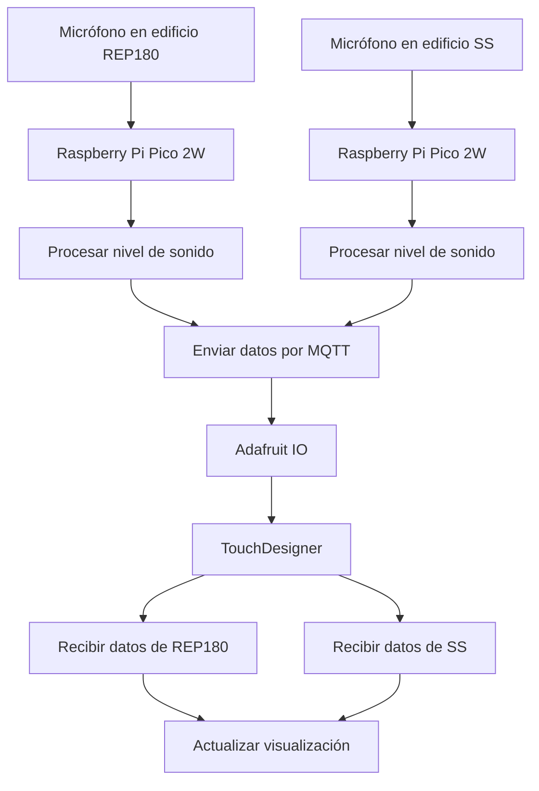
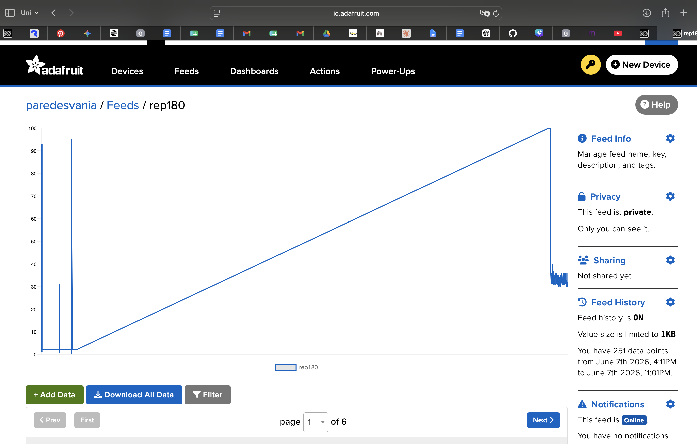

# sesion-13

lunes 08 junio 2026

---

* pseudocódigo
* lista de materiales
* dibujos
* código de prueba con comentarios en consola simulando

---

## Pseudocódigo Raspberry (input)

1. Conectar Raspberry Pi Pico a WiFi
2. Conectar Raspberry Pi Pico a Adafruit IO mediante MQTT
3. MIENTRAS el sistema esté funcionando
4. Leer datos del micrófono
5. Calcular nivel de sonido
6. Convertir nivel de sonido a porcentaje (0% a 100%)
7. Enviar porcentaje al feed MQTT en adafruit

## Pseudocódigo Touchdesigner (output)

1. Conectarse a Adafruit IO mediante MQTT
2. Suscribirse a los feeds de ambos edificios
3. CUANDO llegue un mensaje
  4. Leer valor recibido
  5. Identificar de qué edificio proviene
  6. Actualizar la variable correspondiente
  7. Mostrar el dato en la visualización

### Flujo


### Lista de Materiales

| Cantidad | Componente                 | Descripción                                                  |
| -------- | -------------------------- | ------------------------------------------------------------ |
| 2        | Raspberry Pi Pico 2W       | Microcontroladores con WiFi para capturar y transmitir datos |
| 2        | Módulo micrófono KY-037    | Sensor de sonido con salida analógica                        |
| 2        | Protoboard pequeña         | Montaje temporal de los circuitos                            |
| 6       | Cables dupont  | Conexión entre Pico y micrófono                             |
| 2        | Cable de alimentación  | Alimentación y programación de cada Pico                     |

---

Mi Investigación sobre código la estoy escribiendo en persona02, en la acrpeta examen/grupo02. Pero acá dejo algo:

Logré que funcione, pero aún hay problemas de conexión, cuesta que se conecte a internet y cuando se conecta se vuelve a desconectar.





Mateo me ayudó con eso, me dijo que le pidió a chatgpt reforzar la conexión, este es el link de su conversación: <https://chatgpt.com/share/6a270e2e-6ed0-83e9-9219-f21ec0dc3f2f>

Y funciona!!!


Ahora lo conecté a la cuenta de aaron, así no se me acaba tan rapido el límite de datos que puedo enviar a mi cuenta de adafruit. Los códigos finales que ocupé fueron:

## Código Raspberry

```python
# ============================================================
# SENSOR DE SONIDO — Raspberry Pi Pico 2W
# Examen interacciones inalámbricas
# ============================================================

import time
import board
import analogio
import wifi
import socketpool
import adafruit_minimqtt.adafruit_minimqtt as MQTT

# ============================================================
# CONFIGURACIÓN 
# ============================================================

EDIFICIO      = "grupo02-rep"
WIFI_SSID     = "iPhone de Mateo"
WIFI_PASSWORD = "aaron123"

# ============================================================
# ADAFRUIT IO
# ============================================================

AIO_USERNAME  = "udpmontoyamoraga"
AIO_KEY       = "secreto"
FEED          = f"{AIO_USERNAME}/feeds/{EDIFICIO}"

# ============================================================
# PARÁMETROS
# ============================================================

NUM_MUESTRAS  = 60
PAUSA_MS      = 0.001
INTERVALO_S   = 2.0

PINES_SENSORES = [board.GP26, board.GP27]

# ============================================================
# SENSORES
# ============================================================

sensores = [analogio.AnalogIn(pin) for pin in PINES_SENSORES]
buffers = [[0] * NUM_MUESTRAS for _ in sensores]

# ============================================================
# VARIABLES GLOBALES DE RED
# ============================================================

pool = None
mqtt_cliente = None

# ============================================================
# FUNCIONES WIFI / MQTT
# ============================================================

def estado_wifi():
    """
    Revisa si el WiFi sigue conectado.
    Retorna True si hay conexión, False si no.
    """
    try:
        return wifi.radio.connected
    except Exception:
        return False


def conectar_wifi():
    """
    Conecta o reconecta al WiFi con reintentos.
    """
    print(f"\nConectando a WiFi: '{WIFI_SSID}'")

    while not estado_wifi():
        try:
            wifi.radio.connect(WIFI_SSID, WIFI_PASSWORD)
            time.sleep(1)

            if estado_wifi():
                print("  ✓ WiFi conectado")
                print(f"  IP: {wifi.radio.ipv4_address}")

                try:
                    print(f"  RSSI: {wifi.radio.ap_info.rssi} dBm")
                except Exception:
                    pass

                return True

        except Exception as e:
            print(f"  ✗ Error WiFi: {e}")

        print("  Reintentando WiFi en 5 segundos...")
        time.sleep(5)

def crear_mqtt():
    """
    Crea un nuevo socketpool y un nuevo cliente MQTT.
    Esto es importante después de una caída de WiFi.
    """
    global pool, mqtt_cliente

    pool = socketpool.SocketPool(wifi.radio)

    mqtt_cliente = MQTT.MQTT(
        broker         = "io.adafruit.com",
        port           = 1883,
        username       = AIO_USERNAME,
        password       = AIO_KEY,
        socket_pool    = pool,
        socket_timeout = 1,
        keep_alive     = 30,
    )

def conectar_mqtt():
    """
    Conecta a Adafruit IO.
    Si falla, reintenta.
    """
    global mqtt_cliente

    if mqtt_cliente is None:
        crear_mqtt()

    while True:
        try:
            print("Conectando a Adafruit IO...")
            mqtt_cliente.connect()
            print(f"  ✓ MQTT conectado — feed: {EDIFICIO}")
            return True

        except Exception as e:
            print(f"  ✗ Error MQTT: {e}")

            try:
                mqtt_cliente.disconnect()
            except Exception:
                pass

            print("  Reintentando MQTT en 5 segundos...")
            time.sleep(5)

def desconectar_mqtt_seguro():
    """
    Intenta cerrar MQTT sin romper el programa.
    """
    global mqtt_cliente

    try:
        if mqtt_cliente is not None:
            mqtt_cliente.disconnect()
    except Exception:
        pass

def asegurar_conexiones():
    """
    Revisa WiFi y MQTT.
    Si el WiFi se cayó, reconecta todo desde cero.
    """
    global mqtt_cliente

    # Si WiFi se cayó, reconectar WiFi y recrear MQTT completo
    if not estado_wifi():
        print("\n⚠ WiFi desconectado. Reconectando todo...")

        desconectar_mqtt_seguro()

        conectar_wifi()
        crear_mqtt()
        conectar_mqtt()
        return

    # Si WiFi está OK, mantener vivo MQTT
    try:
        if mqtt_cliente is not None:
           mqtt_cliente.loop(timeout=1)
    except Exception as e:
        print(f"\n⚠ MQTT perdió conexión: {e}")
        print("Reconectando MQTT...")

        desconectar_mqtt_seguro()

        # Si en realidad también cayó WiFi, reconstruir todo
        if not estado_wifi():
            conectar_wifi()
            crear_mqtt()

        conectar_mqtt()

def publicar(valor):
    """
    Publica un valor en Adafruit IO.
    Si falla, reconecta y vuelve a intentar una vez.
    """
    global mqtt_cliente

    try:
        asegurar_conexiones()
        mqtt_cliente.publish(FEED, str(valor))
        print(f"  → Publicado: {valor}%  [{EDIFICIO}]")

    except Exception as e:
        print(f"  ✗ Error al publicar: {e}")
        print("  Intentando reconectar y republicar...")

        try:
            desconectar_mqtt_seguro()
            conectar_wifi()
            crear_mqtt()
            conectar_mqtt()

            mqtt_cliente.publish(FEED, str(valor))
            print(f"  → Republicado: {valor}%  [{EDIFICIO}]")

        except Exception as e2:
            print(f"  ✗ No se pudo republicar: {e2}")

# ============================================================
# MEDICIÓN
# ============================================================

def medir_nivel_sonoro():
    """
    Lee todos los sensores KY-037 conectados por AO.
    Calcula amplitud pico-a-pico y retorna el nivel más alto.
    """
    amplitudes = []

    for i in range(len(sensores)):

        for j in range(NUM_MUESTRAS):
            buffers[i][j] = sensores[i].value
            time.sleep(PAUSA_MS)

        maximo   = max(buffers[i])
        minimo   = min(buffers[i])
        amplitud = maximo - minimo

        porcentaje = min(int((amplitud / 65535) * 100 * 5), 100)

        amplitudes.append(porcentaje)

        print(f"    sensor {i + 1}: pico-a-pico={amplitud} → {porcentaje}%")

    return max(amplitudes)


# ============================================================
# INICIO
# ============================================================

conectar_wifi()
crear_mqtt()
conectar_mqtt()

ultimo_envio = 0

print(f"\n=== [{EDIFICIO.upper()}] Midiendo sonido... ===\n")


# ============================================================
# LOOP PRINCIPAL
# ============================================================

while True:
    try:
        asegurar_conexiones()

        ahora = time.monotonic()

        nivel = medir_nivel_sonoro()

        if (ahora - ultimo_envio) >= INTERVALO_S:
            publicar(nivel)
            ultimo_envio = ahora

    except Exception as e:
        print(f"\n⚠ Error general en loop principal: {e}")
        print("Reiniciando conexiones...")

        try:
            desconectar_mqtt_seguro()
        except Exception:
            pass

        conectar_wifi()
        crear_mqtt()
        conectar_mqtt()

        time.sleep(2)
```

## Codigo Mqtt client / touch designer

```python
# mqttclient1_callbacks

def onConnect(dat, *args):
    dat.subscribe('udpmontoyamoraga/feeds/grupo02-rep')
    dat.subscribe('udpmontoyamoraga/feeds/grupo02-ss')
    print('MQTT conectado')
    return

def onDisconnect(dat, *args):
    print('MQTT desconectado')
    return

def onMessage(dat, topic, payload, qos, retain):
    try:
        valor = float(payload)
        valor = max(0.0, min(100.0, valor))
    except:
        return

    if 'rep180' in topic:
        op('constant_rep').par.value0 = valor
        print(f'[rep180] {valor:.0f}%')

    elif topic.endswith('/ss'):
        op('constant_ss').par.value0 = valor
        print(f'[ss]     {valor:.0f}%')
    return

def onSubscribe(dat, *args):
    print(f'Suscrito a: {args}')
    return

def onUnsubscribe(dat, *args):
    return
```

## Parámetros del mqtt_client DAT


### Video en funcionamiento:
[](https://youtube.com/shorts/eZcYLyGfErY)
