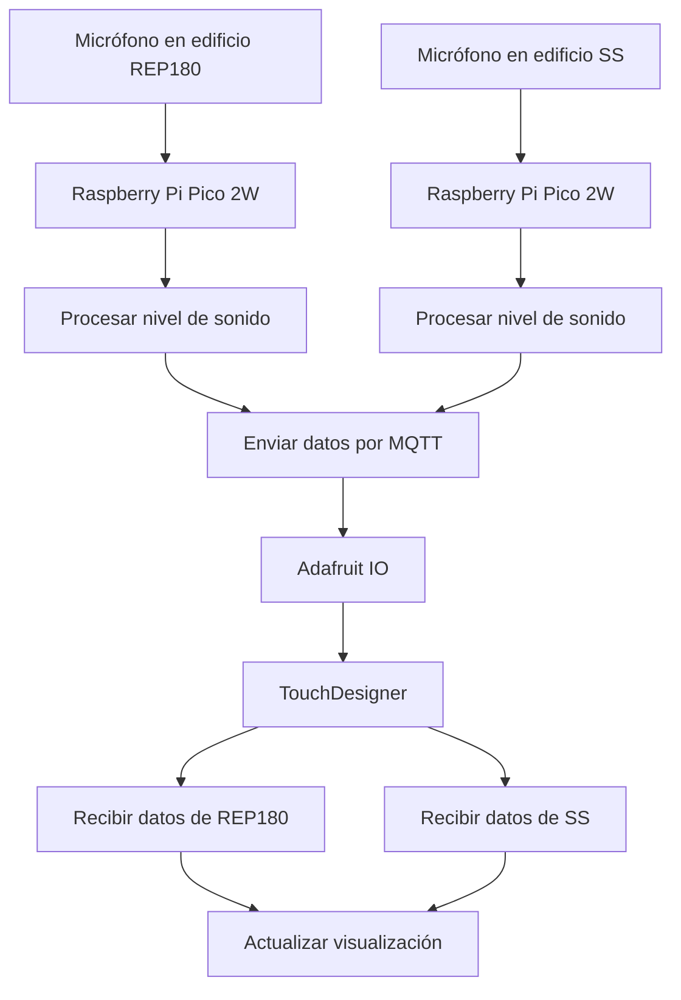

# sesion-13

lunes 08 junio 2026

---

* pseudocódigo
* lista de materiales
* dibujos
* código de prueba con comentarios en consola simulando

---

## Pseudocódigo Raspberry (input)

1. Conectar Raspberry Pi Pico a WiFi
2. Conectar Raspberry Pi Pico a Adafruit IO mediante MQTT
3. MIENTRAS el sistema esté funcionando
   4. Leer datos del micrófono
   5. Calcular nivel de sonido
   6. Convertir nivel de sonido a porcentaje (0% a 100%)
   7. Enviar porcentaje al feed MQTT en adafruit

## Pseudocódigo Touchdesigner (output)

1. Conectarse a Adafruit IO mediante MQTT
2. Suscribirse a los feeds de ambos edificios
3. CUANDO llegue un mensaje
  4. Leer valor recibido
  5. Identificar de qué edificio proviene
  6. Actualizar la variable correspondiente
  7. Mostrar el dato en la visualización

### Flujo

### Lista de Materiales

| Cantidad | Componente                 | Descripción                                                  |
| -------- | -------------------------- | ------------------------------------------------------------ |
| 2        | Raspberry Pi Pico 2W       | Microcontroladores con WiFi para capturar y transmitir datos |
| 2        | Módulo micrófono KY-037    | Sensor de sonido con salida analógica                        |
| 2        | Protoboard pequeña         | Montaje temporal de los circuitos                            |
| 6       | Cables dupont  | Conexión entre Pico y micrófono                             |
| 2        | Cable de alimentación  | Alimentación y programación de cada Pico                     |

