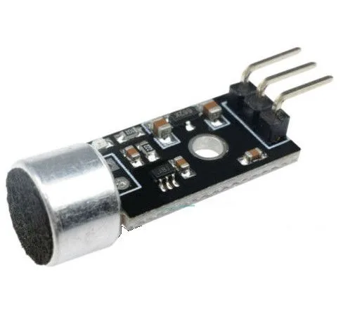
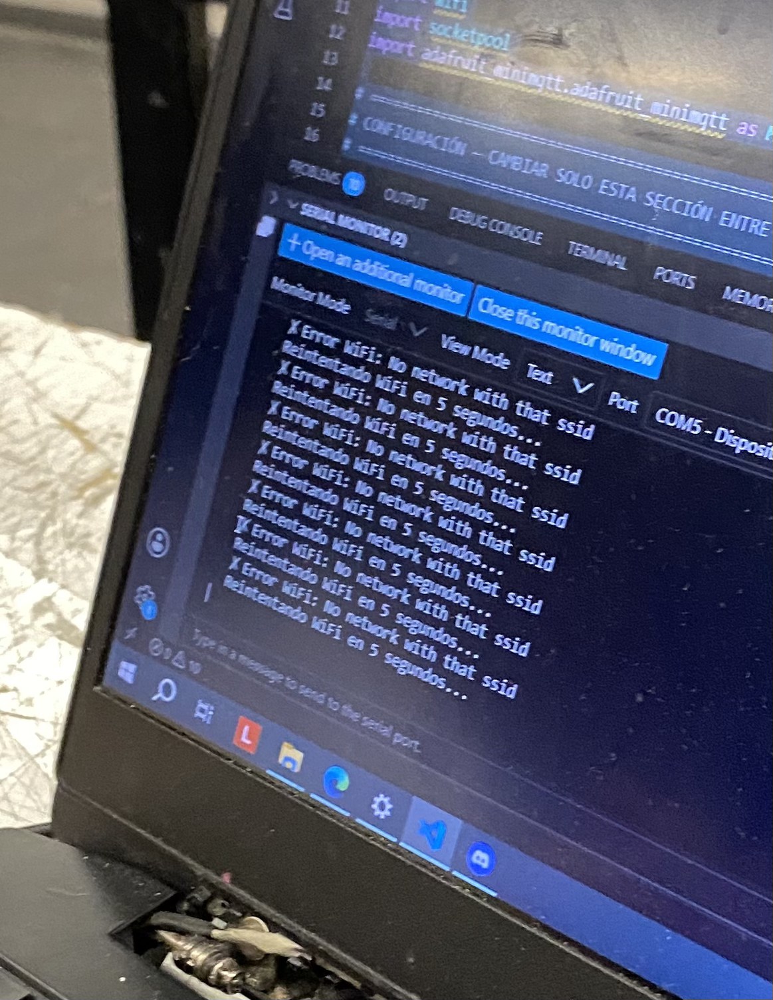

# sesion-14

lunes 15 junio 2026

---
## Trabajo en examen

Hoy pudimos trabajar por primera vez juntas con Cami, ella compró otros micrófonos, que funcionan mejor para sonido ambiente, son estos:

<https://hubot.cl/producto/sensor-analogico-audio-max9812-sku-614/>


> los mic anteriores no detectaban tan bien los sonidos ambiente

lo primero que hicimos fue probar mi código de nuevo, funcionó.

[](https://youtu.be/fMY_MDHsqUs)

[](https://youtube.com/shorts/NO4Tx8xjosk)

Luego probamos el código que tenía Cami:


Pero el problema con su código es que enviaba 3 números distintos, cami me explicó que era porque ella modificó el como se leían los datos ambiente.

Me envió su link con su conversación con claude: <https://claude.ai/chat/7cd64083-1322-4b08-8168-85c80d8ea3de>

Le dije que era mejor ocupar el código que yo tenía para ambas Raspberry, ya que ese código estaba hecho para usarse en ambas cambiando solo el nombre del feed, siendo para una Grupo02-rep y para otra Grupo02-ss.

Lo hicimos y funcionó bien:

[](https://youtube.com/shorts/fLr_ejGx-88?feature=share)

El problema era que los datos que enviaban eran iguales, uno enviaba solo datos grandes de 80 a 100 y el otro pequeos, así que le pedimos a la ia modificar esos valores para que lleguen mas limpios, el micrófono siendo más sensible al ruido.

[](https://youtu.be/3mBjlt_OSWs)

este es el link de mi conversación con claude: <https://claude.ai/share/76b89e2e-c428-4158-8f2e-ccad7250c132>

Luego, subimos este código y en una de las raspberry funcionó perfecto, pero en la otra no se conectaba al internet, estuvimos mucho rato cambiando el hotspot, formateamos la placa, cambiamos de compu y nada:



Era raro que nos funcionara en una placa y en la otra no, siendo que era el mismo internet y mismo código, así que despues de michos intentos Mateo nos prestó su RaspBerry y funcionó de inmediato! mientras arreglabamos lo otro también edité un poquito las visuales en TD y quedó así!

[](https://youtube.com/shorts/NO4Tx8xjosk?feature=share)

## Visual final

[](https://youtu.be/n-fH_hPftp4)

### Códigos

```python
# ============================================================
# SENSOR DE SONIDO — Raspberry Pi Pico 2W + MAX9812
# Examen interacciones inalámbricas
# ============================================================
# CONEXIONES MAX9812:
#   VCC  → Pin 36 (3V3)
#   GND  → Pin 38 (GND)
#   OUT  → Pin 31 (GP26)
# ============================================================

import time
import board
import analogio
import wifi
import socketpool
import adafruit_minimqtt.adafruit_minimqtt as MQTT

# ============================================================
# CONFIGURACIÓN — solo cambia esto entre los dos Picos
# ============================================================

EDIFICIO      = "grupo02-ss"
WIFI_SSID     = "iPhone-cs"
WIFI_PASSWORD = "lasagna342"

AIO_USERNAME  = "udpmontoyamoraga"
AIO_KEY       = "secretooo"

# ============================================================
# PARÁMETROS DE MEDICIÓN
# ============================================================

# El MAX9812 ya tiene 20dB de ganancia incorporada
# así que los umbrales son más bajos que con KY-037
RUIDO_PISO   = 150    # amplitud mínima para contar como sonido
AMPLITUD_MAX = 5000   # amplitud que representa 100%
                      # bajar si no llega a 100% aplaudiendo
                      # subir si se satura muy fácil

NUM_MUESTRAS = 150    # muestras por ráfaga (~15ms sin delay)
INTERVALO_S  = 2.0    # segundos entre envíos (límite Adafruit IO)

# ============================================================
# SENSOR (arreglo para el requisito del curso)
# ============================================================

PINES_SENSORES = [board.GP26]
sensores       = [analogio.AnalogIn(pin) for pin in PINES_SENSORES]

# ============================================================
# RED
# ============================================================

pool         = None
mqtt_cliente = None


def estado_wifi():
    try:
        return wifi.radio.connected
    except Exception:
        return False


def conectar_wifi():
    print(f"Conectando a WiFi: '{WIFI_SSID}'")
    while not estado_wifi():
        try:
            wifi.radio.connect(WIFI_SSID, WIFI_PASSWORD)
            time.sleep(1)
            if estado_wifi():
                print(f"  ✓ WiFi OK — IP: {wifi.radio.ipv4_address}")
                return
        except Exception as e:
            print(f"  ✗ {e}")
        print("  Reintentando en 5s...")
        time.sleep(5)


def crear_mqtt():
    global pool, mqtt_cliente
    pool = socketpool.SocketPool(wifi.radio)
    mqtt_cliente = MQTT.MQTT(
        broker         = "io.adafruit.com",
        port           = 1883,
        username       = AIO_USERNAME,
        password       = AIO_KEY,
        socket_pool    = pool,
        socket_timeout = 1,
        keep_alive     = 30,
    )


def conectar_mqtt():
    intentos = 0
    while True:
        try:
            print("Conectando a Adafruit IO...")
            mqtt_cliente.connect()
            print(f"  ✓ MQTT OK — feed: {EDIFICIO}")
            return
        except Exception as e:
            intentos += 1
            espera = min(3 * intentos, 30)
            print(f"  ✗ {e}. Reintentando en {espera}s...")
            try:
                mqtt_cliente.disconnect()
            except Exception:
                pass
            time.sleep(espera)


def asegurar_conexiones():
    if not estado_wifi():
        print("WiFi caído. Reconectando...")
        try:
            mqtt_cliente.disconnect()
        except Exception:
            pass
        conectar_wifi()
        crear_mqtt()
        conectar_mqtt()
        return
    try:
        mqtt_cliente.loop(timeout=1)
    except Exception as e:
        print(f"MQTT caído: {e}. Reconectando...")
        try:
            mqtt_cliente.disconnect()
        except Exception:
            pass
        if not estado_wifi():
            conectar_wifi()
            crear_mqtt()
        conectar_mqtt()


def publicar(valor):
    try:
        asegurar_conexiones()
        mqtt_cliente.publish(f"{AIO_USERNAME}/feeds/{EDIFICIO}", str(valor))
        print(f"  → {EDIFICIO}: {valor}%")
    except Exception as e:
        print(f"  ✗ Error: {e}")
        try:
            mqtt_cliente.disconnect()
        except Exception:
            pass
        conectar_wifi()
        crear_mqtt()
        conectar_mqtt()

# ============================================================
# MEDICIÓN — pico máximo sin promediar
# ============================================================

def medir_pico():
    """
    Recorre el arreglo de sensores con un bucle for.
    En cada sensor toma una ráfaga rápida y calcula
    la amplitud pico-a-pico SIN promediar.
    Retorna el nivel más alto entre todos los sensores.
    """
    niveles = []

    for i in range(len(sensores)):

        # Ráfaga rápida sin delays (bucle for + arreglo)
        maximo = 0
        minimo = 65535
        for j in range(NUM_MUESTRAS):
            v = sensores[i].value
            if v > maximo:
                maximo = v
            if v < minimo:
                minimo = v

        amplitud = maximo - minimo

        if amplitud < RUIDO_PISO:
            porcentaje = 0
        else:
            porcentaje = int(((amplitud - RUIDO_PISO) / AMPLITUD_MAX) * 100)
            porcentaje = max(0, min(100, porcentaje))

        niveles.append(porcentaje)

    return max(niveles)

# ============================================================
# INICIO
# ============================================================

conectar_wifi()
crear_mqtt()
conectar_mqtt()

ultimo_envio = 0
pico_maximo  = 0       # guarda el pico más alto desde el último envío

print(f"\n=== [{EDIFICIO.upper()}] Escuchando... ===\n")

# ============================================================
# LOOP PRINCIPAL
# ============================================================

while True:
    try:
        # Medir constantemente
        nivel = medir_pico()

        # Guardar el pico más alto visto (no promediar)
        if nivel > pico_maximo:
            pico_maximo = nivel
            print(f"    nuevo pico: {pico_maximo}%")

        # Enviar cada INTERVALO_S segundos
        ahora = time.monotonic()
        if (ahora - ultimo_envio) >= INTERVALO_S:
            publicar(pico_maximo)
            pico_maximo = 0        # resetear después de enviar
            ultimo_envio = ahora

    except Exception as e:
        print(f"Error: {e}. Reconectando...")
        try:
            mqtt_cliente.disconnect()
        except Exception:
            pass
        conectar_wifi()
        crear_mqtt()
        conectar_mqtt()
        time.sleep(2)
```
```python
print("Hello World!")
# ============================================================
# SENSOR DE SONIDO — Raspberry Pi Pico 2W + MAX9812
# Examen interacciones inalámbricas
# ============================================================
# CONEXIONES MAX9812:
#   VCC  → Pin 36 (3V3)
#   GND  → Pin 38 (GND)
#   OUT  → Pin 31 (GP26)
# ============================================================

import time
import board
import analogio
import wifi
import socketpool
import adafruit_minimqtt.adafruit_minimqtt as MQTT

# ============================================================
# CONFIGURACIÓN — solo cambia esto entre los dos Picos
# ============================================================

EDIFICIO      = "grupo02-rep"
WIFI_SSID     = "iPhone-cs"
WIFI_PASSWORD = "lasagna342"

AIO_USERNAME  = "udpmontoyamoraga"
AIO_KEY       = "secretoo"

# ============================================================
# PARÁMETROS DE MEDICIÓN
# ============================================================

# El MAX9812 ya tiene 20dB de ganancia incorporada
# así que los umbrales son más bajos que con KY-037
RUIDO_PISO   = 150    # amplitud mínima para contar como sonido
AMPLITUD_MAX = 5000   # amplitud que representa 100%
                      # bajar si no llega a 100% aplaudiendo
                      # subir si se satura muy fácil

NUM_MUESTRAS = 150    # muestras por ráfaga (~15ms sin delay)
INTERVALO_S  = 2.0    # segundos entre envíos (límite Adafruit IO)

# ============================================================
# SENSOR (arreglo para el requisito del curso)
# ============================================================

PINES_SENSORES = [board.GP26]
sensores       = [analogio.AnalogIn(pin) for pin in PINES_SENSORES]

# ============================================================
# RED
# ============================================================

pool         = None
mqtt_cliente = None


def estado_wifi():
    try:
        return wifi.radio.connected
    except Exception:
        return False


def conectar_wifi():
    print(f"Conectando a WiFi: '{WIFI_SSID}'")
    while not estado_wifi():
        try:
            wifi.radio.connect(WIFI_SSID, WIFI_PASSWORD)
            time.sleep(1)
            if estado_wifi():
                print(f"  ✓ WiFi OK — IP: {wifi.radio.ipv4_address}")
                return
        except Exception as e:
            print(f"  ✗ {e}")
        print("  Reintentando en 5s...")
        time.sleep(5)


def crear_mqtt():
    global pool, mqtt_cliente
    pool = socketpool.SocketPool(wifi.radio)
    mqtt_cliente = MQTT.MQTT(
        broker         = "io.adafruit.com",
        port           = 1883,
        username       = AIO_USERNAME,
        password       = AIO_KEY,
        socket_pool    = pool,
        socket_timeout = 1,
        keep_alive     = 30,
    )


def conectar_mqtt():
    intentos = 0
    while True:
        try:
            print("Conectando a Adafruit IO...")
            mqtt_cliente.connect()
            print(f"  ✓ MQTT OK — feed: {EDIFICIO}")
            return
        except Exception as e:
            intentos += 1
            espera = min(3 * intentos, 30)
            print(f"  ✗ {e}. Reintentando en {espera}s...")
            try:
                mqtt_cliente.disconnect()
            except Exception:
                pass
            time.sleep(espera)


def asegurar_conexiones():
    if not estado_wifi():
        print("WiFi caído. Reconectando...")
        try:
            mqtt_cliente.disconnect()
        except Exception:
            pass
        conectar_wifi()
        crear_mqtt()
        conectar_mqtt()
        return
    try:
        mqtt_cliente.loop(timeout=1)
    except Exception as e:
        print(f"MQTT caído: {e}. Reconectando...")
        try:
            mqtt_cliente.disconnect()
        except Exception:
            pass
        if not estado_wifi():
            conectar_wifi()
            crear_mqtt()
        conectar_mqtt()


def publicar(valor):
    try:
        asegurar_conexiones()
        mqtt_cliente.publish(f"{AIO_USERNAME}/feeds/{EDIFICIO}", str(valor))
        print(f"  → {EDIFICIO}: {valor}%")
    except Exception as e:
        print(f"  ✗ Error: {e}")
        try:
            mqtt_cliente.disconnect()
        except Exception:
            pass
        conectar_wifi()
        crear_mqtt()
        conectar_mqtt()

# ============================================================
# MEDICIÓN — pico máximo sin promediar
# ============================================================

def medir_pico():
    """
    Recorre el arreglo de sensores con un bucle for.
    En cada sensor toma una ráfaga rápida y calcula
    la amplitud pico-a-pico SIN promediar.
    Retorna el nivel más alto entre todos los sensores.
    """
    niveles = []

    for i in range(len(sensores)):

        # Ráfaga rápida sin delays (bucle for + arreglo)
        maximo = 0
        minimo = 65535
        for j in range(NUM_MUESTRAS):
            v = sensores[i].value
            if v > maximo:
                maximo = v
            if v < minimo:
                minimo = v

        amplitud = maximo - minimo

        if amplitud < RUIDO_PISO:
            porcentaje = 0
        else:
            porcentaje = int(((amplitud - RUIDO_PISO) / AMPLITUD_MAX) * 100)
            porcentaje = max(0, min(100, porcentaje))

        niveles.append(porcentaje)

    return max(niveles)

# ============================================================
# INICIO
# ============================================================

conectar_wifi()
crear_mqtt()
conectar_mqtt()

ultimo_envio = 0
pico_maximo  = 0       # guarda el pico más alto desde el último envío

print(f"\n=== [{EDIFICIO.upper()}] Escuchando... ===\n")

# ============================================================
# LOOP PRINCIPAL
# ============================================================

while True:
    try:
        # Medir constantemente
        nivel = medir_pico()

        # Guardar el pico más alto visto (no promediar)
        if nivel > pico_maximo:
            pico_maximo = nivel
            print(f"    nuevo pico: {pico_maximo}%")

        # Enviar cada INTERVALO_S segundos
        ahora = time.monotonic()
        if (ahora - ultimo_envio) >= INTERVALO_S:
            publicar(pico_maximo)
            pico_maximo = 0        # resetear después de enviar
            ultimo_envio = ahora

    except Exception as e:
        print(f"Error: {e}. Reconectando...")
        try:
            mqtt_cliente.disconnect()
        except Exception:
            pass
        conectar_wifi()
        crear_mqtt()
        conectar_mqtt()
        time.sleep(2)
```
Lo que hace este código es medir sonido constantemente, toma 150 lecturas de los micrófonos lo más rápido posible, sin pausas, esso tarda unos 15ms, de esas 150 lecturas busca el valor más alto y el más bajo, y calcula la diferencia:

amplitud = máximo - mínimo


En silencio esa diferencia es pequeña, con un aplauso por ejemplo es grande, eso lo convierte a un porcentaje 0-100.

No promedia nada, lo que hace es que si hubo un pico en esas 150 lecturas, lo captura, guarda el pico más alto.

si nivel actual > pico guardado -> actualiza el pico

Cada 2 segundos envía ese pico y lo resetea

Manda un número entre 0 y 100 al feed de Adafruit IO, y vuelve a empezar desde 0.

---

Qué llega a TouchDesigner: Un número entre 0 y 100 cada 2 segundos:

silencio total     ->  0

voz suave          -> 15–30

voz fuerte         -> 40–60

aplauso            -> 70–100

No es el nivel promedio del ambiente, es el momento más ruidoso de los últimos 2 segundos, si todo estuvo en silencio menos un aplauso, llega 85, si estuvo todo en silencio, llega 0.
