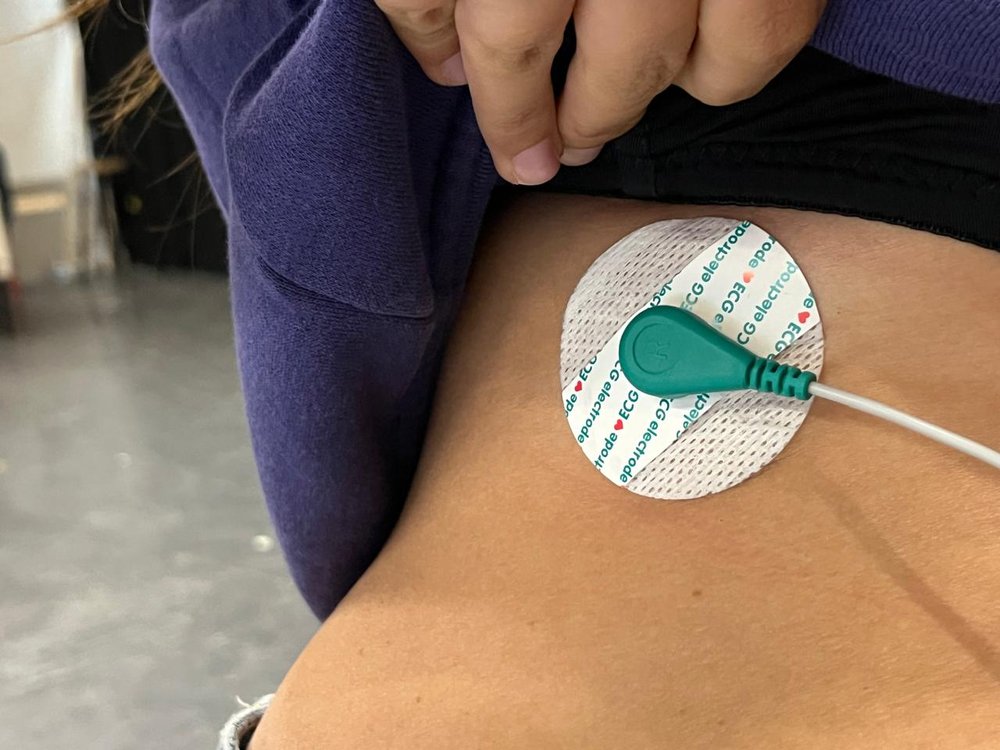
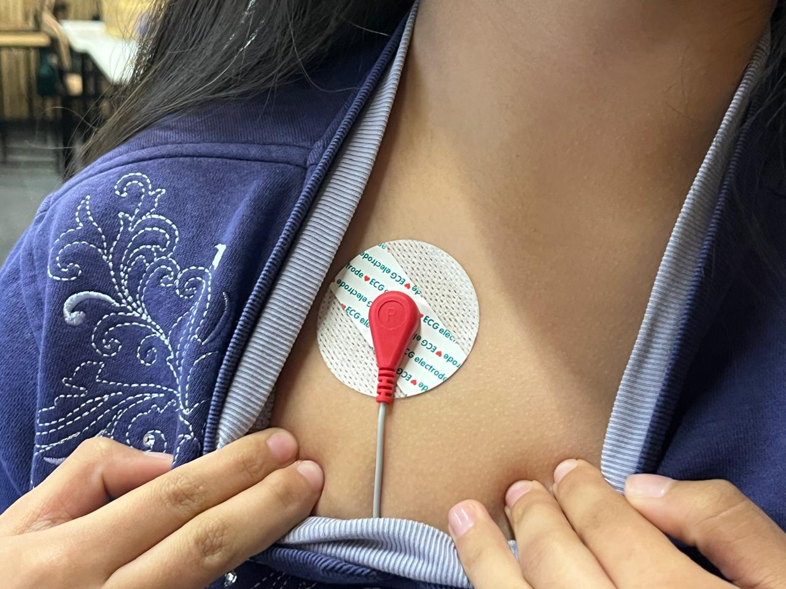

# sesion-14

lunes 15 junio 2026

El día de hoy realizamos trabajo en clase, intendo realizar nuestras conexiones para nuestro examen.

## Listado de materiales final

| Componente | Valor Unidad | Cantidad | Link |
| --- | --- | --- | --- |
| Arduino UNO R4 WiFi | $38.990 | 2 | <https://arduino.cl/producto/arduino-uno-r4-wifi/?srsltid=AfmBOopyyargcSiTQeFlT3cTN5ide380bxZlQXRZVP4u_op0O-qJcENB> |
| Mini protoboard 170 puntos | $990 | 2 | <https://afel.cl/products/mini-protoboard-170-puntos?_pos=4&_sid=aa0b39e11&_ss=r |
| Cables Dupont (Pack 20 unidades) | $1.000 | 1 | <https://afel.cl/products/pack-20-cables-de-conexion-macho-macho> |
| Sensor de Frecuencia Cardíaca ECG AD8232 Electrocardiograma | $9.990 | 1 | <https://afel.cl/products/sensor-de-frecuencia-cardiaca-ecg-ad8232-electrocardiograma> |
| Pantalla TFT LCD redonda de 1.28" | $4.990 | 1 | <https://www.mechatronicstore.cl/pantalla-tft-lcd-redonda-de-1-28/?srsltid=AfmBOormrgaJyuZokh0vmjczLkHKXalCX8OpIDNKoXI-k0D8GjpyM3mX
| Electrodos PACH ECG TENS 5 unidades | $1.500 | 1 | <https://rambal.com/biometricos/1238-electrodo-ecg.html
| Cable USB C | X | 2 | X

Nos funcionó un código el día de hoy, mostrando datos en la pantalla, pero la visualización de la pantalla no era muy clara. Mateo nos prestó otra pensando que estaba mala la inicial, pero no, según nosotras son los cables (comprar cables nuevos).

## Códigos probados hoy

```cpp
#include <WiFiS3.h>
#include "AdafruitIO_WiFi.h"

#include <Arduino_GFX_Library.h>

// ---------------- WIFI ----------------
#define WIFI_SSID "iPhone de Renata"
#define WIFI_PASS "arevalo1234"

// ---------------- ADAFRUIT ----------------
#define IO_USERNAME "arevalourra"
#define IO_KEY "TU_KEY"

// FEEDS
AdafruitIO_WiFi io(IO_USERNAME, IO_KEY, WIFI_SSID, WIFI_PASS);

AdafruitIO_Feed *bpmFeed =
  io.feed("examen-grupo04-bpm");

AdafruitIO_Feed *estadoFeed =
  io.feed("examen-grupo04-ecg");

// ---------------- PANTALLA GC9A01 ----------------

Arduino_DataBus *bus =
  new Arduino_HWSPI(
    9,    // DC
    10    // CS
  );

Arduino_GFX *gfx =
  new Arduino_GC9A01(
    bus,
    8,    // RESET
    0,    // rotación
    true
  );

// ---------------- VARIABLES ----------------

String bpm = "--";
String estado = "---";

void dibujarPantalla()
{
  gfx->fillScreen(0x0000);

  gfx->setTextColor(0xFFFF);

  gfx->setTextSize(2);
  gfx->setCursor(30, 40);
  gfx->println("ECG");

  gfx->setTextSize(4);
  gfx->setCursor(40, 90);
  gfx->println(bpm);

  gfx->setTextSize(2);
  gfx->setCursor(20, 170);
  gfx->println(estado);
}

// ---------- CALLBACK BPM ----------

void handleBPM(AdafruitIO_Data *data)
{
  bpm = data->toString();

  Serial.print("BPM recibido: ");
  Serial.println(bpm);

  dibujarPantalla();
}

// ---------- CALLBACK ESTADO ----------

void handleEstado(AdafruitIO_Data *data)
{
  estado = data->toString();

  Serial.print("Estado recibido: ");
  Serial.println(estado);

  dibujarPantalla();
}

void setup()
{
  Serial.begin(115200);

  gfx->begin();

  gfx->fillScreen(0x0000);

  gfx->setTextColor(0xFFFF);

  gfx->setTextSize(2);
  gfx->setCursor(20,120);
  gfx->println("Conectando...");

  Serial.println("Conectando Adafruit IO");

  io.connect();

  while(io.status() < AIO_CONNECTED)
  {
    Serial.print(".");
    delay(500);
  }

  Serial.println();
  Serial.println("Conectado!");

  bpmFeed->onMessage(handleBPM);
  estadoFeed->onMessage(handleEstado);

  bpmFeed->get();
  estadoFeed->get();

  dibujarPantalla();
}

void loop()
{
  io.run();
}
```

```cpp
#include <WiFiS3.h>
#include "AdafruitIO_WiFi.h"

#include <Arduino_GFX_Library.h>

// ---------------- WIFI ----------------
#define WIFI_SSID "TU_WIFI"
#define WIFI_PASS "TU_CLAVE"

// ---------------- ADAFRUIT ----------------
#define IO_USERNAME "TU_USUARIO"
#define IO_KEY "TU_KEY"

// FEEDS
AdafruitIO_WiFi io(IO_USERNAME, IO_KEY, WIFI_SSID, WIFI_PASS);

AdafruitIO_Feed *bpmFeed =
  io.feed("examen-grupo04-bpm");

AdafruitIO_Feed *estadoFeed =
  io.feed("examen-grupo04-ecg");

// ---------------- PANTALLA GC9A01 ----------------

Arduino_DataBus *bus =
  new Arduino_HWSPI(
    9,    // DC
    10    // CS
  );

Arduino_GFX *gfx =
  new Arduino_GC9A01(
    bus,
    8,    // RESET
    0,    // rotación
    true
  );

// ---------------- VARIABLES ----------------

String bpm = "--";
String estado = "---";

void dibujarPantalla()
{
  gfx->fillScreen(0x0000);

  gfx->setTextColor(0xFFFF);

  gfx->setTextSize(2);
  gfx->setCursor(30, 40);
  gfx->println("ECG");

  gfx->setTextSize(4);
  gfx->setCursor(40, 90);
  gfx->println(bpm);

  gfx->setTextSize(2);
  gfx->setCursor(20, 170);
  gfx->println(estado);
}

// ---------- CALLBACK BPM ----------

void handleBPM(AdafruitIO_Data *data)
{
  bpm = data->toString();

  Serial.print("BPM recibido: ");
  Serial.println(bpm);

  dibujarPantalla();
}

// ---------- CALLBACK ESTADO ----------

void handleEstado(AdafruitIO_Data *data)
{
  estado = data->toString();

  Serial.print("Estado recibido: ");
  Serial.println(estado);

  dibujarPantalla();
}

void setup()
{
  Serial.begin(115200);

  gfx->begin();

  gfx->fillScreen(0x0000);

  gfx->setTextColor(0xFFFF);

  gfx->setTextSize(2);
  gfx->setCursor(20,120);
  gfx->println("Conectando...");

  Serial.println("Conectando Adafruit IO");

  io.connect();

  while(io.status() < AIO_CONNECTED)
  {
    Serial.print(".");
    delay(500);
  }

  Serial.println();
  Serial.println("Conectado!");

  bpmFeed->onMessage(handleBPM);
  estadoFeed->onMessage(handleEstado);

  bpmFeed->get();
  estadoFeed->get();

  dibujarPantalla();
}

void loop()
{
  io.run();
}
```

## Conexiones a mi cuerpo 





