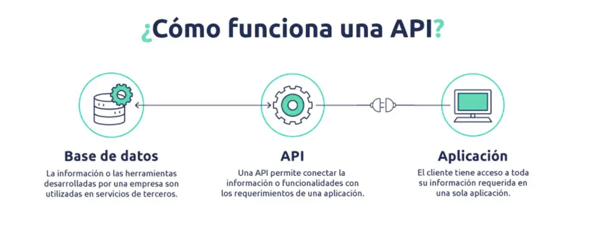

# sesion-12

lunes 01 junio 2026

---

## Apuntes

- `Arrays:` Significa "arreglo"; los arreglos nos permiten almacenar datos del mismo tipo.
  - voy a convertir una variable en un arreglo, por ende en esa variable estarán todos los datos en donde se pueden hacer arreglos.
- En este proyecto para examen, hablemos de que queremos hacer, que queremos transmitir
- Hoy trabajemos en el lenguaje, presentar el proyecto como si fuera portafolio

### [Yeseul Song](https://yeseul.com/)

- Artista nacida en Corea del Sur que utiliza la tecnología, la interacción y la participación como medio artístico.
- Sus obras exploran las posibilidades creativas de los sentidos no visuales mediante lenguajes sensoriales.
- Su trabajo cuestiona nuestra percepción, pensamiento e interacción habituales a través de experiencias perceptivas novedosas.
- Es conocida principalmente por Esculturas Invisibles (2018-2021), una serie de esculturas experimentales no visuales compuestas de sonido, calor, aire, olor y pensamiento.

### API

- Una API (Application Programming Interface o Interfaz de Programación de Aplicaciones) es un conjunto de reglas y protocolos que permite que diferentes aplicaciones de software se comuniquen y compartan información entre sí.
  - <https://openweathermap.org/api>
  - <https://www.ibm.com/es-es/think/topics/api>
  - weird apis for the arts

**¿Qué es una API?**

`API:` *Application Programming Interface*

Una API, o interfaz de programación de aplicaciones, es un conjunto de reglas o protocolos que permite a las aplicaciones informáticas comunicarse entre sí para intercambiar datos, características y funcionalidades.

Las API simplifican y aceleran el desarrollo de aplicaciones y software permitiendo a los desarrolladores integrar datos, servicios y capacidades de otras aplicaciones, en vez de hacerlas desde cero.

Las API permiten compartir solo la información necesaria, manteniendo ocultos otros detalles internos del sistema, lo que ayuda a la seguridad del sistema. Los servidores o dispositivos no tienen que exponer completamente los datos: las API permiten compartir pequeños paquetes de datos, relevantes para la solicitud específica.

A diferencia de una interfaz de usuario (UX), que conecta a una persona con un computador, una *API* conecta a dos softwares o partes de un software. 

**¿Cómo funciona una API?**

La API es el puente que establece la conexión entre ellos.

`Ejemplo:` El procesamiento de pagos a terceros. Cuando alguien compra por internet, a veces te piden "pague con Paypal" u otro tipo de sistema. Bueno, esta función depende de las API para realizar el pago o la conexión.

Si bien la transferencia de datos es según el servicio web utilizado, las solicitudes y respuestas se realizan a través de una API. No hay visibilidad en la interfaz de usuario, lo que significa que las API intercambian datos dentro del ordenador o la aplicación, y aparecen ante el usuario como una conexión sin fisuras.

imagen sacada de: <https://outvio.com/es/blog/que-es-una-api/>

---

`Examen`

- Estudios inalámbricos poéticos
- grupos de 3 o 4 personas
- Excepciones puntuales si es que tienen notas sobre 6.7
- Individuales:
  - investigación sobre apis
  - bitácoras y proceso x2
    
¿qué es un servicio web?

### Trabajo en clases

`Párrafo 1:` Dos edificios que actúan al unísono, sin saberlo. Un sensor en el LID, otro  en la biblioteca, cada uno contando y midiendo presencia, traduciendo lo humano a pulsos digitales. Entre ellos, no está vacío: viaja un protocolo, una API recibe el conteo, lo procesa, lo devuelve transformado; y un actuador responde: una pantalla que se ilumina, un LED que cambia de color, una señal que dice aquí hay vida. El sistema nervioso oculto de los lugares donde pensamos, construido sobre microcontroladores, WiFi y la pregunta técnicamente precisa pero profundamente humana: ¿cuántos habitan tus pasillos ahora mismo?

`Preguntas hechas por compañeros y Aarón:`

1. está a medio camino entre no tener implementación técnica concreta, hablando de sensor y actuador, pero solamente mencionar presencia, pero no describir el contexto de uso, los mensajes que quieran transmitir, las velocidades que quieran usar, o la poética detrás, recomiendo nombrar el proyecto
2. ¿cómo se comunica visualmente el conteo al usuario final? ¿qué significan los distintos colores del led?
3. ¿qué sensor van a ocupar para detectar a un ser vivo?

`Corrección:`

(al final lo corregimos en la siguiente clase!!)

***Grupo 6:***

**Nombre proyecto:** Espacios Entrelazados / Dualidad de espacios

Dos edificios que actúan al unísono, sin saberlo. ¿Cuántos habitan los lugares de trabajo? ¿Cuál es el flujo durante el día?

Nuestro proyecto parte desde la pregunta `¿Cuántos habitan los lugares de trabajo?`, nos interesa capturar el conteo de personas que entran y salen al ocupar los lugares de trabajo en la Universidad (los dos edificios). 

SpaceSync nace de esa pregunta. Dos facultades, dos espacios de trabajo — el LID y la biblioteca — que coexisten sin saber realmente cuánta vida circula en cada una. Nuestro proyecto propone tender un puente invisible entre ambas: sensores que cuentan personas, microcontroladores que traducen presencia humana en datos, y una API que transporta esa información de un edificio al otro en tiempo real.
Lo que buscamos no es solo un número en una pantalla. Es hacer visible el ritmo con que los espacios se llenan y se vacían, los momentos en que el LID desborda y la biblioteca respira, o viceversa. Esa fluctuación constante — que todos vivimos pero nadie registra — se convierte aquí en una visualización que pulsa al ritmo de la ocupación real.
Creemos que entender cómo habitamos los espacios compartidos es el primer paso para habitarlos mejor. SpaceSync no mide metros cuadrados: mide presencia, movimiento, comunidad.
