# sesion-13

lunes 08 junio 2026

---

## Corrección

- Párrafo de prueba: Este proyecto consiste en un sistema que conecta el LID y la biblioteca para medir cuántas personas entran y salen de cada lugar en tiempo real. En la puerta de cada edificio se instalan dos sensores infrarrojos industriales conectados a una placa Arduino con WiFi. Al colocar dos sensores en fila, el sistema detecta de forma automática la dirección de la persona: si pasa primero por el de afuera y luego por el de adentro, cuenta como una entrada; si lo hace al revés, cuenta como una salida. Esta información se envía de manera inalámbrica a través de Internet a una base de datos (API) que lleva el conteo exacto. Finalmente, el sistema responde encendiendo una pantalla o luces LED en el otro edificio; de esta forma, las personas que están en la biblioteca pueden ver mediante una señal visual qué tan lleno está el LID, y viceversa, automatizando el registro de ocupación de los espacios del campus.

Sensor Infrarrojo Evasor de Obstáculos y Anillo LED RGB WS2812 de 16 leds.

Dos edificios que actúan al unísono, sin saberlo. ¿Cuántos habitan los lugares de trabajo? ¿Cuál es el flujo durante el día?

`Preguntas hechas por compañeros y Aarón:`

1. está a medio camino entre no tener implementación técnica concreta, hablando de sensor y actuador, pero solamente mencionar presencia, pero no describir el contexto de uso, los mensajes que quieran transmitir, las velocidades que quieran usar, o la poética detrás, recomiendo nombrar el proyecto
2. ¿cómo se comunica visualmente el conteo al usuario final? ¿qué significan los distintos colores del led?
3. ¿qué sensor van a ocupar para detectar a un ser vivo?

---

`Corrección:`

***Grupo 6:***

**Nombre proyecto:** Puente digital

Nuestro proyecto parte desde la pregunta `¿Cuántos habitan los lugares de trabajo?`, nos interesa capturar el conteo de personas que entran al lugar de trabajo en la Universidad; y visualizarlo en el otro edificio. En este caso, ver cuanta gente entra al LID en Salvador Sanfuentes y visualizarlo en Rep180. Dos edificios, dos espacios de trabajo que coexisten sin saber cuánta gente entra en cada una. En la puerta del LID se instala un *Sensor Infrarrojo Evasor de Obstáculos* conectado a una Raspberry PI Pico 2W, que mide el flujo de gente que entra a este espacio; esto lo denominaremos `entrada`. Esta información se envía de manera inalámbrica a través de wifi a una base de datos (API o Adafruit) que lleva el conteo de la gente. Finalmente, en Rep180, el sistema responde encendiendo y completando cada píxel de un *Anillo LED RGB WS2812 de 16 leds* conectada al Arduino UNO R4 wifi; de esta manera, las personas que están en Rep180 pueden ver mediante una señal visual qué tan rápido se va llenando el LID, esto lo denominaremos `salida`. El mensaje que queremos transmitir es hacer visible el ritmo con que los espacios se llenan, los momentos en que el LID se desborda; es una fluctuación constante que todos vivimos pero nadie registra. 

**Entrada:** Sensor Infrarrojo Evasor de Obstáculos

**Salida:** Anillo LED RGB WS2812 de 16 leds

**Medio de visualización:** Adafruit IO (medio de visualización para lectura de datos)

`Idea de mateo:` Hacer un totém mini que esté la pantalla Oled o el Anillo de leds, en la oficina de Aarón, para que vea cuánta gente está en el LID

### Pseudocódigo

```bash
PROYECTO: Puente Digital
EDIFICIO A → LID (Salvador Sanfuentes)
EDIFICIO B → Rep180

════════════════════════════════════════
MÓDULO A — Arduino UNO R4 WiFi (LID)
════════════════════════════════════════

VARIABLES:
  conteo        ← 0
  umbral        ← 16        // máximo del anillo LED
  estadoSensor  ← LIBRE

INICIALIZAR:
  conectar WiFi (SSID, PASSWORD)
  conectar Adafruit IO (usuario, clave, feed: "lid-conteo")
  configurar pin sensor infrarrojo como ENTRADA

BUCLE PRINCIPAL:
  LEER estadoSensor ← sensor infrarrojo

  SI estadoSensor == OBSTRUIDO:
    esperar hasta estadoSensor == LIBRE   // persona cruzó completamente
    conteo ← conteo + 1
    
    SI conteo > umbral:
      conteo ← umbral                    // tope máximo

    PUBLICAR conteo → Adafruit IO (feed: "lid-conteo")
    esperar 500ms                        // evitar lecturas duplicadas

════════════════════════════════════════
MÓDULO B — Arduino UNO R4 WiFi (Rep180)
════════════════════════════════════════

VARIABLES:
  conteo        ← 0
  totalLeds     ← 16
  ledsActivos   ← 0

INICIALIZAR:
  conectar WiFi (SSID, PASSWORD)
  conectar Adafruit IO (usuario, clave, feed: "lid-conteo")
  configurar anillo LED WS2812 (16 leds)
  apagar todos los LEDs

BUCLE PRINCIPAL:
  SUSCRIBIR a Adafruit IO (feed: "lid-conteo")

  SI llega nuevo valor:
    conteo ← valor recibido
    ledsActivos ← MAPEAR(conteo, 0, 16, 0, totalLeds)

    PARA i DESDE 0 HASTA totalLeds - 1:
      SI i < ledsActivos:
        SI ledsActivos <= 5:
          encender LED[i] → color VERDE   // poco ocupado
        SI ledsActivos <= 10:
          encender LED[i] → color AMARILLO // ocupación media
        SI ledsActivos <= 16:
          encender LED[i] → color ROJO    // casi lleno o lleno
      SINO:
        apagar LED[i]

════════════════════════════════════════
ADAFRUIT IO — Canal intermedio
════════════════════════════════════════

  Feed: "lid-conteo"
  Módulo A publica  → conteo actualizado
  Módulo B escucha  → recibe conteo y actualiza LEDs
```

### Diagrama en Mermaid de Pseudocódigo

```mermaid
flowchart LR

    subgraph A["MÓDULO A — Arduino UNO R4 WiFi (LID)"]
        A1[Sensor Infrarrojo]
        A2[Detectar persona]
        A3[Esperar que el sensor quede libre]
        A4[conteo = conteo + 1]
        A5{conteo > 16?}
        A6[conteo = 16]
        A7[Publicar conteo]
        
        A1 --> A2
        A2 --> A3
        A3 --> A4
        A4 --> A5
        A5 -- Sí --> A6
        A5 -- No --> A7
        A6 --> A7
    end

    subgraph IO["Adafruit IO"]
        IO1[(Feed: lid-conteo)]
    end

    subgraph B["MÓDULO B — Arduino UNO R4 WiFi (Rep180)"]
        B1[Recibir conteo]
        B2[Mapear conteo a LEDs activos]
        B3{Cantidad de LEDs}
        B4[Verde<br/>0–5 LEDs]
        B5[Amarillo<br/>6–10 LEDs]
        B6[Rojo<br/>11–16 LEDs]
        B7[Actualizar anillo WS2812]
        
        B1 --> B2
        B2 --> B3
        B3 --> B4
        B3 --> B5
        B3 --> B6
        B4 --> B7
        B5 --> B7
        B6 --> B7
    end

    A7 --> IO1
    IO1 --> B1

    classDef Mint stroke-width:1px,stroke-dasharray:none,stroke:#99F2CC,fill:#EDFFF7,color:#4C7A66;
    classDef Sunset stroke-width:1px,stroke:#FFB38A,fill:#FFF1E8,color:#8A4A2F;
    classDef YellowSoft stroke-width:1px, stroke-dasharray:none, stroke:#E6C84C, fill:#FFF8D9, color:#7A6720

    class A1,A2,A3,A4,A5,A6,A7 Mint;
    class B1,B2,B3,B4,B5,B6,B7 Sunset;
    class IO1 YellowSoft;

```



### Lista de materiales, bill of materials

|Componente|Cantidad|Precio|Link|
|---|---|---|---|
|Raspberry Pi Pico 2W|1|$14.990|<https://raspberrypi.cl/products/raspberry-pi-pico-2-w-con-headers>|
|Arduino UNO R4 WIFI|1|$38.990|<https://mcielectronics.cl/shop/product/arduino-uno-r4-minima>|
|Anillo LED RGB WS2812 de 16 leds|1|$3.990|<https://afel.cl/products/anillo-led-rgb-neopixel-16-leds-ws2812?_pos=3&_sid=3a945a998&_ss=r>|
|Sensor Infrarrojo Evasor de Obstáculos|1|$2.000|<https://afel.cl/products/sensor-infrarrojo-evasor-de-obstaculos?_pos=1&_sid=96b6bad10&_ss=r>|
|Protoboard|1|$1.500|<https://afel.cl/products/mini-protoboard-400-puntos>|
|cables|4|$1.000|<https://afel.cl/products/pack-20-cables-de-conexion-macho-macho>|
