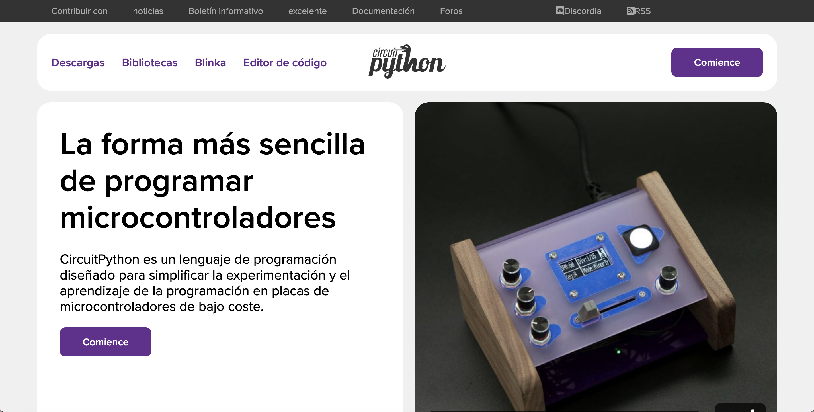

# sesion-08

lunes 27 abril 2026

---

## Apuntes

- ver comunicacion bidirecional que los dos se emitan y reciban
- `Python:` app para programar
  - los espacios si importan, así python visualiza la jerarquía de las cosas
  - Scipy / Numpy
  - `MicroPython:` para microcontroladores 
  - `circuitPython:` es un fork del original de micropython

### CircuitPython

- CircuitPython es un lenguaje de programación diseñado para simplificar la experimentación y el aprendizaje de la programación en placas de microcontroladores de bajo costo.
- Tiene 651 placas para utilizar
- Las bibliotecas mpy, son archivos muy pequeños
- volate_cc > V_CC
- 3.3 V
- 5.0 V
- ADC0 > es como la patita 0 del arduino / pasa de algo análogo a algo digital
