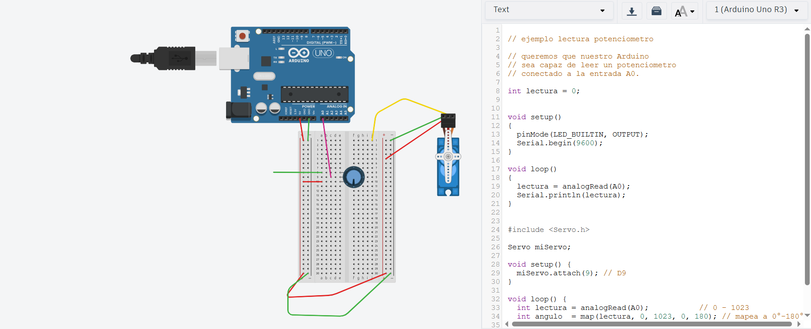

# sesion-07

lunes 20 abril 2026

## Apuntes de clase

entrega de materiales como grupo 1

Potenciometro tiene 3 patitas, por lo general se conecta la 2 y otra de algún extremo

LDR (resistencia), protoboard y cables

Motor servo

 Protoboard o breadboard: está separado en mini placas de metal donde circulan los electrones

 el arduino y la Raspberry pi se colocan en el lugar del ar duino en voltaje positivo y el otro jumper en tierra

 dividir por colores

 lo que conecte en lada metal va a seguir con la continuidsd

 App gratuita Tinkercad

 Distintas secciones

 potenciometro nos aseguramos que esté en 3 lugares distintos

 Le agregamos codigo al arduino

```
// ejemplo lectura potenciometro

// queremos que nuestro Arduino
// sea capaz de leer un potenciometro
// conectado a la entrada A0.

int lectura = 0;


void setup()
{
  pinMode(LED_BUILTIN, OUTPUT);
  Serial.begin(9600);
}

void loop()
{
  lectura = analogRead(A0);
  Serial.println(lectura);
}
```



Y luego utilizamos un nuevo código para colocar el motor Servo

```
// ejemplo lectura potenciometro

// queremos que nuestro Arduino
// sea capaz de leer un potenciometro
// conectado a la entrada A0.


#include <Servo.h>


Servo miServo;

int lectura = 0;
int angulo = 0;


void setup()
{
  pinMode(9, OUTPUT);
  Serial.begin(9600);
  // en que patita esta conectado el servo
  // conectemos a patita 9 digital
  miServo.attach(9);
  
}

void loop()
{
  // leer
  lectura = analogRead(A0);
  
  // imprimir en consola
  Serial.println(lectura);
  
  
  // toma el valor de lectura
  // que va originalmente entre 0 y 1023
  // y mapealo al rango 0 a 180
  angulo = map(lectura, 0, 1023, 0, 180);
    
  // pidele por favor al servo
  // que vaya a ese angulo
  miServo.write(angulo);
  
  // servo descansa un poquito
  // 15 milisegundos
  // la vida es dura
  delay(15);
    
}
```

