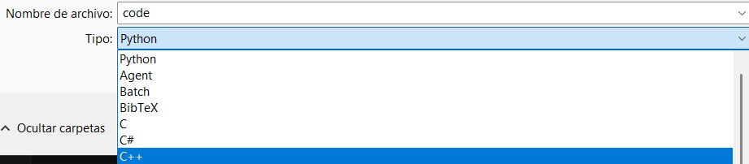
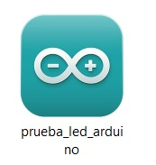
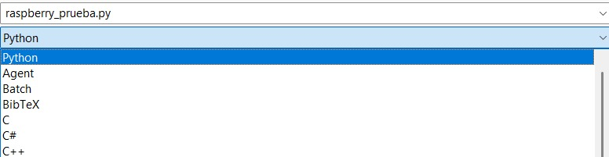
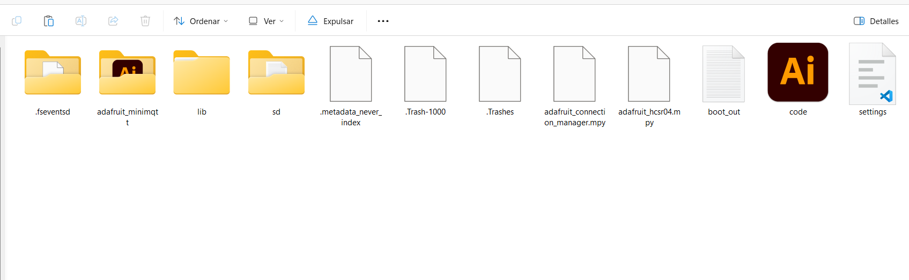
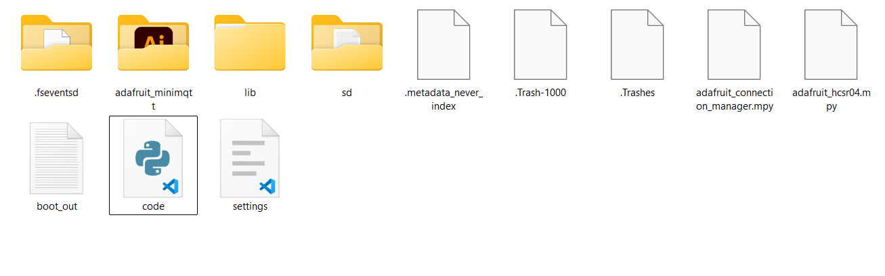

# sesion-11

lunes 25 mayo 2026
# Correcciones Solemne 2

En clases realizamos correcciones de la Solemne 2 en base a la retroalimentación entregada por el docente. Cada grupo estuvo trabajando en los errores detectados para mejorar el proyecto y la documentación presentada.

En nuestro caso, teníamos varios errores relacionados principalmente con:

- Redacción.
- Citación de imágenes.
- Subida correcta de códigos a la carpeta correspondiente.

Durante esta corrección aprendimos la importancia de mantener una buena redacción técnica y citar correctamente las imágenes utilizadas dentro del informe. Además, aprendimos a organizar y subir correctamente los códigos según la plataforma utilizada.

## Organización de Códigos

Los pasos para guardar y subir los códigos dependen del tipo de programación utilizada:

### Arduino

Los archivos deben guardarse en formato C++ (`.ino`). Además, es importante verificar que al abrir el archivo se visualice correctamente dentro del entorno de Arduino IDE. Si el código no se visualiza adecuadamente, es necesario volver a guardarlo correctamente.

### Raspberry Pi

Los códigos se trabajan generalmente en Python (`.py`). En este caso, el archivo debe mantener la misma estructura y visualización que aparece en Visual Studio Code o en el editor utilizado, verificando que no existan errores de formato al subirlo.
 

## Demostración y Corrección del Proyecto

Durante la presentación del proyecto debíamos demostrar el funcionamiento completo del sistema. La idea era que los cuatro integrantes participáramos en la demostración, pero desde mi computador no estaba funcionando correctamente, ya que los datos no estaban llegando al Arduino.

Después de la presentación logramos identificar el problema. El error ocurría porque en mi computador los archivos de Visual Studio Code se visualizaban como archivos de Illustrator, lo que provocaba que el programa no ejecutara correctamente la comunicación entre dispositivos y, por lo tanto, el Arduino no recibía los datos enviados.
 

Una vez encontrado el problema, tuve que corregir la configuración y la visualización de los archivos para que el sistema funcionara correctamente.
 

La demostración realizada consistía en que desde la Raspberry Pi se utilizaba un botón pulsador que enviaba una señal hacia el Arduino conectado en otro computador. Al recibir la señal, se encendía una luz LED, demostrando la comunicación entre ambos dispositivos.

Como observación adicional, descubrimos que utilizando los mismos componentes también era posible controlar y encender dos luces al mismo tiempo, lo que abre nuevas posibilidades de mejora y expansión para el proyecto.
