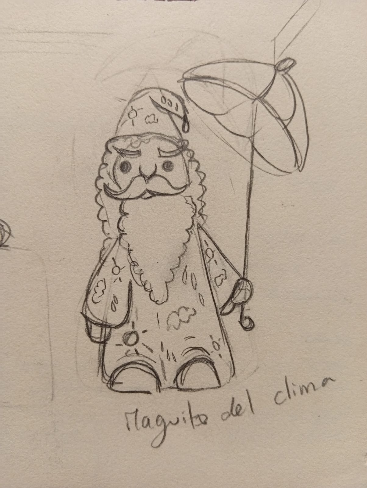
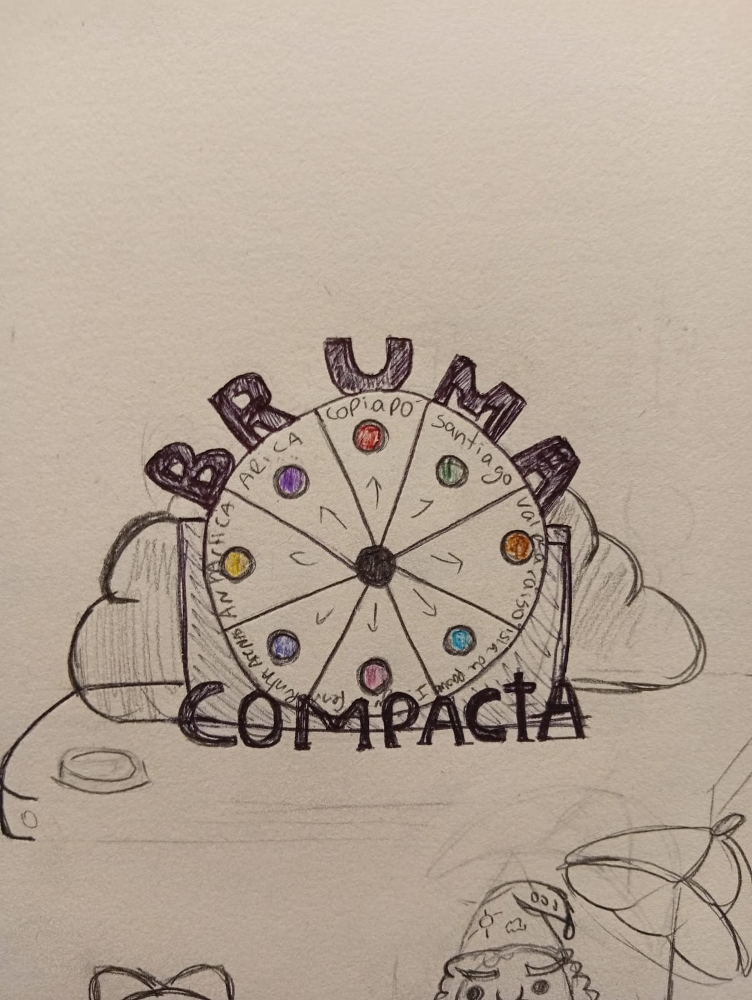
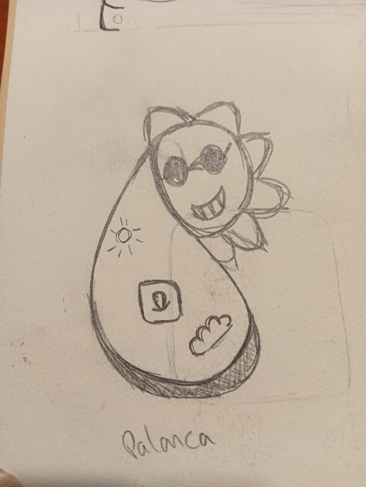

# sesion-13

### lunes 08 junio 2026

Está clase seguimos trabajando en mejorar el concepto y descripción del proyecto. Además de hacer el pseudocódigo para el funcionamiento de "Bruma Compacta".

#### Pseudocódigo:

Descripción informal de un algoritmo o un programa, escrito en un lenguaje natural estructurado.Su propósito principal es mostrar el flujo lógico de un programa o sistema de manera que cualquier persona, con o sin experiencia en programación, pueda entender los pasos que realiza el algoritmo.

fuente: https://openwebinars.net/blog/que-es-pseudocodigo/

#### Descripción y concepto del proyecto:

A través de nuestro proyecto queremos provocar una escena inmersiva entre el agua y el usuario, para esto vamos a reinterpretar el clima de 8 localidades distintas de Chile, con la intención de mostrar de forma literal y concentrada el índice de humedad de cada sector.

Mediante una ruleta que representa las 8 localidades con distintas luces LED, se sorteará de manera aleatoria un destino respaldado con datos ambientales provenientes de una API de Meteochile.gob.cl. y dependiendo del clima actual de dicho lugar, se activará una bruma a través de un humidificador.

Ciudades de Chile elegidas:

* Arica
* Copiapó
* Santiago
* Valparaíso
* Isla de Pascua
* Juan Fernández
* Punta Arenas
* Antártica 

#### Pseudocódigo:

##### Código enviar Raspi: 

Verificar si el Wi Fi está conectado,verificar si API está funcionando,verificar conexión con la nube,nombre WIFI,contraseña WIFI,user nube,contraseña nube,interruptor LEDS.

Al mover el interruptor de la izquierda a la derecha se encienden leds y empieza a enviar la información de la API al arduino a través de AIO.

Envía la información de la humedad de 8 ciudades de Chile:

* Arica
* Copiapó
* Santiago
* Valparaíso
* Isla de Pascua
* Juan Fernández
* Punta Arenas
* Antártica

Deja de enviar información al girar el interruptor de derecha a izquierda.

##### Código recibir Arduino:

Definir módulo LED,definir pantalla,definir humidificador,verificar si Wi Fi conectado,verificar si API está funcionando,verificar conexión con la nube,definir componentes conectados al arduino.

Recibir información de la humedad de las 8 ciudades,asignarle un valor y relacionarlo a un LED del módulo.Con dado digital elegir al azar un valor y encender el LED correspondiente de la ciudad,detectar el porcentaje de humedad del lugar y se activa el humidificador.

#### Ideas para el concepto de "Bruma Compacta"

