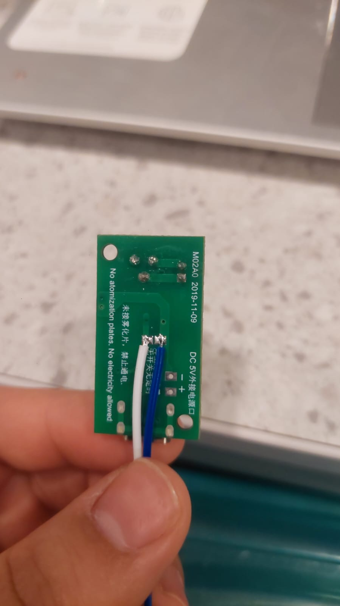
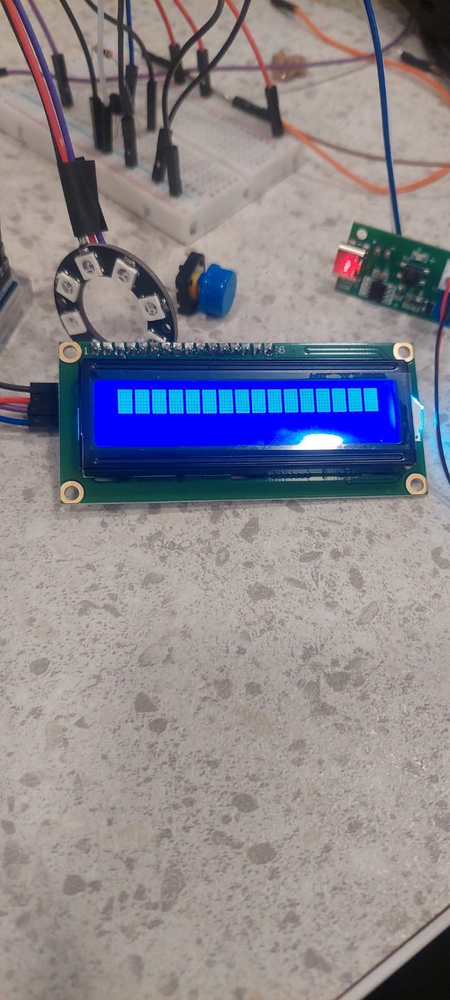
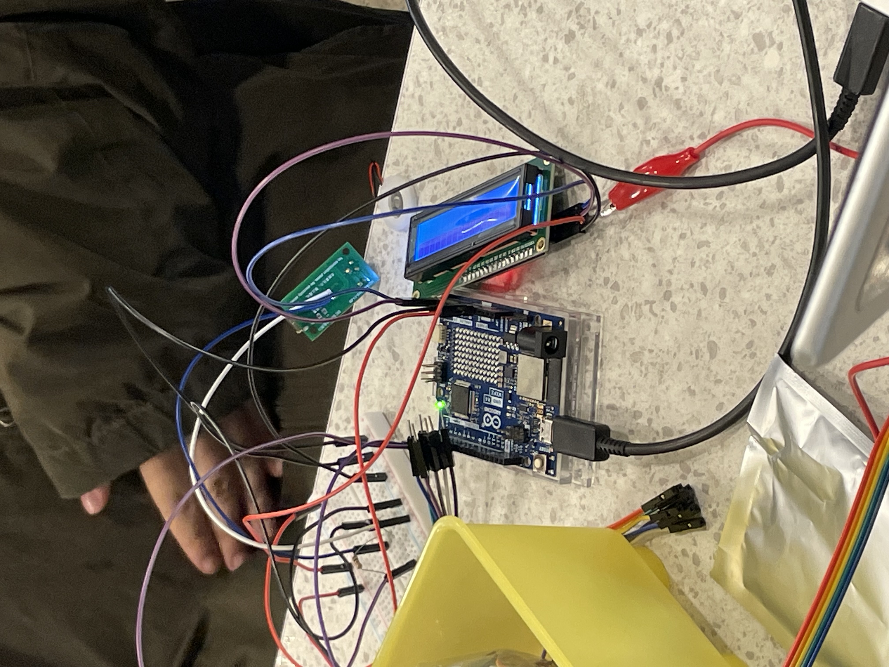

# sesion-14

lunes 15 junio 2026

El día anterior a la clase, nos juntamos en mi casa a avanzar con el trabajo, ya teníamos los componentes principales, el Arduino, la Raspberry, un módulo LED, un botón (que después remplazaríamos por un switch) y el humidificador. Probamos con códigos base y lográbamos que recopilara los datos provenientes de Open Meteo sobre la humedad de nuestras 8 ciudades, también se pudo hacer que el LED funcionara como ruleta, girando 3 veces y seleccionando a un ganador. No sabíamos como hacer funcionar el humidificador, y con la poca info que hay de nuestro modelo, no se hablaba de maneras muy variadas para solucionar errores, hasta que después de mantenerlo reposado sobre el agua de mejor manera, funcionó. Lo único que faltaba era hacer que el humidificador sé apagara después de cierto rato, porque lograba tirar una bruma pero solo presionando el botón y para apagarla lo mismo.

Ya lunes, nos juntamos temprano en la u a solucionar los pendientes, el tiempo de funcionamiento del humidificador, cambiar el botón por un switch y conectar una pantalla que mostrara el porcentaje de humedad. Lo primero fue el switch para el cual usamos un código base si mal no recuerdo, después se conectó la pantalla que solo mostraba cuadrados y ya cuando era hora de probar el humidificador, no funcionaba, teníamos las mismas conexiones que el domingo y probamos también con el mismo código. Después de buscar información sobre posibles errores, no encontramos ni una que nos ayudara puntualmente en lo que nos había pasado, si que recurrimos a preguntarle a Claude, nos dio información, pero muy contradictoria, decía que usáramos un relay de 5v, pero después nos decía que no y que había que usar un transistor, pero también nos dijo que soldáramos el humidificador y eso hicimos.

Humidificador soldado

Demostración pantalla

Panorama completo
