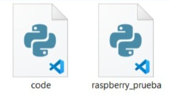

# sesion-11

lunes 25 mayo 2026

## Objetivo de la clase

Durante esta clase trabajamos en la corrección de la Solemne 2 a partir de la retroalimentación entregada por el docente. Revisamos tanto la documentación como la organización de los archivos del proyecto para identificar errores y realizar las mejoras necesarias.

## Correcciones realizadas

Como grupo revisamos distintos aspectos del informe y del repositorio. Los principales errores detectados estaban relacionados con la redacción de algunos apartados del informe, la citación correcta de imágenes utilizadas, la organización de los códigos en las carpetas correspondientes y la verificación de formatos de archivos según la plataforma utilizada.

A partir de esta revisión comprendí la importancia de mantener una documentación clara y ordenada para facilitar la comprensión del proyecto y su evaluación.

## Organización de códigos

Durante la actividad también revisamos cómo deben guardarse correctamente los archivos según el entorno de desarrollo utilizado.

### Arduino

Los programas desarrollados para Arduino deben guardarse con extensión `.ino`. Además, es importante verificar que los archivos puedan abrirse correctamente en Arduino IDE y mantengan su estructura original para asegurar su correcto funcionamiento.

### Raspberry Pi Pico

Los programas utilizados en Raspberry Pi Pico se desarrollan principalmente en Python utilizando archivos `.py`. Revisamos que los códigos conservaran su formato original al ser compartidos y almacenados dentro del proyecto.

## Pruebas del sistema

Durante la presentación realizamos pruebas de comunicación entre la Raspberry Pi Pico y Arduino para verificar el funcionamiento del sistema.

Inicialmente aparecieron algunos problemas relacionados con la configuración y visualización de los archivos de programación. Después de revisar el entorno de desarrollo y la estructura de los archivos, logramos corregir los errores y restablecer la comunicación entre ambos dispositivos.

## Funcionamiento demostrado

La demostración consistió en utilizar un botón pulsador conectado a la Raspberry Pi Pico. Cuando el botón era presionado, se enviaba una señal hacia el Arduino mediante la comunicación configurada entre ambos dispositivos.

Al recibir la señal, el Arduino activaba un LED, demostrando que la transmisión de datos funcionaba correctamente.

### Flujo del sistema

Botón Pulsador  
       ↓  
Raspberry Pi Pico  
       ↓  
Envío de señal  
       ↓  
    Arduino  
       ↓  
LED encendido  

## Aprendizajes obtenidos

* Comprendí la importancia de mantener una buena organización de archivos dentro del proyecto.
* Aprendí a verificar que los códigos se encuentren en el formato correcto antes de subirlos al repositorio.
* Reforcé el uso de referencias y citaciones en la documentación.
* Comprendí mejor el proceso de comunicación entre dispositivos mediante el envío y recepción de datos.
* Aprendí a identificar errores de configuración que pueden afectar el funcionamiento del sistema.
* Observé que la misma lógica de comunicación puede ampliarse para controlar múltiples dispositivos de salida.

## Reflexión personal

La corrección de la Solemne 2 permitió detectar errores que inicialmente pasaron desapercibidos. Esta actividad ayudó a mejorar tanto la documentación como la organización técnica del proyecto. Además, las pruebas realizadas permitieron comprender mejor cómo se comunican los dispositivos y la importancia de verificar cada parte del sistema antes de una demostración o entrega final.
